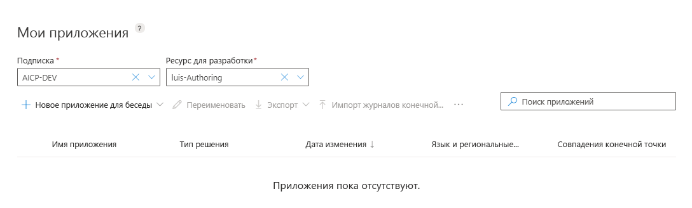

# <a name="quickstart-use-prebuilt-home-automation-app"></a>Краткое руководство. Использование предварительно созданного приложения для системы домашней автоматики

[!INCLUDE [Uses preview portal](./includes/uses-portal-preview.md)]

В этом кратком руководстве описано, как создать приложение LUIS, которое использует предварительно созданную предметную область `HomeAutomation` для включения и отключения освещения и устройств. Эта предварительно созданная предметная область предоставляет для использования намерения, сущности и фразы. Когда все будет готово, вы получите работающую в облаке конечную точку LUIS.

## <a name="prerequisites"></a>Предварительные требования

Для работы с этой статьей требуется бесплатная учетная запись LUIS, которую можно создать на портале LUIS по адресу [https://www.luis.ai](https://www.luis.ai). 

[!INCLUDE [Sign in to LUIS](./includes/sign-in-process.md)]

[!INCLUDE [Select authoring resource](./includes/select-authoring-resource.md)]

## <a name="create-a-new-app"></a>Создание нового приложения
Создавать и администрировать приложения можно на странице **Мои приложения**. 

1. На портале LUIS в списке "Мои приложения" щелкните **+ Создать**.

    

1. В диалоговом окне введите имя приложения `Home Automation` и нажмите кнопку **Готово**. LUIS создает приложение. Указывать описание необязательно. Оно не используется для разработки и прогнозирования. Ресурс прогнозирования также необязателен при создании приложения LUIS. Публикуя приложение в рабочей среде, необходимо назначить ресурс прогнозирования, чтобы приложение могло обрабатывать множество запросов.  

    

    >[!NOTE]
    >Язык и региональные параметры нельзя изменить после создания приложения. 

## <a name="add-prebuilt-domain"></a>Добавление готовой предметной области

Выберите **Prebuilt domains** (Предварительно созданные предметные области), а затем выполните поиск **HomeAutomation**. Нажмите кнопку **Add domain** (Добавить предметную область) на карточке HomeAutomation.


Когда предметная область будет успешно добавлена, в области предварительно созданных предметных областей отобразится кнопка **Remove domain** (Удалить предметную область).

## <a name="intents-and-entities"></a>Намерения и сущности

Выберите **Intents** (Намерения) для просмотра намерений предметной области HomeAutomation. Для намерений предварительно созданных предметных областей есть примеры речевых фрагментов.


> [!NOTE]
> Намерение **None** (Нет) стандартно предоставляется всеми приложениями LUIS. Оно используется для обработки фраз, которые не соответствуют функциям приложения. 

Выберите намерение **HomeAutomation.TurnOff**. Вы увидите, что это намерение содержит список фраз с обозначенными сущностями.

[](media/luis-quickstart-new-app/home-automation-turnoff.png)

## <a name="train-the-luis-app"></a>Обучение приложения LUIS

[!INCLUDE [LUIS How to Train steps](includes/howto-train.md)]

## <a name="test-your-app"></a>Тестирование приложения
После обучения можно выполнить тестирование приложения. Выберите **Тест**. Введите тестовый речевой фрагмент, например `Turn off the lights`, в области интерактивного тестирования и нажмите клавишу ВВОД. 

```
Turn off the lights
```

Убедитесь, что намерение с самой высокой оценкой для этого тестового высказывания выбрано правильно.

В нашем примере `Turn off the lights` правильно распознано как намерение с высокой оценкой **HomeAutomation.TurnOff**.


Выберите **Inspect** (Проверить), чтобы просмотреть дополнительные сведения о прогнозе.


Снова щелкните **Test** (Тестировать), чтобы свернуть панель тестирования. 

<a name="publish-your-app"></a>

## <a name="publish-the-app-to-get-the-endpoint-url"></a>Публикация приложения для получения URL-адреса конечной точки

[!INCLUDE [LUIS How to Publish steps](./includes/howto-publish.md)]

<a name="query-the-v2-api-prediction-endpoint"></a>

## <a name="query-the-v3-api-prediction-endpoint"></a>Запрос конечной точки прогнозирования API V3

[!INCLUDE [LUIS How to get endpoint first step](./includes/v3-prediction-endpoint.md)] 

1. В адресной строке браузера для строки запроса проверьте, указаны ли в URL-адресе следующие строки имени и значения. Если они отсутствуют в строке запроса, добавьте их:

    |Пара "имя — значение"|
    |--|
    |`verbose=true`|
    |`show-all-intents=true`|

1. В адресной строке браузера перейдите в конец URL-адреса и введите `turn off the living room light` для значения _запроса_, а затем нажмите клавишу ВВОД.

    ```json
    {
        "query": "turn off the living room light",
        "prediction": {
            "topIntent": "HomeAutomation.TurnOff",
            "intents": {
                "HomeAutomation.TurnOff": {
                    "score": 0.984315455
                },
                "HomeAutomation.QueryState": {
                    "score": 0.009912962
                },
                "HomeAutomation.TurnDown": {
                    "score": 0.00626645749
                },
                "HomeAutomation.TurnUp": {
                    "score": 0.00572059769
                },
                "HomeAutomation.SetDevice": {
                    "score": 0.00379381469
                },
                "HomeAutomation.TurnOn": {
                    "score": 0.00366983772
                },
                "None": {
                    "score": 0.000623856
                }
            },
            "entities": {
                "HomeAutomation.Location": [
                    "living room"
                ],
                "HomeAutomation.DeviceName": [
                    [
                        "living room light"
                    ]
                ],
                "HomeAutomation.DeviceType": [
                    [
                        "light"
                    ]
                ],
                "$instance": {
                    "HomeAutomation.Location": [
                        {
                            "type": "HomeAutomation.Location",
                            "text": "living room",
                            "startIndex": 13,
                            "length": 11,
                            "score": 0.907323956,
                            "modelTypeId": 1,
                            "modelType": "Entity Extractor",
                            "recognitionSources": [
                                "model"
                            ]
                        }
                    ],
                    "HomeAutomation.DeviceName": [
                        {
                            "type": "HomeAutomation.DeviceName",
                            "text": "living room light",
                            "startIndex": 13,
                            "length": 17,
                            "modelTypeId": 5,
                            "modelType": "List Entity Extractor",
                            "recognitionSources": [
                                "model"
                            ]
                        }
                    ],
                    "HomeAutomation.DeviceType": [
                        {
                            "type": "HomeAutomation.DeviceType",
                            "text": "light",
                            "startIndex": 25,
                            "length": 5,
                            "modelTypeId": 5,
                            "modelType": "List Entity Extractor",
                            "recognitionSources": [
                                "model"
                            ]
                        }
                    ]
                }
            }
        }
    }
    ```

    Дополнительные сведения о [конечной точке прогнозирования V3](luis-migration-api-v3.md).
    

## <a name="clean-up-resources"></a>Очистка ресурсов

[!INCLUDE [LUIS How to clean up resources](../../../includes/cognitive-services-luis-tutorial-how-to-clean-up-resources.md)]

## <a name="next-steps"></a>Дополнительная информация

Эту конечную точку можно вызвать из кода:

> [!div class="nextstepaction"]
> [Руководство по вызову конечной точки LUIS с помощью кода](luis-get-started-cs-get-intent.md).
