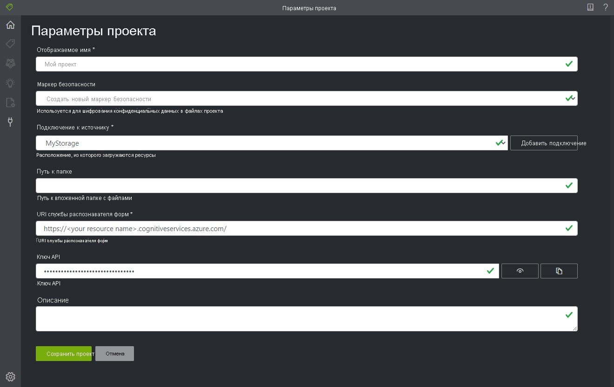

# <a name="train-a-form-recognizer-model-with-labels-using-the-sample-labeling-tool"></a>Обучение модели Распознавателя документов по примерам с метками с помощью средства маркировки данных

В этом кратком руководстве описано, как с помощью REST API Распознавателя документов и средства маркировки данных обучить настраиваемую модель с использованием данных с метками, присвоенными вручную. Дополнительные сведения об этой функции см. в разделе об [обучении с использованием меток](../overview.md#train-with-labels).

Если у вас еще нет подписки Azure, [создайте бесплатную учетную запись](https://azure.microsoft.com/free/?WT.mc_id=A261C142F), прежде чем начинать работу.

## <a name="prerequisites"></a>Предварительные требования

Для работы с этим кратким руководством требуется следующее:

- Минимум шесть документов одного типа. Вы будете использовать эти данные для обучения модели и тестирования формы. Для работы с этим кратким руководством вы можете использовать [пример набора данных](https://go.microsoft.com/fwlink/?linkid=2090451). Передайте файлы для обучения в корневой каталог контейнера хранилища BLOB-объектов в учетной записи хранения Azure.

## <a name="set-up-the-sample-labeling-tool"></a>Настройка средства маркировки данных

Для запуска средства маркировки данных используется модуль Docker. Чтобы настроить контейнер Docker, сделайте следующее. Ознакомьтесь с [общими сведениями о Docker и контейнерах](https://docs.docker.com/engine/docker-overview/).
1. Для начала установите Docker на главный компьютер. Роль главного компьютера может выполнять локальный компьютер под управлением [Windows](https://docs.docker.com/docker-for-windows/), [MacOS](https://docs.docker.com/docker-for-mac/) или [Linux](https://docs.docker.com/install/). Вы также можете использовать службу размещения Docker в Azure, например [Службу Azure Kubernetes](https://docs.microsoft.com/azure/aks/index) и [Экземпляры контейнеров Azure](https://docs.microsoft.com/azure/container-instances/index), или в кластере Kubernetes, [развернутом в Azure Stack](https://docs.microsoft.com/azure-stack/user/azure-stack-solution-template-kubernetes-deploy?view=azs-1910). Главный компьютер должен отвечать следующим требованиям к аппаратному обеспечению.

    | Контейнер | Минимальные | Рекомендуемая|
    |:--|:--|:--|
    |Средство маркировки данных|2 ядра, 4 ГБ памяти|4 ядра, 8 ГБ памяти|
    
1. Получите контейнер средства маркировки данных с помощью команды `docker pull`.
    ```
    docker pull mcr.microsoft.com/azure-cognitive-services/custom-form/labeltool
    ```
1. Теперь все готово к тому, чтобы запустить контейнер с помощью команды `docker run`.
    ```
    docker run -it -p 3000:80 mcr.microsoft.com/azure-cognitive-services/custom-form/labeltool eula=accept
    ```

   Так средство маркировки данных станет доступным в веб-браузере. Перейдите на сайт [http://localhost:3000](http://localhost:3000).

> [!NOTE]
> Вы также можете присваивать документам метки и обучать модели с помощью REST API Распознавателя документов. См. сведения о том, как [выполнять обучение на основе меток и анализ с использованием REST API и Python](./python-labeled-data.md).

## <a name="set-up-input-data"></a>Настройка входных данных

Для начала убедитесь, что все обучающие документы имеют одинаковый формат. Если у вас есть формы в разных форматах, рассортируйте их по вложенным папкам соответствующим образом. При обучении вам нужно будет обращаться к вложенным папкам с помощью API.

### <a name="configure-cross-domain-resource-sharing-cors"></a>Настройка общего доступа к ресурсам независимо от источника (CORS)

Включите CORS для учетной записи хранения. Перейдите в учетную запись хранения на портале Azure и щелкните вкладку **CORS** на панели слева. В нижней строке укажите следующие значения. Теперь щелкните **Сохранить** в верхней части страницы.

* Разрешенные источники = * 
* Допустимые методы = \[выберите все\]
* Допустимые заголовки = *
* Предоставляемые заголовки = * 
* Максимальный возраст = 200

> [!div class="mx-imgBorder"]
> 

## <a name="connect-to-the-sample-labeling-tool"></a>Подключение к средству маркировки данных

Средство маркировки данных подключается к источнику (где находятся исходные формы) и целевому объекту (расположению, куда экспортируются созданные метки и выходные данные).

Подключения можно настраивать и совместно использовать для нескольких проектов. При этом используется расширяемая модель поставщика, что позволяет легко добавлять новых поставщиков источника и назначения.

Чтобы создать новое подключение, щелкните значок **Новые подключения** (электрическая вилка) на панели навигации слева.

Заполните поля следующими значениями.

* **Отображаемое имя** — имя подключения.
* **Описание** — описание проекта.
* **Подписанный URL-адрес** — указывает на контейнер хранилища BLOB-объектов Azure. Чтобы получить подписанный URL-адрес, откройте Обозреватель службы хранилища Microsoft Azure, щелкните контейнер правой кнопкой мыши и выберите **Get shared access signature** (Получить подписанный URL-адрес). Задайте срок действия так, чтобы он истекал после того, как вы завершите работу со службой. Убедитесь, что заданы разрешения на **чтение**, **запись**, **удаление** и **перечисление**, а затем щелкните **Создать**. Затем скопируйте значение в разделе **URL-адрес**. Оно должно быть в таком формате: `https://<storage account>.blob.core.windows.net/<container name>?<SAS value>`.


## <a name="create-a-new-project"></a>Создание нового проекта

В этом средстве маркировки данных конфигурации и параметры хранятся в проектах. Создайте новый проект и заполните поля следующими значениями.

* **Отображаемое имя** — имя проекта.
* **Маркер безопасности** — нужен для хранения конфиденциальных параметров проекта, таких как ключи API или другие общие секреты. Каждый проект создает маркер безопасности, который можно использовать для шифрования и расшифровки конфиденциальных параметров. Маркеры безопасности можно найти в разделе параметров приложения, щелкнув значок шестеренки в нижнем углу на панели навигации слева.
* **Подключение к источнику** — в нашем примере это подключение к хранилищу BLOB-объектов Azure, которое вы создали на предыдущем шаге и хотите использовать для этого проекта.
* **Путь к папке** (необязательно) — нужен, если исходные формы находятся во вложенной папке контейнера больших двоичных объектов.
* **URI службы Распознавателя документов** — указывает на конечную точку Распознавателя документов.
* **Ключ API** — ключ подписки Распознавателя документов.
* **Описание** — описание проекта (необязательно).



## <a name="label-your-forms"></a>Создание меток для форм

При создании или открытии проекта открывается главное окно редактора тегов. Редактор тегов разделен на три сегмента.

* Область просмотра с возможностью изменения размера содержит прокручиваемый список форм из подключенного источника.
* Главная панель редактора позволяет применять теги.
* Панель редактора тегов позволяет пользователям изменять, блокировать, переупорядочивать и удалять теги. 

### <a name="identify-text-elements"></a>Определение текстовых элементов

Щелкните **Выполнить распознавание текста для всех файлов** на панели слева, чтобы получить сведения о макете текста для каждого документа. Средство маркировки данных отобразит ограничивающие прямоугольники вокруг каждого текстового элемента.

### <a name="apply-labels-to-text"></a>Применение меток к тексту

Теперь вам предстоит создать метки и применить их к текстовым элементам, которые должна распознавать модель.

1. Во-первых, с помощью панели редактора тегов создайте теги (метки), которые вы хотите определить.
1. В основном редакторе щелкните и перетащите одно или несколько слов из выделенных текстовых элементов.

    > [!NOTE]
    > Сейчас вы не сможете выбрать текст, который занимает несколько страниц.
1. Щелкните тег, который вам нужно применить, или нажмите соответствующую клавишу. Каждому текстовому элементу можно присвоить только один тег, и каждый тег может применяться только один раз на каждой странице.

    > [!TIP]
    > Клавиши с цифрами позволяют быстро присвоить любой из первых десяти тегов. Чтобы изменить порядок тегов, используйте значки со стрелками вверх и вниз на панели редактора тегов.

Выполните описанные выше действия, чтобы создать метки для пяти форм, а затем перейдите к следующему шагу.


## <a name="train-a-custom-model"></a>Обучение пользовательской модели

Щелкните значок обучения (с изображением вагона) на панели слева, чтобы открыть страницу "Обучение". Затем щелкните **Обучение**, чтобы начать обучение модели. Когда процесс обучения завершится, вы увидите следующие сведения.

* **Идентификатор модели**, которую вы создали и обучили. Каждый вызов обучения создает новую модель с уникальным идентификатором. Скопируйте эту строку в безопасное расположение, она вам понадобится для вызовов прогнозирования через REST API.
* **Средняя точность**, как характеристика точности модели. Точность модели можно улучшить, создав дополнительные формы с метками и повторив обучение для новой модели. Мы рекомендуем для начала создать метки для пяти форм и добавлять новые формы по мере необходимости.
* Список тегов и оценка точности для каждого из них.


Когда обучение завершится, оцените значение **средней точности**. Если оно слишком низкое, следует добавить дополнительные документы и повторить описанные выше шаги. Маркированные документы останутся в индексе проекта.

> [!TIP]
> Вы также можете выполнить процесс обучения, используя вызов REST API. См. сведения о том, как это сделать на [Python](./python-labeled-data.md).

## <a name="analyze-a-form"></a>Анализ формы

Щелкните значок прогнозирования (прямоугольники) слева, чтобы протестировать модель. Отправьте документ формы, который вы не использовали в процессе обучения. Затем нажмите кнопку **Прогнозировать** справа, чтобы получить прогнозы, связанные с парой "ключ — значение" для формы. Средство применит теги к ограничивающим прямоугольникам и сообщит о достоверности каждого тега.

> [!TIP]
> Вы также можете обратиться к API анализа, используя вызов REST. См. сведения о том, как это сделать на [Python](./python-labeled-data.md).

## <a name="improve-results"></a>Улучшение результатов

В зависимости от оценки точности может потребоваться дополнительное обучение для улучшения модели. Завершив прогнозирование, проверьте значения достоверности для каждого из примененных тегов. Если среднее значение точности при обучении было велико, но оценки достоверности низкие или результаты неточные, следует добавить файл, который вы выбрали для прогнозирования, в обучающий набор, присвоить ему метки и выполнить обучение еще раз.

Показатели средней точности, оценки достоверности и фактической точности могут быть противоречивыми, если анализируемые документы отличаются от тех, которые использовались для обучения. Не забывайте, что некоторые документы выглядят одинаковыми для людей, но при этом отличаются для моделей ИИ. Например, если ваша форма имеет два варианта оформления и в наборе для обучения использовалось 20 % варианта А и 80 % варианта Б, на этапе прогнозирования оценки достоверности для документов варианта А будут, скорее всего, ниже.

## <a name="save-a-project-and-resume-later"></a>Сохранение и возобновление проекта

Чтобы возобновить проект в другое время или в другом браузере, вам нужно сохранить маркер безопасности этого проекта и повторно ввести его позже. 

### <a name="get-project-credentials"></a>Получение учетных данных проекта
Перейдите на страницу параметров проекта (значок ползунка) и запишите имя маркера безопасности. Теперь перейдите к параметрам приложения (значок шестеренки), где отображаются все маркеры безопасности в текущем экземпляре браузера. Найдите маркер безопасности нужного проекта, а затем скопируйте и сохраните его имя и значение ключа в безопасном расположении.

### <a name="restore-project-credentials"></a>Восстановление учетных данных проекта
Если вы хотите возобновить проект, создайте подключение к тому же контейнеру хранилища BLOB-объектов. Для этого выполните описанные выше шаги. Затем перейдите на страницу параметров приложения (значок шестеренки) и проверьте, есть ли там маркер безопасности нужного проекта. Если его нет, добавьте новый маркер безопасности и скопируйте в него имя и ключ из предыдущего шага. Теперь щелкните "Сохранить параметры". 

### <a name="resume-a-project"></a>Возобновление проекта
Наконец, перейдите на главную страницу (значок дома) и щелкните "Открыть облачный проект". Теперь выберите подключение к хранилищу BLOB-объектов и выберите файл *.vott* нужного проекта. Приложение загрузит все прежние параметры, так как у него есть маркер безопасности.

## <a name="next-steps"></a>Дальнейшие действия

В этом кратком руководстве описано, как с помощью Распознавателя документов и средства маркировки данных обучить модель с использованием данных с метками, присвоенными вручную. Если вы хотите интегрировать средство маркировки данных в собственное приложение, используйте API REST с поддержкой обучения с использованием данных с метками.

> [!div class="nextstepaction"]
> [Обучение с использованием меток и Python](./python-labeled-data.md)
