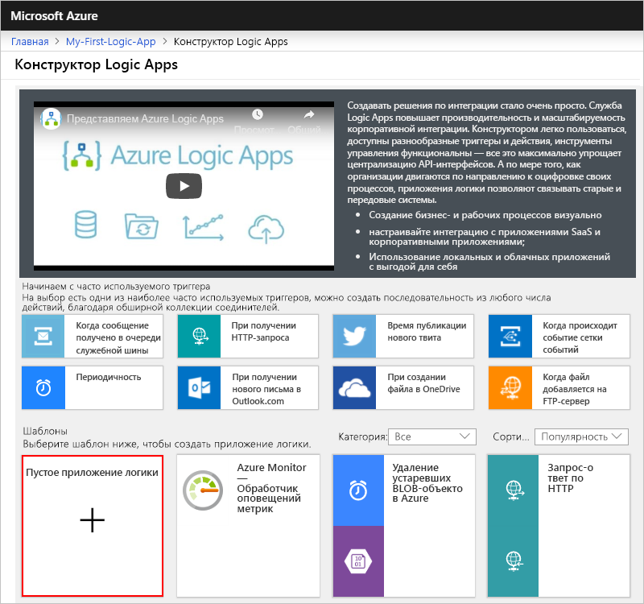

# <a name="tutorial-use-form-recognizer-with-azure-logic-apps-to-analyze-invoices"></a>Руководство по использованию Распознавателя документов с Azure Logic Apps для анализа счетов

В этом учебнике вы создадите рабочий процесс в Azure Logic Apps, который использует Распознаватель документов, службу в составе пакета Azure Cognitive Services, чтобы извлекать данные из счетов. Распознаватель документов используется сначала для обучения модели на основе примера набора данных, а затем — для тестирования модели на основе другого набора данных. Пример данных, используемых в этом учебнике, хранится в контейнерах больших двоичных объектов в службе хранилища Azure.

Темы, рассматриваемые в этом руководстве:

> [!div class="checklist"]
> * запрос доступа для Распознавателя документов;
> * создание контейнера больших двоичных объектов в службе хранилища Azure;
> * отправка примера данных в контейнер больших двоичных объектов службы хранилища Azure;
> * создание приложения логики Azure;
> * настройка в приложении логики использования Распознавателя документов в качестве ресурса;
> * тестирование рабочего процесса путем запуска приложения логики.

## <a name="prerequisites"></a>Предварительные требования

* Подписка Azure — [создайте бесплатную учетную запись](https://azure.microsoft.com/free/).

## <a name="request-access-for-form-recognizer"></a>Запрос доступа для Распознавателя документов

Распознаватель документов доступен в качестве предварительной версии с ограниченным доступом. Чтобы получить доступ к предварительной версии, заполните и отправьте [форму запроса на доступ к Распознавателю документов](https://aka.ms/FormRecognizerRequestAccess). Когда команда Azure Cognitive Services утвердит запрос, вы получите электронное письмо с инструкциями о том, как получить доступ к службе.

## <a name="understand-the-invoice-to-be-analyzed"></a>Анализ счета

Пример набора данных, который мы будем использовать для обучения и тестирования модели, доступен в виде ZIP-файла на сайте [GitHub](https://go.microsoft.com/fwlink/?linkid=2090451). Скачайте ZIP-файл и извлеките его содержимое. Откройте PDF-файл счета в папке **/Train**. Обратите внимание, что здесь есть таблица с номером счета, датой и т. п. 

> [!div class="mx-imgBorder"]
> 

В этом учебнике мы расскажем, как извлекать сведения из таких таблиц в формат JSON с использованием рабочего процесса, созданного с помощью Azure Logic Apps и Распознавателя документов.

## <a name="create-an-azure-storage-blob-container"></a>Создание контейнера больших двоичных объектов в службе хранилища Azure

Этот контейнер используется для отправки примера данных, необходимых для обучения модели.

1. Создайте учетную запись хранения, следуя указаниям, приведенным [здесь](../../storage/common/storage-quickstart-create-account.md). Используйте **formrecostorage** в качестве имени учетной записи хранения.
1. Создайте контейнер больших двоичных объектов в учетной записи хранения Azure, следуя указаниям, приведенным [здесь](../../storage/blobs/storage-quickstart-blobs-portal.md). В качестве имени контейнера используйте **formrecocontainer**. Задайте контейнеру общедоступный уровень доступа, выбрав **Container (anonymous read access for containers and blobs)** (Контейнер (анонимный доступ на чтение к контейнерам и большим двоичным объектам)).

    > [!div class="mx-imgBorder"]
    > 

## <a name="upload-sample-data-to-the-azure-blob-container"></a>Отправка примера данных в контейнер больших двоичных объектов службы хранилища Azure

Скачайте пример данных, доступный на сайте [GitHub](https://go.microsoft.com/fwlink/?linkid=2090451). Извлеките данные в локальную папку и отправьте содержимое папки **/Train** в созданный ранее контейнер **formrecocontainer**. Отправьте данные в контейнер, следуя указаниям в разделе [Отправка блочного BLOB-объекта](../../storage/blobs/storage-quickstart-blobs-portal.md#upload-a-block-blob).

Скопируйте URL-адрес контейнера. Этот URL-адрес потребуется далее в этом учебнике. Если вы создали учетную запись хранения и контейнер с именами, указанными в этом учебнике, URL-адрес будет таким: *https:\//formrecostorage.blob.core.windows.net/formrecocontainer/* .

## <a name="create-a-form-recognizer-resource"></a>Создание ресурса Распознавателя документов

[!INCLUDE [create resource](./includes/create-resource.md)]

## <a name="create-your-logic-app"></a>Создание приложения логики

Для автоматизации и оркестрации задач и рабочих процессов можно использовать Azure Logic Apps. В этом учебнике вы создадите приложение логики, активируемое при получении счета, который требуется проанализировать как вложение электронной почты. Вот какие задачи нужно выполнить в этом рабочем процессе:
* Настройте автоматический запуск приложения логики при получении электронного сообщения со вложенным счетом.
* Настройте в приложении логики использование операции Распознавателя документов **Train Model** (Обучить модель), чтобы обучать модель на основе примера данных, отправленных в хранилище BLOB-объектов Azure.
* Настройте в приложении логики использование операции Распознавателя документов **Analyze Form** (Анализировать документ), чтобы использовать уже обученную модель. Этот компонент проанализирует счет, предоставленный этому приложению логики, на основе модели, которую обучил ранее.

Начнем! Вот как можно настроить рабочий процесс.

1. В главном меню на портале Azure последовательно выберите **Создать ресурс** > **Интеграция** > **Приложение логики**.

1. В разделе **Создание приложения логики** предоставьте сведения о приложении логики, как показано здесь. Когда все будет готово, выберите **Создать**.

   | Свойство | Значение | ОПИСАНИЕ |
   |----------|-------|-------------|
   | **Имя** | <*logic-app-name*> | Имя приложения логики, которое может содержать только буквы, цифры, дефисы (`-`), символы подчеркивания (`_`), круглые скобки (`(`, `)`) и точки (`.`). В этом примере используется имя My-First-Logic-App. |
   | **подписка** | <*Azure-subscription-name*> | Имя подписки Azure. |
   | **группа ресурсов** | <*имя_группы_ресурсов_Azure*> | Имя [группы ресурсов Azure](./../../azure-resource-manager/resource-group-overview.md), используемой для упорядочения связанных ресурсов. В этом примере используется имя My-First-LA-RG. |
   | **Местоположение.** | <*Azure-Region*> | Регион для хранения данных приложения логики. В этом примере используется регион "Западная часть США". |
   | **Служба Log Analytics** | Отключить | Сохраните параметр **Выкл.** для журнала ведения диагностики. |
   ||||

1. После развертывания приложения в Azure на панели инструментов Azure выберите **Уведомления** > **Перейти к ресурсу** для развернутого приложения логики. Вы также можете найти и выбрать приложение логики, введя его имя в поле поиска.

   Открывается конструктор Logic Apps и отображается страница с вводным видео и часто используемыми триггерами. В разделе **Шаблоны** выберите **Пустое приложение логики**.

   > [!div class="mx-imgBorder"]
   > 

### <a name="configure-the-logic-app-to-trigger-the-workflow-when-an-email-arrives"></a>Настройка активации рабочего процесса в приложении логики при получении электронного письма

Здесь рассказывается, как настроить активацию рабочего процесса при получении электронного письма со вложенным счетом. В этом учебнике мы выбрали Office 365 в качестве службы электронной почты, но вы можете использовать любой другой поставщик электронной почты на свое усмотрение.

1. Среди вкладок выберите "Все", а затем **Office 365 Outlook**. В разделе **Триггеры** выберите пункт **Когда приходит новое электронное письмо**.

    

1. В поле **Office 365 Outlook** щелкните **Вход** и введите сведения для входа в учетную запись Office 365.

1. В показанном диалоговом окне сделайте следующее.
    1. Выберите папку, в которой следует отслеживать получение электронных писем.
    1. В поле **Содержит вложения** выберите пункт **Да**. Это гарантирует, что рабочий процесс будет активироваться только при получении сообщений электронной почты с вложениями.
    1. В поле **Включить вложения** выберите пункт **Да**. Это гарантирует, что содержимое вложения будет использоваться в последующей обработке.

        > [!div class="mx-imgBorder"]
        > 

1. Щелкните **Сохранить** на панели инструментов в верхней части окна.

### <a name="configure-the-logic-app-to-use-form-recognizer-train-model-operation"></a>Настройка приложения логики для использования операции Распознавателя документов Train Model (Обучить модель)

Прежде чем использовать службу "Распознаватель документов" для анализа счетов, необходимо обучить модель, предоставив ей пример данных счетов, которые модель может анализировать и изучать.

1. Щелкните **Новый шаг** и в разделе **Выберите действие** найдите **Распознаватель документов**. В показанных результатах выберите **Распознаватель документов**, а затем в разделе действий, доступных для Распознавателя документов, выберите **Train Model** (Обучить модель).

    > [!div class="mx-imgBorder"]
    > 

1. В диалоговом окне Распознавателя документов укажите имя подключения и введите URL-адрес конечной точки и ключ, полученные для ресурса Распознавателя.

    > [!div class="mx-imgBorder"]
    > 

    Нажмите кнопку **Создать**.

1. В диалоговом окне **Train Model** (Обучить модель) в поле **Источник** введите URL-адрес контейнера, куда вы передали пример данных.

    > [!div class="mx-imgBorder"]
    > 

1. Щелкните **Сохранить** на панели инструментов в верхней части окна.

### <a name="configure-the-logic-app-to-use-the-form-recognizer-analyze-form-operation"></a>Настройка приложения логики для использования операции Распознавателя документов Analyze Form (Анализировать документ)

В этом разделе вы добавите в рабочий процесс операцию **Analyze Form** (Анализировать документ). В этой операции используется уже обученная модель для анализа новых счетов, предоставленных приложению логики.

1. Щелкните **Новый шаг** и в разделе **Выберите действие** найдите **Распознаватель документов**. В показанных результатах выберите **Распознаватель документов**, а затем в разделе действий, доступных для него, выберите **Analyze Form** (Анализировать документ).

    > [!div class="mx-imgBorder"]
    > 

1. В диалоговом окне **Analyze Form** (Анализировать документ) сделайте следующее:

    1. Щелкните текстовое поле **Идентификатор модели** и в открывшемся диалоговом окне на вкладке **Динамическое содержимое** выберите пункт **modelId**. Таким образом вы предоставите приложению процесса идентификатор модели, обученной в предыдущем разделе.

        > [!div class="mx-imgBorder"]
        > 

    2. Щелкните текстовое поле **Документ** и в открывшемся диалоговом окне на вкладке **Динамическое содержимое** выберите пункт **Attachments Content** (Содержимое вложений). Таким образом вы настроите для процесса использование файла примера счета, вложенного в сообщении электронной почты, отправка которого активирует рабочий процесс.

        > [!div class="mx-imgBorder"]
        > 

1. Щелкните **Сохранить** на панели инструментов в верхней части окна.

### <a name="extract-the-table-information-from-the-invoice"></a>Извлечение сведений таблицы из счета

В этом разделе мы настроим в приложении логики извлечение информации из таблиц в счетах.

1. Нажмите кнопку **Добавить действие** и в разделе **Выберите действие** найдите действие **Создание**, а затем в разделе доступных действий снова щелкните **Создание**.
    

1. В диалоговом окне **Создание** щелкните текстовое поле **Входные данные** и в открывшемся диалоговом окне выберите пункт **таблицы**.

    > [!div class="mx-imgBorder"]
    > 

1. Выберите команду **Сохранить**.

## <a name="test-your-logic-app"></a>Тестирование приложения логики

Чтобы тестировать приложение логики, используйте примеры счетов в папке **/Test** примера набора данных, скачанного на сайте [GitHub](https://go.microsoft.com/fwlink/?linkid=2090451). Выполните следующие действия:

1. В конструкторе Azure Logic Apps для своего приложения выберите **Запуск** на панели инструментов в верхней части окна. Теперь рабочий процесс активен и ожидает сообщение электронной почты со вложенным счетом.
1. Отправьте электронное сообщение с примером счета, прикрепленным к адресу электронной почты, который вы указали при создании приложения логики. Убедитесь, что сообщение доставлено в папку, указанную при настройке приложения логики.
1. Как только сообщение будет доставлено в эту папку, конструктор Logic Apps выведет экран с ходом выполнения каждого этапа. На снимке экрана ниже показано, что получено электронное сообщение с вложением и выполняется рабочий процесс.

    > [!div class="mx-imgBorder"]
    > 

1. По завершении всех этапов рабочего процесса в конструкторе Logic Apps будет отображаться зеленый флажок возле каждого из них. В окне конструктора щелкните **For each 2** (Для каждых 2), а затем щелкните **Создание**.

    > [!div class="mx-imgBorder"]
    > 

    В поле **Выходные данные** скопируйте сведения и вставьте их в любом текстовом редакторе.

1. Сравните выходные данные JSON с примером счета, отправленным в виде вложения в сообщении электронной почты. Убедитесь, что данные JSON соответствуют данным в таблице в счете.

    ```json
    [
      {
        "id": "table_0",
        "columns": [
          {
            "header": [
              {
                "text": "Invoice Number",
                "boundingBox": [
                  38.5,
                  585.2,
                  113.4,
                  585.2,
                  113.4,
                  575.8,
                  38.5,
                  575.8
                ]
              }
            ],
            "entries": [
              [
                {
                  "text": "7689302",
                  "boundingBox": [
                    38.5,
                    549.8,
                    77.3,
                    549.8,
                    77.3,
                    536.2,
                    38.5,
                    536.2
                  ],
                  "confidence": 1
                }
              ]
            ]
          },
          {
            "header": [
              {
                "text": "Invoice Date",
                "boundingBox": [
                  139.7,
                  585.2,
                  198.5,
                  585.2,
                  198.5,
                  575.8,
                  139.7,
                  575.8
                ]
              }
            ],
            "entries": [
              [
                {
                  "text": "3/09/2015",
                  "boundingBox": [
                    139.7,
                    548.1,
                    184,
                    548.1,
                    184,
                    536.2,
                    139.7,
                    536.2
                  ],
                  "confidence": 1
                }
              ]
            ]
          },
          {
            "header": [
              {
                "text": "Invoice Due Date",
                "boundingBox": [
                  240.5,
                  585.2,
                  321,
                  585.2,
                  321,
                  575.8,
                  240.5,
                  575.8
                ]
              }
            ],
            "entries": [
              [
                {
                  "text": "6/29/2016",
                  "boundingBox": [
                    240.5,
                    549,
                    284.8,
                    549,
                    284.8,
                    536.2,
                    240.5,
                    536.2
                  ],
                  "confidence": 1
                }
              ]
            ]
          },
          {
            "header": [
              {
                "text": "Charges",
                "boundingBox": [
                  341.3,
                  585.2,
                  381.2,
                  585.2,
                  381.2,
                  575.8,
                  341.3,
                  575.8
                ]
              }
            ],
            "entries": [
              [
                {
                  "text": "$22,123.24",
                  "boundingBox": [
                    380.6,
                    548.5,
                    430.5,
                    548.5,
                    430.5,
                    536.2,
                    380.6,
                    536.2
                  ],
                  "confidence": 1
                }
              ]
            ]
          },
          {
            "header": [
              {
                "text": "VAT ID",
                "boundingBox": [
                  442.1,
                  590,
                  474.8,
                  590,
                  474.8,
                  575.8,
                  442.1,
                  575.8
                ]
              }
            ],
            "entries": [
              [
                {
                  "text": "QR",
                  "boundingBox": [
                    447.7,
                    549.8,
                    462.6,
                    549.8,
                    462.6,
                    536.2,
                    447.7,
                    536.2
                  ],
                  "confidence": 1
                }
              ]
            ]
          }
        ]
      }
    ]
    ```
    Вы успешно завершили ознакомление с данным учебником.

## <a name="next-steps"></a>Дополнительная информация

В этом учебнике мы настроили рабочий процесс Azure Logic Apps, чтобы использовать Распознаватель документов для обучения модели и извлечения содержимого счета. Узнайте, как создать набор данных для обучения, чтобы можно было создать подобный сценарий со своими документами.

> [!div class="nextstepaction"]
> [Создание набора данных для обучения](build-training-data-set.md)