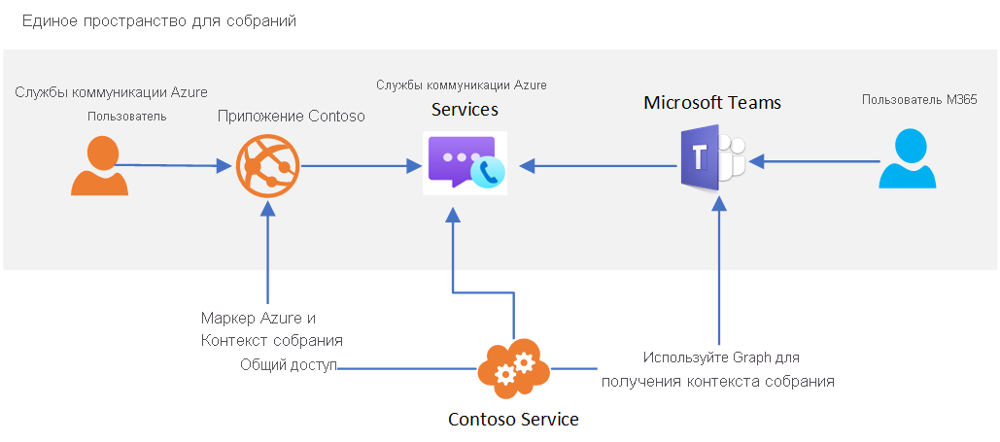

# Взаимодействие с Teams

[!INCLUDE [Private Preview Notice](../../includes/private-preview-include.md)]

Службы связи Azure можно использовать для создания пользовательских интерфейсов для конференций, взаимодействующих с Microsoft Teams. Пользователи ваших решений Служб коммуникации могут взаимодействовать с участниками Teams путем голосовой и видеосвязи, а также общего доступа к экранам.

Такое взаимодействие позволяет создавать пользовательские приложения Azure, которые соединяют пользователей с конференциями Teams. Пользователям таких приложений не нужно иметь удостоверения Azure Active Directory или лицензии Teams, чтобы воспользоваться этой возможностью. Это идеальный вариант для того, чтобы собрать вместе сотрудников (которые могут быть знакомы с Teams) и внешних пользователей (использующих интерфейсы своих приложений), чтобы обеспечить бесперебойную работу. Это позволяет создавать такие возможности:

1. Сотрудники используют Teams для планирования собрания
2. Пользовательское приложение Служб коммуникации использует Microsoft Graph API для доступа к сведениям о конференции
3. Сведения о конференции совместно используются внешними пользователями в пользовательском приложении
4. Внешние пользователи используют ваше пользовательское приложение для присоединения к конференции Teams (через клиентскую библиотеку Calling Служб коммуникации)

Архитектура верхнего уровня для этого варианта использования выглядит следующим образом. 

Хотя некоторые функции конференций Teams, такие как поднятая рука, совместный режим и комнаты отдыха, будут доступны только для пользователей Teams, а ваше пользовательское приложение будет иметь доступ к основным функциям аудио-, видеосвязи и общего доступа к экрану.

Когда пользователь Служб коммуникации присоединяется ко встрече Teams, отображаемое имя, предоставленное через клиентскую библиотеку Calling, будет показано для пользователей Teams. В противном случае пользователь Служб коммуникации будет рассматриваться в Teams как анонимный пользователь. Пользовательское приложение должно учитывать проверку подлинности пользователей и другие меры безопасности для защиты конференций Teams. Помните о соображениях безопасности, разрешая анонимным пользователям присоединяться к конференциям, и используйте [руководство по безопасности Teams](/microsoftteams/teams-security-guide#addressing-threats-to-teams-meetings) для настройки возможностей, доступных анонимным пользователям.

Пользователи Служб коммуникации могут присоединяться к конференциям по расписанию, если в [параметрах конференций](/microsoftteams/meeting-settings-in-teams) включены анонимные подключения.

## Дальнейшие шаги

> [!div class="nextstepaction"]
> [Подключение приложения для звонков к собранию в Teams](../../quickstarts/voice-video-calling/get-started-teams-interop.md)