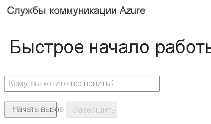

[!INCLUDE [Emergency Calling Notice](../../../includes/emergency-calling-notice-include.md)]
## <a name="prerequisites"></a>Предварительные требования

- Учетная запись Azure с активной подпиской. [Создайте учетную запись](https://azure.microsoft.com/free/?WT.mc_id=A261C142F) бесплатно. 
- Развернутый ресурс Служб коммуникации. [Создайте ресурс Служб коммуникации.](../../create-communication-resource.md)
- Номер телефона, полученный из ресурса Служб коммуникации. [Как получить номер телефона](../../telephony-sms/get-phone-number.md).
- `User Access Token` для включения клиента вызова. Дополнительные сведения о том, [как получить `User Access Token`](../../access-tokens.md)
- Выполните инструкции из краткого руководства [Начало работы путем добавления вызова в приложение](../getting-started-with-calling.md).

### <a name="prerequisite-check"></a>Проверка предварительных условий

- Чтобы просмотреть номера телефонов, связанные с ресурсом Служб коммуникации, войдите на [портал Azure](https://portal.azure.com/), перейдите к ресурсу Служб коммуникации и откройте вкладку с **номерами телефонов** в области навигации слева.
- Вы можете создать и запустить приложение с помощью клиентской библиотеки вызовов Служб коммуникации Azure для JavaScript:

```console
npx webpack-dev-server --entry ./client.js --output bundle.js
```

## <a name="setting-up"></a>Настройка

### <a name="add-pstn-functionality-to-your-app"></a>Добавление возможностей PSTN в приложение

Расширьте свой макет с помощью средств управления набором номера телефона.

Поместите этот код в конец раздела `<body />` в **index.html** перед тегами `<script />`:

```html
<input 
  id="callee-phone-input"
  type="text"
  placeholder="Phone number you would like to dial"
  style="margin-bottom:1em; width: 230px;"
/>
<div>
  <button id="call-phone-button" type="button">
    Start Phone Call
  </button>
  &nbsp;
  <button id="hang-up-phone-button" type="button" disabled="true">
    Hang Up Phone Call
  </button>
</div>
```

Расширьте логику приложения с помощью функций телефонии.

Добавьте этот код в файл **client.js**.

```javascript
const calleePhoneInput = document.getElementById("callee-phone-input");
const callPhoneButton = document.getElementById("call-phone-button");
const hangUpPhoneButton = document.getElementById("hang-up-phone-button");
```

## <a name="start-a-call-to-phone"></a>Вызов телефонного номера

Укажите номер телефона, полученный в ресурсе Служб коммуникации, который будет использоваться для осуществления вызова:
> [!WARNING]
> Обратите внимание, что номера телефонов должны быть указаны в формате международного стандарта E.164, например, +12223334444.

Добавьте обработчик событий, чтобы начать вызов по номеру телефона, указанному при нажатии `callPhoneButton`:


```javascript
callPhoneButton.addEventListener("click", () => {
  // start a call to phone
  const phoneToCall = calleePhoneInput.value;
  call = callAgent.call(
    [{phoneNumber: phoneToCall}], { alternateCallerId: {phoneNumber: '+18336528005'}
  });

  // toggle button states
  hangUpPhoneButton.disabled = false;
  callPhoneButton.disabled = true;
});
```

## <a name="end-a-call-to-phone"></a>Завершение вызова на телефонный номер

Добавьте прослушиватель событий для завершения текущего вызова при нажатии `hangUpPhoneButton`:

```javascript
hangUpPhoneButton.addEventListener("click", () => {
  // end the current call
  call.hangUp({
    forEveryone: true
  });

  // toggle button states
  hangUpPhoneButton.disabled = true;
  callPhoneButton.disabled = false;
});
```

Свойство `forEveryone` позволяет завершить вызов для всех его участников.

## <a name="run-the-code"></a>Выполнение кода

Чтобы создать и запустить приложение, используйте `webpack-dev-server`. Выполните следующую команду, чтобы создать пакет узла приложения на локальном веб-сервере:


```console
npx webpack-dev-server --entry ./client.js --output bundle.js
```

Откройте веб-браузер и перейдите по адресу `http://localhost:8080/`. Вы увидите следующее:




Вы можете осуществить вызов на реальный номер телефона, указав номер телефона в дополнительном текстовом поле и нажав кнопку **Start Phone Call** (Начать вызов).

> [!WARNING]
> Обратите внимание, что номера телефонов должны быть указаны в формате международного стандарта E.164, например, +12223334444.
