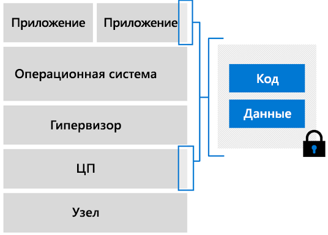

# Обзор виртуальных машин с конфиденциальными вычислениями в Azure

Azure — это первый поставщик облачных служб, который предлагает конфиденциальные вычисления в виртуальном окружении. Мы разработали специальные виртуальные машины, которые представляют уровень абстракции между оборудованием и приложением. Вы можете выполнять на них рабочие нагрузки в большом масштабе с возможностью обеспечения избыточности и требуемого уровня доступности.  

## Виртуальные машины с поддержкой Intel SGX

На виртуальных машинах конфиденциальных вычислений Azure некоторая часть мощности ЦП резервируется для защищенных блоков кода и данных в приложении. Эти защищенные блоки и являются анклавами. 

Инфраструктура конфиденциальных вычислений Azure сейчас включает специализированный SKU для виртуальных машин. Такие виртуальные машины выполняются на процессорах Intel c технологией Intel SGX (Software Guard Extension). Компонент [Intel SGX](https://intel.com/sgx) позволяет усилить защиту, обеспечиваемую конфиденциальными вычислениями. 

Сейчас Azure предлагает виртуальные машины [DCsv2-Series](https://docs.microsoft.com/azure/virtual-machines/dcv2-series) на основе технологии Intel SGX для создания анклавов с аппаратной поддержкой. Вы можете создавать защищенные приложения на основе анклавов, которые будут выполняться на виртуальных машинах серии DCsv2 для защиты данных и кода, используемых в приложении. 

[Узнайте больше](virtual-machine-solutions.md) о развертывании виртуальных машин с конфиденциальными вычислениями в Azure с помощью доверенных енклавес на основе оборудования.

## Анклавы

Енклавес — это защищенные части процессора и памяти оборудования. Даже с помощью отладчика невозможно просматривать данные, размещенные в анклаве. Если недоверенный код попытается изменить содержимое памяти анклава, среда будет заблокирована, а любые операции отклонены.

Анклав можно концептуально рассматривать как защищенный ящик. В этот ящик вы помещаете зашифрованные данные и код. За пределами ящика содержимое не подлежит просмотру. Вы передаете в анклав ключ для расшифровки данных, после чего данные обрабатываются и снова шифруются перед отправкой за пределы анклава.

Каждый анклава имеет установленный размер кэша зашифрованных страниц (EPC), который определяет объем памяти, который может хранить каждая анклава. Большие виртуальные машины DCsv2 имеют больше памяти EPC. На странице [спецификации DCsv2](https://docs.microsoft.com/azure/virtual-machines/dcv2-series) приведены максимальные значения EPC на размер виртуальной машины.

### Разработка приложений для запуска в енклавес
При разработке приложений вы можете использовать [программные средства](application-development.md) для блокировки сегментов кода и данных в анклаве. Эти средства не позволят просматривать код и данные лицам за пределами доверенной среды. 

## Next Steps
- [Ознакомьтесь](virtual-machine-solutions.md) с рекомендациями по развертыванию решений на виртуальных машинах с конфиденциальными вычислениями в Azure.
- [Развертывание DCsv2-Series виртуальной машины](quick-create-portal.md)
- [Разработка приложения с поддержкой анклава](application-development.md) с помощью пакета SDK OE