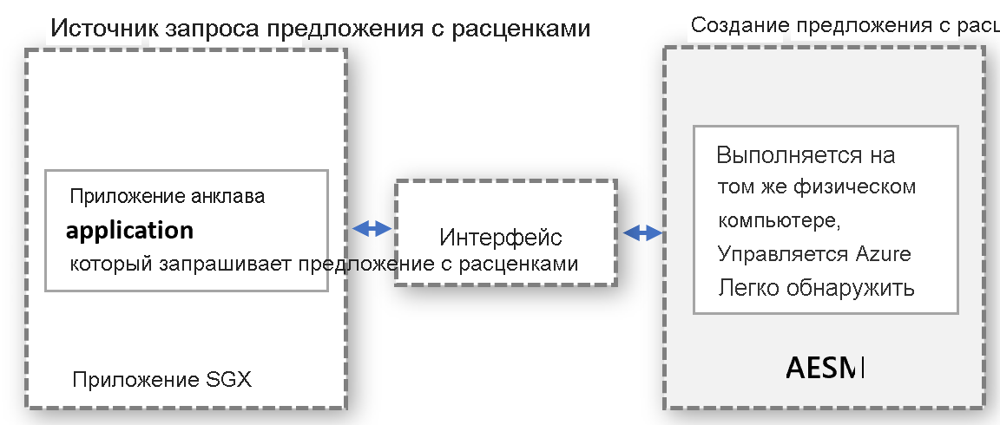

# <a name="platform-software-management-with-sgx-quote-helper-daemon-set"></a>Управление программными платформами с помощью набора управляющих программ вспомогательной функции цитирования SGX

[Приложения с поддержкой анклавов](confidential-computing-enclaves.md), которые выполняют удаленную аттестацию, требуют создания цитаты (QUOTE). Эта цитата предоставляет криптографическое подтверждение идентификации и состояния приложения, а также среды выполнения анклава. Для создания цитаты требуются доверенные программные компоненты, которые входят в пакет Intel PSW (Platform Software Components — компоненты программной платформы).

## <a name="overview"></a>Обзор
 
Intel поддерживает для создания цитаты два режима аттестации:
- **внутрипроцессный** означает размещение доверенных программных компонентов внутри процесса приложения с поддержкой анклавов;

- **внепроцессный** означает размещение доверенных программных компонентов за пределами процесса приложения с поддержкой анклавов.
 
Приложения SGX, созданные на основе пакета Open Enclave SDK, по умолчанию используют внутрипроцессный режим аттестации. Приложения на основе SGX разрешают внепроцессную аттестацию, но для этого необходимо размещать и предоставлять за пределами приложения обязательные дополнительные компоненты, как например Диспетчер архитектуры служб анклава (Architectural Enclave Service Manager — АЕСМ).

Мы **настоятельно рекомендуем** использовать эту возможность, так как она повышает время бесперебойной работы приложений поддержкой анклавов при обновлениях платформы Intel или драйверов DCAP.

## <a name="why-and-what-are-the-benefits-of-out-of-proc"></a>Какие преимущества дает внепроцессная аттестация и почему?

-   Не придется отдельно обновлять компоненты PSW для создания цитат в каждом контейнерном приложении. Внепроцессный подход позволяет владельцам контейнеров не беспокоиться об управлении обновлениями в своем контейнере. Вместо этого владельцы контейнеров применяют интерфейс, предоставляемый поставщиком, чтобы обращаться к размещенной за пределами контейнера централизованной службе, обновлением и управлением которой занимается поставщик.

-   Не нужно беспокоиться о сбоях аттестации из-за устаревших компонентов PSW. Создание цитаты включает доверенные компоненты (анклав цитирования (QE) и сертификат подготовки анклава (PCE)), которые входят в доверенную вычислительную базу (TCB). Чтобы соблюдать требования аттестации, эти компоненты программного обеспечения должны быть актуальными. Так как обновлениями этих компонентов управляет поставщик, клиенты никогда не столкнутся с ошибками аттестации из-за устаревших компонентов доверенного программного обеспечения в контейнере.

-   Более эффективное использование памяти EPC. В режиме внутрипроцессной аттестации каждому приложению с поддержкой анклавов необходимо создать свой экземпляр QE и PCE для удаленной аттестации. Внепроцессный режим позволяет не размещать эти анклавы в контейнере, а значит не тратить на их работу память из квоты контейнера.

-   Защита от принудительного выполнения ядра. Когда драйвер SGX выносится "наверх" в ядро Linux, к анклаву применяется принудительное выполнение для повышения уровня привилегий. Этот уровень позволяет анклаву вызывать PCE, но это нарушает работу приложения с поддержкой анклавов, работающего во внутрипроцессном режиме. По умолчанию анклавы не имеют такого разрешения. Чтобы предоставить приложению с поддержкой анклавов эту привилегию, нужно вносить изменения в процесс установки приложения. Это легче сделать при использовании внепроцессной модели, так как поставщик службы, обрабатывающей внепроцессные запросы, обеспечит предоставление этой привилегии при установке службы.

-   Нет необходимости проверять обратную совместимость с PSW и DCAP. Обновления компонентов создания цитат в PSW проверяются поставщиком на обратную совместимость перед каждым обновлением. Это поможет заранее избежать проблем с совместимостью и устранить их перед развертыванием обновлений для конфиденциальных рабочих нагрузок.

## <a name="how-does-the-out-of-proc-attestation-mode-work-for-confidential-workloads-scenario"></a>Как работает внепроцессный режим аттестации в сценарии с конфиденциальной рабочей нагрузкой?

На высоком уровне архитектура использует модель, в которой запрашивающая сторона и создающая цитату сторона выполняются раздельно, но на одном физическом компьютере. Создание цитаты выполняется централизованным компонентом, который обслуживает запросы цитат от всех сущностей. Интерфейс должен быть правильно определен и доступен для обнаружения любой сущностью, которая может запрашивать цитаты.



Описанная выше абстрактная модель в сценарии с конфиденциальной рабочей нагрузки использует уже доступную службу AESM. AESM размещается в контейнерах и развертывается в кластере Kubernetes в формате набора управляющих программ. Kubernetes гарантирует, что на каждом узле агента будет развернут один экземпляр контейнера службы АЕСМ, упакованный в Pod. Новый пакет управляющих программ SGX Quote имеет зависимость от набора управляющих программ sgx-device-plugin, так как контейнер службы AESM будет запрашивать память из sgx-device-plugin для запуска анклавов QE и PCE.

Для каждого контейнера нужно подтвердить внепроцессный режим создания цитат, установив при его создании переменную среды **SGX_AESM_ADDR=1**. Также этот контейнер должен содержать пакет libsgx-quote-ex, который отвечает за отправку запросов на стандартный сокет домена Unix.

Приложение сможет по-прежнему использовать внутрипроцессную аттестацию, но не одновременно с внепроцессной моделью. Внепроцессная инфраструктура доступна по умолчанию и потребляет ресурсы.

## <a name="sample-implementation"></a>Простой пример реализации

Ниже представлен пример файла docker для приложения на основе Open Enclave SDK. Установите переменную среды SGX_AESM_ADDR=1 в этом файле docker или в файле развертывания. В следующем примере вы можете ознакомиться с файлом docker и описанием развертывания yaml. 

  > [!Note] 
  > Чтобы внепросцессная аттестация работала нормально, в контейнер приложения необходимо включить библиотеку **libsgx-quote-ex** компании Intel.
    
```yaml
# Refer to Intel_SGX_Installation_Guide_Linux for detail
FROM ubuntu:18.04 as sgx_base
RUN apt-get update && apt-get install -y \
    wget \
    gnupg

# Add the repository to sources, and add the key to the list of
# trusted keys used by the apt to authenticate packages
RUN echo "deb [arch=amd64] https://download.01.org/intel-sgx/sgx_repo/ubuntu bionic main" | tee /etc/apt/sources.list.d/intel-sgx.list \
    && wget -qO - https://download.01.org/intel-sgx/sgx_repo/ubuntu/intel-sgx-deb.key | apt-key add -
# Add Microsoft repo for az-dcap-client
RUN echo "deb [arch=amd64] https://packages.microsoft.com/ubuntu/18.04/prod bionic main" | tee /etc/apt/sources.list.d/msprod.list \
    && wget -qO - https://packages.microsoft.com/keys/microsoft.asc | apt-key add -

FROM sgx_base as sgx_sample
RUN apt-get update && apt-get install -y \
    clang-7 \
    libssl-dev \
    gdb \
    libprotobuf10 \
    libsgx-dcap-ql \
    libsgx-quote-ex \
    az-dcap-client \
    open-enclave
WORKDIR /opt/openenclave/share/openenclave/samples/remote_attestation
RUN . /opt/openenclave/share/openenclave/openenclaverc \
    && make build
# this sets the flag for out of proc attestation mode. alternatively you can set this flag on the deployment files
ENV SGX_AESM_ADDR=1 

CMD make run
```
Также вы можете включить режим внепроцессной аттестации в файле развертывания yaml, как представлено ниже.

```yaml
apiVersion: batch/v1
kind: Job
metadata:
  name: sgx-test
spec:
  template:
    spec:
      containers:
      - name: sgxtest
        image: <registry>/<repository>:<version>
        env:
        - name: SGX_AESM_ADDR
          value: 1
        resources:
          limits:
            kubernetes.azure.com/sgx_epc_mem_in_MiB: 10
        volumeMounts:
        - name: var-run-aesmd
          mountPath: /var/run/aesmd
      restartPolicy: "Never"
      volumes:
      - name: var-run-aesmd
        hostPath:
          path: /var/run/aesmd
```

## <a name="next-steps"></a>Next Steps
[Краткое руководство. Развертывание кластера Azure Kubernetes Service (AKS) с конфиденциальными вычислительными узлами с использованием Azure CLI (предварительная версия)](./confidential-nodes-aks-get-started.md)

[Примеры для быстрого начала работы с конфиденциальными контейнерами](https://github.com/Azure-Samples/confidential-container-samples)

[Список SKU DCsv2](https://docs.microsoft.com/azure/virtual-machines/dcv2-series)

<!-- LINKS - external -->
[Azure Attestation]: https://docs.microsoft.com/en-us/azure/attestation/


<!-- LINKS - internal -->
[DC Virtual Machine]: /confidential-computing/virtual-machine-solutions