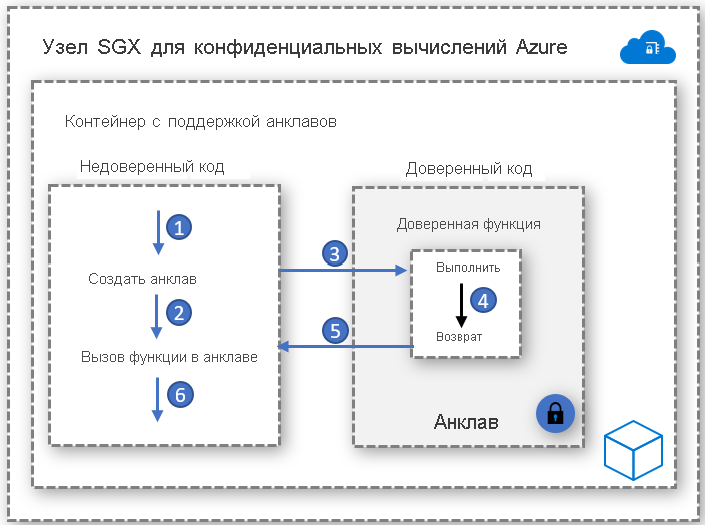

# Контейнеры с поддержкой анклавов

Анклав — это защищенная область памяти, которая обеспечивает конфиденциальность данных и выполнения кода. Это экземпляр доверенной среды выполнения (TEE), защищенный оборудованием. Узлы конфиденциальных вычислений на AKS используют [расширение Intel Software Guard (SGX)](https://software.intel.com/sgx) для создания изолированных сред анклавов в узлах между каждым приложением-контейнером.

Аналогично виртуальным машинам Intel SGX, приложения-контейнеры, разработанные для запуска в анклавах, имеют два компонента:

- ненадежный компонент (основное приложение);
- доверенный компонент (анклав).

Архитектура приложений-контейнеров с поддержкой анклавов обеспечивает наибольший контроль над реализацией и поддерживает занимаемый кодом объем памяти в анклаве на низком уровне. Уменьшение объема кода, выполняемого в анклаве, помогает сократить контактные зоны для атак.   

## Необходимые условия

### Открыть пакет SDK для Enclave
Пакет SDK Open Enclave — это независимая от оборудования библиотека с открытым кодом для разработки приложений на C, C++, использующих аппаратные доверенные среды выполнения. Текущая реализация обеспечивает поддержку Intel SGX, а также предварительной версии [ОС OP-TEE в Arm TrustZone](https://optee.readthedocs.io/en/latest/general/about.html).

Начните работу с приложением-контейнером на основе Open Enclave, выполнив действия, описанные [здесь](https://github.com/openenclave/openenclave/tree/master/docs/GettingStartedDocs).

### Пакет SDK Intel SGX
Технология Intel поддерживает пакет средств разработки программного обеспечения для создания приложений SGX для рабочих нагрузок контейнеров Linux и Windows. Контейнеры Windows в настоящее время не поддерживаются узлами конфиденциальных вычислений AKS.

Начните работу с приложениями на основе Intel SGX, выполнив действия, описанные [здесь](https://software.intel.com/content/www/us/en/develop/topics/software-guard-extensions/sdk.html).

### Платформа консорциума конфиденциальных вычислений (CCF)
Платформа консорциума конфиденциальных вычислений (CCF) — это платформа с открытым кодом для создания категории безопасных, высокодоступных и производительных приложений для вычислительных ресурсов и данных с несколькими участниками. Платформа CCF может включать высокомасштабируемые и конфиденциальные сети, соответствующие основным требованиям предприятий. Она предоставляет средства для ускорения производства и адаптации блокчейн-консорциума и технологии вычисления ресурсов с несколькими участниками.

Начните работу с конфиденциальными вычислениями Azure и CCF, выполнив действия, описанные [здесь](https://github.com/Microsoft/CCF).

### Среда выполнения ONNX с конфиденциальным выводом

Среда выполнения ONNX на основе анклавов с открытым кодом устанавливает защищенный канал между клиентом и службой вывода, чтобы ни запрос, ни ответ не могли оказаться за пределами безопасного анклава. 

Это решение позволяет использовать существующую обученную модель машинного обучения и выполнять ее конфиденциально, создавая отношения доверия между клиентом и сервером с помощью аттестации и проверки. 

Начните работу по миграции модели машинного обучения методом lift-and-shift в среду выполнения ONNX, выполнив действия, описанные [здесь](https://aka.ms/confidentialinference).

### Edgeless RT

Edgeless RT — это проект с открытым кодом, созданный на основе пакета SDK Open Enclave. В нем добавлена поддержка Go и дополнительных функций C++. Начните работу с простым конфиденциальным приложением Go, используя знакомую среду VS Code, [здесь](https://github.com/edgelesssys/edgelessrt). В случае с приложениями Edgeless в AKS следуйте [этим инструкциям](https://github.com/edgelesssys/edgelessrt/blob/master/docs/ERTAzureAKSDeployment.md).

## Примеры реализации на основе контейнеров

[Примеры Azure для контейнеров с поддержкой анклавов в AKS](https://github.com/Azure-Samples/confidential-computing/tree/main/containersamples)

<!-- LINKS - external -->
[Аттестация Azure](../attestation/overview.md)

<!-- LINKS - internal -->
[Виртуальная машина контроллера домена](/azure/confidential-computing/virtual-machine-solutions)
[Конфиденциальные контейнеры](/azure/confidential-computing/confidential-containers)
