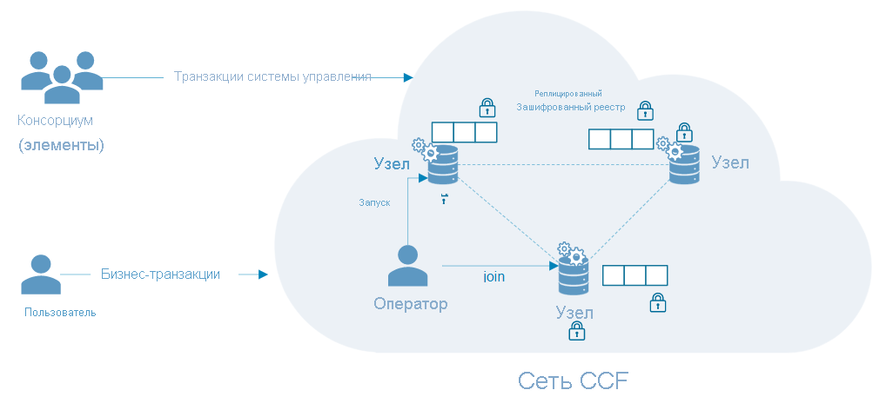

# Типичные сценарии для конфиденциальных вычислений в Azure

В этой статье собраны общие сведения о нескольких распространенных сценариях для конфиденциальных вычислений в Azure. Приведенные в этой статье рекомендации станут отправной точкой при разработке приложения, которое использует службы и платформы конфиденциальных вычислений. 

Ознакомившись с данной статьей, вы сможете ответить на следующие вопросы.

- Какие существуют сценарии для конфиденциальных вычислений в Azure?
- В чем преимущества конфиденциальных вычислений в Azure для сценариев с несколькими участниками?
- В чем преимущества конфиденциальных вычислений в Azure в сети блокчейн?

## Безопасное вычисление с несколькими участниками
Конфиденциальные вычисления в Azure позволяют обрабатывать данные из нескольких источников, не раскрывая входные данные другим сторонам. Такой тип безопасных вычислений поддерживает многие сценарии, такие как защита от отмыва денег, обнаружение мошенничества и безопасный анализ медицинских данных.

Несколько источников могут передать свои данные в один анклав на виртуальной машине. Затем один из участников отправляет анклаву команду на вычисление или обработку данных. Ни один из участников (даже тот, который фактически выполняет анализ) не может видеть данные другого участника, которые были переданы в анклав. 

При выполнении безопасных вычислений с несколькими участниками в анклав отправляются зашифрованные данные, затем он расшифровывает эти данные с помощью ключа, выполняет анализ и получает результат, а затем возвращает зашифрованный результат участнику, который может расшифровать его с помощью назначенного ключа. 

**Защита данных при использовании.** 
- Используйте в Azure виртуальную машину серии DCsv2 (VM) с включенной поддержкой Intel SGX. Эти виртуальные машины оснащены доверенными средами выполнения (trusted execution environment — TEE), которые защищают и изолируют фрагменты данных и кода приложения.
- Используйте пакет SDK с поддержкой анклавов, чтобы создать анклав внутри виртуальной машины. Данные в таком анклаве недоступны никому, даже поставщику виртуальной машины. Данные в анклаве шифруются с использованием аппаратных ресурсов.
    - Например, для обработки на стороне сервера вы можете применить [пакет Open Enclave SDK](https://github.com/openenclave/openenclave). 

**Защита данных при передаче** 
- Использование аттестованного TLS в качестве защищенного канала для защиты передаваемых данных.
- Клиент гарантирует, что данные отправляются только на тот сервер, который защищен с помощью анклава. 

**Защита хранящихся данных**
- Использование защищенных и безопасных хранилищ данных для защиты данных при хранении. 

### Борьба с отмыванием денег
В нашем примере защищенных вычислений с несколькими участниками объединяются данные нескольких банков, ни один из которых не предоставляет другим персональные данные своих клиентов. Банки применяют согласованные аналитические вычисления по объединенному набору конфиденциальных данных. Аналитика по объединенному набору данных позволяет обнаруживать перемещения денег, выполняемые одним человеком между несколькими банками, при этом банки не получают доступа к чужим данным.

Благодаря конфиденциальным вычислениям эти финансовые учреждения могут увеличить долю обнаруженных мошенничеств, сценариев отмывания денег, сократить количество ложных срабатываний и увеличить размер наборов данных, используемых для обучения. 

### Разработка медикаментов в сфере здравоохранения
Партнерские платформы здравоохранения объединяют наборы данных о пациентах и применяют их для обучения модели машинного обучения. Каждое медицинское учреждение может видеть только свой набор данных. Другие учреждения и даже поставщик облачных услуг не смогут просматривать эти данные или результирующую модель. 

Все учреждения получат пользу от применения обученной модели. Создавая модель по большему объему данных, мы повышаем ее точность. Каждое учреждение, которое участвовало в обучении модели, сможет использовать ее и получать полезные результаты. 

## Блокчейн

Сеть блокчейн представляет собой децентрализованную сеть узлов. Эти узлы выполняются и обслуживаются операторами (проверяющими сторонами), которые стремятся обеспечить целостность сети и достичь консенсуса в отношении ее состояния. Каждый узел хранит реплики реестров, которые используются для мониторинга транзакций блокчейна. Каждый узел имеет полную копию журнала транзакций, что гарантирует их целостность и доступность в распределенной сети.

Технологии блокчейн, основанные на конфиденциальных вычислениях, могут использовать аппаратные методы обеспечения конфиденциальности для защиты данных и вычислений. В некоторых случаях все журналы транзакций шифруются для защиты доступа к данным. Иногда транзакции выполняются в модуле вычислений внутри анклава на том же узле.

### Платформа консорциума конфиденциальных вычислений (CCF)
[CCF](https://www.microsoft.com/research/project/confidential-consortium-framework/) является одним из примеров распределенной блокчейн-платформы, построенной на базе конфиденциальных вычислений Azure. Эта платформа развивается под руководством Microsoft Research, и на основе мощных доверенных сред выполнения (TEE) позволяет создавать сеть удаленных анклавов для аттестации. Эти узлы могут выполняться на виртуальных машинах Azure ([серии DCsv2](confidential-computing-enclaves.md)) и использовать все преимущества инфраструктуры анклава. С помощью протоколов аттестации пользователи блокчейна могут проверять целостность каждого узла CCF и всей сети в целом. 

В архитектуре CCF децентрализованный реестр хранит все внесенные в хранилище изменения в формате "ключ — значение" и реплицируется на все узлы в сети. На каждом из этих узлов выполняется обработчик транзакций, который активируется пользователями блокчейна через TLS-подключение. Каждое обращение к конечной точке изменяет данные в хранилище пар "ключ — значение". Перед сохранением зашифрованного изменения в децентрализованном журнале транзакций оно должно быть согласовано с определенным количеством узлов, чтобы достичь консенсуса. 

## Next Steps
[Разверните](quick-create-marketplace.md) виртуальную машину серии DCsv2.

