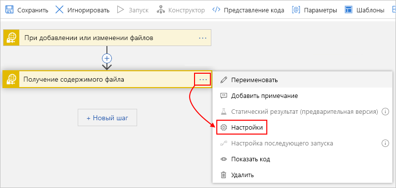

# Мониторинг и создание SFTP-файлов, а также управление ими с помощью SSH и Azure Logic Apps

Чтобы автоматизировать задачи мониторинга, создания, отправки и получения файлов на сервере [безопасного протокола передачи файлов (SFTP)](https://www.ssh.com/ssh/sftp/) с помощью протокола [SSH](https://www.ssh.com/ssh/protocol/), создайте и автоматизируйте рабочие процессы интеграции с помощью Azure Logic Apps и соединителя SFTP-SSH. SFTP является сетевым протоколом, которому предоставляется доступ к файлам, передаче файлов и управлению файлами на основе надежного потока данных.

Ниже приведены некоторые примеры задач, которые можно автоматизировать:

* мониторинг добавления или изменения файлов;
* получение, создание, копирование, переименование, перечисление, обновление и удаление файлов;
* создание папок;
* получение содержимого и метаданных файлов;
* извлечение архивов в папки.

Вы можете использовать триггеры, которые отслеживают события сервера SFTP и делают выходные данные доступными для других действий. Вы можете использовать действия для выполнения различных задач на SFTP-сервере. Кроме того, в вашем приложении логики есть другие действия, которые могут использовать выходные данные действий SFTP. Например, если вы регулярно извлекаете файлы с сервера SFTP, то можете отправлять сообщения оповещений об этих файлах и их содержимое с помощью соединителя Outlook Office 365 или Outlook.com. Если вы не знакомы с приложениями логики, ознакомьтесь со статьей [Что такое Azure Logic Apps](../logic-apps/logic-apps-overview.md).

Сведения о различиях между соединителем SFTP-SSH и соединителем SFTP см. Далее в разделе [Сравнение SFTP-SSH и SFTP](#comparison) .

## Ограничения

* В настоящее время соединитель SFTP-SSH не поддерживает эти серверы SFTP:

  * IBM Power
  * мессажевай
  * OpenText безопасная MFT
  * OpenText ГКСС

* Соединитель SFTP-SSH поддерживает проверку подлинности с помощью закрытого ключа или пароля, а не оба.

* Операции SFTP-SSH, поддерживающие [фрагментацию](../logic-apps/logic-apps-handle-large-messages.md) , могут работать с файлами размером до 1 ГБ, а действия SFTP, которые не поддерживают фрагментацию, могут работать с файлами размером до 50 МБ. Хотя размер фрагмента по умолчанию составляет 15 МБ, этот размер может динамически изменяться, начиная с 5 МБ и постепенно увеличивающийся до 50 МБ в зависимости от таких факторов, как задержка сети, время ответа сервера и т. д.

  > [!NOTE]
  > Для приложений логики в [среде службы интеграции (ISE)](../logic-apps/connect-virtual-network-vnet-isolated-environment-overview.md)эта версия этого соединителя требует, чтобы в качестве фрагментации использовались [ограничения сообщений интегрированной среды сценариев](../logic-apps/logic-apps-limits-and-config.md#message-size-limits) .

  Это адаптивное поведение можно переопределить при [указании размера блока константы](#change-chunk-size) для использования вместо него. Этот размер может варьироваться от 5 МБ до 50 МБ. Например, предположим, что имеется файл размером 45 МБ и сеть, которая может поддерживать этот размер файла без задержки. Адаптивное Фрагментирование приводит к нескольким вызовам, а не по одному вызову. Чтобы уменьшить количество вызовов, можно попробовать установить размер фрагмента 50-МБ. В разных сценариях, если время ожидания приложения логики истекает, например при использовании блоков размером 15 МБ, можно попробовать уменьшить размер до 5 МБ.

  Размер фрагмента связан с соединением. Это означает, что можно использовать одно и то же соединение для действий, поддерживающих фрагментацию, а затем для действий, которые не поддерживают фрагментацию. В этом случае размер фрагмента для действий, которые не поддерживают фрагментацию диапазонов от 5 МБ до 50 МБ. В этой таблице показано, какие действия SFTP поддерживают фрагментацию:

  | Действие | Поддержка фрагментации | Поддержка переопределения размера блока |
  |--------|------------------|-----------------------------|
  | **Копировать файл** | Нет | Неприменимо |
  | **Создание файла** | Да | Да |
  | **Создать папку** | Неприменимо | Неприменимо |
  | **Удалить файл** | Неприменимо | Неприменимо |
  | **Извлечение архива в папку** | Неприменимо | Неприменимо |
  | **Получение содержимого файла** | Да | Да |
  | **Получение содержимого файла с помощью пути** | Да | Да |
  | **Получение метаданных файла** | Неприменимо | Неприменимо |
  | **Получение метаданных файла с помощью пути** | Неприменимо | Неприменимо |
  | **Вывод списка файлов в папке** | Неприменимо | Неприменимо |
  | **Переименовать файл** | Неприменимо | Неприменимо |
  | **Обновление файла** | Нет | Неприменимо |
  ||||

* SFTP-триггеры SSH не поддерживают фрагментацию сообщений. При запросе содержимого файла триггеры выбирают только те файлы, которые имеют размер не менее 15 МБ. Чтобы получить файлы размером более 15 МБ, используйте следующий шаблон:

  1. Используйте триггер SFTP-SSH, который возвращает только свойства файла, например **при добавлении или изменении файла (только свойства)**.

  1. Следуйте указаниям триггера с действием SFTP-SSH **Get File Content** , которое считывает полный файл и неявно использует фрагменты сообщений.

## Сравнение SFTP-SSH и SFTP

Ниже приведены остальные ключевые различия между соединителями SFTP-SSH и SFTP. Соединитель SFTP-SSH имеет следующие возможности:

* Использует [библиотеку SSH.NET](https://github.com/sshnet/SSH.NET), которая является библиотекой Secure Shell с открытым исходным кодом (SSH), которая поддерживает .NET.

* Предоставляет действие **Создание папки**, которое создает папку по указанному пути на сервере SFTP.

* Предоставляет действие **Переименование файла**, которое переименовывает файл на сервере SFTP.

* Выполняет кэширование подключения к серверу SFTP *продолжительностью до 1 часа*, что повышает производительность и уменьшает количество попыток подключения к серверу. Чтобы указать длительность этого поведения кэширования, измените свойство [**ClientAliveInterval**](https://man.openbsd.org/sshd_config#ClientAliveInterval) в конфигурации SSH на SFTP-сервере.

## Предварительные требования

* Подписка Azure. Если у вас еще нет подписки Azure, [зарегистрируйтесь для получения бесплатной учетной записи Azure](https://azure.microsoft.com/free/).

* Ваши адреса сервера SFTP и учетные данные учетной записи, которые позволяют приложению логики получать доступ к учетной записи SFTP. Вам также необходим доступ к закрытому ключу SSH и паролю закрытого ключа SSH. Чтобы использовать фрагментацию при отправке больших файлов, необходимы разрешения на чтение и запись для корневой папки на сервере SFTP. В противном случае возникнет ошибка "401 с несанкционированным".

  > [!IMPORTANT]
  >
  > Соединитель SFTP-SSH поддерживает *только* эти закрытые ключи, форматы, алгоритмы и отпечатки пальцев:
  >
  > * **Форматы закрытых ключей**: ключи RSA (Ривест Шамир Адельман) и DSA (алгоритм цифровой подписи) в форматах OpenSSH и SSH.com. Если закрытый ключ находится в формате файла выводимого (. PPK), сначала [преобразуйте ключ в формат файла OpenSSH (PEM)](#convert-to-openssh).
  >
  > * **Алгоритмы шифрования**. DES-EDE3-CBC, DES-EDE3-CFB, DES CBC, AES-128-CBC, AES-192-CBC и AES-256-CBC.
  >
  > * **Отпечаток**. MD5
  >
  > После добавления триггера SFTP или действия, которое требуется для приложения логики, необходимо указать сведения о подключении для сервера SFTP. При предоставлении закрытого ключа SSH для этого подключения **_не вводите или не изменяйте ключ_* _, что может привести к сбою подключения. Вместо этого необходимо _*_скопировать ключ_*_ из файла закрытого ключа SSH и _*_Вставить_*_ этот ключ в сведения о подключении. 
  > Дополнительные сведения см. в разделе [Подключение к SFTP с помощью SSH далее в](#connect) этой статье.

_ Основные сведения о [создании приложений логики](../logic-apps/quickstart-create-first-logic-app-workflow.md)

* Приложение логики, из которого необходимо получить доступ к учетной записи SFTP. Чтобы начать работу с триггером SFTP-SSH, [создайте пустое приложение логики](../logic-apps/quickstart-create-first-logic-app-workflow.md). Чтобы использовать действие SFTP-SSH, запустите приложение логики с другим триггером, например триггером **Периодичность**.

## Как работают триггеры SFTP-SSH

### Поведение опроса

SFTP — триггеры SSH опрашиваются в файловой системе SFTP и ищут все файлы, измененные с момента последнего опроса. При изменении файлов некоторые средства позволяют сохранить метку времени. В этом случае необходимо отключить эту функцию, чтобы триггер мог работать. Ниже приведены некоторые распространенные параметры:

| Клиент SFTP | Действие |
|-------------|--------|
| Winscp | Последовательно выберите **пункты Параметры**  >  **предпочтения**  >  **Перенос**  >  **изменить**  >  **сохранить метку**  >  **отключать** . |
| FileZilla | Переход к **передаче**  >  **сохранять метки времени для перенесенных файлов**  >  **Отключить** |
|||

Найдя новый файл, триггер проверяет, записан ли файл полностью, а не частично. Например, во время проверки файлового сервера триггером в файл могут вноситься изменения. Чтобы избежать возврата частично записанного файла, триггер отмечает метку времени для файла с последними изменениями и не возвращает его сразу. Он возвращает его только при повторном опросе сервера. Иногда такое поведение может вызвать задержку, которая удваивает интервал опроса триггера.

### Триггеры сдвига и смещение повторений

Триггеры на основе подключения, в которых необходимо сначала создать подключение, например триггер SFTP-SSH, отличаются от встроенных триггеров, которые изначально выполняются в Azure Logic Apps, например [триггера повторения](../connectors/connectors-native-recurrence.md). В повторяющихся триггерах на основе соединения расписание повторения не является единственным драйвером, который управляет выполнением, а часовой пояс определяет только начальное время начала. Последующие запуски зависят от расписания повторения, последнего выполнения триггера *и* других факторов, которые могут привести к тому, что время выполнения будет отменяться или вызывать непредвиденное поведение, например не сохраняя заданное расписание при начале и окончании летнего времени. Чтобы убедиться, что время повторения не изменяется при наступлении силы летнего времени, вручную настройте повторение, чтобы приложение логики продолжало выполняться в ожидаемое время. В противном случае время запуска смещается на один час вперед при запуске летнего времени, а на один час назад — при окончании летнего времени. Дополнительные сведения см. в разделе [повторение триггеров на основе подключений](../connectors/apis-list.md#recurrence-connection-based).

## Преобразование ключа на основе выводимых данных в OpenSSH

Если закрытый ключ имеет формат выводимого, который использует расширение имени файла PPK (выведение закрытого ключа), сначала преобразуйте ключ в формат OpenSSH, который использует расширение имени файла PEM (Privacy Enhanced Mail).

### ОС на основе UNIX

1. Если в системе не установлены средства вывода, сделайте это сейчас, например:

   `sudo apt-get install -y putty`

1. Выполните следующую команду, которая создает файл, который можно использовать с соединителем SFTP-SSH:

   `puttygen <path-to-private-key-file-in-PuTTY-format> -O private-openssh -o <path-to-private-key-file-in-OpenSSH-format>`

   Пример:

   `puttygen /tmp/sftp/my-private-key-putty.ppk -O private-openssh -o /tmp/sftp/my-private-key-openssh.pem`

### ОС Windows

1. Если вы еще не сделали этого, [скачайте последнюю версию средства создания генератора выпусков (puttygen.exe)](https://www.chiark.greenend.org.uk/~sgtatham/putty/latest.html), а затем запустите средство.

1. На этом экране нажмите кнопку **загрузить**.

   

1. Перейдите к файлу закрытого ключа в формате выводимого файла и выберите **Открыть**.

1. В меню **преобразования** выберите **Экспорт ключа OpenSSH**.

   

1. Сохраните файл закрытого ключа с `.pem` расширением имени файла.

## Рекомендации

В этом разделе описываются рекомендации по проверке триггеров и действий этого соединителя.

### Создать файл

Чтобы создать файл на SFTP-сервере, можно использовать действие **создания файла** SFTP/SSH. Когда это действие создает файл, служба Logic Apps также автоматически вызывает SFTP Server для получения метаданных файла. Однако при перемещении только что созданного файла до того, как служба Logic Apps сможет вызвать получение метаданных, вы получите `404` сообщение об ошибке `'A reference was made to a file or folder which does not exist'` . Чтобы пропустить чтение метаданных файла после создания файла, выполните шаги по [добавлению и установке свойства **получить все метаданные файла** в значение **нет**](#file-does-not-exist).

## Подключение к SFTP с помощью SSH

[!INCLUDE [Create connection general intro](../../includes/connectors-create-connection-general-intro.md)]

1. Войдите на [портал Azure](https://portal.azure.com) и откройте свое приложение логики в конструкторе приложений логики, если оно еще не открыто.

1. Для пустых приложений логики в поле поиска введите `sftp ssh` фильтр. В списке триггеров выберите нужный триггер.

   -или-

   Для существующих приложений логики на последнем шаге, куда нужно добавить действие, выберите **новый шаг**. В поле поиска введите `sftp ssh` в качестве фильтра. В списке действий выберите любое необходимое действие.

   Чтобы добавить действие между шагами, переместите указатель на стрелку между шагами. Нажмите появившийся знак "плюс" ( **+** ), а затем выберите **Добавить действие**.

1. Укажите необходимые сведения для подключения.

   > [!IMPORTANT]
   >
   > При вводе закрытого ключа SSH в свойстве **закрытого ключа SSH** выполните следующие дополнительные шаги, которые помогут убедиться, что вы предоставили полное и правильное значение для этого свойства. Недопустимый ключ вызывает сбой подключения.

   Несмотря на то, что можно использовать любой текстовый редактор, ниже приведены примеры шагов, которые показывают, как правильно копировать и вставлять в него ключ. Например, с помощью Notepad.exe.

   1. Откройте файл закрытого ключа SSH в текстовом редакторе. В этих шагах Notepad используется в качестве примера.

   1. В меню **Правка** Блокнота выберите **команду выбрать все**.

   1. Выберите **изменить**  >  **копию**.

   1. В триггере SFTP-SSH или действии, которое вы добавили, вставьте *полный* ключ, скопированный в свойство **закрытого ключа SSH**, которое поддерживает несколько строк.  **_Обязательно вставьте_* _ ключ. _*_Не вводите или не изменяйте ключ вручную_*_.

1. Завершив ввод сведений о подключении, выберите _ * создать * *.

1. Теперь укажите необходимые сведения для выбранного триггера или действия и продолжайте создание рабочего процесса приложения логики.

## Переопределить размер блока

Чтобы переопределить адаптивное поведение, используемое при использовании блоков, можно задать постоянный размер фрагмента в размере от 5 МБ до 50 МБ.

1. В правом верхнем углу действия нажмите кнопку с многоточием (**...**), а затем выберите **Параметры**.

   

1. В разделе **Перемещение содержимого** в свойстве **Размер фрагмента** введите целое значение `5` , например `50` : 

   

1. После завершения нажмите кнопку **Готово**.

## Примеры

### Триггер SFTP-SSH. Добавление или изменение файла

Если на сервере SFTP добавлен или изменен файл, триггер запускает рабочий процесс приложения логики. Например, вы можете добавить условие, которое проверяет содержимое файла и получает его в зависимости от того, соответствует ли содержимое указанному условию. Затем вы можете добавить действие, которое получает содержимое файла и помещает его в папку на сервере SFTP.

В **контексте предприятия** можно использовать этот триггер, чтобы отслеживать в папке SFTP новые файлы, представляющие заказы клиентов. Вы также можете использовать действие SFTP **Получить содержимое файла**, чтобы получить содержимое заказа для дальнейшей обработки и хранения в базе данных заказов.

### SFTP — действие SSH: получение содержимого файла по пути

Это действие получает содержимое из файла на SFTP-сервере, указывая путь к файлу. Например, вы можете добавить триггер из предыдущего примера и условие, которому должно соответствовать содержимое файла. Если оно соответствует условию, действие, которое получает содержимое, может выполняться.

## Устранение неполадок

В этом разделе описываются возможные решения распространенных ошибок или проблем.

### 504 ошибка: "попытка подключения не удалась, так как подключенная сторона не ответила должным образом по истечении определенного периода времени, или не удалось установить соединение, так как подключенный узел не смог ответить" или "запрос на SFTP-сервер занял больше" 00:00:30 "секунд"

Эта ошибка может возникать, если приложение логики не может успешно установить соединение с SFTP-сервером. Эта проблема может быть различной по разным причинам, поэтому попробуйте выполнить следующие действия по устранению неполадок:

* Время ожидания подключения составляет 20 секунд. Убедитесь, что сервер SFTP имеет хорошую производительность и промежуточные устройства, такие как брандмауэры, не добавляют дополнительную нагрузку. 

* Если настроен брандмауэр, убедитесь, что вы добавили **IP-адреса управляемых соединителей** в список утвержденных. Чтобы найти IP-адреса для региона приложения логики, см. раздел [ограничения и настройка для Azure Logic Apps](../logic-apps/logic-apps-limits-and-config.md#multi-tenant-azure---outbound-ip-addresses).

* Если эта ошибка возникает периодически, измените параметр **политики повтора** для действия SFTP-SSH на число повторных попыток, превышающее четыре попытки по умолчанию.

* Проверьте, устанавливает ли SFTP-сервер ограничение на количество подключений с каждого из них. Если ограничение существует, может потребоваться ограничить количество одновременных экземпляров приложения логики.

* Чтобы снизить стоимость установки подключения, в конфигурации SSH для SFTP-сервера увеличьте значение свойства [**ClientAliveInterval**](https://man.openbsd.org/sshd_config#ClientAliveInterval) примерно на один час.

* Просмотрите журнал сервера SFTP, чтобы проверить, достиг ли запрос от приложения логики SFTP Server. Чтобы получить дополнительные сведения о проблеме с подключением, можно также запустить трассировку сети в брандмауэре и на сервере SFTP.

### 404 ошибка: "была сделана ссылка на несуществующий файл или папку"

Эта ошибка может произойти, когда приложение логики создает новый файл на сервере SFTP с помощью действия SFTP-SSH **CREATE FILE** , но сразу же перемещает созданный файл до того, как служба Logic Apps сможет получить метаданные файла. Когда приложение логики запускает действие " **Создание файла** ", служба Logic Apps автоматически вызывает SFTP Server для получения метаданных файла. Однако если приложение логики переместит файл, то служба Logic Apps не сможет найти файл, чтобы получить `404` сообщение об ошибке.

Если не удается избежать или отложить перемещение файла, можно пропустить чтение метаданных файла после создания файла, выполнив следующие действия.

1. В действии **создать файл** откройте список **Добавить новый параметр** , выберите свойство **получить все метаданные файла** и задайте для него значение **нет**.

1. Если эти метаданные файлов понадобятся позже, можно использовать действие **получить метаданные файла** .

## Справочник по соединителям

Дополнительные технические сведения об этом соединителе, такие как триггеры, действия и ограничения, описанные в файле Swagger соединителя, см. на [странице справочника по соединителю](/connectors/sftpwithssh/).

> [!NOTE]
> Для приложений логики в [среде службы интеграции (ISE)](../logic-apps/connect-virtual-network-vnet-isolated-environment-overview.md)эта версия этого соединителя требует, чтобы в качестве фрагментации использовались [ограничения сообщений интегрированной среды сценариев](../logic-apps/logic-apps-limits-and-config.md#message-size-limits) .

## Дальнейшие действия

* См. дополнительные сведения о других [соединителях Logic Apps](../connectors/apis-list.md).
