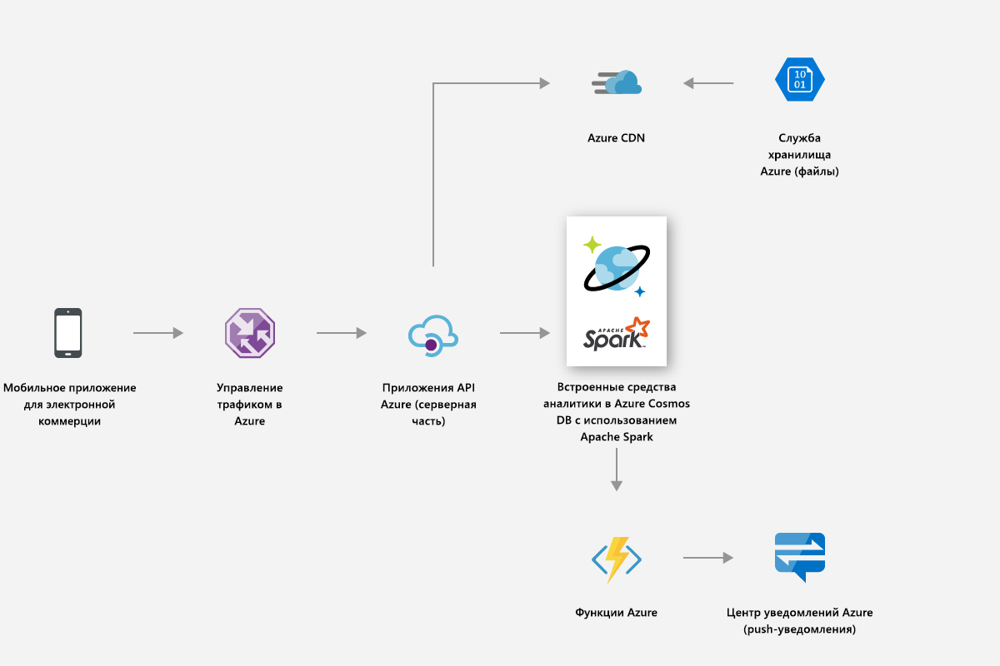
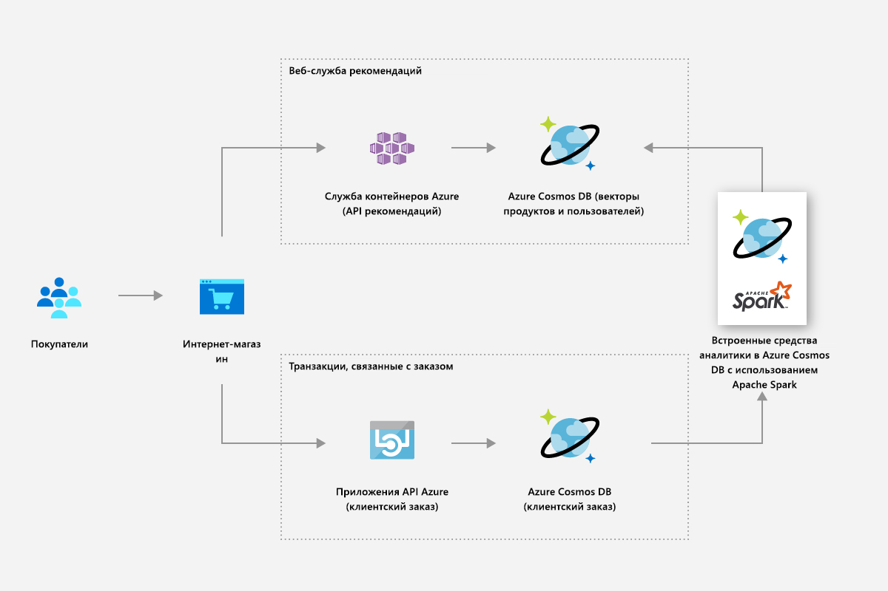
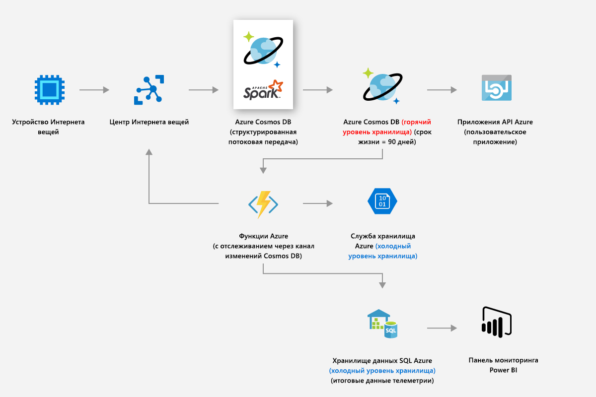
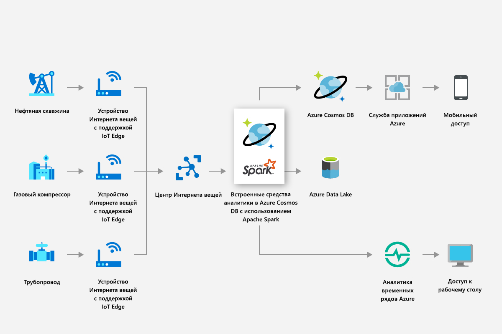
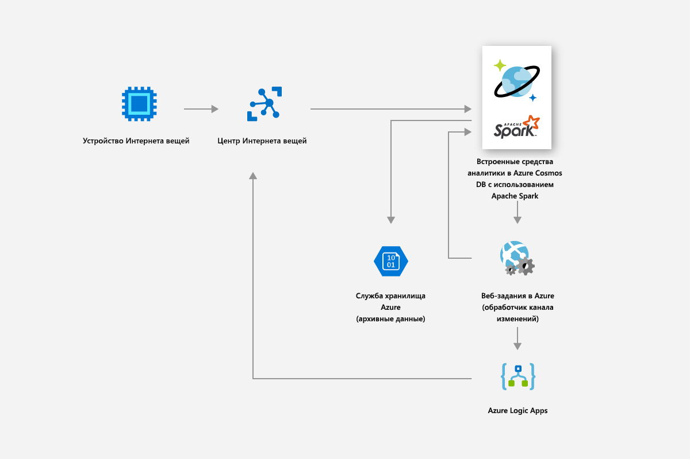
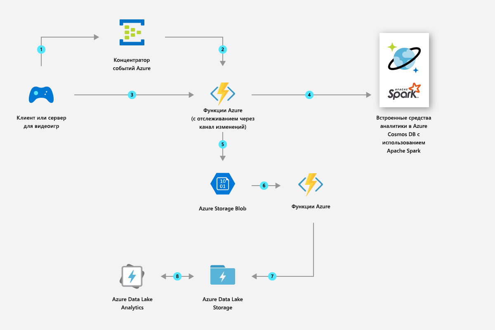

# Решения, использующие глобально распределенную аналитику в Azure Cosmos DB

В этой статье описываются решения, которые можно построить с помощью глобального распределенного анализа в Azure Cosmos DB.

## Розничная торговля и потребительские товары

Вы можете использовать поддержку Spark в Azure Cosmos DB для предоставления рекомендаций и предложений в режиме реального времени. Вы можете помочь клиентам в обнаружении элементов, которые понадобятся им для персонализации и рекомендаций по продуктам в режиме реального времени.

* Вы можете использовать встроенную поддержку машинного обучения, предоставляемую средой выполнения Apache Spark, для создания рекомендаций по каталогам продуктов в режиме реального времени.

* Вы можете собирать данные посещаемости сайтов, данные о приобретениях и данные пользователей, чтобы предоставить целевые рекомендации, позволяющие увеличить значение времени существования.

* Используя функцию глобального распределения Azure Cosmos DB, можно мгновенно анализировать большие объемы данных о продуктах, которые распределяются по регионам.

* Вы можете быстро получить полезные сведения о географически распределенных пользователях и данных. Вы можете повысить коэффициент преобразования продвижения, предоставив нужное объявление нужному пользователю в нужное время.

* Вы можете использовать встроенную функцию потоковой передачи Spark для обогащения актуальных данных, объединив их со статическими данными пользователей. Таким образом, вы можете предоставлять более персонализированные и целевые объявления в режиме реального времени с учетом действий клиентов.

На следующем рисунке показано, как поддержка Azure Cosmos DB Spark используется для оптимизации цен и рекламных предложений:

На следующем рисунке показано, как поддержка Azure Cosmos DB Spark используется в подсистеме рекомендаций в режиме реального времени:

## Производство и Интернет вещей

Встроенная платформа аналитики Azure Cosmos DB позволяет в реальном времени анализировать данные Интернета вещей с миллионов устройств в глобальном масштабе. Вы можете создавать современные инновации, такие как прогнозирование погодных условий, прогнозный анализ и оптимизация энергопотребления.

* Используя Azure Cosmos DB, вы можете анализировать данные, такие как метрики активов в реальном времени и погодные факторы, а затем применять аналитику интеллектуальной сети для оптимизации производительности подключенных устройств в разных расположениях. Аналитика интеллектуальной сети является ключом к контролю за эксплуатационными расходами, повышению надежности сетки и предоставлению персонализированных служб энергоснабжения для пользователей.

На следующем рисунке показано, как поддержка Spark в Azure Cosmos DB используется для считывания метрик с устройств Интернета вещей и применения интеллектуальной аналитики сетей:

## Упреждающее обслуживание

* Обслуживание таких ресурсов, как компрессоры, которые используются в небольших бурильных установках для глубоководных платформ, является сложной задачей. Эти ресурсы расположены по всему миру и создают петабайты данных. С помощью Azure Cosmos DB вы можете создать сквозной конвейер прогнозирования данных, который использует потоковую передачу Spark для обработки больших объемов данных телеметрии датчиков, хранения частей ресурсов и данных сопоставления датчиков.

* Вы можете создавать и развертывать модели машинного обучения для прогнозирования сбоев ресурсов до того, как они произойдут, и для выполнения заданий на техническое обслуживание до возникновения сбоя.

На следующем рисунке показано, как поддержка Spark в Azure Cosmos DB используется для создания системы прогнозного обслуживания:

На следующем рисунке показано, как поддержка Spark в Azure Cosmos DB используется для создания системы диагностики транспортных средств в режиме реального времени:

## Игры

* Благодаря встроенной поддержке Spark Azure Cosmos DB позволяет легко создавать, масштабировать и развертывать расширенные модели аналитики и машинного обучения за считанные минуты, чтобы максимально расширить возможности игрового процесса.

* Вы можете анализировать данные об игроках, покупках и поведении, чтобы создавать соответствующие персонализированные предложения для достижения высоких показателей преобразования.

* С помощью машинного обучения Spark можно анализировать данные телеметрии игр и получать сведения о них. Вы можете диагностировать и предотвращать медленную загрузку и внутриигровые проблемы.

На следующем рисунке показано, как поддержка Spark Azure Cosmos DB используется в игровой аналитике:

## Дальнейшие действия

* Чтобы узнать о преимуществах Azure Cosmos DB, изучите [эту обзорную статью](introduction.md).
* [API Azure Cosmos DB для MongoDB](mongodb-introduction.md)
* [Знакомство с API Cassandra для Azure Cosmos DB](cassandra-introduction.md)
* [Знакомство с Azure Cosmos DB: API Gremlin](graph-introduction.md)
* [Знакомство с Azure Cosmos DB. API таблиц](table-introduction.md)
