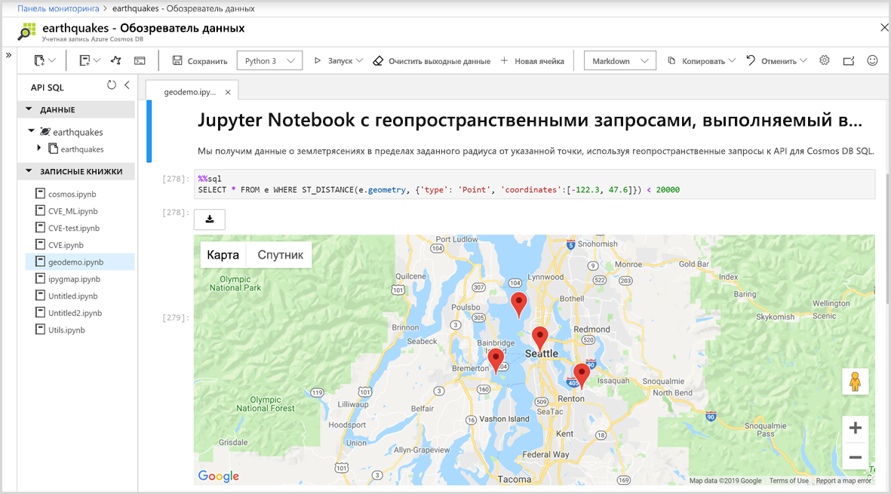

# Встроенная поддержка записных книжек Jupyter в Azure Cosmos DB

Записная книжка Jupyter — это веб-приложение с открытым исходным кодом, которое позволяет создавать и совместно использовать документы, содержащие код в реальном времени, уравнения, визуализации и текстовое описание. Azure Cosmos DB поддерживает встроенные записные книжки Jupyter для всех интерфейсов API, например Cassandra, MongoDB, SQL, Gremlin и таблицы. Встроенная поддержка записных книжек для всех API-интерфейсов Azure Cosmos DB и моделей данных позволяет выполнять запросы интерактивно. Записные книжки Jupyter работают в учетных записях Cosmos Azure и позволяют разработчикам выполнять исследование, очистку, преобразования данных, численное моделирование, статистическое моделирование, визуализацию данных и машинное обучение.

Записные книжки Jupyter поддерживают функции магической команды, которые расширяют возможности ядра, путем поддержки дополнительных команд. Магическая команда Cosmos — это команда, расширяющая возможности ядра Python в записной книжке Jupyter, таким образом станет возможным выполнение API-запросов к Azure Cosmos SQL в дополнение к Apache Spark. Вы можете легко объединить запросы к Python и к API SQL для запроса и визуализации данных с помощью полнофункциональных библиотек визуализации, интегрированных с командами преобразования для просмотра.
Портал Azure изначально интегрирует работу с записной книжкой Jupyter в учетные записи Azure Cosmos, как показано на следующем рисунке:

## Преимущества записных книжек Jupyter

Записные книжки Jupyter изначально разрабатывались для приложений по обработке и анализу данных, написанных в Python, R. Однако их можно использовать по-разному для различных проектов, таких как:

* ***Визуализации данных:** Записные книжки Jupyter позволяют визуализировать данные в виде общей записной книжки, отображающей некоторые наборы данных в графическом виде. Записная книжка Jupyter позволяет создавать визуализации, предоставлять к ним общий доступ и разрешать внесение интерактивных изменений в общий код и набор данных.

* **Общий доступ к коду:** Такие службы, как GitHub, предоставляют способы совместного использования кода, но в основном не являются интерактивными. С помощью записной книжки Jupyter можно просматривать код, выполнять его и отображать результаты непосредственно на портале Azure.

* **Взаимодействие в режиме реального времени с помощью кода:** Код записной книжки Jupyter является динамическим; его можно изменить и постепенно повторно запустить в режиме реального времени. В записные книжки также могут быть встроены пользовательские элементы управления (например, ползунки или поля ввода текста), которые можно использовать в качестве источников входных данных для кода, демонстраций или подтверждения концепции (POC).

* **Документация по примерам кода и результатам исследования данных:** Если у вас есть фрагмент кода и вы хотите построчно объяснить как он работает в Azure Cosmos DB, с выводом в режиме реального времени на протяжении всего пути, вы можете встроить его в записную книжку Jupyter. Код будет оставаться полностью функциональным. Вы можете добавить интерактивность одновременно с документацией.

* **Магические команды Cosmos:** В записных книжках Jupyter можно использовать пользовательские магические команды для Azure Cosmos DB, чтобы упростить интерактивные вычисления. Например, магическая команда %%sql позволяет запрашивать контейнер Cosmos с помощью API SQL непосредственно в записной книжке.

* **Централизованная среда:** Записные книжки Jupyter объединяют код, форматированный текст, изображения, видео, анимации, математические уравнения, графики, карты, интерактивные рисунки, мини-приложения и графические интерфейсы пользователя в один документ.

## Компоненты записной книжки Jupyter

Записные книжки Jupyter могут включать несколько типов компонентов, каждый из которых организован в отдельные блоки:

* **Текст и HTML:** Обычный текст или текст с заметками в синтаксисе Markdown для создания HTML можно вставить в документ в любой точке. Дизайн CSS также можно встроить или добавить в шаблон, используемый для создания записной книжки.

* **Код и выходные данные:** Записные книжки Jupyter поддерживают код Python. Результаты выполненного кода появляются сразу после блоков кода, и блоки кода могут выполняться несколько раз в любом порядке.

* **Визуализации:** Графики и диаграммы могут быть сгенерированы из кода с использованием таких модулей, как Matplotlib, Plotly или Bokeh. Подобно выходным данным, эти визуализации отображаются в строке рядом с кодом, который их генерирует.

* **Мультимедиа:** Поскольку записная книжка Jupyter построена на основе веб-технологии, она может отображать все типы мультимедиа, поддерживаемые на веб-странице. Вы можете включить их в записную книжку как элементы HTML или сгенерировать их программно с помощью модуля `IPython.display`.

* **Данные:** Данные из контейнеров Azure Cosmos и результаты запросов можно программно импортировать в записную книжку Jupyter. Например, включив код в записную книжку для запроса данных с помощью любого API Cosmos DB или встроенной Apache Spark.

## Дополнительная информация

Чтобы приступить к работе со встроенными записными книжками Jupyter в Azure Cosmos DB см. следующие статьи:

* [Enable notebooks in an Azure Cosmos account](enable-notebooks.md) (Включение записных книжек для учетных записей Azure Cosmos DB)
* [Use notebook features and commands](use-notebook-features-and-commands.md) (Использование функций и команд записной книжки)

