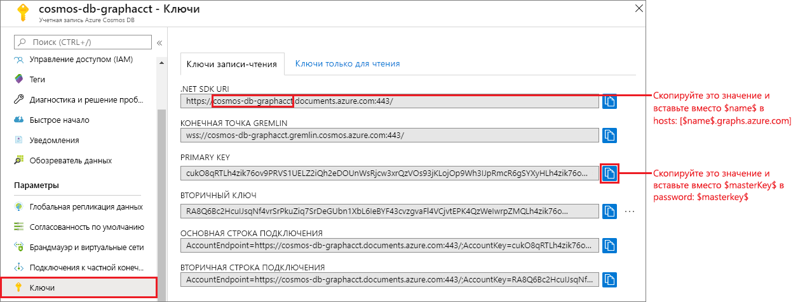
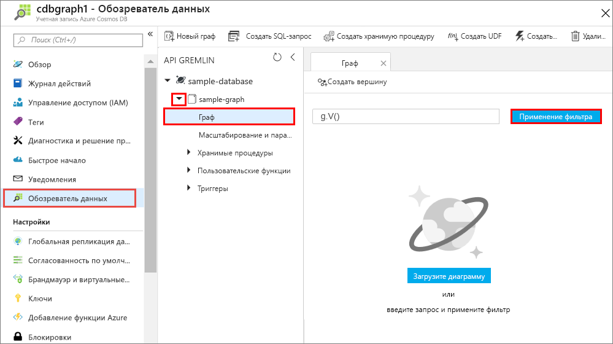
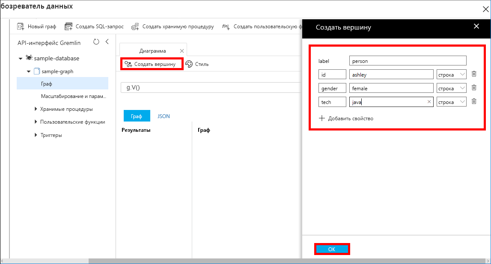
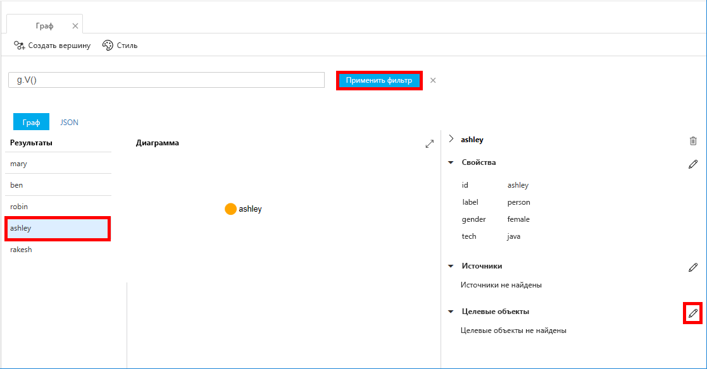
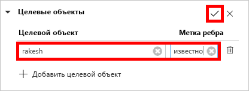
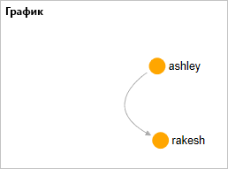

# <a name="quickstart-build-a-graph-database-with-the-java-sdk-and-the-azure-cosmos-db-table-api"></a>Краткое руководство. Создание графовой базы данных с помощью пакета SDK для Java и API таблиц для Azure Cosmos DB

> [!div class="op_single_selector"]
> * [Консоль Gremlin](create-graph-gremlin-console.md)
> * [.NET](create-graph-dotnet.md)
> * [Java](create-graph-java.md)
> * [Node.js](create-graph-nodejs.md)
> * [Python](create-graph-python.md)
> * [PHP](create-graph-php.md)
>  

Azure Cosmos DB — это глобально распределенная многомодельная служба базы данных Майкрософт. С помощью Azure Cosmos DB вы можете быстро создавать базы данных управляемых документов, таблиц и диаграмм и обращаться к ним. 

Выполнив это краткое руководство, вы создадите простую базу данных графа с помощью средств портала Azure для Azure Cosmos DB. В этом руководстве также объясняется, как быстро создать консольное приложение Java с помощью базы данных [API Gremlin](graph-introduction.md) и драйвера [OSS Apache TinkerPop](https://tinkerpop.apache.org/). Указания в этом руководстве применимы к любой операционной системе, с которой может работать Java. Из этого краткого руководства вы узнаете, как создавать и изменять графы с помощью пользовательского интерфейса или программных средств. 

## <a name="prerequisites"></a>Предварительные требования
[!INCLUDE [quickstarts-free-trial-note](../../includes/quickstarts-free-trial-note.md)]

Кроме того, сделайте следующее:

* [Пакет SDK для Java (JDK) версии 8](https://aka.ms/azure-jdks)
    * Обязательно настройте переменную среды JAVA_HOME так, чтобы она указывала на папку, в которой установлен пакет JDK.
* [Скачайте](https://maven.apache.org/download.cgi) и [установите](https://maven.apache.org/install.html) двоичный архив [Maven](https://maven.apache.org/).
    * В Ubuntu выполните команду `apt-get install maven`, чтобы установить Maven.
* [Git](https://www.git-scm.com/)
    * В Ubuntu выполните команду `sudo apt-get install git`, чтобы установить Git.

## <a name="create-a-database-account"></a>Создание учетной записи базы данных

Перед созданием графовой базы данных необходимо создать учетную запись графовой базы данных Gremlin с Azure Cosmos DB.

[!INCLUDE [cosmos-db-create-dbaccount-graph](../../includes/cosmos-db-create-dbaccount-graph.md)]

## <a name="add-a-graph"></a>Добавление графа

[!INCLUDE [cosmos-db-create-graph](../../includes/cosmos-db-create-graph.md)]

## <a name="clone-the-sample-application"></a>Клонирование примера приложения

Теперь перейдем к работе с кодом. Мы клонируем приложение API Gremlin из GitHub, зададим строку подключения и запустим приложение. Вы узнаете, как можно упростить работу с данными программным способом.  

1. Откройте командную строку, создайте папку git-samples, а затем закройте окно командной строки.

    ```bash
    md "C:\git-samples"
    ```

2. Откройте окно терминала git, например git bash, и выполните команду `cd`, чтобы перейти в папку для установки примера приложения.  

    ```bash
    cd "C:\git-samples"
    ```

3. Выполните команду ниже, чтобы клонировать репозиторий с примером. Эта команда создает копию примера приложения на локальном компьютере. 

    ```bash
    git clone https://github.com/Azure-Samples/azure-cosmos-db-graph-java-getting-started.git
    ```

## <a name="review-the-code"></a>Просмотр кода

Этот шаг не является обязательным. Если вы хотите узнать, как создать в коде ресурсы базы данных, изучите приведенные ниже фрагменты кода. Если вас это не интересует, можете сразу переходить к разделу [Обновление строки подключения](#update-your-connection-information).

Следующие фрагменты кода взяты из файла C:\git-samples\azure-cosmos-db-graph-java-getting-started\src\GetStarted\Program.java.

* `Client` Gremlin инициализируется на основе конфигурации в файле C:\git-samples\azure-cosmos-db-graph-java-getting-started\src\remote.yaml.

    ```java
    cluster = Cluster.build(new File("src/remote.yaml")).create();
    ...
    client = cluster.connect();
    ```

* Ряд шагов Gremlin выполняется с использованием метода `client.submit`.

    ```java
    ResultSet results = client.submit(gremlin);

    CompletableFuture<List<Result>> completableFutureResults = results.all();
    List<Result> resultList = completableFutureResults.get();

    for (Result result : resultList) {
        System.out.println(result.toString());
    }
    ```

## <a name="update-your-connection-information"></a>Обновление информации о подключении

Теперь вернитесь на портал Azure, чтобы получить данные для подключения. Скопируйте эти данные в приложение. Эти настройки обеспечат обмен данными между вашим приложением и размещенной базой данных.

1. На [портале Azure](https://portal.azure.com/) щелкните **Ключи**. 

    Скопируйте первую часть значения URI.

    
2. Откройте файл src/remote.yaml и вставьте значение уникального идентификатора вместо `$name$` в `hosts: [$name$.graphs.azure.com]`.

    Теперь строка 1 в remote.yaml будет выглядеть примерно так: 

    `hosts: [test-graph.graphs.azure.com]`

3. В значении `endpoint` измените `graphs` на `gremlin.cosmosdb`. (Если учетная запись базы данных графа создана до 20 декабря 2017 г., оставьте значение конечной точки без изменений и перейдите к следующему шагу.)

    Значение конечной точки должно выглядеть так:

    `"endpoint": "https://testgraphacct.gremlin.cosmosdb.azure.com:443/"`

4. На портале Azure используйте кнопку "Копировать", чтобы скопировать первичный ключ и вставить его вместо `$masterKey$` в `password: $masterKey$`.

    Теперь строка 4 в remote.yaml будет выглядеть примерно так: 

    `password: 2Ggkr662ifxz2Mg==`

5. Измените строку 3 файла remote.yaml. Внесите вместо

    `username: /dbs/$database$/colls/$collection$`

    значение 

    `username: /dbs/sample-database/colls/sample-graph`

    Если вы использовали уникальное имя для примера базы данных или графа, обновите соответствующие значения.

6. Сохраните файл remote.yaml.

## <a name="run-the-console-app"></a>Запуск консольного приложения

1. В окне терминала Git перейдите в папку azure-cosmos-db-graph-java-getting-started с помощью команды `cd`.

    ```git
    cd "C:\git-samples\azure-cosmos-db-graph-java-getting-started"
    ```

2. В окне терминала Git введите приведенную ниже команду, чтобы установить необходимые пакеты Java.

   ```git
   mvn package
   ```

3. В окне терминала Git выполните следующую команду, чтобы запустить приложение Java.
    
    ```git
    mvn exec:java -D exec.mainClass=GetStarted.Program
    ```

    В окне терминала появятся вершины, добавляемые в граф. 
    
    Если возникают ошибки времени ожидания, проверьте, правильно ли вы [указали сведения о подключении](#update-your-connection-information), и попробуйте еще раз выполнить последнюю команду. 
    
    Когда программа завершит работу, нажмите клавишу ВВОД и откройте окно веб-браузера с порталом Azure. 

<a id="add-sample-data"></a>
## <a name="review-and-add-sample-data"></a>Просмотр и добавление демонстрационных данных

Теперь можно вернуться в обозреватель данных, чтобы просмотреть вершины, добавленные в граф, и добавить дополнительные точки данных.

1. Щелкните **Обозреватель данных**, разверните **sample-graph**, а затем выберите **Граф** и нажмите кнопку **Применить фильтр**. 

   

2. В списке **результатов** обратите внимание на новых пользователей, добавленных в граф. Выберите пользователя **ben**. Вы увидите, что он связан с пользователем robin. Здесь можно перетаскивать вершины мышью, увеличивать или уменьшать масштаб колесиком мыши, а также увеличивать размер графа с помощью двойной стрелки. 

   

3. Давайте добавим несколько новых пользователей. Щелкните **Создать вершину**, чтобы добавить данные в граф.

   

4. В поле метки укажите *пользователя*.

5. Щелкните **Добавить свойство**, чтобы добавить каждое из указанных ниже свойств. Обратите внимание, что вы можете создать уникальные свойства для каждого пользователя в графе. Требуется только ключ идентификатора.

    key|value|Примечания
    ----|----|----
    id|ashley|Уникальный идентификатор вершины. Если не указать идентификатор, он создастся автоматически.
    gender|Женский| 
    Технология | java | 

    > [!NOTE]
    > С помощью этого краткого руководства вы создадите несекционированную коллекцию. Но если вы создаете секционированную коллекцию, указав ключ раздела во время создания коллекции, включите ключ раздела в качестве ключа каждой новой вершины. 

6. Нажмите кнопку **ОК**. Чтобы увидеть кнопку **ОК** в нижней части экрана, может потребоваться развернуть экран.

7. Еще раз щелкните **Создать вершину**, чтобы добавить нового пользователя. 

8. Введите метку *person*.

9. Щелкните **Добавить свойство**, чтобы добавить каждое из указанных ниже свойств:

    key|value|Примечания
    ----|----|----
    id|rakesh|Уникальный идентификатор вершины. Если не указать идентификатор, он создастся автоматически.
    gender|Мужской| 
    Учебное заведение|MIT| 

10. Нажмите кнопку **ОК**. 

11. Щелкните **Применить фильтр** со стандартным значением фильтра `g.V()`, чтобы отобразить все значения графа. Все пользователи теперь отображаются в списке **Результаты**. 

    По мере добавления новых данных используйте фильтры для ограничения результатов. По умолчанию обозреватель данных использует `g.V()` для получения всех вершин в графе. Вы можете задать для него другой [запрос графа](tutorial-query-graph.md), например `g.V().count()`, который возвращает число всех вершин графа в формате JSON. Если вы изменили фильтр, снова установите фильтр `g.V()` и щелкните **Применить фильтр**, чтобы снова отобразить полный список результатов.

12. Теперь вы можете соединить пользователей rakesh и ashley. Выберите в списке **Результаты** пользователя **ashley** и щелкните  рядом с пунктом **Целевые объекты** внизу справа. Чтобы отобразить кнопку, может потребоваться развернуть окно.

    

13. В поле **Целевой объект** введите *rakesh*, затем в поле **Граничная метка** введите слово *знает* и установите флажок.

    

14. Теперь выберите пользователя **rakesh** в списке результатов. Вы увидите, что пользователи ashley и rakesh связаны. 

    

    На этом часть руководства, посвященная созданию ресурсов, завершена. Вы можете дополнить граф новыми вершинами, а также изменить существующие вершины или запросы. Теперь давайте изучим метрики, которые предоставляет Azure Cosmos DB, а затем очистим все ресурсы. 

## <a name="review-slas-in-the-azure-portal"></a>Просмотр соглашений об уровне обслуживания на портале Azure

[!INCLUDE [cosmosdb-tutorial-review-slas](../../includes/cosmos-db-tutorial-review-slas.md)]

## <a name="clean-up-resources"></a>Очистка ресурсов

[!INCLUDE [cosmosdb-delete-resource-group](../../includes/cosmos-db-delete-resource-group.md)]

## <a name="next-steps"></a>Дополнительная информация

В этом кратком руководстве вы узнали, как создать учетную запись Azure Cosmos DB, граф с помощью обозревателя данных, а также как запустить приложение. Теперь вы можете создавать более сложные запросы и внедрять эффективную логику обхода графа с помощью Gremlin. 

> [!div class="nextstepaction"]
> [Как выполнять запросы к данным в базе данных Azure Cosmos DB с помощью API Graph (предварительная версия)](tutorial-query-graph.md)

