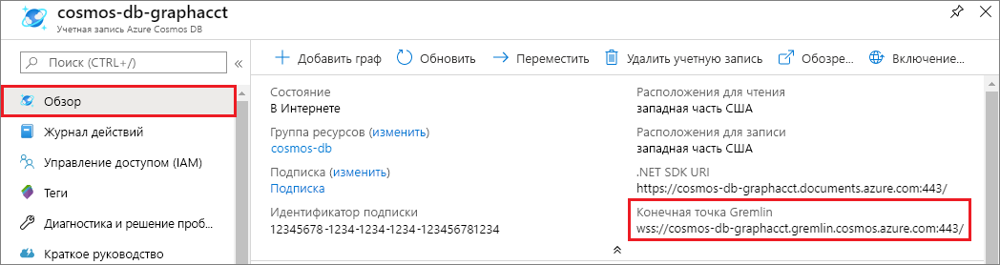
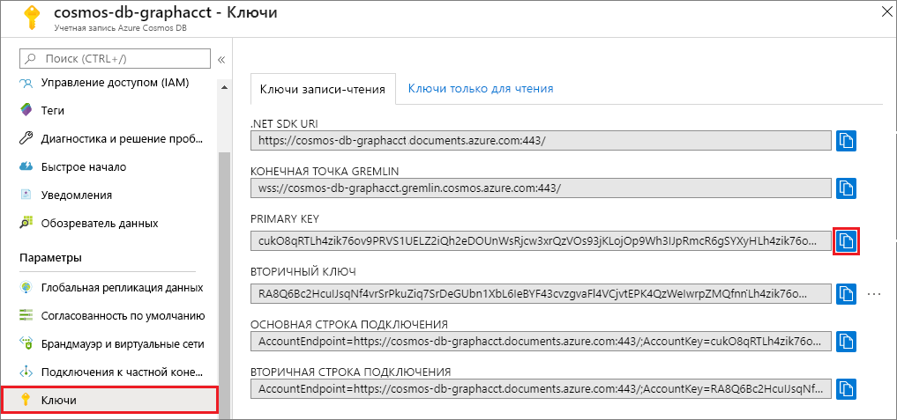

# <a name="quickstart-build-a-nodejs-application-by-using-azure-cosmos-db-gremlin-api-account"></a>Краткое руководство. Создание приложения Node.js с помощью учетной записи API Gremlin для Azure Cosmos DB

> [!div class="op_single_selector"]
> * [Консоль Gremlin](create-graph-gremlin-console.md)
> * [.NET](create-graph-dotnet.md)
> * [Java](create-graph-java.md)
> * [Node.js](create-graph-nodejs.md)
> * [Python](create-graph-python.md)
> * [PHP](create-graph-php.md)
>  

Azure Cosmos DB — это глобально распределенная многомодельная служба базы данных Майкрософт. Вы можете быстро создавать и запрашивать документы, пары "ключ — значение" и базы данных графов, используя преимущества возможностей глобального распределения и горизонтального масштабирования базы данных Azure Cosmos DB. 

В этом кратком руководстве описано, как в Azure Cosmos DB создать учетную запись, базу данных и граф [API Gremlin](graph-introduction.md) с помощью портала Azure. Затем вы можете создать и запустить консольное приложение, используя драйвер [Gremlin Node.js](https://www.npmjs.com/package/gremlin) с открытым кодом.

## <a name="prerequisites"></a>Предварительные требования

Для выполнения этого примера вам потребуется:
* [Node.js](https://nodejs.org/en/) v0.10.29 или более поздней версии;
* [Git.](https://git-scm.com/)

[!INCLUDE [quickstarts-free-trial-note](../../includes/quickstarts-free-trial-note.md)]

## <a name="create-a-database-account"></a>Создание учетной записи базы данных

[!INCLUDE [cosmos-db-create-dbaccount-graph](../../includes/cosmos-db-create-dbaccount-graph.md)]

## <a name="add-a-graph"></a>Добавление графа

[!INCLUDE [cosmos-db-create-graph](../../includes/cosmos-db-create-graph.md)]

## <a name="clone-the-sample-application"></a>Клонирование примера приложения

Теперь необходимо клонировать приложение API Gremlin из GitHub, задать строку подключения и запустить приложение. Вы узнаете, как можно упростить работу с данными программным способом. 

1. Откройте командную строку, создайте папку git-samples, а затем закройте окно командной строки.

    ```bash
    md "C:\git-samples"
    ```

2. Откройте окно терминала git, например git bash, и выполните команду `cd`, чтобы перейти в новую папку для установки примера приложения.

    ```bash
    cd "C:\git-samples"
    ```

3. Выполните команду ниже, чтобы клонировать репозиторий с примером. Эта команда создает копию примера приложения на локальном компьютере.

    ```bash
    git clone https://github.com/Azure-Samples/azure-cosmos-db-graph-nodejs-getting-started.git
    ```

3. Откройте файл решения в Visual Studio. 

## <a name="review-the-code"></a>Просмотр кода

Этот шаг не является обязательным. Если вы хотите узнать, как создать в коде ресурсы базы данных, изучите приведенные ниже фрагменты кода. Если вас это не интересует, можете сразу переходить к разделу [Обновление строки подключения](#update-your-connection-string). 

Приведенные ниже фрагменты кода взяты из файла app.js.

* Создание клиента Gremlin.

    ```javascript
    const authenticator = new Gremlin.driver.auth.PlainTextSaslAuthenticator(
        `/dbs/${config.database}/colls/${config.collection}`, 
        config.primaryKey
    )


    const client = new Gremlin.driver.Client(
        config.endpoint, 
        { 
            authenticator,
            traversalsource : "g",
            rejectUnauthorized : true,
            mimeType : "application/vnd.gremlin-v2.0+json"
        }
    );

    ```

  Все конфигурации находятся в файле `config.js`, который мы изменим в [следующем разделе](#update-your-connection-string).

* Для выполнения различных операций Gremlin определяется набор функций. Это один из них:

    ```javascript
    function addVertex1()
    {
        console.log('Running Add Vertex1'); 
        return client.submit("g.addV(label).property('id', id).property('firstName', firstName).property('age', age).property('userid', userid).property('pk', 'pk')", {
                label:"person",
                id:"thomas",
                firstName:"Thomas",
                age:44, userid: 1
            }).then(function (result) {
                    console.log("Result: %s\n", JSON.stringify(result));
            });
    }
    ```

* Каждая функция выполняет метод `client.execute` с параметром строки запроса Gremlin. Ниже приведен пример выполнения `g.V().count()`:

    ```javascript
    function countVertices()
    {
        console.log('Running Count');
        return client.submit("g.V().count()", { }).then(function (result) {
            console.log("Result: %s\n", JSON.stringify(result));
        });
    }
    ```

* В конце файла вызываются все методы. После этого они выполняются один за другим:

    ```javascript
    client.open()
    .then(dropGraph)
    .then(addVertex1)
    .then(addVertex2)
    .then(addEdge)
    .then(countVertices)
    .catch((err) => {
        console.error("Error running query...");
        console.error(err)
    }).then((res) => {
        client.close();
        finish();
    }).catch((err) => 
        console.error("Fatal error:", err)
    );
    ```


## <a name="update-your-connection-string"></a>Обновление строки подключения

1. Откройте файл config.js. 

2. В файле сonfig.js заполните значения ключа `config.endpoint` значением **Gremlin URI** со страницы **обзора** на портале Azure. 

    `config.endpoint = "https://<your_Gremlin_account_name>.gremlin.cosmosdb.azure.com:443/";`

    

3. В файле config.js заполните значения параметра config.primaryKey значением **первичного ключа** на странице **Ключи** на портале Azure. 

    `config.primaryKey = "PRIMARYKEY";`

   

4. Введите имя базы данных и графа (контейнера) для значения config.database и config.collection. 

Вот как должен выглядеть файл config.js:

```javascript
var config = {}

// Note that this must not have HTTPS or the port number
config.endpoint = "https://testgraphacct.gremlin.cosmosdb.azure.com:443/"; 
config.primaryKey = "Pams6e7LEUS7LJ2Qk0fjZf3eGo65JdMWHmyn65i52w8ozPX2oxY3iP0yu05t9v1WymAHNcMwPIqNAEv3XDFsEg==";
config.database = "graphdb"
config.collection = "Persons"

module.exports = config;
```

## <a name="run-the-console-app"></a>Запуск консольного приложения

1. Откройте окно терминала. С помощью команды `cd` перейдите в каталог установки файла package.json, включенного в проект.

2. Запустите `npm install`, чтобы установить необходимые модули npm, включая `gremlin`.

3. Запустите `node app.js` в окне терминала, чтобы запустить приложение Node.

## <a name="browse-with-data-explorer"></a>Просмотр с помощью обозревателя данных

Теперь вернитесь в обозреватель данных на портале Azure. Здесь вы можете просматривать, запрашивать и изменять новые данные графа, а также работать с ними.

В обозревателе данных новая база данных отображается в области **Графы**. Разверните базу данных и контейнер, а затем выберите **Граф**.

Данные, созданные в примере приложения, отображаются в следующей области в пределах вкладки **Граф** при нажатии **Применить фильтр**.

Повторите выполнение `g.V()` с `.has('firstName', 'Thomas')` для тестирования фильтра. Обратите внимание, что в значении учитывается регистр.

## <a name="review-slas-in-the-azure-portal"></a>Просмотр соглашений об уровне обслуживания на портале Azure

[!INCLUDE [cosmosdb-tutorial-review-slas](../../includes/cosmos-db-tutorial-review-slas.md)]

## <a name="clean-up-your-resources"></a>Очистка ресурсов

[!INCLUDE [cosmosdb-delete-resource-group](../../includes/cosmos-db-delete-resource-group.md)]

## <a name="next-steps"></a>Дополнительная информация

Из этой статьи вы узнали, как создать учетную запись Azure Cosmos DB, как создать граф с помощью обозревателя данных, а также как запустить приложение. Теперь вы можете создавать более сложные запросы и внедрять эффективную логику обхода графа с помощью Gremlin. 

> [!div class="nextstepaction"]
> [Как выполнять запросы к данным в базе данных Azure Cosmos DB с помощью API Graph (предварительная версия)](tutorial-query-graph.md)
