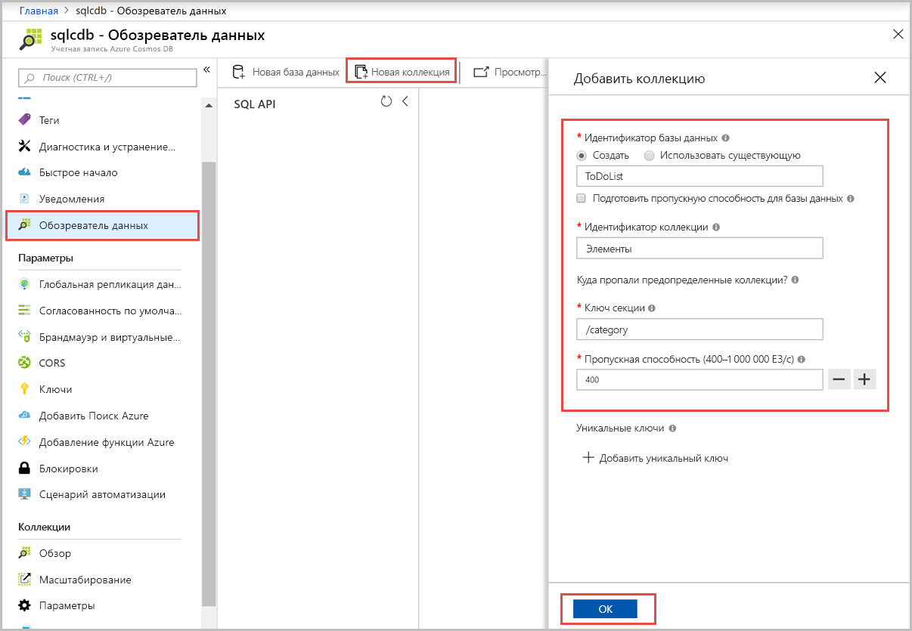
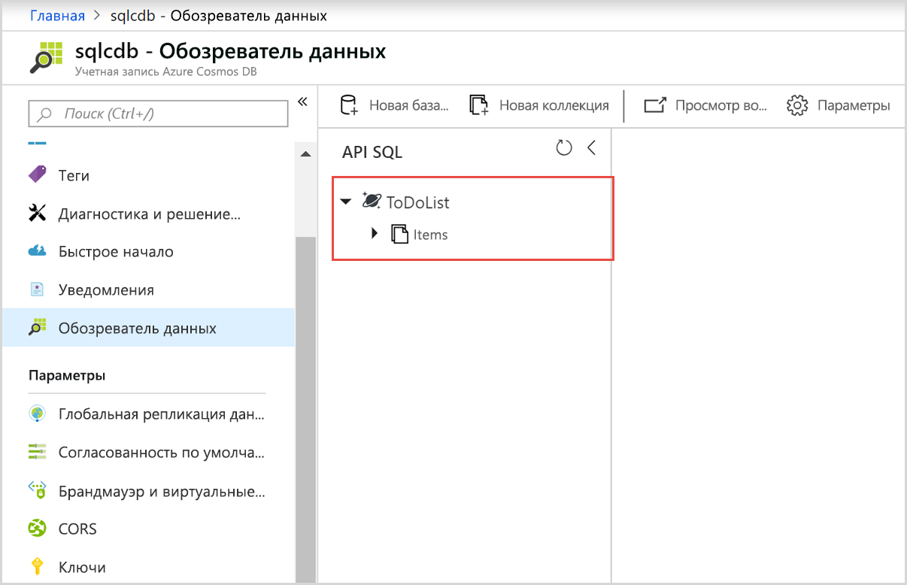
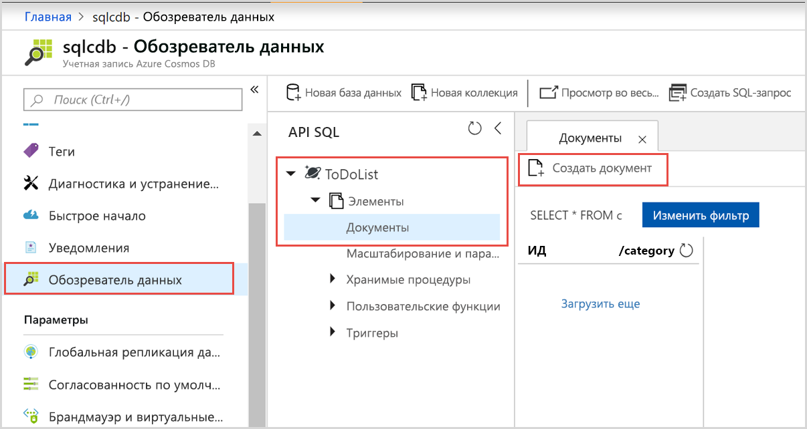
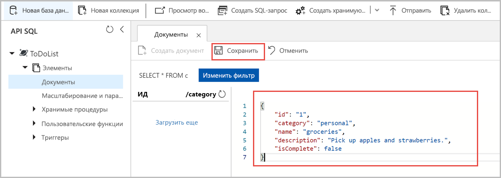
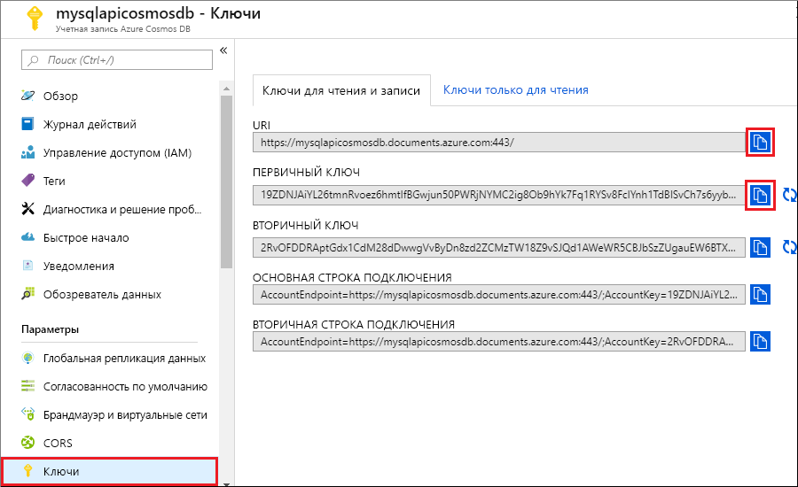
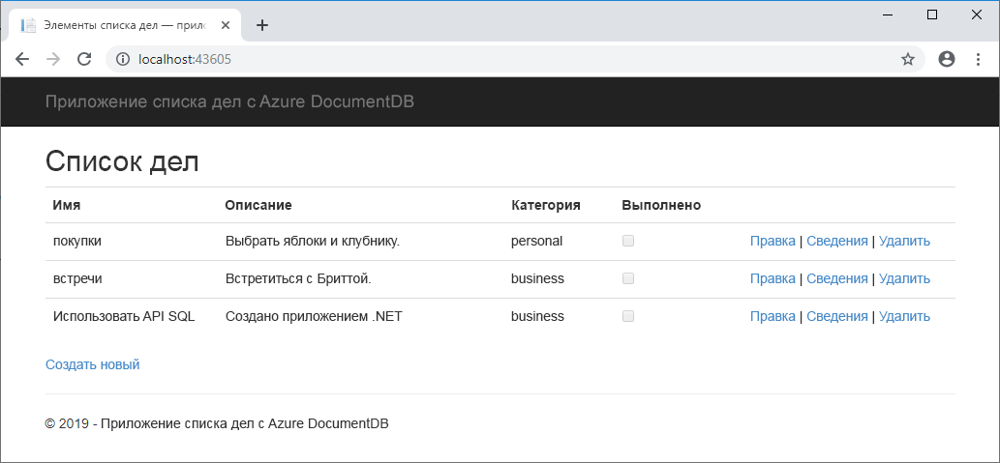

# <a name="quickstart-build-a-net-web-app-using-azure-cosmos-db-sql-api-account"></a>Краткое руководство. Создание веб-приложения .NET с помощью учетной записи API SQL для Azure Cosmos DB

> [!div class="op_single_selector"]
> * [.NET](create-sql-api-dotnet.md)
> * [.NET (предварительная версия)](create-sql-api-dotnet-preview.md)
> * [Java](create-sql-api-java.md)
> * [Node.js](create-sql-api-nodejs.md)
> * [Python](create-sql-api-python.md)
> * [Xamarin](create-sql-api-xamarin-dotnet.md)
>  
> 

Azure Cosmos DB — это глобально распределенная многомодельная служба базы данных Майкрософт. Вы можете быстро создавать и запрашивать документы, пары "ключ — значение" и базы данных графов, используя преимущества возможностей глобального распределения и горизонтального масштабирования базы данных Azure Cosmos DB. 

В этом кратком руководстве показано, как создать учетную запись [API SQL](sql-api-introduction.md), базу данных документов и коллекцию Azure Cosmos DB, а также как добавить пример данных к коллекции с использованием портала Azure. Затем вы создадите и развернете веб-приложение со списком дел на основе [пакета SDK для SQL .NET](sql-api-sdk-dotnet.md), чтобы добавить больше управляемых данных к коллекции. 

## <a name="prerequisites"></a>Предварительные требования

Если вы еще не установили Visual Studio 2017, вы можете скачать и использовать **бесплатный** [выпуск Community для Visual Studio 2017](https://www.visualstudio.com/downloads/). При установке Visual Studio необходимо включить возможность **разработки для Azure**.

[!INCLUDE [quickstarts-free-trial-note](../../includes/quickstarts-free-trial-note.md)] 
[!INCLUDE [cosmos-db-emulator-docdb-api](../../includes/cosmos-db-emulator-docdb-api.md)]  

<a id="create-account"></a>
## <a name="create-an-account"></a>Создание учетной записи

[!INCLUDE [cosmos-db-create-dbaccount](../../includes/cosmos-db-create-dbaccount.md)]

<a id="create-collection-database"></a>
## <a name="add-a-database-and-a-collection"></a>Добавление базы данных и коллекции

Теперь вы можете использовать средство обозреватель данных на портале Azure для создания базы данных и коллекции. 

1. Щелкните **Обозреватель данных** > **Новая коллекция**. 
    
    Справа отобразится область **Добавление коллекции** (вам может потребоваться прокрутить вправо, чтобы увидеть ее).

    

2. На странице **Добавление коллекции** введите параметры для новой коллекции.

    Параметр|Рекомендуемое значение|ОПИСАНИЕ
    ---|---|---
    **Идентификатор базы данных**|ToDoList|Введите *ToDoList* в качестве имени новой базы данных. Имена баз данных должны быть длиной от 1 до 255 символов и не могут содержать символы `/, \\, #, ?` или пробел в конце.
    **Идентификатор коллекции**|Items|Введите *Элементы* в качестве имени новой коллекции. Для идентификаторов коллекций предусмотрены те же требования к символам, что и для имен баз данных.
    **Ключ секции**| `<your_partition_key>`| Введите ключ секции. В примере, описанном в этой статье, используется ключ секции */category*.
    **Пропускная способность**|400 ЕЗ|Укажите для пропускной способности 400 единиц запросов в секунду. Чтобы сократить задержку, позже вы можете увеличить масштаб пропускной способности. 
    
    Помимо указанных выше параметров вы также можете добавить **уникальные ключи** для коллекции. В рамках этого примера оставим это поле пустым. Уникальные ключи предоставляют разработчикам возможность добавить слой целостности данных в базу данных. Создавая политику уникальных ключей при создании коллекции, вы гарантируете уникальность одного или нескольких значений ключа секции. Дополнительные сведения см. в статье [Уникальные ключи в Azure Cosmos DB](unique-keys.md).
    
    Последовательно выберите **ОК**.

    В обозревателе данных отобразится новая база данных и коллекция.

    

<a id="add-sample-data"></a>
## <a name="add-sample-data"></a>Добавление демонстрационных данных

Теперь вы можете добавить данные в новую коллекцию с помощью обозревателя данных.

1. В обозревателе данных новая база данных отображается в области "Коллекции". Разверните базу данных **Задачи** и коллекцию **Элементы**, выберите **Документы**, а затем щелкните **Новые документы**. 

   
  
2. Теперь можно добавить документ в коллекцию со следующей структурой:

     ```json
     {
         "id": "1",
         "category": "personal",
         "name": "groceries",
         "description": "Pick up apples and strawberries.",
         "isComplete": false
     }
     ```

3. Добавив данные JSON на вкладке **Документы**, щелкните **Сохранить**.

    

4. Создайте и сохраните один или несколько документов, задав уникальное значение для свойства `id`, и измените другие свойства по своему усмотрению. Новые документы могут иметь любую структуру, так как Azure Cosmos DB не устанавливает определенные схемы данных.

## <a name="query-your-data"></a>Обращение к данным

[!INCLUDE [cosmos-db-create-sql-api-query-data](../../includes/cosmos-db-create-sql-api-query-data.md)]

## <a name="clone-the-sample-application"></a>Клонирование примера приложения

Теперь перейдем к работе с кодом. Давайте клонируем [приложение API SQL из GitHub](https://github.com/Azure-Samples/documentdb-dotnet-todo-app). Задайте строку подключения и выполните ее. Вы узнаете, как можно упростить работу с данными программным способом. 

1. Откройте командную строку, создайте папку git-samples, а затем закройте окно командной строки.

    ```bash
    md "C:\git-samples"
    ```

2. Откройте окно терминала git, например git bash, и выполните команду `cd`, чтобы перейти в новую папку для установки примера приложения.

    ```bash
    cd "C:\git-samples"
    ```

3. Выполните команду ниже, чтобы клонировать репозиторий с примером. Эта команда создает копию примера приложения на локальном компьютере.

    ```bash
    git clone https://github.com/Azure-Samples/documentdb-dotnet-todo-app.git
    ```

4. Затем откройте файл решения в Visual Studio. 

## <a name="review-the-code"></a>Просмотр кода

Этот шаг не является обязательным. Если вы хотите узнать, как создать в коде ресурсы базы данных, изучите приведенные ниже фрагменты кода. Если вас это не интересует, можете сразу переходить к разделу [Обновление строки подключения](#update-your-connection-string). В этом кратком руководстве вы создадите базу данных и коллекцию с помощью портала Azure и добавите пример данных с помощью примера кода .NET. Тем не менее базу данных и коллекцию можно также создать с помощью примера кода .NET. 

Следующие фрагменты кода взяты из файла DocumentDBRepository.cs.

* Экземпляр DocumentClient инициализируется, как показано в следующем коде:

    ```csharp
    client = new DocumentClient(new Uri(ConfigurationManager.AppSettings["endpoint"]), ConfigurationManager.AppSettings["authKey"]);
    ```

* База данных создается с помощью метода `CreateDatabaseAsync`, как показано в следующем коде:

    ```csharp
    await client.CreateDatabaseAsync(new Database { Id = DatabaseId });
    ```

* Коллекция создается с помощью метода `CreateDocumentCollectionAsync`, как показано в следующем коде:

    ```csharp
    private static async Task CreateCollectionIfNotExistsAsync()
    {
        try
        {
           await client.ReadDocumentCollectionAsync(UriFactory.CreateDocumentCollectionUri(DatabaseId, CollectionId));
        }
        catch (DocumentClientException e)
        {
           if (e.StatusCode == System.Net.HttpStatusCode.NotFound)
           {
              await client.CreateDocumentCollectionAsync(
              UriFactory.CreateDatabaseUri(DatabaseId),
              new DocumentCollection
              {
                  Id = CollectionId
              },
              new RequestOptions { OfferThroughput = 400 });
           }
           else
           {
             throw;
           }
        }
    }
    ```

## <a name="update-your-connection-string"></a>Обновление строки подключения

Теперь вернитесь на портал Azure, чтобы получить данные строки подключения. Скопируйте эти данные в приложение.

1. На [портале Azure](https://portal.azure.com/) перейдите к учетной записи базы данных Azure Cosmos DB и на панели навигации слева щелкните **Ключи**, а затем выберите **Ключи записи-чтения**. На следующем шаге используйте кнопку копирования в правой части экрана, чтобы скопировать универсальный код ресурса (URI) и первичный ключ в файл web.config.

    

2. В Visual Studio 2017 откройте файл web.config. 

3. Скопируйте значение универсального кода ресурса (URI) на портале (с помощью кнопки копирования) и добавьте его в качестве значения параметра ключа конечной точки в файле web.config. 

    `<add key="endpoint" value="FILLME" />`

4. Затем скопируйте значение первичного ключа с портала и добавьте его в качестве значения параметра authKey в файле web.config. 

    `<add key="authKey" value="FILLME" />`
    
5. Затем обновите значения базы данных и коллекции, чтобы они соответствовали имени базы данных, которую вы создали ранее. Теперь приложение со всеми сведениями, необходимыми для взаимодействия с Azure Cosmos DB, обновлено. 

   ```csharp
   <add key="database" value="ToDoList"/>
   <add key="collection" value="Items"/>
   ```
 
## <a name="run-the-web-app"></a>Запуск веб-приложения
1. В Visual Studio в **обозревателе решений** щелкните проект правой кнопкой мыши и выберите **Управление пакетами NuGet**. 

2. В окне NuGet в поле **Обзор** введите *DocumentDB*.

3. В результатах поиска найдите библиотеку **Microsoft.Azure.DocumentDB** и установите ее. При этом будет установлен пакет Microsoft.Azure.DocumentDB, а также все зависимые компоненты.

4. Нажмите клавиши CTRL + F5 для запуска приложения. Приложение откроется в браузере. 

5. Выберите **Создать** в браузере и создайте несколько задач в приложении со списком задач.

   

Вернитесь в обозреватель данных, где вы можете просматривать, запрашивать и изменять новые данные, а также работать с ними. 

## <a name="review-slas-in-the-azure-portal"></a>Просмотр соглашений об уровне обслуживания на портале Azure

[!INCLUDE [cosmosdb-tutorial-review-slas](../../includes/cosmos-db-tutorial-review-slas.md)]

## <a name="clean-up-resources"></a>Очистка ресурсов

[!INCLUDE [cosmosdb-delete-resource-group](../../includes/cosmos-db-delete-resource-group.md)]

## <a name="next-steps"></a>Дополнительная информация

В этом кратком руководстве вы узнали, как создать учетную запись Azure Cosmos DB, коллекцию с помощью обозревателя данных, а также как запустить веб-приложение. Теперь можно импортировать дополнительные данные в учетную запись Azure Cosmos DB. 

> [!div class="nextstepaction"]
> [Импорт данных в DocumentDB с помощью средства миграции базы данных](import-data.md)


