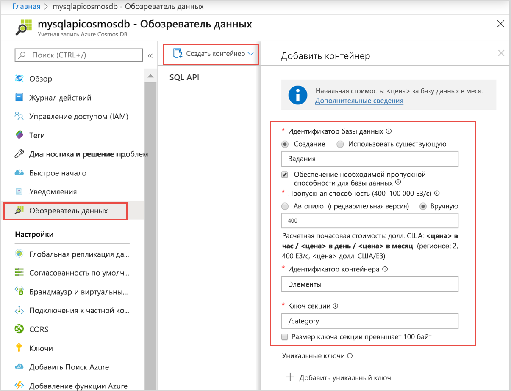

# <a name="quickstart-use-nodejs-to-connect-and-query-data-from-azure-cosmos-db-sql-api-account"></a>Краткое руководство. Подключение и выполнение запроса к данным из учетной записи API SQL для Azure Cosmos DB с помощью Node.js

> [!div class="op_single_selector"]
> - [.NET версии 3](create-sql-api-dotnet.md)
> - [.NET версии 4](create-sql-api-dotnet-V4.md)
> - [Java](create-sql-api-java.md)
> - [Node.js](create-sql-api-nodejs.md)
> - [Python](create-sql-api-python.md)
> - [Xamarin](create-sql-api-xamarin-dotnet.md)

В этом кратком руководстве вы научитесь создавать учетную запись API SQL Azure Cosmos DB и управлять ею на портале Azure, а также с помощью приложения Node.js, клонированного с GitHub. Azure Cosmos DB — это служба многомодельной базы данных, позволяющая быстро создавать и запрашивать документы, таблицы, пары "ключ-значение" и графовые базы данных, используя возможности глобального распределения и горизонтального масштабирования.

## <a name="prerequisites"></a>Предварительные требования

- Учетная запись Azure с активной подпиской. [Создайте бесплатно](https://azure.microsoft.com/free/?ref=microsoft.com&utm_source=microsoft.com&utm_medium=docs&utm_campaign=visualstudio). Или [воспользуйтесь пробной версией Azure Cosmos DB](https://azure.microsoft.com/try/cosmosdb/) без подписки Azure. Вы также можете воспользоваться [эмулятором Azure Cosmos DB](https://aka.ms/cosmosdb-emulator) с URI `https://localhost:8081` и ключом `C2y6yDjf5/R+ob0N8A7Cgv30VRDJIWEHLM+4QDU5DE2nQ9nDuVTqobD4b8mGGyPMbIZnqyMsEcaGQy67XIw/Jw==`.
- [Node.js 6.0.0+](https://nodejs.org/).
- [Git](https://www.git-scm.com/downloads).

## <a name="create-an-azure-cosmos-account"></a>Создание учетной записи Azure Cosmos

В рамках этого краткого руководства вы можете использовать [бесплатную пробную версию Azure Cosmos DB](https://azure.microsoft.com/try/cosmosdb/), чтобы создать учетную запись Azure Cosmos.

1. Перейдите на страницу [Бесплатная пробная версия Azure Cosmos DB](https://azure.microsoft.com/try/cosmosdb/).

1. Выберите учетную запись API **SQL** и нажмите **Create** (Создать). Войдите под своей учетной записью Майкрософт.

1. После успешного входа учетная запись Azure Cosmos должна быть готова. Выберите **Open in the Azure portal** (Открыть на портале Azure), чтобы открыть только что созданную учетную запись.

Для использования бесплатной пробной версии Azure Cosmos DB подписка Azure не требуется. Эта версия предоставляет учетную запись Azure Cosmos на ограниченный период длительностью 30 дней. Если вы хотите использовать учетную запись Azure Cosmos дольше, [создайте ее](create-cosmosdb-resources-portal.md#create-an-azure-cosmos-db-account) в подписке Azure.

## <a name="add-a-container"></a>Добавление контейнера

Теперь вы можете использовать средство обозреватель данных на портале Azure для создания базы данных и контейнера.

1. Щелкните **Обозреватель данных** > **Создать контейнер**.

   Справа отобразится область **Добавить контейнер**. Возможно, вам придется прокрутить экран вправо, чтобы увидеть ее.

   

2. На странице **Добавить контейнер** введите параметры для нового контейнера.

   | Параметр           | Рекомендуемое значение | Описание                                                                                                                                                                                                                                                                                                                                                                           |
   | ----------------- | --------------- | ------------------------------------------------------------------------------------------------------------------------------------------------------------------------------------------------------------------------------------------------------------------------------------------------------------------------------------------------------------------------------------- |
   | **Идентификатор базы данных**   | Задания           | Введите _Задача_ в качестве имени новой базы данных. Имена баз данных должны быть длиной от 1 до 255 символов и не могут содержать символы `/, \\, #, ?` или пробел в конце. Проверьте параметр **Provision database throughput** (Подготовка пропускной способности базы данных), который позволяет предоставить общий доступ к пропускной способности, подготовленной для базы данных всех контейнеров в пределах базы данных. Этот параметр также способствует экономии денежных средств. |
   | **Пропускная способность**    | 400             | Для пропускной способности сохраните значение в 400 единиц запроса в секунду. Чтобы сократить задержку, позже вы можете увеличить масштаб пропускной способности.                                                                                                                                                                                                                                                    |
   | **Идентификатор контейнера**  | Items           | Введите _Items_ в качестве имени нового контейнера. Для идентификаторов контейнеров предусмотрены те же требования к символам, что и для имен баз данных.                                                                                                                                                                                                                                                               |
   | **Ключ секции** | /category       | В примере, описанном в этой статье, используется ключ секции _/category_.                                                                                                                                                                                                                                                                                                           |

   Помимо указанных выше параметров вы также можете добавить **уникальные ключи** для контейнера. В рамках этого примера оставим это поле пустым. Уникальные ключи предоставляют разработчикам возможность добавить слой целостности данных в базу данных. Создавая политику уникальных ключей при создании контейнера, вы гарантируете уникальность одного или нескольких значений ключа секции. Дополнительные сведения см. в статье [Уникальные ключи в Azure Cosmos DB](unique-keys.md).

   Щелкните **ОК**. В обозревателе данных отобразится новая база данных и контейнер.

## <a name="add-sample-data"></a>Добавление демонстрационных данных

[!INCLUDE [cosmos-db-create-sql-api-add-sample-data](../../includes/cosmos-db-create-sql-api-add-sample-data.md)]

## <a name="query-your-data"></a>Обращение к данным

[!INCLUDE [cosmos-db-create-sql-api-query-data](../../includes/cosmos-db-create-sql-api-query-data.md)]

## <a name="clone-the-sample-application"></a>Клонирование примера приложения

Теперь необходимо клонировать приложение Node.js из GitHub. Задайте строку подключения и выполните ее.

1. Выполните команду ниже, чтобы клонировать репозиторий с примером. Эта команда создает копию примера приложения на локальном компьютере.

   ```bash
   git clone https://github.com/Azure-Samples/azure-cosmos-db-sql-api-nodejs-getting-started.git
   ```

## <a name="review-the-code"></a>Просмотр кода

Это необязательный шаг. Если вы хотите узнать, как создать в коде ресурсы базы данных Azure Cosmos, изучите приведенные ниже фрагменты кода. Если вас это не интересует, можете сразу переходить к разделу [Обновление строки подключения](#update-your-connection-string).

Если вам знакома предыдущая версия пакета SDK для SQL на JavaScript, вы уже видели термины _коллекция_ и _документ_. Так как Azure Cosmos DB поддерживает [несколько моделей API](introduction.md), [пакет SDK для JavaScript версии 2.0+](https://www.npmjs.com/package/@azure/cosmos) использует общий термин _контейнер_, который может быть коллекцией, графом или таблицей, и термин _элемент_ для описания содержимого контейнера.

Пакет SDK Cosmos DB для JavaScript называется @azure/cosmos и может быть установлен из npm...

```bash
npm install @azure/cosmos
```

Приведенные ниже фрагменты кода взяты из файла _app.js_.

- `CosmosClient` импортируется из npm-пакета `@azure/cosmos`.

  ```javascript
  const CosmosClient = require("@azure/cosmos").CosmosClient;
  ```

- Новый объект `CosmosClient` инициализирован.

  ```javascript
  const client = new CosmosClient({ endpoint, key });
  ```

- Выберите базу данных "Задачи".

  ```javascript
  const database = await client.databases(databaseId);
  ```

- Выберите контейнер или коллекцию "Элементы".

  ```javascript
  const container = await client.databases(containerId);
  ```

- Выберите все элементы в контейнере "Элементы".

  ```javascript
  // query to return all items
  const querySpec = {
    query: "SELECT * from c"
  };

  const { resources: results } = await container.items
    .query(querySpec)
    .fetchAll();
  ```

- Создайте элемент.

  ```javascript
  const { resource: createdItem } = await container.items.create(newItem);
  ```

- Обновите элемент.

  ```javascript
  const { id, category } = createdItem;

  createdItem.isComplete = true;
  const { resource: itemToUpdate } = await container
    .item(id, category)
    .replace(itemToUpdate);
  ```

- Удаление элемента

  ```javascript
  const { resource: result } = await this.container.item(id, category).delete();
  ```

> [!NOTE]
> В методах обновления и удаления элемент следует выбирать из базы данных путем вызова `container.item()`. Передаются два параметра — это идентификатор и ключ секции элемента. В этом случае ключ секции является значением поля category.

## <a name="update-your-connection-string"></a>Обновление строки подключения

Теперь вернитесь на портал Azure, чтобы получить сведения о строке подключения учетной записи Azure Cosmos. Скопируйте строку подключения в приложение, чтобы с ее помощью подключиться к базе данных.

1. В учетной записи Azure Cosmos DB на [портале Azure](https://portal.azure.com/) выберите **Ключи** на панели навигации слева, а затем выберите **Ключи записи-чтения**. На следующем шаге нажмите кнопки копирования в правой части экрана, чтобы скопировать универсальный код ресурса (URI) и первичный ключ в файл _app.js_.

   

2. Откройте файл _config.js_.

3. Скопируйте значение универсального кода ресурса (URI) на портале (с помощью кнопки копирования) и добавьте его в качестве значения параметра ключа конечной точки в файл _config.js_.

   `endpoint: "<Your Azure Cosmos account URI>"`

4. Затем скопируйте значение первичного ключа с портала и добавьте его в качестве значения `config.key` в файл _config.js_. Теперь приложение со всеми сведениями, необходимыми для взаимодействия с Azure Cosmos DB, обновлено.

   `key: "<Your Azure Cosmos account key>"`

## <a name="run-the-app"></a>Запустите приложение

1. В окне терминала выполните команду `npm install`, чтобы установить необходимый npm-пакет @azure/cosmos.

2. Запустите `node app.js` в окне терминала, чтобы запустить приложение Node.

3. Будут перечислены два элемента, созданные ранее согласно инструкциям в этом кратком руководстве. Создается новый элемент. Вместо флага "isComplete" для этого элемента отображается "true", а затем элемент удаляется.

Вы можете продолжить экспериментировать с этим примером приложения или вернуться в обозреватель данных, внести изменения и работать со своими данными.

## <a name="review-slas-in-the-azure-portal"></a>Просмотр соглашений об уровне обслуживания на портале Azure

[!INCLUDE [cosmosdb-tutorial-review-slas](../../includes/cosmos-db-tutorial-review-slas.md)]

## <a name="next-steps"></a>Дальнейшие действия

В этом кратком руководстве описано, как создать учетную запись Azure Cosmos DB и контейнер с помощью обозревателя данных, а также как запустить приложение Node.js. Теперь можно импортировать дополнительные данные в учетную запись Azure Cosmos DB.

> [!div class="nextstepaction"]
> [Импорт данных в Azure Cosmos DB](import-data.md)
