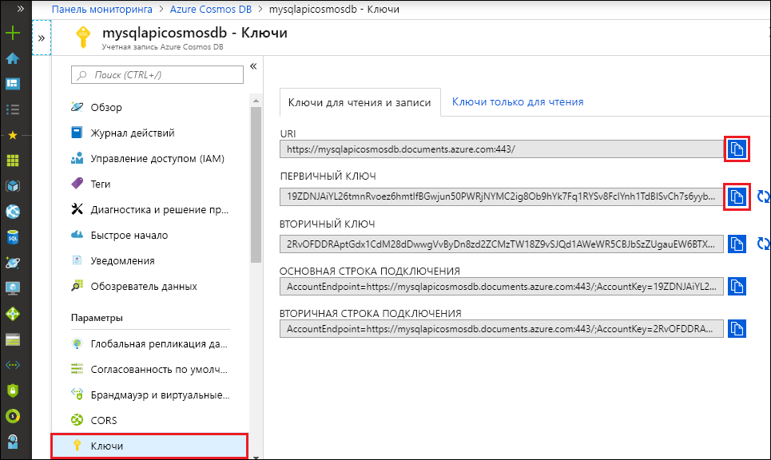

# <a name="quickstart-build-a-python-application-using-an-azure-cosmos-db-sql-api-account"></a>Краткое руководство. Создание приложения Python с использованием учетной записи API SQL для Azure Cosmos DB

> [!div class="op_single_selector"]
> * [.NET](create-sql-api-dotnet.md)
> * [Java](create-sql-api-java.md)
> * [Node.js](create-sql-api-nodejs.md)
> * [Python](create-sql-api-python.md)
> * [Xamarin](create-sql-api-xamarin-dotnet.md)
>  

В этом кратком руководстве показано, как создать учетную запись [API SQL для Azure Cosmos DB](sql-api-introduction.md), базу данных документов и контейнер с помощью портала Azure. Затем вы создадите консольное приложение с помощью пакета SDK для Python для [API SQL](sql-api-sdk-python.md) и запустите его.

Azure Cosmos DB — это глобально распределенная многомодельная служба базы данных Майкрософт. Можно быстро создавать и запрашивать документы, пары "ключ-значение", широкие столбцы и графовые базы данных. Все эти операции используют преимущества распределения и масштабирования Azure Cosmos DB.

В этом кратком руководстве используется версия 3.0 [пакета SDK для Python](https://pypi.org/project/azure-cosmos).

[!INCLUDE [quickstarts-free-trial-note](../../includes/quickstarts-free-trial-note.md)] [!INCLUDE [cosmos-db-emulator-docdb-api](../../includes/cosmos-db-emulator-docdb-api.md)]

## <a name="prerequisites"></a>Предварительные требования

* [Python 3.6](https://www.python.org/downloads/) с исполняемым файлом `python` в `PATH`.
* [Visual Studio Code](https://code.visualstudio.com/)
* [Расширение Python для Visual Studio Code](https://marketplace.visualstudio.com/items?itemName=ms-python.python#overview)

## <a name="create-a-database-account"></a>Создание учетной записи базы данных

[!INCLUDE [cosmos-db-create-dbaccount](../../includes/cosmos-db-create-dbaccount.md)]

## <a name="add-a-container"></a>Добавление контейнера

[!INCLUDE [cosmos-db-create-collection](../../includes/cosmos-db-create-collection.md)]

## <a name="add-sample-data"></a>Добавление демонстрационных данных

[!INCLUDE [cosmos-db-create-sql-api-add-sample-data](../../includes/cosmos-db-create-sql-api-add-sample-data.md)]

## <a name="query-your-data"></a>Обращение к данным

[!INCLUDE [cosmos-db-create-sql-api-query-data](../../includes/cosmos-db-create-sql-api-query-data.md)]

## <a name="clone-the-sample-application"></a>Клонирование примера приложения

Теперь необходимо клонировать приложение API SQL из GitHub. Задайте строку подключения и выполните ее.

1. Откройте командную строку, создайте папку git-samples, а затем закройте окно командной строки.

    ```cmd
    md "git-samples"
    ```
   Если используете строку Bash, укажите следующую команду:

   ```bash
   mkdir "git-samples"
   ```

2. Откройте окно терминала git, например git bash, и выполните команду `cd`, чтобы перейти в новую папку для установки примера приложения.

    ```bash
    cd "git-samples"
    ```

3. Выполните команду ниже, чтобы клонировать репозиторий с примером. Эта команда создает копию примера приложения на локальном компьютере. 

    ```bash
    git clone https://github.com/Azure-Samples/azure-cosmos-db-python-getting-started.git
    ```  

## <a name="update-your-connection-string"></a>Обновление строки подключения

Теперь вернитесь на портал Azure, чтобы получить данные строки подключения. Скопируйте эти данные в приложение.

1. На [портале Azure](https://portal.azure.com/) в учетной записи Azure Cosmos выберите **Ключи** в области навигации слева. На следующем шаге используйте кнопку копирования в правой части экрана, чтобы скопировать **универсальный код ресурса (URI)** и **первичный ключ** в файл `CosmosGetStarted.py`.

    

2. Откройте файл `CosmosGetStarted.py` из \git-samples\azure-cosmos-db-python-getting-started в Visual Studio Code.

3. Скопируйте значение **универсального кода ресурса (URI)** на портале (с помощью кнопки копирования) и добавьте его в качестве значения параметра ключа **конечной точки** в файле ``CosmosGetStarted.py``. 

    `'ENDPOINT': 'https://FILLME.documents.azure.com',`

4. Затем скопируйте значение **ПЕРВИЧНОГО КЛЮЧА** с портала и добавьте его в качестве значения параметра **config.PRIMARYKEY** в файле ``CosmosGetStarted.py``. Теперь приложение со всеми сведениями, необходимыми для взаимодействия с Azure Cosmos DB, обновлено. 

    `'PRIMARYKEY': 'FILLME',`

5. Сохраните файл ``CosmosGetStarted.py``.

## <a name="review-the-code"></a>Просмотр кода

Этот шаг не является обязательным. Узнайте о ресурсах базы данных, созданных в коде, или сразу перейдите к разделу [Обновление строки подключения](#update-your-connection-string).

Обратите внимание, что если вам знакома предыдущая версия пакета SDK для Python, вы уже видели термины "коллекция" и "документ". Так как Azure Cosmos DB поддерживает несколько моделей API, пакет SDK для Python версии 3.0+ использует общий термин "контейнер", который может быть коллекцией, графом или таблицей, и термин "элемент" для описания содержимого контейнера.

Приведенные ниже фрагменты кода взяты из файла `CosmosGetStarted.py`.

* Инициализация экземпляра CosmosClient. Обязательно обновите значения "Endpoint" (конечная точка) и "master key" (главный ключ), как описано в разделе [Обновление строки подключения](#update-your-connection-string). 

    ```python
    # Initialize the Cosmos client
    client = cosmos_client.CosmosClient(url_connection=config['ENDPOINT'], auth={'masterKey': config['MASTERKEY']})
    ```

* Создание базы данных.

    ```python
    # Create a database
    db = client.CreateDatabase({ 'id': config['DATABASE'] })
    ```

* Создание контейнера.

    ```python
    # Create container options
    options = {
        'offerThroughput': 400
    }

    # Create a container
    container = client.CreateContainer(db['_self'], container_definition, options)
    ```

* Некоторые элементы добавляются в контейнер.

    ```python
    # Create and add some items to the container
    item1 = client.CreateItem(container['_self'], {
        'serverId': 'server1',
        'Web Site': 0,
        'Cloud Service': 0,
        'Virtual Machine': 0,
        'message': 'Hello World from Server 1!'
        }
    )

    item2 = client.CreateItem(container['_self'], {
        'serverId': 'server2',
        'Web Site': 1,
        'Cloud Service': 0,
        'Virtual Machine': 0,
        'message': 'Hello World from Server 2!'
        }
    )
    ```

* Выполнение запросов с помощью SQL

    ```python
    query = {'query': 'SELECT * FROM server s'}

    options = {}
    options['enableCrossPartitionQuery'] = True
    options['maxItemCount'] = 2

    result_iterable = client.QueryItems(container['_self'], query, options)
    for item in iter(result_iterable):
        print(item['message'])
    ```
   
## <a name="run-the-app"></a>Запуск приложения

1. В Visual Studio Code выберите **Вид** > **Палитра команд**. 

2. При появлении соответствующего запроса введите **Python: выбрать интерпретатор** и установите нужную версию Python.

    Нижний колонтитул в Visual Studio Code будет обновлен для указания выбранного интерпретатора. 

3. Выберите **Вид** > **Интегрированный терминал**, чтобы открыть интегрированный терминал Visual Studio Code.

4. В окне терминала проверьте, находитесь ли вы в папке "azure-cosmos-db-python-getting-started". Если нет, выполните следующую команду, чтобы перейти в папку примера. 

    ```cmd
    cd "\git-samples\azure-cosmos-db-python-getting-started"`
    ```

5. Выполните следующую команду, чтобы установить пакет azure-cosmos. 

    ```python
    pip3 install azure-cosmos
    ```

    Если при попытке установить пакет azure-cosmos появляется ошибка отказа в доступе, необходимо [запустить Visual Studio Code от имени администратора](https://stackoverflow.com/questions/37700536/visual-studio-code-terminal-how-to-run-a-command-with-administrator-rights).

6. Выполните следующую команду, чтобы запустить пример, а также создать и сохранить документы в Azure Cosmos DB.

    ```python
    python CosmosGetStarted.py
    ```

7. Чтобы убедиться в том, что элементы созданы и сохранены, на портале Azure выберите **Обозреватель данных**, разверните **coll**, затем **Документы** и выберите документ **server1**. Содержимое документа server1 соответствует содержимому, отображаемому в интегрированном окне терминала. 

    

## <a name="review-slas-in-the-azure-portal"></a>Просмотр соглашений об уровне обслуживания на портале Azure

[!INCLUDE [cosmosdb-tutorial-review-slas](../../includes/cosmos-db-tutorial-review-slas.md)]

## <a name="clean-up-resources"></a>Очистка ресурсов

[!INCLUDE [cosmosdb-delete-resource-group](../../includes/cosmos-db-delete-resource-group.md)]

## <a name="next-steps"></a>Дополнительная информация

В этом руководстве описано, как создать учетную запись Azure Cosmos и контейнер с помощью обозревателя данных, а также как запустить приложение. Теперь можно импортировать дополнительные данные в учетную запись Azure Cosmos DB. 

> [!div class="nextstepaction"]
> [Импорт данных в Azure Cosmos DB для API SQL](import-data.md)


