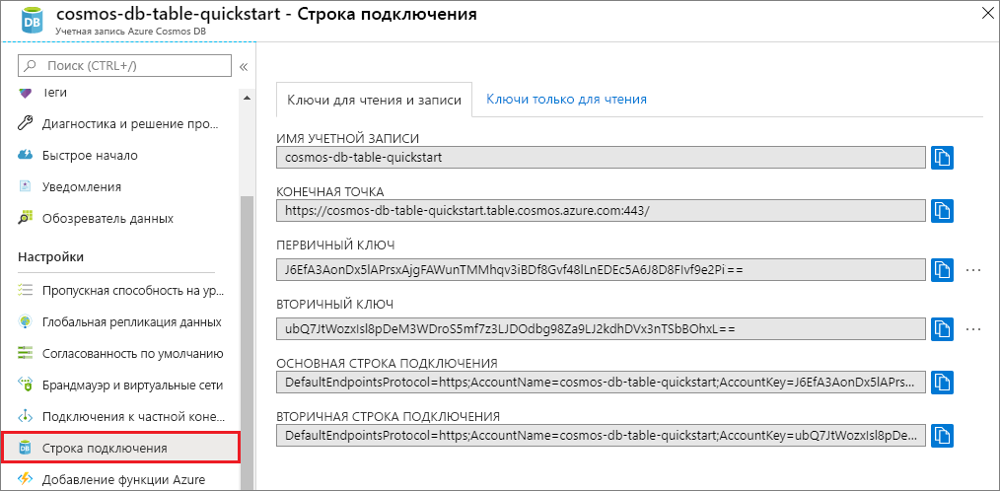

# <a name="quickstart-build-a-table-api-app-with-nodejs-and-azure-cosmos-db"></a>Краткое руководство. Создание приложения API таблиц с помощью Node.js и Azure Cosmos DB

> [!div class="op_single_selector"]
> * [.NET](create-table-dotnet.md)
> * [Java](create-table-java.md)
> * [Node.js](create-table-nodejs.md)
> * [Python](create-table-python.md)
> 

В этом кратком руководстве объясняется, как создать учетную запись API таблиц Azure Cosmos DB, а также как с помощью обозревателя данных и приложения Node.js, клонированного из GitHub, создать таблицы и сущности. Azure Cosmos DB — это служба многомодельной базы данных, позволяющая быстро создавать и запрашивать документы, таблицы, пары "ключ-значение" и графовые базы данных, используя возможности глобального распределения и горизонтального масштабирования.

## <a name="prerequisites"></a>Предварительные требования

- Учетная запись Azure с активной подпиской. [Создайте бесплатно](https://azure.microsoft.com/free/?ref=microsoft.com&utm_source=microsoft.com&utm_medium=docs&utm_campaign=visualstudio). Или [воспользуйтесь пробной версией Azure Cosmos DB](https://azure.microsoft.com/try/cosmosdb/) без подписки Azure. Вы также можете воспользоваться [эмулятором Azure Cosmos DB](https://aka.ms/cosmosdb-emulator) с URI `https://localhost:8081` и ключом `C2y6yDjf5/R+ob0N8A7Cgv30VRDJIWEHLM+4QDU5DE2nQ9nDuVTqobD4b8mGGyPMbIZnqyMsEcaGQy67XIw/Jw==`.
- [Node.js версии 0.10.29 и выше](https://nodejs.org/).
- [Git](https://git-scm.com/downloads).

## <a name="create-a-database-account"></a>Создание учетной записи базы данных

> [!IMPORTANT] 
> Для работы с общедоступными пакетами SDK для API таблиц нужно создать новую учетную запись API таблиц. Учетные записи API таблиц, созданные во время работы с предварительной версией, не поддерживаются в общедоступных пакетах SDK.
>

[!INCLUDE [cosmos-db-create-dbaccount-table](../../includes/cosmos-db-create-dbaccount-table.md)]

## <a name="add-a-table"></a>Добавление таблицы

[!INCLUDE [cosmos-db-create-table](../../includes/cosmos-db-create-table.md)]

## <a name="add-sample-data"></a>Добавление демонстрационных данных

[!INCLUDE [cosmos-db-create-table-add-sample-data](../../includes/cosmos-db-create-table-add-sample-data.md)]

## <a name="clone-the-sample-application"></a>Клонирование примера приложения

Теперь необходимо клонировать приложение "Таблица" из GitHub. Задайте строку подключения и выполните ее. Вы узнаете, как можно упростить работу с данными программным способом.

1. Откройте командную строку, создайте папку git-samples, а затем закройте окно командной строки.

    ```bash
    md "C:\git-samples"
    ```

2. Откройте окно терминала git, например git bash, и выполните команду `cd`, чтобы перейти в новую папку для установки примера приложения.

    ```bash
    cd "C:\git-samples"
    ```

3. Выполните команду ниже, чтобы клонировать репозиторий с примером. Эта команда создает копию примера приложения на локальном компьютере.

    ```bash
    git clone https://github.com/Azure-Samples/storage-table-node-getting-started.git
    ```

> [!TIP]
> Более подробное пошаговое руководство по аналогичному коду см. в статье с [примером API таблиц для Cosmos DB](table-storage-how-to-use-nodejs.md). 

## <a name="review-the-code"></a>Просмотр кода

Это необязательный шаг. Если вы хотите узнать, как создать в коде ресурсы базы данных, изучите приведенные ниже фрагменты кода. Если вас это не интересует, можете сразу переходить к разделу [Обновление строки подключения](#update-your-connection-string) в этом документе.

* В следующем коде показано, как создать таблицу в службе хранилища Azure.

  ```javascript
  storageClient.createTableIfNotExists(tableName, function (error, createResult) {
    if (error) return callback(error);

    if (createResult.isSuccessful) {
      console.log("1. Create Table operation executed successfully for: ", tableName);
    }
  }

  ```

* В следующем коде показано, как вставить данные в таблицу.

  ```javascript
  var customer = createCustomerEntityDescriptor("Harp", "Walter", "Walter@contoso.com", "425-555-0101");

  storageClient.insertOrMergeEntity(tableName, customer, function (error, result, response) {
    if (error) return callback(error);

    console.log("   insertOrMergeEntity succeeded.");
  }
  ```

* В следующем коде показано, как выполнить запрос данных из таблицы.

  ```javascript
  console.log("6. Retrieving entities with surname of Smith and first names > 1 and <= 75");

  var storageTableQuery = storage.TableQuery;
  var segmentSize = 10;

  // Demonstrate a partition range query whereby we are searching within a partition for a set of entities that are within a specific range. 
  var tableQuery = new storageTableQuery()
      .top(segmentSize)
      .where('PartitionKey eq ?', lastName)
      .and('RowKey gt ?', "0001").and('RowKey le ?', "0075");
  
  runPageQuery(tableQuery, null, function (error, result) {
  
      if (error) return callback(error);
  
  ```

* В следующем коде показано, как удалить данные из таблицы.

  ```javascript
  storageClient.deleteEntity(tableName, customer, function entitiesQueried(error, result) {
      if (error) return callback(error);
  
      console.log("   deleteEntity succeeded.");
  }
  ```
  
## <a name="update-your-connection-string"></a>Обновление строки подключения

Теперь вернитесь на портал Azure, чтобы получить данные строки подключения. Скопируйте эти данные в приложение. Так вы обеспечите обмен данными между приложением и размещенной базой данных. 

1. Выберите элемент **Строка подключения** в своей учетной записи Azure Cosmos DB на [портале Azure](https://portal.azure.com/). 

    

2. Скопируйте основную строку подключения с помощью кнопки копирования справа.

3. Откройте файл *app.config* и вставьте значение в connectionString в третьей строке. 

    > [!IMPORTANT]
    > Если для вашей конечной точки указан адрес documents.azure.com, это значит, что вы используете учетную запись для предварительной версии. В этом случае для работы с общедоступными пакетами SDK для API таблиц вам нужно создать [новую учетную запись API таблиц](#create-a-database-account).
    >

3. Сохраните файл *app.config*.

Теперь приложение со всеми сведениями, необходимыми для взаимодействия с Azure Cosmos DB, обновлено. 

## <a name="run-the-app"></a>Запустите приложение

1. В окне терминала git перейдите к папке storage-table-java-getting-started с помощью команды `cd`.

    ```
    cd "C:\git-samples\storage-table-node-getting-started"
    ```

2. Выполните следующую команду, чтобы установить модули [azure], [node-uuid], [nconf] и [async] локально, а также чтобы сохранить запись для них в файле *package.json*.

   ```
   npm install azure-storage node-uuid async nconf --save
   ```

2. В окне терминала Git выполните приведенные ниже команды, чтобы запустить приложение Node.js.

    ```
    node ./tableSample.js 
    ```

    В окне консоли отобразятся данные таблицы, добавленные к новой базе данных таблиц в Azure Cosmos DB.

    Вернитесь в обозреватель данных, где вы можете просматривать, запрашивать и изменять новые данные, а также работать с ними. 

## <a name="review-slas-in-the-azure-portal"></a>Просмотр соглашений об уровне обслуживания на портале Azure

[!INCLUDE [cosmosdb-tutorial-review-slas](../../includes/cosmos-db-tutorial-review-slas.md)]

## <a name="clean-up-resources"></a>Очистка ресурсов

[!INCLUDE [cosmosdb-delete-resource-group](../../includes/cosmos-db-delete-resource-group.md)]

## <a name="next-steps"></a>Дальнейшие действия

Из этого краткого руководства вы узнали, как создать учетную запись Azure Cosmos DB и таблицу с помощью обозревателя данных, а также как запустить приложение Node.js для добавления данных таблицы.  Теперь вы можете выполнить запрос данных с помощью API таблиц.  

> [!div class="nextstepaction"]
> [Импорт данных таблиц в API таблицы](table-import.md)
