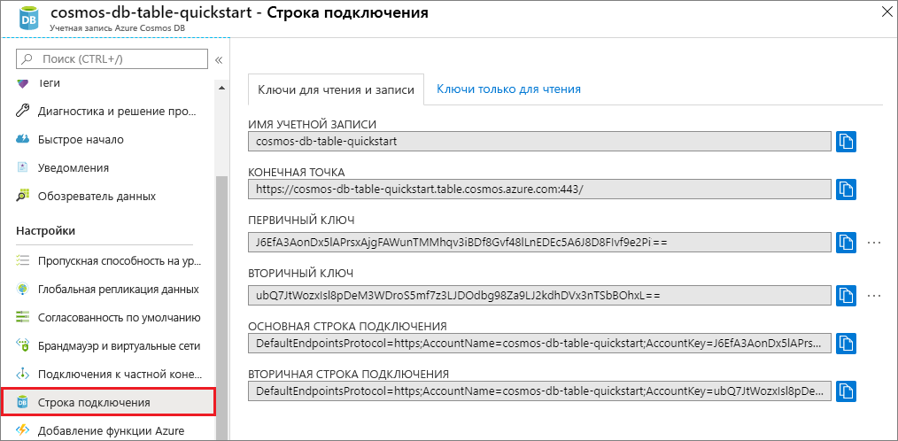

# <a name="quickstart-build-a-table-api-app-with-python-and-azure-cosmos-db"></a>Краткое руководство. Сборка приложения API таблиц с помощью Python и Azure Cosmos DB

> [!div class="op_single_selector"]
> * [.NET](create-table-dotnet.md)
> * [Java](create-table-java.md)
> * [Node.js](create-table-nodejs.md)
> * [Python](create-table-python.md)
> 

Из этого краткого руководства вы узнаете, как создать учетную запись API таблиц Azure Cosmos DB и управлять ею с портала Azure и из Visual Studio с помощью приложения Python, клонированного из GitHub. Azure Cosmos DB — это служба многомодельной базы данных, позволяющая быстро создавать и запрашивать документы, таблицы, пары "ключ-значение" и графовые базы данных, используя возможности глобального распределения и горизонтального масштабирования.

## <a name="prerequisites"></a>предварительные требования

- Учетная запись Azure с активной подпиской. [Создайте бесплатно](https://azure.microsoft.com/free/?ref=microsoft.com&utm_source=microsoft.com&utm_medium=docs&utm_campaign=visualstudio). Или [воспользуйтесь пробной версией Azure Cosmos DB](https://azure.microsoft.com/try/cosmosdb/) без подписки Azure. Вы также можете воспользоваться [эмулятором Azure Cosmos DB](https://aka.ms/cosmosdb-emulator) с URI `https://localhost:8081` и ключом `C2y6yDjf5/R+ob0N8A7Cgv30VRDJIWEHLM+4QDU5DE2nQ9nDuVTqobD4b8mGGyPMbIZnqyMsEcaGQy67XIw/Jw==`.
- [Visual Studio 2019](https://www.visualstudio.com/downloads/) с выбранными во время установки рабочими нагрузками **разработки Azure** и **разработки Python**. 
- [Git](https://git-scm.com/downloads).

## <a name="create-a-database-account"></a>Создание учетной записи базы данных

> [!IMPORTANT] 
> Для работы с общедоступными пакетами SDK для API таблиц нужно создать новую учетную запись API таблиц. Учетные записи API таблиц, созданные во время работы с предварительной версией, не поддерживаются в общедоступных пакетах SDK.
>

[!INCLUDE [cosmos-db-create-dbaccount-table](../../includes/cosmos-db-create-dbaccount-table.md)]

## <a name="add-a-table"></a>Добавление таблицы

[!INCLUDE [cosmos-db-create-table](../../includes/cosmos-db-create-table.md)]

## <a name="add-sample-data"></a>Добавление демонстрационных данных

[!INCLUDE [cosmos-db-create-table-add-sample-data](../../includes/cosmos-db-create-table-add-sample-data.md)]

## <a name="clone-the-sample-application"></a>Клонирование примера приложения

Теперь необходимо клонировать приложение "Таблица" из GitHub. Задайте строку подключения и выполните ее. Вы узнаете, как можно упростить работу с данными программным способом. 

1. Откройте командную строку, создайте папку git-samples, а затем закройте окно командной строки.

    ```bash
    md "C:\git-samples"
    ```

2. Откройте окно терминала git, например git bash, и выполните команду `cd`, чтобы перейти в новую папку для установки примера приложения.

    ```bash
    cd "C:\git-samples"
    ```

3. Выполните команду ниже, чтобы клонировать репозиторий с примером. Эта команда создает копию примера приложения на локальном компьютере. 

    ```bash
    git clone https://github.com/Azure-Samples/storage-python-getting-started.git
    ```

3. Затем откройте файл решения в Visual Studio. 

## <a name="update-your-connection-string"></a>Обновление строки подключения

Теперь вернитесь на портал Azure, чтобы получить данные строки подключения. Скопируйте эти данные в приложение. Так вы обеспечите обмен данными между приложением и размещенной базой данных. 

1. Выберите элемент [Строка подключения](https://portal.azure.com/) в своей учетной записи Azure Cosmos DB на **портале Azure**. 

    

2. Скопируйте имя учетной записи с помощью кнопки копирования справа.

3. Откройте файл *config.py* и вставьте скопированное с портала имя учетной записи как значение параметра STORAGE_ACCOUNT_NAME в строке 19.

4. Вернитесь на портал и скопируйте первичный ключ.

5. Вставьте скопированный первичный ключ как значение параметра STORAGE_ACCOUNT_KEY в строке 20.

6. Сохраните файл *config.py*.

## <a name="run-the-app"></a>Запустите приложение

1. В Visual Studio щелкните проект правой кнопкой мыши в **обозревателе решений**.

2. Выберите текущую среду Python и щелкните правой кнопкой мыши.

2. Выберите **Установить пакет Python**, а затем введите *azure-storage-table*.

3. Нажмите клавишу F5 для запуска приложения. Приложение откроется в браузере. 

Вернитесь в обозреватель данных, где вы можете просматривать, запрашивать и изменять новые данные, а также работать с ними. 

## <a name="review-slas-in-the-azure-portal"></a>Просмотр соглашений об уровне обслуживания на портале Azure

[!INCLUDE [cosmosdb-tutorial-review-slas](../../includes/cosmos-db-tutorial-review-slas.md)]

## <a name="clean-up-resources"></a>Очистка ресурсов

[!INCLUDE [cosmosdb-delete-resource-group](../../includes/cosmos-db-delete-resource-group.md)]

## <a name="next-steps"></a>Дальнейшие действия

Из этого краткого руководства вы узнали, как создать учетную запись Azure Cosmos DB и таблицу с помощью обозревателя данных, а также как запустить приложение Python в Visual Studio и добавить в таблицу данные.  Теперь вы можете выполнить запрос данных с помощью API таблиц.  

> [!div class="nextstepaction"]
> [Импорт данных таблиц в API таблицы](table-import.md)
