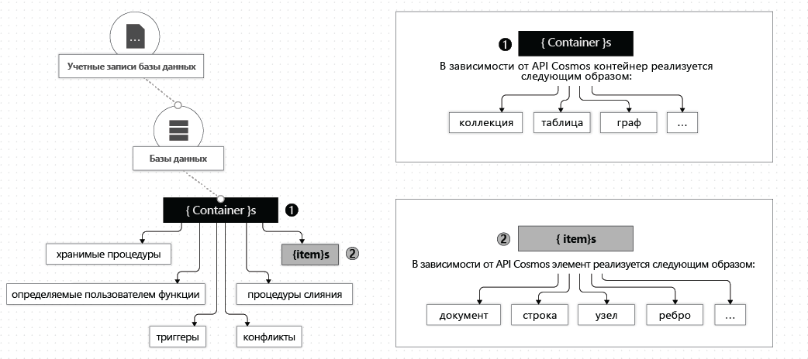

# Работа с базами данных, контейнерами и элементами

Создав [учетную запись Azure Cosmos DB](account-overview.md) в подписке Azure, вы сможете управлять данными в своей учетной записи, создавая базы данных, контейнеры и элементы. В этой статье описаны все эти сущности: базы данных, контейнеры и элементы. Ниже показана иерархия разных сущностей в учетной записи Azure Cosmos:

## Базы данных Azure Cosmos

Вы можете создать одну или несколько баз данных Azure Cosmos в рамках своей учетной записи. Базы данных является аналогом пространства имен. Это единица управления для набора контейнеров Azure Cosmos. В следующей таблице показано, как база данных Azure Cosmos соотносится с разными сущностями определенных API:

| **Сущность Azure Cosmos DB** | **API SQL** | **API Cassandra**; | **API Azure Cosmos DB для MongoDB** | **API Gremlin**; | **API таблицы**; |
| --- | --- | --- | --- | --- | --- |
|База данных Azure Cosmos | База данных | Пространство ключей | База данных | База данных | Нет данных |

> [!NOTE]
> При создании первой таблицы с помощью API таблиц база данных по умолчанию создается автоматически в рамках учетной записи Azure Cosmos.

### Операции с базой данных Azure Cosmos

Вы можете взаимодействовать с базой данных Azure Cosmos с помощью следующих API Azure Cosmos:

| **Операция** | **Интерфейс командной строки Azure**|**API SQL**; | **API Cassandra**; | **API Azure Cosmos DB для MongoDB** | **API Gremlin**; | **API таблицы**; |
| --- | --- | --- | --- | --- | --- | --- |
|Перечисление всех баз данных| Yes | Yes | Да (база данных соответствует пространству имен) | Yes | Нет данных | Нет данных |
|Чтение базы данных| Yes | Yes | Да (база данных соответствует пространству имен) | Yes | Нет данных | Нет данных |
|Создание базы данных| Yes | Yes | Да (база данных соответствует пространству имен) | Yes | Нет данных | Нет данных |
|Обновление базы данных| Yes | Yes | Да (база данных соответствует пространству имен) | Yes | Нет данных | Нет данных |

## Контейнеры Azure Cosmos

Контейнер Azure Cosmos — это единица масштабируемости для пропускной способности и хранения элементов. Контейнер горизонтально секционируется и затем реплицируются между несколькими регионами. Добавленные в контейнер элементы и подготовленная для него пропускная способность автоматически распределяются в пределах набора логических секций на основе ключа секции. См. дополнительные сведения о [логических секциях, секционировании и ключах секций](partition-data.md). 

При создании контейнера Azure Cosmos пропускную способность можно настроить для использования в одном из следующих режимов:

* Режим **выделенной подготовленной пропускной способности**. Подготовленная для контейнера пропускная способность зарезервирована исключительно для него, и это гарантируется Соглашениями об уровне обслуживания. См. дополнительные сведения о том, как [подготовить пропускную способность для контейнера Azure Cosmos](how-to-provision-container-throughput.md).

* Режим **общей подготовленной пропускной способности**. Контейнеры совместно используют подготовленную пропускную способность с другими контейнерами в пределах одной базы данных (кроме контейнеров с выделенной подготовленной пропускной способностью). Другими словами, подготовленная пропускная способность для базы данных является общим ресурсом для всех связанных контейнеров. См. дополнительные сведения о том, как [настроить подготовленную пропускную способность для базы данных Azure Cosmos](how-to-provision-database-throughput.md).

Контейнеры Cosmos Azure поддерживают эластичное масштабирование независимо от выбранного режима подготовленной пропускной способности (выделенной или общей).

Контейнер Azure Cosmos — это контейнер элементов, не зависящий от схем. Элементы в контейнере могут иметь произвольные схемы. Например, элементы, представляющие человека и автомобиль, могут размещаться в одном контейнере. По умолчанию все элементы, добавляемые в контейнер, автоматически индексируются без необходимости явно управлять индексом или схемой. Можно настроить поведение индексирования, определив политику индексирования в контейнере. 

Можно задать срок жизни для выбранных элементов в контейнере Azure Cosmos или для всего контейнера, чтобы надлежащим образом удалить эти элементы из системы. Azure Cosmos DB будет автоматически удалять элементы после истечения срока их жизни. Также гарантируется, что запрос к контейнеру не будет возвращать элементы с истекшим сроком жизни в пределах фиксированных границ. См. дополнительные сведения о [настройке срока жизни для контейнера](how-to-time-to-live.md).

С помощью канала изменений можно подписаться на журнал операций, который управляется для каждого логического раздела контейнера. Канал изменений предоставляет журнал всех обновлений, выполненных в контейнере вместе с разнесенными во времени сведениями об измененных элементах. См. дополнительные сведения о [создании реактивных приложений с помощью канала изменений](change-feed.md). Можно также настроить длительность хранения для канала с помощью политики канала изменений в контейнере. 

Вы можете регистрировать хранимые процедуры, триггеры, определяемые пользователем функции и процедуры слияния для контейнера Azure Cosmos. 

Вы можете указать уникальный ключ для контейнера Azure Cosmos. Создавая политику уникальных ключей, вы гарантируете уникальность одного или нескольких значений ключа логической секции. Созданный с использованием политики уникальных ключей контейнер запрещает создавать новые или обновленные элементы со значениями, которые дублируют значения, заданные с помощью ограничения уникального ключа. См. дополнительные сведения об [ограничениях уникальных ключей](unique-keys.md).

Контейнер Azure Cosmos соотносится с сущностями определенных API следующим образом:

| **Сущность Azure Cosmos DB** | **API SQL** | **API Cassandra**; | **API Azure Cosmos DB для MongoDB** | **API Gremlin**; | **API таблицы**; |
| --- | --- | --- | --- | --- | --- |
|Контейнер Azure Cosmos | Коллекция | Таблица | Коллекция | График | Таблица |

### Свойства контейнера Azure Cosmos

Контейнер Azure Cosmos имеет набор системных свойств. В зависимости от выбора API некоторые из них могут не предоставляться напрямую. В следующей таблице приведен список поддерживаемых системных свойств:

| **Системные свойства** | **Устанавливаемое пользователем или генерируемое системой** | **Назначение** | **API SQL**; | **API Cassandra**; | **API Azure Cosmos DB для MongoDB** | **API Gremlin**; | **API таблицы**; |
| --- | --- | --- | --- | --- | --- | --- | --- |
|_rid | Генерируемое системой | Уникальный идентификатор контейнера. | Yes | Нет  | Нет  | Нет  | Нет  |
|_etag | Генерируемое системой | Тег сущности, используемый для управления оптимистической блокировкой. | Yes | Нет  | Нет  | Нет  | Нет  |
|_ts | Генерируемое системой | Метка времени последнего обновления контейнера. | Yes | Нет  | Нет  | Нет  | Нет  |
|_self | Генерируемое системой | Адресуемый URI контейнера. | Yes | Нет  | Нет  | Нет  | Нет  |
|id | Настраивается пользователем | Определяемое пользователем уникальное имя контейнера. | Yes | Да | Да | Да | Yes |
|indexingPolicy | Настраивается пользователем | Позволяет изменять путь индекса, точность и модель согласованности. | Yes | Нет  | Нет  | Нет  | Yes |
|TimeToLive | Настраивается пользователем | Позволяет автоматически удалять элементы из контейнера через определенное время. См. дополнительные сведения о [настройке срока жизни](time-to-live.md). | Yes | Нет  | Нет  | Нет  | Yes |
|changeFeedPolicy | Настраивается пользователем | Используется для считывания изменений, внесенных в элементы в контейнере. См. дополнительные сведения о [канале изменений](change-feed.md). | Yes | Нет  | Нет  | Нет  | Yes |
|uniqueKeyPolicy | Настраивается пользователем | Уникальные ключи гарантируют уникальность одного или нескольких значений в пределах логической секции. См. дополнительные сведения об [уникальных ключах](unique-keys.md). | Yes | Нет  | Нет  | Нет  | Yes |

### Операции с контейнером Azure Cosmos

Контейнер Azure Cosmos поддерживает следующие операции с использованием любого из API Azure Cosmos.

| **Операция** | **Интерфейс командной строки Azure** | **API SQL**; | **API Cassandra**; | **API Azure Cosmos DB для MongoDB** | **API Gremlin**; | **API таблицы**; |
| --- | --- | --- | --- | --- | --- | --- | --- |
| Перечисление контейнеров в базе данных | Да* | Yes | Да | Yes | Нет данных | Нет данных |
| Считывание контейнера | Yes | Да | Да | Yes | Нет данных | Нет данных |
| Создание контейнера | Yes | Да | Да | Yes | Нет данных | Нет данных |
| Обновление контейнера | Yes | Да | Да | Yes | Нет данных | Нет данных |
| Удаление контейнера | Yes | Да | Да | Yes | Нет данных | Нет данных |

## Элементы Azure Cosmos

В зависимости от используемого API элемент Azure Cosmos может представлять документа в коллекции, строку в таблице или узел (ребро) в графе. В следующей таблице показано, как элемент Azure Cosmos соотносится с разными сущностями определенных API:

| **Сущность Azure Cosmos DB** | **API SQL** | **API Cassandra**; | **API Azure Cosmos DB для MongoDB** | **API Gremlin**; | **API таблицы**; |
| --- | --- | --- | --- | --- | --- |
|Элемент Azure Cosmos | Документ | Строка | Документ | Узел или ребро | Элемент |

### Свойства элемента

Каждый элемент Azure Cosmos имеет следующие системные свойства. В зависимости от выбора API некоторые из них могут не предоставляться напрямую.

|**Системные свойства** | **Устанавливаемое пользователем или генерируемое системой**| **Назначение** | **API SQL**; | **API Cassandra**; | **API Azure Cosmos DB для MongoDB** | **API Gremlin**; | **API таблицы**; |
| --- | --- | --- | --- | --- | --- | --- | --- |
|_№ | Генерируемое системой | Уникальный идентификатор элемента. | Yes | Нет  | Нет  | Нет  | Нет  |
|_etag | Генерируемое системой | Тег сущности, используемый для управления оптимистической блокировкой. | Yes | Нет  | Нет  | Нет  | Нет  |
|_ts | Генерируемое системой | Метка времени последнего обновления элемента. | Yes | Нет  | Нет  | Нет  | Нет  |
|_self | Генерируемое системой | Адресуемый URI элемента. | Yes | Нет  | Нет  | Нет  | Нет  |
|id | Можно использовать | Определяемое пользователем уникальное имя в пределах логической секции. Если пользователь не указывает идентификатор, система автоматически создаст его. | Yes | Да | Да | Да | Yes |
|Определяемые пользователем свойства | Определяемые пользователем маршруты | Определяемые пользователем свойства в собственном формате API (JSON, BSON, CQL и т. д.). | Yes | Да | Да | Да | Yes |

### Операции с элементами

Элемент Azure Cosmos поддерживает следующие операции с использованием любого из API Azure Cosmos.

| **Операция** | **Интерфейс командной строки Azure** | **API SQL**; | **API Cassandra**; | **API Azure Cosmos DB для MongoDB** | **API Gremlin**; | **API таблицы**; |
| --- | --- | --- | --- | --- | --- | --- | --- |
| Вставка, замена, удаление, обновление или вставка, чтение | Нет  | Yes | Да | Да | Да | Yes |

## Дополнительная информация

Теперь вы можете узнать о том, как подготовить пропускную способность для учетной записи Azure Cosmos, или ознакомиться с другими понятиями из следующих статей:

* [Настройка подготовленной пропускной способности для базы данных Azure Cosmos](how-to-provision-database-throughput.md)
* [Настройка подготовленной пропускной способности для контейнера Azure Cosmos](how-to-provision-container-throughput.md)
* [Логические секции](partition-data.md)
* [Настройка срока жизни для контейнера Azure Cosmos](how-to-time-to-live.md)
* [Создание реактивных приложений с помощью канала изменений](change-feed.md)
* [Настройка ограничения уникального ключа для контейнера Azure Cosmos](unique-keys.md)
