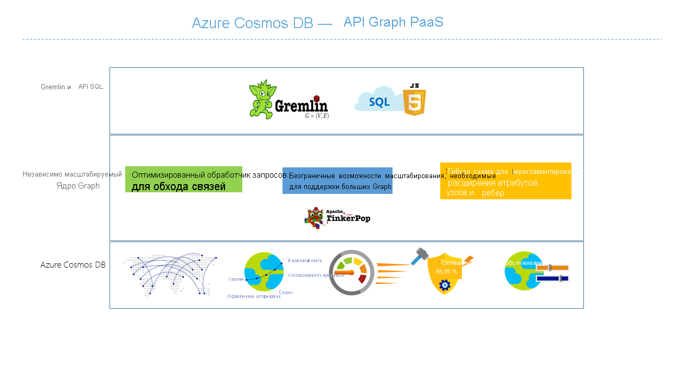

# Общие сведения об Azure Cosmos DB: API Gremlin

[Azure Cosmos DB](introduction.md) — это глобально распределенная, многомодельная служба базы данных от Майкрософт, необходимая для работы с критически важными приложениями. Эта база данных является многомодельной и поддерживает модели данных документа, пары "ключ-значение", графы и столбчатые модели данных. API Gremlin для Azure Cosmos DB используется для хранения и обработки данных графов. API Gremlin поддерживает моделирование данных графов и предоставляет API-интерфейсы для их просмотра.

В этой статье содержатся сведения об интерфейсе API Gremlin для Azure Cosmos DB и объясняется, как его использовать для хранения больших графов с миллиардами вершин и ребер. Вы также узнаете о выполнении запросов с миллисекундными задержками и простой разработке структуры и схемы графа. Для выполнения запросов к Azure Cosmos DB вы можете использовать язык обхода графов [Apache TinkerPop](http://tinkerpop.apache.org) или [Gremlin](http://tinkerpop.apache.org/docs/current/reference/#graph-traversal-steps).

## Что такое база данных графов
В реальном мире все данные связаны естественным образом. Традиционное моделирование данных ориентировано на сущности. Для многих приложений необходимо моделировать сущности и взаимосвязи между ними естественным способом.

[Граф](http://mathworld.wolfram.com/Graph.html) — это структура, состоящая из [вершин](http://mathworld.wolfram.com/GraphVertex.html) и [ребер](http://mathworld.wolfram.com/GraphEdge.html). Вершины и ребра могут содержать произвольное число свойств. 

* **Вершины** обозначают дискретные объекты, например пользователя, место или событие. 

* **Ребра** обозначают взаимосвязи между вершинами. Например, пользователь может знать другого пользователя, участвовать в событии или посетить мероприятие. 

* **Свойства** выражают сведения о вершинах и ребрах. Например, свойствами являются имя и возраст для некоторой вершины. Ребро может иметь свойства отметки времени и (или) веса. Более формально эта модель называется [графом свойства](http://tinkerpop.apache.org/docs/current/reference/#intro). База данных Azure Cosmos DB поддерживает модель графа свойства.

Например, ниже представлен пример графа, в котором показаны отношения между людьми, их интересами, мобильными устройствами и операционными системами.

Наборы данных графа позволяют эффективно моделировать и хранить графы естественным образом, благодаря чему их можно применить для различных сценариев. Базы данных графа обычно представляют собой базы данных NoSQL, так как для использования последних часто требуются быстрая итерация и гибкость схемы.

Вы можете объединить быстрые обходы, обеспечиваемые базами данных графа, с такими его алгоритмами, как первый поиск глубины и ширины, алгоритм Дейкстры и т. д., чтобы решить проблемы в различных доменах, например социальных сетях, управлении содержимым, геопространстве и рекомендациях.

## Функции базы данных графов в Azure Cosmos DB
 
База данных Azure Cosmos DB является полностью управляемой базой данных графа, которая обеспечивает глобальное распределение, гибкое масштабирование хранилища и пропускной способности, автоматическое индексирование и возможность выполнять запросы, настраиваемые уровни согласованности, а также поддержку стандартной платформы вычисления графа TinkerPop.

База данных Azure Cosmos DB предлагает следующие отличительные возможности по сравнению с другими базами данных графа, представленными на рынке:

* Гибко масштабируемая пропускная способность и хранилище

 На практике графы должны масштабироваться за пределы емкости одного сервера. С базой данных Azure Cosmos DB вы можете быстро и эффективно масштабировать графы на нескольких серверах. Вы также можете масштабировать пропускную способность графа на основе шаблонов доступа. База данных Azure Cosmos DB поддерживает базы данных графа, которые можно масштабировать, достигая практически неограниченных размеров хранилища и подготовленной пропускной способности.

* Репликация между несколькими регионами

 База данных Azure Cosmos DB прозрачно реплицирует данные графа во все регионы, связанные с вашей учетной записью. Репликация позволяет разрабатывать приложения, которым требуется глобальный доступ к данным. При этом нужно идти на компромиссы, выбирая между согласованностью, доступностью и производительностью, с соответствующими гарантиями. Azure Cosmos DB обеспечивает прозрачную отработку отказа между регионами с помощью API-интерфейсов с поддержкой множественной адресации. Вы сможете гибко масштабировать пропускную способность и размер хранилища по всему миру.

* Быстрое выполнение запросов и обходов с помощью знакомого синтаксиса Gremlin

 Храните разные типы вершин и ребер, а также выполняйте запросы этих документов через знакомый синтаксис Gremlin. База данных Azure Cosmos DB использует безблокировочную технологию индексирования с высокой степенью параллелизма и структурированием журналов для автоматического индексирования всего содержимого. Это дает возможность формировать многофункциональные запросы и обходы в режиме реального времени без необходимости указывать подсказки для схемы, вторичные индексы или представления. Дополнительные сведения см. в статье [Поддержка графа Gremlin в базе данных Azure Cosmos DB](gremlin-support.md).

* Полная управляемость

 Azure Cosmos DB устраняет необходимость управления базой данных и вычислительными ресурсами. В полностью управляемой службе Microsoft Azure вам не нужно заниматься управлением виртуальными машинами, развертыванием и настройкой программного обеспечения, масштабированием или иметь дело со сложными обновлениями на уровне данных. Каждый граф автоматически сохраняется и защищается от региональных сбоев. Вы можете легко добавлять учетные записи Azure Cosmos DB и подготавливать требуемую емкость по мере необходимости, позволяя сосредоточиться на приложении, а не на вопросах эксплуатации и управления базой данных.

* Автоматическая индексация

 По умолчанию база данных Azure Cosmos DB автоматически индексирует все свойства в узлах и ребрах в графе, не ожидая и не требуя наличия какой-либо схемы или создания дополнительных индексов.

* Совместимость с Apache TinkerPop

 База данных Azure Cosmos DB изначально поддерживает стандартный язык TinkerPop с открытым кодом, а также может интегрироваться с другими системами графа, совместимыми с этим языком. Таким образом, вы можете легко выполнять миграцию из другой базы данных графа, например Titan или Neo4j, или использовать базу Azure Cosmos DB с платформами аналитики графа, такими как Apache Spark GraphX.

* Настраиваемые уровни согласованности.

 Вам доступны на выбор пять четко определенных уровней согласованности для достижения оптимального соотношения между согласованностью и производительностью. Для запросов и операций чтения служба Azure Cosmos DB предлагает пять отдельных уровней согласованности — сильный, с ограниченным устареванием, сеансовый, с согласованностью префиксов и согласованный в конечном счете. Эти разделенные, четко определенные уровни согласованности позволяют принимать обоснованные компромиссы между показателями согласованности, доступности и задержки. Дополнительные сведения см. в статье [Настраиваемые уровни согласованности данных в Azure Cosmos DB](consistency-levels.md).

База данных Azure Cosmos DB также позволяет использовать несколько моделей, например документа и графа, в тех же контейнерах или базах данных. Вы можете использовать контейнер с документами, чтобы хранить с ними данные графа. Кроме того, можно использовать SQL-запросы для JSON и запросы Gremlin для выполнения тех же запросов, что и для графа.

## Начало работы

Для создания учетных записей базы данных Azure Cosmos DB с поддержкой API Gremlin и доступа к ним можно использовать интерфейс командной строки Azure (CLI), Azure PowerShell или же портал Azure. Создав учетную запись, вы можете получить доступ к базам данных графов в пределах этой учетной записи с помощью конечной точки службы API Gremlin `https://<youraccount>.gremlin.cosmosdb.azure.com`, которая обеспечивает внешний интерфейс WebSocket для языка Gremlin. Вы можете настроить инструменты, совместимые с TinkerPop, например [консоль Gremin](http://tinkerpop.apache.org/docs/current/reference/#gremlin-console), чтобы подключиться к этой конечной точке, а также создать приложения на Java, Node.js или любом другом клиентском драйвере Gremlin.

В таблице ниже приведены распространенные драйверы Gremlin, которые вы можете использовать для базы данных Azure Cosmos DB.

| Загрузка | Документация | Приступая к работе | Поддерживаемая версия соединителя |
| --- | --- | --- | --- |
| [.NET](http://tinkerpop.apache.org/docs/3.3.1/reference/#gremlin-DotNet) | [Gremlin.NET в GitHub](https://github.com/apache/tinkerpop/tree/master/gremlin-dotnet) | [Создание приложения Graph с помощью .NET](create-graph-dotnet.md) | 3.4.0-RC2 |
| [Java](https://mvnrepository.com/artifact/com.tinkerpop.gremlin/gremlin-java) | [Документация по Gremlin для Java](http://tinkerpop.apache.org/javadocs/current/full/) | [Создание приложения Graph с помощью Java](create-graph-java.md) | 3.2.0 и выше |
| [Node.js](https://www.npmjs.com/package/gremlin) | [Gremlin для JavaScript в GitHub](https://github.com/jbmusso/gremlin-javascript) | [Создание приложения Graph с помощью Node.js](create-graph-nodejs.md) | 2.6.0|
| [Python](http://tinkerpop.apache.org/docs/3.3.1/reference/#gremlin-python) | [Gremlin-Python в GitHub](https://github.com/apache/tinkerpop/tree/master/gremlin-python) | [Создание приложения Graph с помощью Python](create-graph-python.md) | 3.2.7 |
| [PHP](https://packagist.org/packages/brightzone/gremlin-php) | [Gremlin-PHP в GitHub](https://github.com/PommeVerte/gremlin-php) | [Создание приложения Graph с помощью PHP](create-graph-php.md) | 3.1.0 |
| [Консоль Gremlin](https://tinkerpop.apache.org/downloads.html) | [Документация по TinkerPop](http://tinkerpop.apache.org/docs/current/reference/#gremlin-console) |  [Создание приложения Graph с помощью консоли Gremlin](create-graph-gremlin-console.md) | 3.2.0 и выше |

## Вопросы проектирования базы данных графа

Если при разработке графа вы решите моделировать сущности как отдельные вершины, а не как свойства других сущностей вершин, то это повлечет за собой понижение производительности и дополнительные затраты. Основные критерии этого решения — способ запроса данных и масштабируемость самой модели.

Чтобы выбрать для сущности правильный режим моделирования, ответьте на следующие вопросы.

* Какие сущности вам потребуется извлекать в формате вершин в большинстве запросов?

* Какие сведения включаются в граф для целей фильтрации данных?

* Какие сущности представляют собой лишь связи с другими сущностями, значения которых вы на самом деле используете?

* Какие элементы информации нужны вашим запросам и какова стоимость их выполнения в единицах запроса?

Предположим, что граф имеет следующую структуру:

* В зависимости от используемых запросов может оказаться, что связь District->Store используется только для фильтрации вершин Store. Например, это справедливо для всех запросов в формате "получить список всех магазинов из конкретного района". В такой ситуации имеет смысл свернуть сущность District, превратив ее из отдельной вершины в свойство вершины Store. 

* Этот прием позволит снизить стоимость извлечения каждой вершины Store, поскольку вместо трех объектов графа (District, District->Store, Store) будет извлекаться только вершина Store. Это может повысить производительность системы и (или) снизить затраты на запрос.

* Вершина Store здесь связана с двумя другими вершинами — Employee и Product. Это означает, что Store следует считать обязательной вершиной, так как она дает дополнительные возможности для просмотра.  

## Сценарии, в которых будет полезен интерфейс API Gremlin
Ниже приведены некоторые примеры использования поддержки графа базы данных Azure Cosmos DB:

* Социальные сети

 Объединяя данные о клиентах и их взаимодействиях с другими людьми, вы можете разработать персонализированные средства, предугадать поведение клиента или объединить людей на основе их интересов. Базу данных Azure Cosmos DB можно использовать для управления социальными сетями и отслеживания данных о клиенте и его предпочтениях.

* Системы рекомендаций

 Широко используется в сфере розничной торговли. Объединяя сведения о продукции, пользователях и операциях пользователей, например приобретении, поиске и оценке товара, вы можете создать пользовательские рекомендации. База данных Azure Cosmos DB с минимальной задержкой, гибким масштабированием и встроенной поддержкой графа представляет собой идеальный вариант моделирования этих взаимосвязей.

* Геопространственные данные

 Многим приложениям в сферах телекоммуникаций, логистики и туристического планирования требуется поиск интересующего расположения в регионе или же обнаружение самого короткого (оптимального) пути между двумя расположениями. База данных Azure Cosmos DB поможет легко справиться с этими задачами.

* Интернет вещей

 Исследуя сеть и подключения между устройствами Интернета вещей, смоделированными как граф, вы сможете разобраться с состоянием своих устройств и ресурсов. Кроме того, вы сможете узнать, как изменения одного компонента сети могут повлиять на другой.

## Дополнительная информация
Дополнительные сведения о поддержке графа в базе данных Azure Cosmos DB см. в следующих ресурсах:

* [Azure Cosmos DB. Создание приложения .NET с помощью API Graph](create-graph-dotnet.md)
* Дополнительные сведения см. в статье [Поддержка графа Gremlin в базе данных Azure Cosmos DB](gremlin-support.md).
