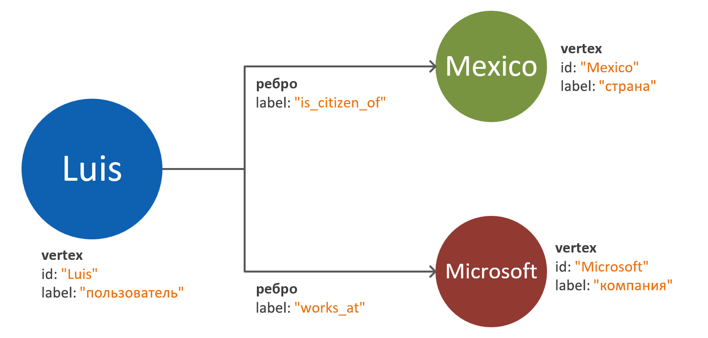
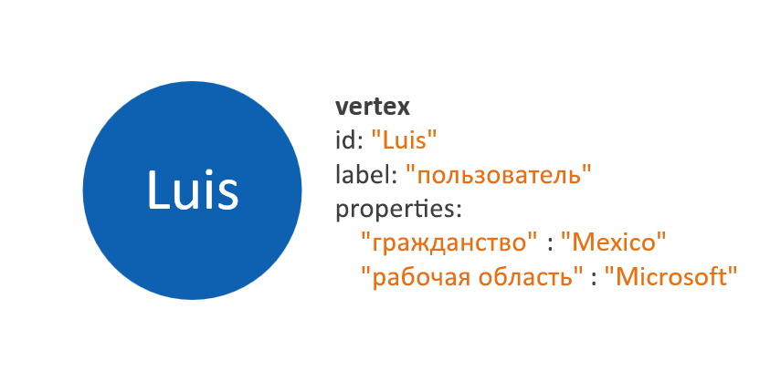
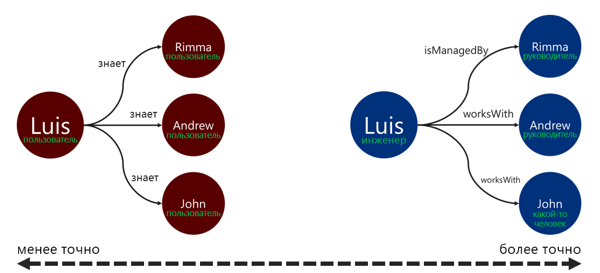

# Моделирование данных графов для API Gremlin Azure Cosmos DB

В этом документе приведены рекомендации по моделированию данных графов. Этот шаг крайне важен для обеспечения масштабируемости и производительности системы графовой базы данных по мере развития данных. Эффективная модель данных особенно важна при использовании крупномасштабных графов.

## Требования

Процесс, описанный в этом руководстве, исходит из следующих предположений:
 * **Сущности** в проблемной области определены. Эти сущности предназначены для использования _атомарным образом_ для каждого запроса. Другими словами, система базы данных не предназначена для получения данных одной сущности в нескольких запросах.
 * Есть представление о **требованиях к чтению и записи** для системы базы данных. Эти требования помогут выполнить оптимизации, необходимые для модели данных графов.
 * Принципы [стандарта графа свойства Apache Tinkerpop](http://tinkerpop.apache.org/docs/current/reference/#graph-computing) хорошо понятны.

## Зачем нужна графовая база данных?

Решение графовой базы данных можно оптимально применять, если сущности и связи в домене данных имеют следующие характеристики: 

* Сущности являются **часто подключаемыми** через описательные связи. Преимущество этого сценария заключается в том, что связи сохраняются в хранилище.
* Существуют **циклические связи** или **сущности, ссылающиеся на самих себя**. Этот шаблон часто таит в себе сложности при использовании реляционных баз данных или баз данных документов.
* Между сущностями есть **динамически развивающиеся связи**. Этот шаблон хорошо подходит для иерархических или древовидных данных с несколькими уровнями.
* Между сущностями есть **связи "многие ко многим"** .
* Существуют **требования к записи и чтению для сущностей и связей**. 

Если приведенные выше критерии удовлетворены, вполне вероятно, что подход с использованием графовой базы данных обеспечивает преимущества для **сложности запроса**, **масштабируемости модели данных** и **производительности запросов**.

На следующем шаге нужно определить, будет ли использоваться граф в целях аналитики или транзакций. Если граф предназначен для использования в больших вычислениях и в рабочих нагрузках обработки данных, стоит узнать больше о [соединителе Spark для Cosmos DB](https://docs.microsoft.com/azure/cosmos-db/spark-connector) и использовании [библиотеки GraphX](https://spark.apache.org/graphx/). 

## Как использовать объекты графов

[Стандарт графа свойства Apache Tinkerpop](http://tinkerpop.apache.org/docs/current/reference/#graph-computing) определяет два типа объектов: **вершины** и **ребра**. 

Ниже приведены рекомендации для свойств в объектах графов.

| Объект. | Свойство | type | Примечания |
| --- | --- | --- |  --- |
| Вершина | ИД | Строка, | Уникально применяется на секцию. Если значение не предоставлено при вставке, будет храниться автоматически созданный идентификатор GUID. |
| Вершина | label | Строка, | Это свойство используется для определения типа сущности, которую представляет вершина. Если значение не указано, будет использоваться значение по умолчанию (vertex). |
| Вершина | properties | Строка, логическое значение, числовое значение | Список отдельных свойств, которые хранятся в виде пар "ключ — значение", в каждой вершине. |
| Вершина | partition key | Строка, логическое значение, числовое значение | Это свойство определяет, где будет храниться вершина и ее исходящие ребра. Узнайте больше о [секционировании графов](graph-partitioning.md). |
| Edge | ИД | Строка, | Уникально применяется на секцию. Автоматически создается по умолчанию. Как правило, нет необходимости в уникальном получении ребер по идентификатору. |
| Edge | label | Строка, | Это свойство используется для определения типа связи двух вершин. |
| Edge | properties | Строка, логическое значение, числовое значение | Список отдельных свойств, которые хранятся в виде пар "ключ — значение", в каждом ребре. |

> [!NOTE]
> Ребрам не требуется значение ключа секции, так как это значение автоматически назначается в соответствии с исходной вершиной ребра. Узнайте больше из статьи о [секционировании графов](graph-partitioning.md).

## Рекомендации по моделированию сущностей и связей

Ниже приведен набор рекомендаций по моделированию для графовой базы данных API Gremlin Azure Cosmos DB. Эти инструкции предполагают наличие определения домена данных и запросов для него.

> [!NOTE]
> Описанные ниже действия представлены как рекомендации. Конечную модель необходимо оценить и протестировать, прежде чем рассматривать ее как готовую к рабочей среде. Кроме того, приведенные ниже рекомендации относятся к реализации API Gremlin Azure Cosmos DB. 

### Моделирование вершин и свойств 

Первым шагом для создания модели данных графов является сопоставление каждой идентифицируемой сущности с **объектом вершины**. Сопоставление всех сущностей к вершинам по принципу "один к одному" должно быть первым шагом и может быть изменено.

Сопоставление свойств одной сущности в качестве отдельных вершин является одной из распространенных ошибок. Рассмотрим приведенный ниже пример, где одна и та же сущность представлена двумя разными способами:

* **Свойства на основе вершин**. При таком подходе для описания свойств сущности используются три отдельных вершины и два ребра. Хотя при таком подходе может уменьшиться избыточность, он увеличивает сложность модели. Это может привести к дополнительной задержке, увеличению сложности запросов и повышению вычислительных затрат. Эта модель также может вызвать трудности при секционировании.

* **Вершины с внедренными свойствами**. В этом подходе для представления всех свойств сущности внутри вершины используется список пар "ключ — значение". Такой подход уменьшает сложности модели, что приведет к упрощению запросов и более экономически выгодным обходам.

> [!NOTE]
> В приведенных выше примерах показана упрощенная модель графов, отображающая только сравнение двух способов разделения свойств сущности.

Шаблон **вершин с внедренными свойствами** обычно обеспечивает более производительный и масштабируемый подход. Подход по умолчанию к новой модели данных графов должен исходить из этого шаблона.

Но есть сценарии, где использование ссылки на свойство может обеспечивать преимущества. Например, если свойство, на которое указывает ссылка, постоянно обновляется. При использовании отдельной вершины для представления свойства, которое постоянно меняется, сокращается объем операций записи, для которых требуется обновление.

### Моделирование связи с направлениями ребер

После моделирования вершин можно добавить ребра для обозначения связей между ними. Первый аспект, который необходимо оценить, — это **направление связи**. 

Объекты ребер имеют направление по умолчанию, которое сопровождается обходом при использовании функции `out()` или `outE()`. При использовании естественного направления повышается эффективность операции, так как все вершины хранятся с исходящими от них ребрами. 

Тем не менее обход в обратном направлении ребра при использовании функции `in()` всегда приводит к возникновению запроса между секциями. Узнайте больше о [секционировании графов](graph-partitioning.md). Если нужно постоянно выполнять обход с использованием функции `in()`, мы рекомендуем добавить ребра в обоих направлениях.

Вы можете определить направление ребра, используя предикаты `.to()` или `.from()` для шага Gremlin `.addE()` либо используя [библиотеку BulkExecutor для API Gremlin](bulk-executor-graph-dotnet.md).

> [!NOTE]
> Объекты ребер имеют направление по умолчанию.

### Создание меток для связи

Использование описательных меток для связи может повысить эффективность операций разрешения ребер. Этот шаблон можно применять следующими способами:
* Создание меток для связи с использованием условий, не являющихся универсальными.
* Связывание метки исходной вершины с меткой целевой вершины с использованием имени связи.

Чем конкретнее метка, которую средство обхода будет использовать для фильтрации ребер, тем лучше. Это решение также может оказать значительное влияние на затраты на отправку запросов. Эти затраты можно проверить в любое время, [используя шаг executionProfile](graph-execution-profile.md).

## Дальнейшие действия: 
* Ознакомьтесь со списком поддерживаемых [шагов Gremlin](gremlin-support.md).
* Узнайте больше о [секционировании графовых баз данных](graph-partitioning.md), чтобы обрабатывать крупномасштабные графы.
* Оцените запросы Gremlin, используя [шаг профиля выполнения](graph-execution-profile.md).
