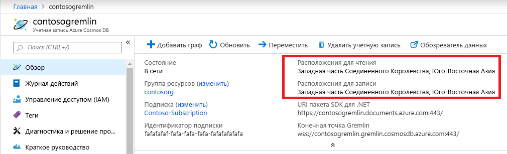

# <a name="regional-endpoints-for-azure-cosmos-db-graph-account"></a>Региональные конечные точки для графовой учетной записи Azure Cosmos DB
Графовая база данных Azure Cosmos DB [глобально распределена](distribute-data-globally.md), поэтому приложения могут использовать несколько конечных точек для чтения. В приложениях, которым необходим доступ на запись в нескольких расположениях, нужно включить возможность использования [нескольких источников](how-to-multi-master.md).

Причины для выбора нескольких регионов:
1. **Масштабируемость чтения по горизонтали** — при увеличении нагрузки приложения может быть целесообразно направить трафик чтения в разные регионы Azure.
2. **Низкая задержка** — вы можете уменьшить сетевую задержку для каждого обхода, проводя маршрутизацию трафика чтения и записи в ближайший регион Azure.

Требование **местонахождения данных** выполняется путем установки политики Azure Resource Manager для учетной записи Cosmos DB. Клиент может ограничить регионы, в которые Cosmos DB реплицирует данные.

## <a name="traffic-routing"></a>Маршрутизация трафика

Ядро графовой СУБД Cosmos DB работает в нескольких регионах, каждый из которых содержит несколько кластеров. Каждый кластер содержит сотни компьютеров. DNS CNAME графовой учетной записи Cosmos DB *accountname.gremlin.cosmos.azure.com* разрешается в запись кластера DNS A. Один IP-адрес балансировщика нагрузки скрывает топологию внутреннего кластера.

Для каждого региона графовой учетной записи Cosmos DB создается региональная запись DNS CNAME. Формат региональной конечной точки — *accountname-region.gremlin.cosmos.azure.com*. Сегмент региона региональной конечной точки получается путем удаления всех пробелов из имени [региона Azure](https://azure.microsoft.com/global-infrastructure/regions). Например, регион `"East US 2"` для глобальной учетной записи базы данных `"contoso"` будет иметь DNS CNAME *contoso-eastus2.gremlin.cosmos.azure.com*

Клиент TinkerPop Gremlin предназначен для работы с одним сервером. Приложение может использовать глобально записываемую DNS CNAME для трафика чтения и записи. Приложения, поддерживающие регион, должны использовать региональную конечную точку для трафика чтения. Используйте региональную конечную точку для трафика записи, только если для конкретного региона настроено принятие операций записи. 

> [!NOTE]
> Графовое ядро СУБД Cosmos DB может принимать операцию записи в регионе чтения за счет использования прокси-сервера для трафика в регион записи. Мы не советуем отсылать записи в доступный только для чтения регион, так как он повышает задержку обхода и подвержен возникновению ограничений в будущем.

CNAME учетной записи глобальной базы данных всегда указывает на допустимый регион записи. Во время отработки отказа на стороне сервера для региона записи Cosmos DB обновляет CNAME учетной записи глобальной базы данных, чтобы указать на новый регион. Если приложение не может справиться с перенаправлением трафика после отработки отказа, оно должно использовать DNS CNAME учетной записи глобальной базы данных.

> [!NOTE]
> Cosmos DB не направляет трафик на основе географической близости вызывающего объекта. Каждое приложение должно выбрать правильный регион в соответствии с уникальными требованиями приложений.

## <a name="portal-endpoint-discovery"></a>Обнаружение конечной точки портала

Самый простой способ получить список регионов для графовой учетной записи Azure Cosmos DB — это колонка обзора на портале Azure. Это сработает для приложений, которые не изменяют регионы часто или позволяют обновлять список через конфигурацию приложения.



В примере ниже показаны общие принципы доступа к региональной конечной точке Gremlin. Приложение должно учитывать количество регионов для отправки трафика, а также число соответствующих клиентов Gremlin для создания экземпляра.

```csharp
// Example value: Central US, West US and UK West. This can be found in the overview blade of you Azure Cosmos DB Gremlin Account. 
// Look for Write Locations in the overview blade. You can click to copy and paste.
string[] gremlinAccountRegions = new string[] {"Central US", "West US" ,"UK West"};
string gremlinAccountName = "PUT-COSMOSDB-ACCOUNT-NAME-HERE";
string gremlinAccountKey = "PUT-ACCOUNT-KEY-HERE";
string databaseName = "PUT-DATABASE-NAME-HERE";
string graphName = "PUT-GRAPH-NAME-HERE";

foreach (string gremlinAccountRegion in gremlinAccountRegions)
{
  // Convert preferred read location to the form "[acountname]-[region].gremlin.cosmos.azure.com".
  string regionalGremlinEndPoint = $"{gremlinAccountName}-{gremlinAccountRegion.ToLowerInvariant().Replace(" ", string.Empty)}.gremlin.cosmos.azure.com";

  GremlinServer regionalGremlinServer = new GremlinServer(
    hostname: regionalGremlinEndPoint, 
    port: 443,
    enableSsl: true,
    username: "/dbs/" + databaseName + "/colls/" + graphName,
    password: gremlinAccountKey);

  GremlinClient regionalGremlinClient = new GremlinClient(
    gremlinServer: regionalGremlinServer,
    graphSONReader: new GraphSON2Reader(),
    graphSONWriter: new GraphSON2Writer(),
    mimeType: GremlinClient.GraphSON2MimeType);
}
```

## <a name="sdk-endpoint-discovery"></a>Обнаружение конечной точки пакета SDK

Приложение может использовать [пакет SDK Azure Cosmos DB](sql-api-sdk-dotnet.md) для обнаружения расположений чтения и записи для графовой учетной записи. Эти расположения могут измениться в любое время с помощью ручной перенастройки на стороне сервера или автоматического перехода на другой ресурс.

Для пакета SDK для TinkerPop Gremlin не предусмотрен API для обнаружения регионов учетной записи графовой базы данных Cosmos DB. Приложения, для которых требуется обнаружение конечной точки среды выполнения, должны размещать 2 отдельных пакета SDK в пространстве процесса.

```csharp
// Depending on the version and the language of the SDK (.NET vs Java vs Python)
// the API to get readLocations and writeLocations may vary.
IDocumentClient documentClient = new DocumentClient(
    new Uri(cosmosUrl),
    cosmosPrimaryKey,
    connectionPolicy,
    consistencyLevel);

DatabaseAccount databaseAccount = await cosmosClient.GetDatabaseAccountAsync();

IEnumerable<DatabaseAccountLocation> writeLocations = databaseAccount.WritableLocations;
IEnumerable<DatabaseAccountLocation> readLocations = databaseAccount.ReadableLocations;

// Pick write or read locations to construct regional endpoints for.
foreach (string location in readLocations)
{
  // Convert preferred read location to the form "[acountname]-[region].gremlin.cosmos.azure.com".
  string regionalGremlinEndPoint = location
    .Replace("http:\/\/", string.Empty)
    .Replace("documents.azure.com:443/", "gremlin.cosmos.azure.com");
  
  // Use code from the previous sample to instantiate Gremlin client.
}
```

## <a name="next-steps"></a>Дополнительная информация
* [Управление учетными записями базы данных](how-to-manage-database-account.md) в Azure Cosmos DB
* [Высокий уровень доступности](high-availability.md) при использовании Azure Cosmos DB
* [Global data distribution with Azure Cosmos DB - under the hood](global-dist-under-the-hood.md) (Глобальное распределение в Azure Cosmos DB — взгляд изнутри)
* [Примеры Azure CLI](cli-samples.md) для Azure Cosmos DB
