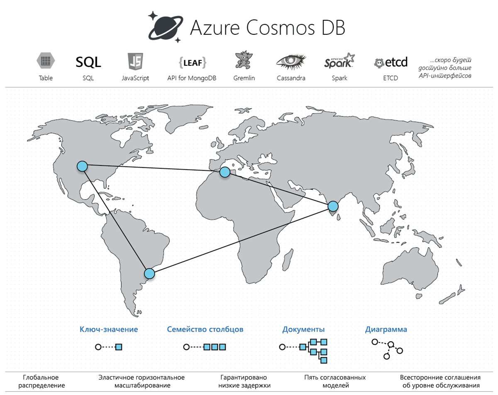

# Добро пожаловать в базу данных Azure Cosmos DB

Современные приложения должны мгновенно реагировать на запросы и быть постоянно доступными в Интернете. Чтобы обеспечить низкую задержку и высокий уровень доступности, экземпляры этих приложений нужно развернуть в ближайших к пользователям центрах обработки данных. Приложениям нужно реагировать в режиме реального времени на существенные изменения загрузки в пиковые часы, сохранять огромные объемы данных и предоставлять их пользователям с задержкой не более нескольких миллисекунд.

Azure Cosmos DB — это глобально распределенная многомодельная служба базы данных Майкрософт. С помощью одного лишь нажатия кнопки Cosmos DB позволяет гибко и независимо масштабировать пропускную способность и ресурсы хранилища в любых регионах Azure по всему миру. Вы можете эластично масштабировать пропускную способность и хранилище, а также получать быстрый (не более 10 мс) доступ к данным через API на ваш выбор, включая SQL, MongoDB, Cassandra, Tables или Gremlin. Cosmos DB предоставляет подробные [соглашения об уровне обслуживания](https://aka.ms/acdbsla) по таким параметрам, как пропускная способность, задержки, доступность и согласованность. Это уникальное предложение для служб баз данных.

[Бесплатную пробную версию Azure Cosmos DB](https://azure.microsoft.com/try/cosmosdb/) можно использовать без подписки Azure, без оплаты и каких-либо обязательств.

> [!div class="nextstepaction"]
> [Бесплатная пробная версия Azure Cosmos DB](https://azure.microsoft.com/try/cosmosdb/)

## Основные преимущества

### Полная готовность к глобальному распространению

Cosmos DB позволяет создавать приложения с малым временем отклика и высоким уровнем доступности по всему миру. Cosmos DB прозрачно реплицирует данные туда, где находятся пользователи, позволяя им взаимодействовать с ближайшей репликой данных.

Cosmos DB позволяет в любое время одним щелчком добавить в учетную запись Cosmos любой из регионов Azure или удалить добавленный ранее. Cosmos DB незаметно для вас реплицирует все данные во все регионы, связанные с учетной записью Cosmos, сохраняя высокий уровень доступности приложения благодаря поддержке *множественной адресации*. Дополнительные сведения см. в статье о [глобальном распределении](distribute-data-globally.md).

### Всегда включено

Благодаря глубокой интеграции с инфраструктурой Azure и [прозрачной репликации с несколькими источниками](global-dist-under-the-hood.md) Cosmos DB обеспечивает [высокую доступность на уровне 99,999 %](high-availability.md) для операций чтения и записи. Также Cosmos DB позволяет программными средствами (или с помощью портала) выполнять региональную отработку отказа для учетной записи Cosmos. Эта возможность гарантирует, что приложение предназначено для отработки отказа в случае региональной аварии.

### Глобальное эластичное масштабирование пропускной способности и хранилища

Cosmos DB позволяет выполнять прозрачное горизонтальное секционирование и репликацию из нескольких источников, а также обеспечивает непревзойденную эластичную масштабируемость операций записи и чтения по всему миру. Вы можете эластично масштабировать глобальную систему от нескольких тысяч до сотен миллионов запросов в секунду, выполнив всего один вызов API, и всегда оплачивать только реально необходимую пропускную способность (и хранилище). Это помогает справиться с непредвиденными скачками в рабочих нагрузках без предварительной подготовки лишних ресурсов для пиковых нагрузок. Дополнительные сведения см. в статьях [о секционировании в Cosmos DB](partitioning-overview.md), [подготовленной пропускной способности в контейнерах и базах данных](set-throughput.md) и [глобальном масштабировании подготовленной пропускной способности](scaling-throughput.md).

### Гарантированная низкая задержка на 99-м процентиле в любой точке мира

Используя Cosmos DB, вы можете создавать приложения глобального масштаба с высокой скоростью реагирования. Благодаря новому протоколу репликации из нескольких источников и [оптимизированному для операций записи](index-policy.md) ядру СУБД Azure Cosmos DB гарантирует показатели задержки менее 10 мс для операций чтения и (индексированных) операций записи до 99-го процентиля по всему миру. Эта возможность позволяет организовать стабильный прием данных и молниеносно обслуживать запросы, а значит создавать приложения с малым временем отклика.

### Строго определенные варианты согласованности

При создании глобально распределенных приложений в Cosmos DB больше не нужно идти на [большие компромиссы между согласованностью, доступностью, минимизацией задержки и пропускной способностью](consistency-levels-tradeoffs.md). Протокол Cosmos DB репликации из нескольких источников обеспечивает [пять строго определенных уровней согласованности](consistency-levels.md) - *: строгая*, *с ограниченным устареванием*, *сеансовая*, *с постоянным префиксом* и *итоговая*. Они позволяют создать интуитивно удобную модель программирования с низкой задержкой и высокой доступностью для глобально распределенного приложения.

### Отсутствие необходимости управлять схемами или индексами

Поддержание синхронизации схемы и индексов базы данных со схемой в приложении крайне затруднено для глобально распределенных приложений. С помощью Cosmos DB вам не придется иметь дело с управлением схемами и индексами. Ядро этой СУБД является полностью бессхемным.  Избавление от необходимости работать со схемами и (или) индексами позволяет заодно избавиться и от простоев приложения на период миграции схем. Cosmos DB [автоматически индексирует все данные](index-policy.md) и быстро обслуживает запросы.

### Проверенная в реальной работе служба базы данных

Cosmos DB была одной из первых служб в Azure. Уже почти десять лет Cosmos DB используется во многих популярных продуктах корпорации Майкрософт для критически важных и глобальных приложений, таких как Skype, Xbox, Office 365, Azure и многие другие. Сейчас Cosmos DB является одной из наиболее быстро развивающихся служб Azure. Ею пользуются многие внешние клиенты и критически важные приложения, которым важны гибкое масштабирование, комплексное глобальное распределение, готовность к использованию репликации с несколькими источниками, что позволяет обеспечить низкую задержку и высокий уровень доступности для операций чтения и записи.

### Повсеместное географическое присутствие

Cosmos DB доступна во всех регионах Azure по всему миру: более 54 регионов в общедоступном облаке, [Azure China 21Vianet](https://www.azure.cn/en-us/), Azure для Германии, Azure для государственных организаций (США) и Azure для министерства обороны (США). См. сведения о [географическом присутствии Cosmos DB](regional-presence.md).

### Безопасность по умолчанию и готовность для предприятий

Cosmos DB имеет сертификацию, свидетельствующую о соответствии [разным стандартам](compliance.md). Кроме того, все данные в Cosmos DB шифруются при хранении и при передаче. Cosmos DB поддерживает авторизацию на уровне строк и придерживается строгих стандартов безопасности.

### Существенное снижение совокупной стоимости владения

Cosmos DB является полностью управляемой службой, а значит вам не придется управлять сложными развертываниями в нескольких центрах обработки данных и обновлениями программного обеспечения для базы данных. Вы также избавитесь от расходов на поддержку, лицензирование, эксплуатацию. Кроме того, вам не нужно будет подготавливать базу данных для пиковой рабочей нагрузки. Дополнительные сведения см. в статье [Совокупная стоимость владения (TCO) при использовании Azure Cosmos DB](total-cost-ownership.md).

### Лучшие в отрасли подробные соглашения об уровне обслуживания

Cosmos DB — это первая и единственная служба, которая предоставляет [лучшие в отрасли подробные соглашения об уровне обслуживания](https://azure.microsoft.com/support/legal/sla/cosmos-db/), гарантируя доступность на уровне 99,999 %, задержку на 99-м процентиле для операций чтения и записи, пропускную способность и согласованность.

### Глобально распределенная операционная аналитика с помощью Spark

Вы можете запустить [Spark](spark-connector.md) непосредственно с данными, хранимыми в Cosmos DB. Эта возможность позволяет получать оперативную аналитику в глобальном масштабе с низким уровнем задержек и без ухудшения работы транзакционных рабочих нагрузок, которые обращаются напрямую к Cosmos DB. Дополнительные сведения см. в статье [Azure Cosmos DB: Implement a lambda architecture on the Azure platform](lambda-architecture.md) (Azure Cosmos DB. Реализация архитектуры lambda на платформе Azure).

### Разработка приложений в Cosmos DB с помощью популярных интерфейсов API NoSQL

Cosmos DB предлагает широкий ассортимент API-интерфейсов для работы с данными, хранящимися в базе данных Cosmos. По умолчанию [вы можете использовать SQL](how-to-sql-query.md) (основной API) для выполнения запросов к базе данных Cosmos. Кроме того, Cosmos DB поддерживает API для [Cassandra](cassandra-introduction.md), [MongoDB](mongodb-introduction.md), [Gremlin](graph-introduction.md) и [Azure Table Storage](table-introduction.md). Вы можете настроить клиентские драйверы (и инструменты) популярных интерфейсов NoSQL (например, MongoDB, Cassandra, Gremlin) так, чтобы они напрямую обращались к базе данных Cosmos. Благодаря поддержке протоколов передачи данных для популярных интерфейсов API NoSQL служба Cosmos DB обеспечивает следующие возможности:

* Простой перенос приложений в Cosmos DB с сохранением значительной части логики приложения.
* Сохранение переносимости приложения и независимости от поставщика облачной платформы.
* Полностью управляемая облачная служба с лучшими в отрасли Соглашениями об уровне обслуживания с финансовыми гарантиями для распространенных API NoSQL. 
* Гибкое масштабирование подготовленной пропускной способности и хранилища для баз данных с учетом текущих потребностей, что позволяет оплачивать только необходимую пропускную способность и хранилище. Все это приводит к значительному снижению затрат.

## Преимущества использования Azure Cosmos DB с некоторыми решениями

Использование Cosmos DB [гарантированно обеспечит высокий уровень доступности](https://azure.microsoft.com/support/legal/sla/cosmos-db/), высокую пропускную способность, низкую задержку и настраиваемые уровни согласованности при использовании с любыми [веб-приложениями, мобильными и игровыми приложениями, а также приложениями Интернета вещей](use-cases.md), которым необходимо обрабатывать большой объем данных, большое число операций чтения и записи в [глобальном масштабе](distribute-data-globally.md) с малым временем отклика практически в реальном времени. См. дополнительные сведения о применении Azure Cosmos DB в [Интернете вещей и телематике](use-cases.md#iot-and-telematics), [розничной торговле и маркетинге](use-cases.md#retail-and-marketing), [игровых приложениях](use-cases.md#gaming), а также [веб-приложениях и мобильных приложениях](use-cases.md#web-and-mobile-applications).

## Дополнительная информация

Ознакомьтесь с дополнительными сведениями об основных понятиях Cosmos DB: [комплексное глобальное распределение](distribute-data-globally.md), [секционирование](partitioning-overview.md) и [подготовленная пропускная способность](request-units.md).

Приступая к работе с Azure Cosmos DB, ознакомьтесь с одним из наших кратких руководств:

* [Azure Cosmos DB. Создание веб-приложения API SQL с использованием языка .NET и портала Azure](create-sql-api-dotnet.md)
* [Начало работы с API Azure Cosmos DB для MongoDB](create-mongodb-nodejs.md)
* [Краткое руководство. Создание приложения Cassandra с помощью .NET и Azure Cosmos DB](create-cassandra-dotnet.md)
* [Начало работы с API Gremlin в Azure Cosmos DB](create-graph-dotnet.md)
* [Краткое руководство. Создание приложения API таблицы с помощью .NET и Azure Cosmos DB](create-table-dotnet.md)

> [!div class="nextstepaction"]
> [Бесплатная пробная версия Azure Cosmos DB](https://azure.microsoft.com/try/cosmosdb/)
