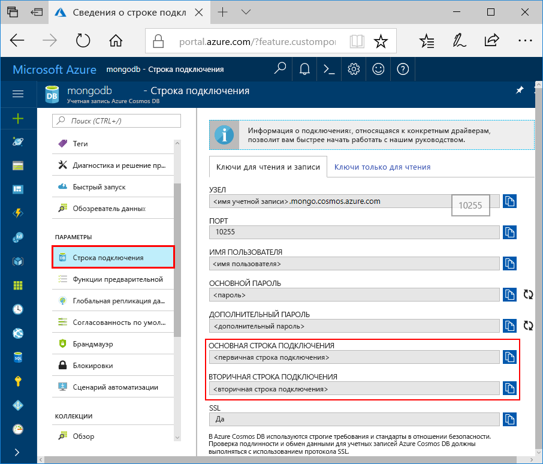
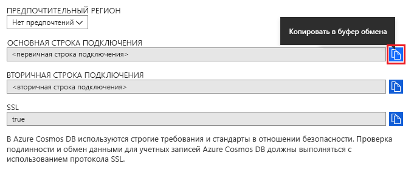

# Подключение к API Azure Cosmos DB для MongoDB с помощью MongoDB Compass 

Этот учебник содержит сведения об использовании [MongoDB Compass](https://www.mongodb.com/products/compass) при хранении и администрировании данных в Cosmos DB. В этом пошаговом руководстве используется API Azure Cosmos DB для MongoDB. Для тех из вас, кто еще не знаком с Compass, — это графический пользовательский интерфейс для MongoDB. Обычно он используется для визуализации данных, выполнения ad-hoc-запросов, наряду с управлением данными. 

Cosmos DB — это глобально распределенная многомодельная служба базы данных Майкрософт. Вы можете быстро создавать и запрашивать документы, пары "ключ-значение" и графовые базы данных, используя преимущества глобального распределения и горизонтального масштабирования Cosmos DB.

## Предварительные требования 
Чтобы подключиться к учетной записи Cosmos DB с помощью Robo 3T, сделайте следующее.

* Скачайте и установите [Compass](https://www.mongodb.com/download-center/compass?jmp=hero).
* Получите сведений о [строке подключения](connect-mongodb-account.md) Cosmos DB.

## Подключение к API Cosmos DB для MongoDB 
Чтобы подключить учетную запись Cosmos DB к Compass, выполните следующие шаги:

1. Получите сведения о подключении для учетной записи Cosmos, настроенной с помощью API Azure Cosmos DB для MongoDB, следуя инструкциям [здесь](connect-mongodb-account.md).

    

2. Нажмите кнопку с текстом **Копировать в буфер обмена** рядом с **основной или дополнительной строкой подключения** в Cosmos DB. После нажатия этой кнопки строка подключения будет полностью скопирована в буфер обмена. 

    

3. Откройте Compass на рабочем столе или компьютере и щелкните **Подключить**, а затем **Подключение к...** . 

4. Compass автоматически обнаруживает строку подключения в буфере обмена и спросит, хотите ли вы ее использовать для подключения. Щелкните **Да**, как показано на следующем снимке экрана.

    

5. После нажатия кнопки **Да** на предыдущем шаге данные из строки подключения будут заполнены автоматически. Удалите автоматически заполненное значение в поле **Replica Set Name** (Имя набора реплик), убедитесь, что поле пустое. 

    

6. В нижней части страницы щелкните **Подключиться**. Базы данных и учетная запись Cosmos DB теперь должны отображаться в MongoDB Compass.

## Дополнительная информация

- Узнайте, как [использовать Studio 3T](mongodb-mongochef.md) с API Azure Cosmos DB для MongoDB.
- Ознакомьтесь с [примерами](mongodb-samples.md) MongoDB с API Azure Cosmos DB для MongoDB.