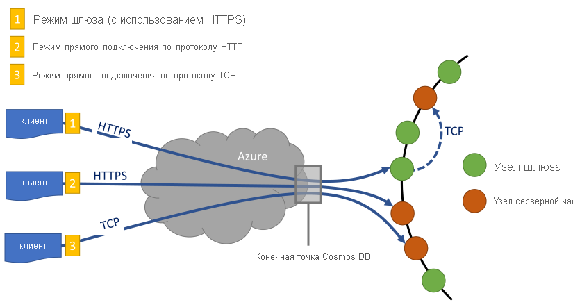

# <a name="performance-tips-for-azure-cosmos-db-and-net"></a>Советы по повышению производительности для .NET в Azure Cosmos DB

> [!div class="op_single_selector"]
> * [Async Java](performance-tips-async-java.md)
> * [Java](performance-tips-java.md)
> * [.NET](performance-tips.md)
> 

Azure Cosmos DB — быстрая и гибкая распределенная база данных, которая легко масштабируется с гарантированной задержкой и пропускной способностью. Для масштабирования базы данных с помощью Azure Cosmos DB не нужно вносить в архитектуру существенные изменения или писать сложный код. Для увеличения или уменьшения масштаба достаточно выполнить один вызов API. Дополнительные сведения см. в разделах [о подготовке пропускной способности контейнера](how-to-provision-container-throughput.md) и [о подготовке пропускной способности базы данных](how-to-provision-database-throughput.md). Но так как для доступа к Azure Cosmos DB выполняются сетевые вызовы, некоторые оптимизации на стороне клиента помогут повысить производительность при работе с [пакетом SDK .NET для SQL](sql-api-sdk-dotnet-standard.md).

Чтобы повысить производительность базы данных, рассмотрите следующие варианты.

## <a name="networking"></a>Сети
<a id="direct-connection"></a>

1. **Политика подключения: использование режима прямого подключения**

    Режим подключения к Azure Cosmos DB серьезно влияет на производительность, в частности на задержку на стороне клиента. Для настройки политики подключения для клиента используются два основных параметра конфигурации — *режим* и *протокол* подключения.  DocumentDB предоставляет два режима подключения:

   * Режим шлюза
      
     Режим шлюза поддерживается на всех платформах SDK и является настроенным по умолчанию для [пакета SDK Microsoft. Azure. DocumentDB](sql-api-sdk-dotnet.md). Если приложение работает в корпоративной сети с ограниченными ограничениями брандмауэра, лучшим выбором является режим шлюза, так как он использует стандартный HTTPS-порт и одну конечную точку. Однако компромисс производительности заключается в том, что режим шлюза включает дополнительный сетевой прыжок всякий раз, когда данные считываются или записываются в Azure Cosmos DB. Поэтому для обеспечения более высокой производительности рекомендуется использовать режим прямого подключения. Режим подключения шлюза также рекомендуется при запуске приложений в средах с ограниченным числом подключений к сокету. 

     При использовании пакета SDK в функциях Azure, особенно в [плане потребления](../azure-functions/functions-scale.md#consumption-plan), учитывать текущие [ограничения в подключениях](../azure-functions/manage-connections.md). В этом случае рекомендуется использовать режим шлюза, если вы также работаете с другими клиентами на основе HTTP в приложении "функции Azure".

   * Прямой режим

     Режим прямого доступа поддерживает подключение через протоколы TCP и HTTPS, а также режим подключения по умолчанию, если используется [Microsoft. Azure. Cosmos/.NET v3 SDK](sql-api-sdk-dotnet-standard.md).

     При использовании режима шлюза Cosmos DB использует порт 443 и порты 10250, 10255 и 10256 при использовании API Azure Cosmos DB для MongoDB. Порт 10250 сопоставляется со стандартным экземпляром MongoDB без функции георепликации, а порты 10255 и 10256 — с экземпляром MongoDB, в котором эта функция включена. Если вы используете протокол TCP в режиме прямого подключения, то в дополнение к портам шлюза необходимо открыть диапазон портов 10000–20000, так как Azure Cosmos DB использует динамические TCP-порты. Используя протокол TCP при закрытых портах, вы получите ошибку 503 "Служба недоступна". В таблице ниже приведены режимы подключения, поддерживаемые различными API-интерфейсами, и порты служб.

     |Режим подключения  |Поддерживаемый протокол  |Поддерживаемые пакеты SDK  |API и порт службы  |
     |---------|---------|---------|---------|
     |Шлюз  |   HTTPS    |  Все пакеты SDK    |   SQL (443), Mongo (10250, 10255, 10256), таблица (443), Cassandra (10350), Graph (443)    |
     |Прямой    |    HTTPS     |  Пакет SDK для .NET и Java    |   Порты в диапазоне 10 000–20 000    |
     |Прямой    |     TCP    |  Пакет SDK для .NET    | Порты в диапазоне 10 000–20 000 |

     Azure Cosmos DB предлагает простую и открытую модель программирования RESTful поверх HTTPS. Кроме того, предлагается эффективный протокол TCP, который также является RESTful в своей коммуникационной модели и доступен через клиентский пакет SDK для .NET. Как Direct TCP, так и HTTPS используют SSL для первоначальной аутентификации и шифрования трафика. Чтобы добиться лучшей производительности, рекомендуется по возможности использовать протокол TCP.

     Для пакета SDK v3 режим подключения настраивается при создании экземпляра Космосклиент в составе Космосклиентоптионс.

     ```csharp
     var serviceEndpoint = new Uri("https://contoso.documents.net");
     var authKey = "your authKey from the Azure portal";
     CosmosClient client = new CosmosClient(serviceEndpoint, authKey,
     new CosmosClientOptions
     {
        ConnectionMode = ConnectionMode.Direct,
        ConnectionProtocol = Protocol.Tcp
     });
     ```

     Для пакета SDK Microsoft. Azure. DocumentDB режим подключения настраивается во время создания экземпляра DocumentClient с помощью параметра ConnectionPolicy. При использовании режима прямого подключения протокол также можно определить в параметре ConnectionPolicy.

     ```csharp
     var serviceEndpoint = new Uri("https://contoso.documents.net");
     var authKey = "your authKey from the Azure portal";
     DocumentClient client = new DocumentClient(serviceEndpoint, authKey,
     new ConnectionPolicy
     {
        ConnectionMode = ConnectionMode.Direct,
        ConnectionProtocol = Protocol.Tcp
     });
     ```

     Поскольку протокол TCP поддерживается только в прямом режиме, если используется режим шлюза, то протокол HTTPS всегда используется для связи со шлюзом, а значение протокола в ConnectionPolicy игнорируется.

     

2. **Использование вызовов OpenAsync для избежания задержки при выполнении первого запроса**

    По умолчанию первый запрос характеризуется более длительной задержкой, так как он должен получить таблицу маршрутизации сетевых адресов. При использовании [пакета SDK версии 2](sql-api-sdk-dotnet.md)во избежание задержки запуска при первом запросе следует вызвать OpenAsync () один раз во время инициализации, как показано ниже.

        await client.OpenAsync();

    > [!NOTE] 
    > Метод OpenAsync создаст запросы на получение таблицы маршрутизации адресов для всех контейнеров в учетной записи. Для учетных записей, которые имеют много контейнеров, но их приложения обращаются к подмножеству, это вызовет ненужный объем трафика, что приводит к снижению скорости инициализации. Поэтому использование метода OpenAsync может оказаться нецелесообразным в этом сценарии, так как замедляет запуск приложения.

   <a id="same-region"></a>
3. **Повышение производительности за счет размещения клиентов в одном регионе Azure**

    По возможности разместите все приложения, вызывающие Azure Cosmos DB, в том же регионе, что и база данных Azure Cosmos. Для приблизительного сравнения: вызовы к Azure Cosmos DB в пределах региона выполняются в течение 1–2 мс, но задержка между восточным и западным побережьем США превышает 50 мс. Значение задержки может отличаться в зависимости от выбранного маршрута при передаче запроса от клиента к границе центра обработки данных Azure. Минимальная возможная задержка достигается при размещении клиентского приложения в том же регионе Azure, в котором предоставляется конечная точка Azure Cosmos DB. Список доступных регионов см. на странице [Регионы Azure](https://azure.microsoft.com/regions/#services).

    
   <a id="increase-threads"></a>
4. **Увеличение количества потоков или задач**

    Так как вызовы Cosmos DB выполняются по сети, может потребоваться изменить степень параллелизма запросов, чтобы клиентское приложение тратило минимальное количество времени на ожидание между запросами. Например, если вы используете [библиотеку параллельных задач .NET](https://msdn.microsoft.com//library/dd460717.aspx), создайте несколько сотен задач для чтения или записи в Azure Cosmos DB.

5. **Включить ускоренную сеть**

   Чтобы сократить задержку и нагрузку на ЦП, рекомендуется включить поддержку ускорения работы виртуальных машин на клиентских компьютерах. См. статью [Создание виртуальной машины Windows с ускорением](../virtual-network/create-vm-accelerated-networking-powershell.md) работы в сети или [Создание виртуальной машины Linux с поддержкой](../virtual-network/create-vm-accelerated-networking-cli.md) ускоренной работы в сети для включения ускорения работы в сети.


## <a name="sdk-usage"></a>Использование пакета SDK
1. **Установка последней версии пакета SDK**

    Пакеты SDK для Azure Cosmos DB постоянно улучшаются, чтобы обеспечивать самую высокую производительность. Сведения об улучшениях в последней версии пакета SDK см. в статье о [пакете SDK для Azure Cosmos DB](sql-api-sdk-dotnet-standard.md).

2. **Использование API-интерфейсов потока**

    [Пакет SDK для .NET v3](sql-api-sdk-dotnet-standard.md) содержит API-интерфейсы потока, которые могут получать и возвращать данные без сериализации. 

    Приложения среднего уровня, которые не используют ответы пакета SDK напрямую, но ретранслировать их на другие уровни приложений, могут воспользоваться преимуществами API-интерфейсов потока. Примеры обработки потоков см. в разделе примеры [управления элементами](https://github.com/Azure/azure-cosmos-dotnet-v3/blob/master/Microsoft.Azure.Cosmos.Samples/Usage/ItemManagement) .

3. **Используйте один и тот же клиент Azure Cosmos DB в течение всего жизненного цикла приложения.**

    Каждый экземпляр DocumentClient и Космосклиент является потокобезопасным и выполняет эффективное управление подключением и кэширование адресов при работе в режиме прямого подключения. Чтобы обеспечить эффективное управление подключениями и повысить производительность клиента пакета SDK, рекомендуется использовать один экземпляр на AppDomain в течение всего времени существования приложения.

   <a id="max-connection"></a>
4. **Увеличение максимального количества подключений System.Net для каждого узла при использовании режима шлюза**

    В режиме шлюза Azure Cosmos DB выполняет запросы через HTTPS или REST, а значит на них распространяется стандартное ограничение на количество подключений к одному имени узла или IP-адресу. Может потребоваться увеличить это значение (до 100–1000), чтобы клиентская библиотека могла использовать несколько одновременных подключений к Azure Cosmos DB. В пакете SDK для .NET версии 1.8.0 и выше для параметра [ServicePointManager.DefaultConnectionLimit](https://msdn.microsoft.com/library/system.net.servicepointmanager.defaultconnectionlimit.aspx) по умолчанию задано значение 50. Чтобы изменить это значение, установите для параметра [Documents.Client.ConnectionPolicy.MaxConnectionLimit](https://msdn.microsoft.com/library/azure/microsoft.azure.documents.client.connectionpolicy.maxconnectionlimit.aspx) более высокое значение.   
5. **Настройка параллельных запросов для секционированных коллекций**

     В пакете SDK .NET для SQL, начиная с версии 1.9.0, поддерживаются параллельные запросы, позволяющие обращаться к секционированным коллекциям в параллельном режиме. Дополнительные сведения см. в [примерах кода](https://github.com/Azure/azure-documentdb-dotnet/blob/master/samples/code-samples/Queries/Program.cs) для работы с пакетами SDK. Параллельные запросы предназначены для сокращения задержки при обработке запросов и улучшения пропускной способности посредством их последовательных аналогов. Параллельные запросы содержат два параметра, которые пользователи могут настроить в соответствии со своими требованиями: а) MaxDegreeOfParallelism устанавливает максимальное количество секций, которые можно запросить в параллельном режиме; б) MaxBufferedItemCount устанавливает количество предварительно выбираемых результатов.

    (a) ***Настройка MaxDegreeOfParallelism\:***. При параллельном запросе одновременно запрашиваются несколько секций. Однако данные из отдельной секционированной коллекции извлекаются последовательно в соответствии с запросом. Таким образом, настройка количества секций для параметра MaxDegreeOfParallelism позволит достичь высокой производительности запроса, если все другие состояния системы остаются неизменными. Если вы не знаете количество секций, для параметра MaxDegreeOfParallelism можно задать высокое значение. Система автоматически выберет минимальное из двух значений: число секций или количество, указанное пользователем.

    Следует отметить, что параллельные запросы обеспечивают больше преимуществ, если данные равномерно распределены во всех секциях по отношению к запросу. Если коллекция секционируется таким образом, что все или большинство данных, возвращаемых запросом, содержатся в нескольких секциях (в худшем случае в одной), это негативно скажется на производительности запроса.

    (b) ***Настройка MaxBufferedItemCount\:***. Параллельный запрос предназначен для предварительного получения результатов, пока текущий пакет результатов обрабатывается клиентом. Предварительная выборка способствует общему уменьшению задержки при обработке запроса. Параметр MaxBufferedItemCount ограничивает количество предварительно выбираемых результатов. Если настроить для параметра MaxBufferedItemCount ожидаемое (или максимальное) количество возвращаемых результатов, запрос получит максимальную выгоду от предварительной выборки.

    Предварительная выборка работает одинаково при любом значении параметра MaxDegreeOfParallelism. Для данных из всех секций применяется один буфер.  
6. **Включение сбора мусора на сервере**

    В некоторых случаях для оптимизации производительности необходимо уменьшить частоту сбора мусора. В .NET установите для параметра [gcServer](https://msdn.microsoft.com/library/ms229357.aspx) значение true.
7. **Реализация интервала задержки для RetryAfter**

    Во время проверки производительности следует увеличивать нагрузку до тех пор, пока регулирование не будет выполняться при небольшой частоте запросов. При регулировании клиентское приложение должно реализовать интервал частоты повтора для частоты повтора сервера. Это гарантирует, что время ожидания между повторными попытками будет минимальным. В пакетах SDK SQL для [.NET](sql-api-sdk-dotnet.md) и [Java](sql-api-sdk-java.md) версии 1.8.0 и выше, в пакетах SDK для [Node.js](sql-api-sdk-node.md) и [Python](sql-api-sdk-python.md) версии 1.9.0 и выше, а также во всех поддерживаемых пакетах SDK для [.NET Core](sql-api-sdk-dotnet-core.md) включена поддержка политики повтора. Дополнительные сведения см. в статье [о свойстве RetryAfter](https://msdn.microsoft.com/library/microsoft.azure.documents.documentclientexception.retryafter.aspx).
    
    В версии 1.19 и последующих версиях пакета SDK для .NET появился механизм для регистрации дополнительных диагностических сведений и устранения проблем, связанных с задержкой, как показано в следующем примере. Вы можете зарегистрировать строку диагностики для запросов с высокой задержкой чтения. Записанная строка диагностики поможет вам узнать, сколько раз возникала ошибка 429 для этого запроса.
    ```csharp
    ResourceResponse<Document> readDocument = await this.readClient.ReadDocumentAsync(oldDocuments[i].SelfLink);
    readDocument.RequestDiagnosticsString 
    ```
    
8. **Развертывание рабочей нагрузки клиента**

    При проверке с высокой пропускной способностью (более 50 000 единиц запроса в секунду) клиентское приложение может стать узким местом из-за того, что на компьютере будут достигнуты максимальные уровни использования ЦП и сети. Если вы достигли этой точки, то можете повысить производительность Azure Cosmos DB, развернув клиентские приложения на нескольких серверах.
9. **Кэширование URI документов для снижения задержки чтения**

    Чтобы повысить производительность операций чтения, по возможности выполняйте кэширование URI документов. При создании ресурса нужно определить логику для кэширования resourceid. Операции поиска на основе resourceid выполняются быстрее, чем операции поиска на основе имени, поэтому кэширование этих значений позволяет повысить производительность. 

   <a id="tune-page-size"></a>
10. **Оптимизация производительности посредством настройки размера страницы для запросов и каналов чтения**

   Если при выполнении массового чтения документов с помощью функции для чтения канала (например, ReadDocumentFeedAsync) или отправке запроса SQL получен слишком большой набор результатов, результаты возвращаются частями. По умолчанию результаты возвращаются в пакетах (не более 100 элементов и не более 1 МБ в каждом пакете).

   Чтобы снизить количество полных обходов сети, необходимых для получения всех соответствующих результатов, можно увеличить размер страницы до 1000 с помощью заголовка запроса [x-ms-max-item-count](https://docs.microsoft.com/rest/api/cosmos-db/common-cosmosdb-rest-request-headers). Чтобы отобразить только некоторые результаты, например, когда пользовательский интерфейс или приложение API возвращает только десять результатов за раз, размер страницы можно уменьшить до 10. Это позволит снизить пропускную способность, используемую на операции чтения и на выполнение запросов.

   > [!NOTE] 
   > Свойство Макситемкаунт не должно использоваться только для назначения разбивки на страницы. Это основное использование для повышения производительности запросов за счет уменьшения максимального количества элементов, возвращаемых на одной странице.  

   Размер страницы также можно задать с помощью доступных пакетов SDK для Azure Cosmos DB. Свойство [макситемкаунт](/dotnet/api/microsoft.azure.documents.client.feedoptions.maxitemcount?view=azure-dotnet) в FeedOptions позволяет задать максимальное число элементов, возвращаемых операцией перечисления. Если `maxItemCount` параметр имеет значение-1, пакет SDK автоматически находит наиболее оптимальное значение в зависимости от размера документа. Пример:
    
   ```csharp
    IQueryable<dynamic> authorResults = client.CreateDocumentQuery(documentCollection.SelfLink, "SELECT p.Author FROM Pages p WHERE p.Title = 'About Seattle'", new FeedOptions { MaxItemCount = 1000 });
   ```
    
   При выполнении запроса полученные данные отправляются в пакете TCP. Если указано слишком низкое значение для `maxItemCount`, то число поездок, необходимых для отправки данных в пакете TCP, велико, что влияет на производительность. Поэтому, если вы не знаете, какое значение следует задать `maxItemCount` свойству, лучше установить его в значение-1 и позволить пакету SDK выбрать значения по умолчанию. 

11. **Увеличение количества потоков или задач**

    См. подраздел [Увеличение количества потоков или задач](#increase-threads) раздела "Сеть".

12. **Использование 64-разрядных хост-процессов**

    Если вы используете пакет SDK .NET для SQL версии 1.11.4 и выше, он работает в 32-разрядном хост-процессе. Но если вы используете запросы между секциями, то для повышения производительности мы рекомендуем использовать 64-разрядные хост-процессы. В следующих типах приложений по умолчанию используется 32-разрядный хост-процесс. Чтобы изменить его на 64-разрядный, выполните описанные ниже действия в зависимости от типа приложения.

    - Для исполняемых приложений это можно сделать, сняв флажок **Предпочтительно 32-разр.** в окне **Свойства проекта** на вкладке **Сборка**.

    - Для тестовых проектов на основе VSTest это можно сделать, выбрав **Тест**->**Параметры тестирования**->**Default Processor Architecture as X64** (Архитектура процессора по умолчанию — X64) в пункте меню **Тест Visual Studio**.

    - Для локально развернутых веб-приложений ASP.NET это можно сделать, установив флажок **Использовать 64-разрядную версию IIS Express для веб-сайтов и проектов** в меню **Сервис**->**Параметры**->**Проекты и решения**->**Веб-проекты**.

    - Для веб-приложений ASP.NET, развернутых в Azure, это можно сделать, выбрав **Platform as 64-bit** (Платформа — 64-разрядная) в меню **Параметры приложения** на портале Azure.

## <a name="indexing-policy"></a>Политика индексации
 
1. **Увеличение скорости выполнения операций записи посредством исключения неиспользуемых путей из индексирования**

    Политика индексирования Cosmos DB также позволяет добавлять пути к документам или исключать их из индексирования. Для этого используется параметр Indexing Paths (IndexingPolicy.IncludedPaths и IndexingPolicy.ExcludedPaths). Возможность управления путями индексирования позволяет оптимизировать производительность записи и снизить затраты на хранение индекса для сценариев с заранее определенными шаблонами запросов. Это связано с тем, что затраты на индексирование непосредственно зависят от количества уникальных путей индексирования.  Например, в следующем коде показано, как исключить весь раздел документов (поддерево) из индексирования с помощью подстановочного знака "*".

    ```csharp
    var collection = new DocumentCollection { Id = "excludedPathCollection" };
    collection.IndexingPolicy.IncludedPaths.Add(new IncludedPath { Path = "/*" });
    collection.IndexingPolicy.ExcludedPaths.Add(new ExcludedPath { Path = "/nonIndexedContent/*");
    collection = await client.CreateDocumentCollectionAsync(UriFactory.CreateDatabaseUri("db"), excluded);
    ```

    Дополнительные сведения см. в статье [Политики индексации Azure Cosmos DB](index-policy.md).

## <a name="throughput"></a>Пропускная способность
<a id="measure-rus"></a>

1. **Измерение и настройка расхода единиц запроса/повторного использования**

    Azure Cosmos DB предоставляет обширный набор операций с документами в коллекции базы данных, в том числе реляционные и иерархические запросы с использованием UDF, хранимых процедур и триггеров. Затраты, связанные с каждой из этих операций, зависят от типа процессора, операций ввода-вывода и памяти, необходимой для завершения операции. Вместо того чтобы думать о закупке и управлении аппаратными ресурсами, вы можете думать о единице запроса (RU) как единой меры для ресурсов, необходимых для выполнения различных операций с базами данных и обслуживания запросов приложений.

    Пропускная способность выделяется на основе количества [единиц запроса](request-units.md), заданного для каждого контейнера. Удельный расход единиц запросов оценивается в расчете на одну секунду. Частота запросов для приложений, у которых она превышает подготовленные единицы запросов для контейнера, будет ограничена, пока она не упадет ниже зарезервированного для контейнера уровня. Если приложению требуется более высокий уровень пропускной способности, можно увеличить ее путем выделения дополнительных единиц запросов. 

    Сложность запроса влияет на количество потребляемых единиц запросов для операции. Количество предикатов и их характер, количество определяемых пользователем функций и размер набора исходных данных — все это влияет на плату за операции запроса.

    Чтобы измерить издержки на любую операцию (создание, обновление или удаление), просмотрите заголовок [x-MS-Request-расход](https://docs.microsoft.com/rest/api/cosmos-db/common-cosmosdb-rest-response-headers) (или эквивалентное свойство RequestCharge в ResourceResponse\<t > или FeedResponse\<T > в пакете SDK для .NET), чтобы измеряет количество единиц запросов, потребляемых этими операциями.

    ```csharp
    // Measure the performance (request units) of writes
    ResourceResponse<Document> response = await client.CreateDocumentAsync(collectionSelfLink, myDocument);
    Console.WriteLine("Insert of document consumed {0} request units", response.RequestCharge);
    // Measure the performance (request units) of queries
    IDocumentQuery<dynamic> queryable = client.CreateDocumentQuery(collectionSelfLink, queryString).AsDocumentQuery();
    while (queryable.HasMoreResults)
         {
              FeedResponse<dynamic> queryResponse = await queryable.ExecuteNextAsync<dynamic>();
              Console.WriteLine("Query batch consumed {0} request units", queryResponse.RequestCharge);
         }
    ```             

    Затраты на запрос, возвращенные в этом заголовке, — это часть подготовленной пропускной способности (например, 2000 единиц запроса в секунду). Например, если приведенный выше запрос вернет 1000 документов размером по 1 КБ каждый, затраты на операцию составят 1000 единиц. Таким образом, перед ограничением частоты выполнения последующих запросов сервер за одну секунду выполняет только два таких запроса. Чтобы узнать больше, ознакомьтесь с [единицами запроса](request-units.md) и [калькулятором единиц запроса](https://www.documentdb.com/capacityplanner).
<a id="429"></a>
2. **Обработка ограничения скорости / слишком высокая частота запросов**

    Выполнение запроса, который превышает лимит зарезервированной пропускной способности для учетной записи, не приводит к снижению производительности сервера, так как пользователь не сможет превысить это зарезервированное значение. Сервер заранее завершит запрос с ошибкой RequestRateTooLarge (код состояния HTTP: 429) и вернет в заголовке [x-x-ms-retry-after-ms](https://docs.microsoft.com/rest/api/cosmos-db/common-cosmosdb-rest-response-headers) время (в миллисекундах), спустя которое можно повторно выполнить этот запрос.

        HTTP Status 429,
        Status Line: RequestRateTooLarge
        x-ms-retry-after-ms :100

    Пакеты SDK перехватят этот ответ, обработают заголовок retry-after, указанный сервером, и отправят запрос повторно. Если к вашей учетной записи параллельно имеет доступ только один клиент, следующая попытка будет успешной.

    По умолчанию количество повторных попыток отправки запроса составляет 9 (это значение задается клиентом). Если к вашей учетной записи имеют доступ несколько клиентов и они выполняют запросы одновременно, этого значения может быть недостаточно. В этом случае клиент выдаст для приложения исключение DocumentClientException с кодом состояния 429. Число повторных попыток по умолчанию можно переопределить в свойстве RetryOptions экземпляра ConnectionPolicy. По умолчанию в случае превышения заданного счетчика повторов исключение DocumentClientException с кодом состояния 429 возвращается через 30 секунд (совокупное время ожидания). Это происходит, даже если текущее значение количества повторных попыток (по умолчанию (9) или определенное пользователем) меньше максимального значения.

    Хотя автоматическая процедура отправки повторного запроса позволяет улучшить устойчивость приложений и повысить удобство работы с ними, она может снизить производительность, что, в свою очередь, станет причиной появления более длительных задержек.  Если настройка производительности повлияла на регулирование сервера и стала причиной автоматической отправки запросов пакетом SDK, это может стать причиной появления пиков задержек на стороне клиента. Чтобы избежать пиков задержек во время настройки производительности, проверьте расход ресурсов на каждую операцию и убедитесь, что значение частоты запросов не превышено. Дополнительные сведения см. в статье [Единицы запросов в DocumentDB](request-units.md).
3. **Использование меньших документов для более высокой пропускной способности**

    Плата за запрос (например, плата за обработку запроса) на выполнение определенной операции напрямую зависит от размера документа. За операции с большими документами взимается больше единиц запроса, чем за операции с мелкими документами.

## <a name="next-steps"></a>Следующие шаги
Пример приложения, используемого в сценариях оценки производительности Azure Cosmos DB на нескольких клиентских компьютерах, см. в статье [Проверка производительности и масштабирования с помощью Azure Cosmos DB](performance-testing.md).

Дополнительные сведения о создании собственного масштабируемого приложения с высокой производительностью см. в статье [Секционирование, ключи секции и масштабирование в DocumentDB](partition-data.md).
