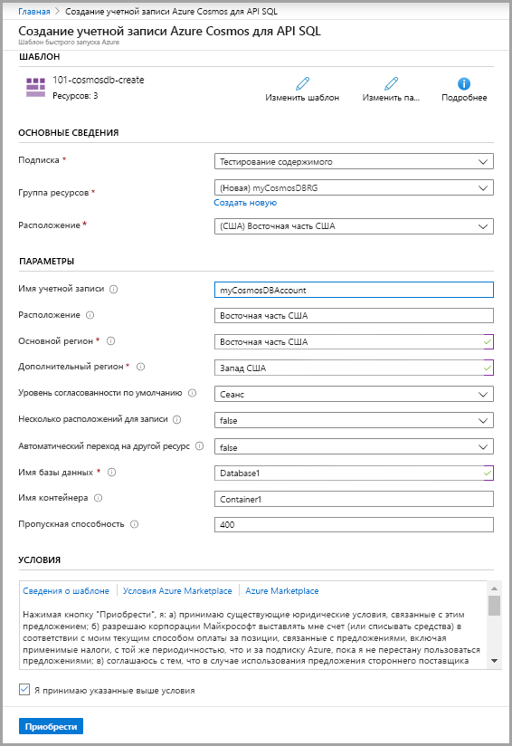
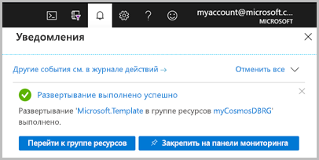

# <a name="quickstart-create-an-azure-cosmos-db-and-a-container-by-using-azure-resource-manager-template"></a>Краткое руководство. Создание Azure Cosmos DB и контейнера с помощью шаблона Azure Resource Manager

Azure Cosmos DB — это глобально распределенная многомодельная служба базы данных Майкрософт. С помощью Azure Cosmos DB вы можете быстро создавать базы данных с парами "ключ — значение", документами, графами и обращаться к ним. В этом кратком руководстве рассматривается развертывание шаблона Resource Manager для создания базы данных Azure Cosmos DB и контейнера в ней. Впоследствии в этом контейнере можно будет хранить данные.

[!INCLUDE [About Azure Resource Manager](../../includes/resource-manager-quickstart-introduction.md)]

Если у вас еще нет подписки Azure, [создайте бесплатную учетную запись](https://azure.microsoft.com/free/?WT.mc_id=A261C142F), прежде чем начинать работу.

## <a name="prerequisites"></a>Предварительные требования

Подписка Azure или бесплатная пробная учетная запись Azure Cosmos DB.

- [!INCLUDE [quickstarts-free-trial-note](../../includes/quickstarts-free-trial-note.md)]

- [!INCLUDE [cosmos-db-emulator-docdb-api](../../includes/cosmos-db-emulator-docdb-api.md)]

## <a name="create-an-azure-cosmos-account-database-container"></a>Создание учетной записи, базы данных и контейнера Azure Cosmos DB

### <a name="review-the-template"></a>Изучение шаблона

Шаблон, используемый в этом кратком руководстве, взят из [шаблонов быстрого запуска Azure](https://azure.microsoft.com/resources/templates/101-cosmosdb-create/).

:::code language="json" source="~/quickstart-templates/101-cosmosdb-create/azuredeploy.json":::

В шаблоне определены три ресурса Azure:

* [Microsoft.DocumentDB/databaseAccounts](/azure/templates/microsoft.documentdb/databaseaccounts) — создает учетную запись Azure Cosmos DB.

* [Microsoft.DocumentDB/databaseAccounts/sqlDatabases](/azure/templates/microsoft.documentdb/databaseaccounts/sqldatabases) — создает базу данных Azure Cosmos DB.

* [Microsoft.DocumentDB/databaseAccounts/sqlDatabases/containers](/azure/templates/microsoft.documentdb/databaseaccounts/sqldatabases/containers) — создает контейнер Azure Cosmos DB.

Другие примеры шаблонов Azure Cosmos DB можно найти в [коллекции шаблонов быстрого запуска Azure](https://azure.microsoft.com/resources/templates/?resourceType=Microsoft.Documentdb).

### <a name="deploy-the-template"></a>Развертывание шаблона

1. Выберите следующее изображение, чтобы войти на портал Azure и открыть шаблон. Шаблон создаст учетную запись, базу данных и контейнер Azure Cosmos DB.

   <a href="https://portal.azure.com/#create/Microsoft.Template/uri/https%3A%2F%2Fraw.githubusercontent.com%2FAzure%2Fazure-quickstart-templates%2Fmaster%2F101-cosmosdb-create%2Fazuredeploy.json"></a>

2. Введите или выберите следующие значения.

   

    Если значение не указано, используйте значения по умолчанию для создания ресурсов Azure Cosmos DB.

    * **Подписка**. Выберите нужную подписку Azure.
    * **Группа ресурсов**. Щелкните **Создать**, введите уникальное имя новой группы ресурсов и нажмите кнопку **ОК**.
    * **Расположение**. Выберите расположение.  Например, **центральная часть США**.
    * **Имя учетной записи**. Имя учетной записи Azure Cosmos DB. Оно должно быть глобально уникальным.
    * **Расположение**. Введите расположение, в котором вы хотите создать учетную запись Azure Cosmos DB. Это может быть то же расположение, в котором размещена группа ресурсов.
    * **Основной регион**. Регион первичной реплики для учетной записи Azure Cosmos DB.
    * **Дополнительный регион**. Регион вторичной реплики для учетной записи Azure Cosmos DB.
    * **Имя базы данных**: имя базы данных Azure Cosmos DB.
    * **Имя контейнера**: имя контейнера Azure Cosmos DB.
    * **Пропускная способность**.  Пропускная способность контейнера, минимальное значение — 400 единиц запросов в секунду.
    * **I agree to the terms and conditions state above** (Я принимаю указанные выше условия). Установите этот флажок.

3. Щелкните **Приобрести**. После успешного развертывания учетной записи Azure Cosmos DB вы получите такое уведомление:

   

Для развертывания шаблона используется портал Azure. В дополнение к порталу Azure можно также использовать Azure PowerShell, Azure CLI и REST API. Дополнительные сведения о других методах развертывания см. в статье о [развертывании с использованием шаблонов](../azure-resource-manager/templates/deploy-powershell.md).

## <a name="validate-the-deployment"></a>Проверка развертывания

Вы можете проверить учетную запись, базу данных и контейнер Azure Cosmos DB на портале Azure или просмотреть созданный секрет, используя следующий скрипт Azure CLI или Azure PowerShell.

# <a name="cli"></a>[CLI](#tab/CLI)

```azurecli-interactive
echo "Enter your Azure Cosmos account name:" &&
read cosmosAccountName &&
echo "Enter the resource group where the Azure Cosmos account exists:" &&
read resourcegroupName &&
az cosmosdb show -g $resourcegroupName -n $cosmosAccountName
```

# <a name="powershell"></a>[PowerShell](#tab/PowerShell)

```azurepowershell-interactive
$resourceGroupName = Read-Host -Prompt "Enter the resource group name where your Azure Cosmos account exists"
(Get-AzResource -ResourceType "Microsoft.DocumentDB/databaseAccounts" -ResourceGroupName $resourceGroupName).Name
 Write-Host "Press [ENTER] to continue..."
```

---

## <a name="clean-up-resources"></a>Очистка ресурсов

Если вы планируете продолжить работу с последующими учебниками, эти ресурсы можно не удалять.
Удалите группу ресурсов, если она больше не нужна. Учетная запись Azure Cosmos DB и связанные ресурсы будут также удалены. Чтобы удалить группу ресурсов с помощью Azure CLI или Azure PowerShell, выполните следующие действия.

# <a name="cli"></a>[CLI](#tab/CLI)

```azurecli-interactive
echo "Enter the Resource Group name:" &&
read resourceGroupName &&
az group delete --name $resourceGroupName &&
echo "Press [ENTER] to continue ..."
```

# <a name="powershell"></a>[PowerShell](#tab/PowerShell)

```azurepowershell-interactive
$resourceGroupName = Read-Host -Prompt "Enter the Resource Group name"
Remove-AzResourceGroup -Name $resourceGroupName
Write-Host "Press [ENTER] to continue..."
```

---

## <a name="next-steps"></a>Дальнейшие действия

Работая с этим кратким руководством, вы создали учетную запись, базу данных и контейнер Azure Cosmos DB с помощью шаблона Azure Resource Manager и проверили развертывание. Дополнительные сведения об Azure Cosmos DB и Azure Resource Manager см. в статьях ниже.

- Ознакомьтесь с [обзором Azure Cosmos DB](introduction.md).
- Сведения об [Azure Resource Manager](../azure-resource-manager/management/overview.md)
- Получите другие [шаблоны Azure Resource Manager для Azure Cosmos DB](resource-manager-samples.md).