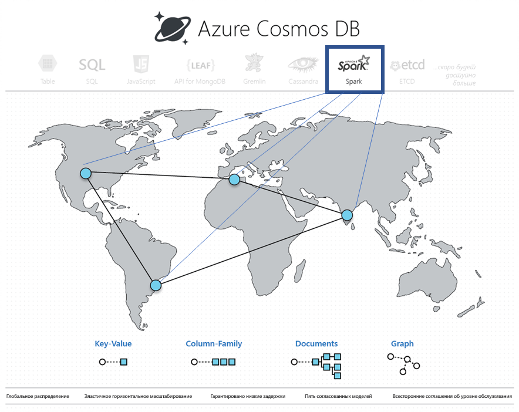

# Встроенная операционная аналитика в Azure Cosmos DB с использованием Apache Spark

Запускайте глобально распределенную аналитику с минимальной задержкой и средства ИИ для транзакционных данных в Azure Cosmos DB. Благодаря встроенной поддержке для записных книжек Apache Spark и Jupyter Azure Cosmos DB помогает сократить время получения аналитических ведений. Потому что данные поступают, обрабатываются и анализируются по реплике локальной базы данных в регионе Azure. Вы можете выполнять запросы Apache Spark непосредственно к индексированным мультимодельным данным, хранящимся в разделах данных.

Встроенная поддержка Apache Spark в Azure Cosmos DB позволяет запускать из Apache Spark аналитику данных, которые хранятся в учетной записи Azure Cosmos. Azure Cosmos DB предоставляет собственную поддержку для заданий Apache Spark, что позволяет выполнять их непосредственно в глобально распределенных базах данных Cosmos. Благодаря таким возможностям разработчики, инженеры данных и специалисты по анализу данных могут использовать Azure Cosmos DB как гибкую, масштабируемую и высокопроизводительную платформу данных для рабочих нагрузок **OLTP и OLAP/HTAP**.

Поддержка Apache Spark в Azure Cosmos DB предоставляет следующие преимущества.

* Вы обеспечите анализ для географически распределенных пользователей и данных за минимальное время.

* Вы сможете упростить архитектуру решения и снизить [совокупную стоимость владения](total-cost-ownership.md). Для системы потребуется минимальное число компонентов для обработки данных, и вы сможете избежать лишнего перемещения данных между ними.

* Создает границу в системе для охвата всех управляемых данных, что упрощает обеспечение [безопасности](secure-access-to-data.md), соблюдение [соответствия](compliance.md) и выполнение аудита.

* Предоставляет конечным пользователям систему аналитики с постоянной доступностью или [высоким уровнем доступности](high-availability.md) с соблюдением строгих соглашений об уровне обслуживания.

 
С помощью поддержки Apache Spark в Azure Cosmos DB вы можете создавать и развертывать решения с такими технологиями, как искусственный интеллект и модели глубокого обучения, прогнозная аналитика, рекомендации, Интернет вещей, Customer 360, обнаружение мошенничества, анализ тональности текста и анализ сведений о посещении сайта. Все эти решения напрямую работают с данными в Azure Cosmos DB.

Вы можете настроить пакетные и потоковые задания ETL для Azure Cosmos DB, не выходя за рамки службы базы данных и не добавляя дополнительные службы вычислений. Вы можете гибко масштабировать вычислительную среду, если требуется выполнить задание ETL, а затем уменьшать масштаб после его завершения.

Поддержка Apache Spark в Azure Cosmos DB обеспечивает собственную поддержку машинного обучения в средах выполнения Apache Spark. Сюда входят Spark MLLib, Машинное обучение Майкрософт для Spark, Машинное обучение Azure и Cognitive Services. Благодаря такому набору функций специалисты по обработке и анализу данных могут за короткие сроки и с низкими затратами создавать и вводить в эксплуатацию модели машинного обучения непосредственно в Azure Cosmos DB.

## Основные преимущества

### Система операционной аналитики и искусственного интеллекта с низкой задержкой

Применив Apache Spark к глобально распределенной базе данных Azure Cosmos, вы сможете быстро получать аналитические сведения по всему миру. Azure Cosmos DB обеспечивает **глобально распределенную операционную аналитику с низкой задержкой** и эластичным масштабированием, реализуя три основных методики:

* База данных Azure Cosmos глобально распределена, а значит все данные принимаются локально по месту нахождения поставщика данных (например, пользователей приложения). Запросы обслуживаются в ближайших локальных репликах как для поставщиков, так и для потребителей данных, независимо от их расположения.

* Все аналитические запросы выполняются непосредственно по индексированным данным в разделах данных, без их излишнего перемещения.

* Поскольку решение Spark размещено совместно с Azure Cosmos DB, снижается количество промежуточных преобразований и перемещений данных, что повышает производительность и масштабируемость системы.

* Все основные функции Azure Cosmos DB, такие как несколько источников, автоматический переход на другой ресурс, зоны доступности и т. д., доступны для встроенной Apache Spark в Azure Cosmos DB.

### Унифицированное бессерверное взаимодействие для Apache Spark

Многомодельная база данных Azure Cosmos DB расширяет поддержку интерфейсов API OSS, предоставляя **унифицированное бессерверное взаимодействие для Apache Spark** с поддержкой моделей данных для пар "ключ-значение", документов, графов и семейств столбцов. Поддерживаются разные модели данных с использованием API-интерфейсов MongoDB, Cassandra, Gremlin, Etcd и SQL, каждый из которых обрабатывает один набор базовых данных. 

Благодаря поддержке в Azure Cosmos DB доступна собственная поддержка приложений на языках Scala, Python и Java, а также несколько тесно интегрированных библиотек для SQL. Эти библиотеки поддерживают работу с SQL ([Spark SQL](https://spark.apache.org/sql/)), машинным обучением (Spark [MLlib](https://spark.apache.org/mllib/)), потоковой обработкой ([Структурированная потоковая передача Spark](https://spark.apache.org/streaming/)) и графами (Spark [GraphFrames]( https://docs.databricks.com/spark/latest/graph-analysis/graphframes/user-guide-python.html)). Эти инструменты облегчают применение Apache Spark для разных вариантов использования. Вам не придется отвлекаться на управление Spark или кластерами Spark. Вы можете использовать хорошо знакомые API-интерфейсы Apache Spark и **записные книжки Jupyter** для аналитики, а также API SQL или любой другой API OSS NoSQL (например, Cassandra) для одновременной транзакционной обработки одного набора базовых данных.

### Отсутствие необходимости управлять схемами или индексами

В отличие от традиционных аналитических баз данных, Azure Cosmos DB освобождает специалистов по обработке и анализу данных от управления громоздкими схемами и индексами. Ядро СУБД в Azure Cosmos DB не требует явных операций со схемами и (или) индексами, а также может автоматически индексировать все принимаемые данные и быстро обрабатывать запросы Apache Spark.

### Варианты согласованности

Так как задания Apache Spark выполняются в разделах данных в базе данных Azure Cosmos, для запросов могут соблюдаться [пять четко определенных вариантов согласованности](consistency-levels.md). Эти модели согласованности обеспечивают гибкость при выборе строгости согласованности и позволяют получить оптимальную точность алгоритмов машинного обучения без повышения задержки и ухудшения уровня доступности.

### Полный спектр соглашений об уровне обслуживания

На задания Apache Spark распространяются те же гарантии, что и на Azure Cosmos DB, с применением лучших в отрасли комплексных [соглашений об уровне обслуживания](https://azure.microsoft.com/support/legal/sla/documentdb/v1_1/) (с уровнем доступности 99,999) без дополнительных расходов на управление отдельными кластерами Apache Spark. Эти соглашения об уровне обслуживания предусматривают высокую пропускную способность, задержку на уровне 99-го процентиля, согласованность и высокий уровень доступности. 

### Смешанные рабочие и аналитические рабочие нагрузки с полной изоляцией

Интеграция Apache Spark с Azure Cosmos DB устраняет пропасть между транзакционными и аналитическими операциями, которая долго оставалась одной из самых проблемных точек для клиентов при создании облачных приложений в глобальном масштабе. Рабочие нагрузки OLTP и OLAP выполняются параллельно и не мешают друг другу.

### Аналитическое и транзакционное хранилище с низкой задержкой

Azure Cosmos DB изначально хранит данные на двух различных уровнях хранилища: транзакционном (со строковой ориентацией) и аналитическом (со столбчатой ориентацией, в формате файлов Apache Parquet). Он реплицирует данные на каждом уровне в глобальном масштабе и позволяет пользователям независимо управлять данными на этих уровнях на основе политик периода удержания.

Эта архитектура хранилища обеспечивает как критически важные, так и аналитические рабочие нагрузки на одни и те же глобально распределенные данные. С Cosmos DB вам не нужны операции извлечения, преобразования и загрузки или ненужные перемещения данных. Для одних и тех же базовых данных можно просто запустить как транзакционные, так и аналитические рабочие нагрузки. В транзакционных рабочих нагрузках могут использоваться привычные API-адреса доступа к транзакциям, включая SQL, Cassandra, MongoDB, Gremlin и Etcd. В то время, как в аналитических рабочих нагрузках и рабочих нагрузках ИИ могут использоваться встроенные Apache Spark SQL, платформы ML и все цепочки инструментов Apache Spark.

### Моментальные снимки и архивные аналитические данные запросов

Вы можете создавать моментальные снимки сжатых данных в столбцах, хранящихся на аналитическом уровне, по требованию или по расписанию, чтобы выполнять аналитические запросы непосредственно к конкретному моментальному снимку. Эта функция позволяет получать обратные сигналы или аналитические запросы во времени, откаты, полные архивные журналы аудита, а также воспроизводимые результаты машинного обучения и экспериментов с искусственным интеллектом.

## Дополнительная информация

* Чтобы узнать о преимуществах Azure Cosmos DB, изучите [эту обзорную статью](introduction.md).
* [API Azure Cosmos DB для MongoDB](mongodb-introduction.md)
* [Знакомство с API Cassandra для Azure Cosmos DB](cassandra-introduction.md)
* [Знакомство с Azure Cosmos DB: API Gremlin](graph-introduction.md)
* [Знакомство с Azure Cosmos DB. API таблиц](table-introduction.md)