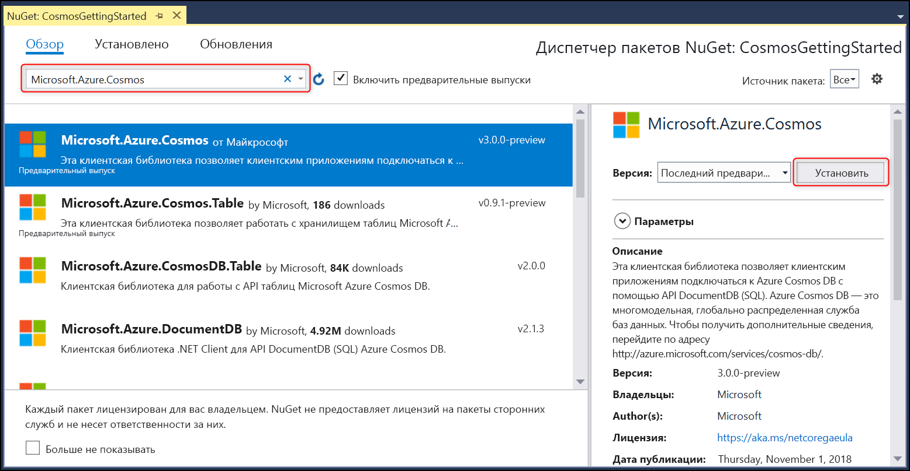

# <a name="build-a-net-console-app-to-manage-data-in-azure-cosmos-db-sql-api-account-sdk-version-3-preview"></a>Создание консольного приложения .NET для управления данными в учетной записи API SQL Azure Cosmos DB (предварительная версия 3 пакета SDK)

> [!div class="op_single_selector"]
> * [.NET (предварительная версия)](sql-api-dotnet-get-started-preview.md)
> * [.NET](sql-api-get-started.md)
> * [.NET Core](sql-api-dotnetcore-get-started.md)
> * [.NET Core (предварительная версия)](sql-api-dotnet-core-get-started-preview.md)
> * [Java](sql-api-java-get-started.md)
> * [Async Java](sql-api-async-java-get-started.md)
> * [Node.js](sql-api-nodejs-get-started.md)
> 

Давайте приступим к обзору API SQL службы Azure Cosmos DB. После изучения этого руководства у вас будет консольное приложение, которое создает ресурсы Azure Cosmos DB и отправляет запросы к ним. Для работы с этим руководством используется [версия 3.0 и более поздние](https://www.nuget.org/packages/Microsoft.Azure.Cosmos) пакета SDK Azure Cosmos DB .NET, предназначенного для [.NET Standard 2.0.](https://docs.microsoft.com/dotnet/standard/net-standard)

Темы, рассматриваемые в этом руководстве:

> [!div class="checklist"]
> * создание учетной записи Azure Cosmos и подключение к ней;
> * настройка проекта в Visual Studio;
> * создание базы данных и контейнера;
> * добавление элементов в контейнер;
> * выполнение запросов контейнера;
> * выполнение операций CRUD с элементом;
> * удаление базы данных.

У вас нет времени? Не беспокойтесь! Полное решение доступно на [GitHub](https://github.com/Azure-Samples/cosmos-dotnet-getting-started). Краткие инструкции см. в разделе [Получение полного решения для этого руководства](#GetSolution).

А теперь приступим к работе!

## <a name="prerequisites"></a>Предварительные требования

* Активная учетная запись Azure. Если у вас ее нет, зарегистрируйте [бесплатную учетную запись](https://azure.microsoft.com/free/). 

  [!INCLUDE [cosmos-db-emulator-docdb-api](../../includes/cosmos-db-emulator-docdb-api.md)]

* [!INCLUDE [cosmos-db-emulator-vs](../../includes/cosmos-db-emulator-vs.md)]

## <a name="step-1-create-an-azure-cosmos-db-account"></a>Шаг 1. создание учетной записи Azure Cosmos DB;
Давайте создадим учетную запись Azure Cosmos DB. Если у вас уже есть учетная запись, которую вы собираетесь использовать, можно перейти к шагу [Настройка решения Visual Studio](#SetupVS). Если вы используете эмулятор Azure Cosmos DB, выполните действия, описанные в статье об [эмуляторе Azure Cosmos DB](local-emulator.md), чтобы его настроить и сразу перейти к [настройке проекта Visual Studio](#SetupVS).

[!INCLUDE [create-dbaccount-preview](../../includes/cosmos-db-create-dbaccount-preview.md)]

## <a id="SetupVS"></a>Шаг 2. Настройка проекта Visual Studio
1. Откройте **Visual Studio 2017** у себя на компьютере.
1. В меню **Файл** выберите пункт **Создать**, а затем — **Проект**.
1. В диалоговом окне **Новый проект** выберите **Visual C#** / **Консольное приложение (.NET Framework)**, а затем укажите имя проекта и нажмите кнопку **ОК**.
    
1. В **обозревателе решений** щелкните правой кнопкой мыши новое консольное приложение (оно находится в решении Visual Studio). Затем щелкните **Управление пакетами NuGet...**
    
    
1. На вкладке **NuGet** щелкните **Обзор** и в поле поиска введите **Microsoft.Azure.Cosmos**. Не забудьте установить флажок *Include prelease* (Включить предварительную версию), чтобы найти предварительную версию.
1. В результатах найдите **Microsoft.Azure.Cosmos** и щелкните **Установить**.
   Идентификатором пакета для клиентской библиотеки API SQL Azure Cosmos DB является [Microsoft Azure Cosmos DB Client Library](https://www.nuget.org/packages/Microsoft.Azure.Cosmos/).
   

    Если появится сообщение о просмотре изменений в решении, нажмите кнопку **ОК**. Если появится сообщение о принятии условий лицензионного соглашения, щелкните **Принимаю**.

Отлично! Теперь, когда мы завершили настройку, начнем писать код. Вы можете найти проект готового кода для этого руководства в [GitHub](https://github.com/Azure-Samples/cosmos-dotnet-getting-started).

## <a id="Connect"></a> Шаг 3. Подключение к учетной записи Azure Cosmos DB
1. Во-первых, замените ссылки в начале приложения C# в файле **Program.cs** на такие:

   ```csharp
   using System;
   using System.Threading.Tasks;
   using System.Configuration;
   using Microsoft.Azure.Cosmos;
   using System.Collections.Generic;
   using System.Net;
   ```

1. Теперь добавьте эти константы и переменные в открытый класс ``Program``.
    ```csharp
    public class Program
    {
        // ADD THIS PART TO YOUR CODE

        // The Azure Cosmos DB endpoint for running this sample.
        private static readonly string EndpointUri = "<your endpoint here>";
        // The primary key for the Azure Cosmos account.
        private static readonly string PrimaryKey = "<your primary key>";

        // The Cosmos client instance
        private CosmosClient cosmosClient;

        // The database we will create
        private CosmosDatabase database;

        // The container we will create.
        private CosmosContainer container;

        // The name of the database and container we will create
        private string databaseId = "FamilyDatabase";
        private string containerId = "FamilyContainer";
    }
    ```
    Обратите внимание, что если вам знакома предыдущая версия пакета SDK для .NET, вы уже видели термины "коллекция" и "документ". Так как Azure Cosmos DB поддерживает несколько моделей API, версия 3.0+ пакета SDK для .NET использует общие термины "контейнер" и "элемент". Контейнер может представлять собой коллекцию, граф или таблицу. Элемент может представлять собой документ, ребро, вершину или запись и является содержимым внутри контейнера. [Подробнее о базах данных, контейнерах и элементах.](databases-containers-items.md)

1. Получите URL-адрес конечной точки и первичный ключ на [портале Azure](https://portal.azure.com).

    На портале Azure перейдите к учетной записи Azure Cosmos DB, а затем щелкните **Ключи**.

    Скопируйте универсальный код ресурса (URI) с портала и вставьте его в параметр `<your endpoint URL>` в файле ```Program.cs```. Скопируйте на портале значение поля "Первичный ключ" и вставьте его в параметр `<your primary key>`.

   

1. Далее мы создадим новый экземпляр ```CosmosClient``` и настроим формирование шаблонов для нашей программы.

    В методе **Main** добавьте новую асинхронную задачу с именем **GetStartedDemoAsync**, которая создает экземпляр ```CosmosClient```. Мы будем использовать **GetStartedDemoAsync** в качестве точки входа, которая вызывает методы для работы с ресурсами Azure Cosmos DB.

    ```csharp
    public static async Task Main(string[] args)
    {
    }

    // ADD THIS PART TO YOUR CODE
    /*
        Entry point to call methods that operate on Azure Cosmos DB resources in this sample
    */   
    public async Task GetStartedDemoAsync()
    {
        // Create a new instance of the Cosmos Client
        this.cosmosClient = new CosmosClient(EndpointUri, PrimaryKey);
    }
    ```

1. Добавьте указанный далее код, чтобы запустить асинхронную задачу **GetStartedDemoAsync** из метода **Main**. Метод **Main** будет перехватывать исключения и записывать их в консоли.
    ```csharp
    public static async Task Main(string[] args)
    {
        // ADD THIS PART TO YOUR CODE
        try
        {
            Console.WriteLine("Beginning operations...\n");
            Program p = new Program();
            await p.GetStartedDemoAsync();
        }
        catch (CosmosException de)
        {
            Exception baseException = de.GetBaseException();
            Console.WriteLine("{0} error occurred: {1}\n", de.StatusCode, de);
        }
        catch (Exception e)
        {
            Console.WriteLine("Error: {0}\n", e);
        }
        finally
        {
            Console.WriteLine("End of demo, press any key to exit.");
            Console.ReadKey();
        }
    }
    ```

1. Нажмите клавишу **F5**, чтобы запустить приложение. Результаты в окне консоли отображают сообщение `End of demo, press any key to exit.`. Это означает, что подключение к Azure Cosmos DB установлено. Теперь можно закрыть окно консоли. 

Поздравляем! Вы успешно подключились к учетной записи Azure Cosmos DB. 

## <a name="step-4-create-a-database"></a>Шаг 4. Создание базы данных
Вы можете создать базу данных с помощью метода [**CreateDatabaseIfNotExistsAsync**](/dotnet/api/microsoft.azure.cosmos.cosmosclient.createdatabaseifnotexistsasync) или функции [**CreateDatabaseAsync**](/dotnet/api/microsoft.azure.cosmos.cosmosclient.createdatabaseasync) класса ``CosmosDatabases``. База данных представляет собой логический контейнер элементов, разделенных между контейнерами.
    
1. Скопируйте и вставьте метод **CreateDatabase** ниже метода **GetStartedDemoAsync**. Функция **CreateDatabase** создаст базу данных с идентификатором ``FamilyDatabase``, указанным в поле ``databaseId``, если она не была создана ранее. 

    ```csharp
    /*
        Create the database if it does not exist
    */    
    private async Task CreateDatabase()
    {
        // Create a new database
        this.database = await this.cosmosClient.Databases.CreateDatabaseIfNotExistsAsync(databaseId);
        Console.WriteLine("Created Database: {0}\n", this.database.Id);
    }
    ```

1. Скопируйте и вставьте приведенный ниже код, где вы создали экземпляр CosmosClient, для вызова добавленного метода **CreateDatabase**.

    ```csharp
    public async Task GetStartedDemoAsync()
    {
        // Create a new instance of the Cosmos Client
        this.cosmosClient = new CosmosClient(EndpointUri, PrimaryKey);

        //ADD THIS PART TO YOUR CODE
        await this.CreateDatabase(); 
    }
    ```

    На этом этапе ваш код должен выглядеть следующим образом с заполненными значениями конечной точки и первичного ключа.
    ```csharp
    using System;
    using System.Threading.Tasks;
    using System.Configuration;
    using Microsoft.Azure.Cosmos;
    using System.Collections.Generic;
    using System.Net;

    namespace CosmosGettingStarted
    {
        class Program
        {
            // The Azure Cosmos DB endpoint for running this sample.
            private static readonly string EndpointUri = "<your endpoint here>";
            // The primary key for the Azure Cosmos account.
            private static readonly string PrimaryKey = "<your primary key>";

            // The Cosmos client instance
            private CosmosClient cosmosClient;
        
            // The database we will create
            private CosmosDatabase database;

            // The container we will create.
            private CosmosContainer container;

            // The name of the database and container we will create
            private string databaseId = "FamilyDatabase";
            private string containerId = "FamilyContainer";

            public static async Task Main(string[] args)
            {
                try
                {
                    Console.WriteLine("Beginning operations...");
                    Program p = new Program();
                    await p.GetStartedDemoAsync();
                }
                catch (CosmosException de)
                {
                    Exception baseException = de.GetBaseException();
                    Console.WriteLine("{0} error occurred: {1}\n", de.StatusCode, de);
                }
                catch (Exception e)
                {
                    Console.WriteLine("Error: {0}\n", e);
                }
                finally
                {
                    Console.WriteLine("End of demo, press any key to exit.");
                    Console.ReadKey();
                }
            }

            /*
                Entry point to call methods that operate on Azure Cosmos DB resources in this sample
            */
            public async Task GetStartedDemoAsync()
            {
                // Create a new instance of the Cosmos Client
                this.cosmosClient = new CosmosClient(EndpointUri, PrimaryKey);
                await this.CreateDatabase();
            }

            /*
                Create the database if it does not exist
            */    
            private async Task CreateDatabase()
            {
                // Create a new database
                this.database = await this.cosmosClient.Databases.CreateDatabaseIfNotExistsAsync(databaseId);
                Console.WriteLine("Created Database: {0}\n", this.database.Id);
            }
        }
    }
    ```

Нажмите клавишу **F5**, чтобы запустить приложение.

Поздравляем! Вы успешно создали базу данных Azure Cosmos DB.  

## <a id="CreateColl"></a>Шаг 5. Создание контейнера
> [!WARNING]
> При вызове метода **CreateContainerIfNotExistsAsync** будет создан контейнер с ценовыми требованиями. Дополнительные сведения см. на нашей [странице цен](https://azure.microsoft.com/pricing/details/cosmos-db/).
> 
> 

Контейнер можно создать с помощью метода [**CreateContainerIfNotExistsAsync**](/dotnet/api/microsoft.azure.cosmos.database.createcontainerifnotexistsasync) или функции [**CreateContainerAsync**](/dotnet/api/microsoft.azure.cosmos.database.createcontainerasync) из класса **CosmosContainers**. Контейнер состоит из элементов (которые в случае API SQL являются документами JSON) и связанной логики приложения JavaScript на стороне сервера, например хранимые процедуры, определяемые пользователем функции и триггеры.

1. Скопируйте и вставьте метод **CreateContainer** ниже метода **CreateDatabase**. Функция **CreateContainer** создаст контейнер с идентификатором ``FamilyContainer``, указанным в поле ``containerId``, если она не была создана ранее. 

    ```csharp
    /*
        Create the container if it does not exist. 
        Specify "/LastName" as the partition key since we're storing family information, to ensure good distribution of requests and storage.
    */
    private async Task CreateContainer()
    {
        // Create a new container
        this.container = await this.database.Containers.CreateContainerIfNotExistsAsync(containerId, "/LastName");
        Console.WriteLine("Created Container: {0}\n", this.container.Id);
    }
    ```

1. Скопируйте и вставьте приведенный ниже код, где вы создали экземпляр CosmosClient, для вызова добавленного метода **CreateContainer**.

    ```csharp
    public async Task GetStartedDemoAsync()
    {
        // Create a new instance of the Cosmos Client
        this.cosmosClient = new CosmosClient(EndpointUri, PrimaryKey);
        await this.CreateDatabase(); 

        //ADD THIS PART TO YOUR CODE
        await this.CreateContainer();
    }
    ```
   Нажмите клавишу **F5**, чтобы запустить приложение.

Поздравляем! Вы успешно создали контейнер Azure Cosmos DB.  

## <a id="CreateDoc"></a>Шаг 6. Добавление элементов в контейнер
Элемент можно создать с помощью функции [**CreateItemAsync**](/dotnet/api/microsoft.azure.cosmos.container.createitemasync) класса **CosmosItems**. При использовании API SQL элементы проецируются как документы, которые являются содержимым JSON, определенным пользователем (произвольным). Теперь можно вставить элемент в ваш контейнер Azure Cosmos DB.

Сначала необходимо создать класс **Family**, который будет представлять объекты, хранящиеся в Azure Cosmos DB в этом примере. Мы также создадим подклассы **Parent**, **Child**, **Pet** и **Address**, используемые в классе **Family**. Обратите внимание, документы должны иметь свойство **Id**, сериализуемое как **id** в файле JSON. 
1. Выберите **Ctrl + Shift + A**, чтобы открыть диалоговое окно **Добавить новый элемент**. Добавьте в ваш проект новый класс **Family.cs**. 

    

1. Скопируйте и вставьте классы **Family**, **Parent**, **Child**, **Pet** и **Address** в **Family.cs**. 
    ```csharp
    using Newtonsoft.Json;

    namespace CosmosGettingStarted
    {
        public class Family
        {
            [JsonProperty(PropertyName = "id")]
            public string Id { get; set; }
            public string LastName { get; set; }
            public Parent[] Parents { get; set; }
            public Child[] Children { get; set; }
            public Address Address { get; set; }
            public bool IsRegistered { get; set; }
            public override string ToString()
            {
                return JsonConvert.SerializeObject(this);
            }
        }

        public class Parent
        {
            public string FamilyName { get; set; }
            public string FirstName { get; set; }
        }

        public class Child
        {
            public string FamilyName { get; set; }
            public string FirstName { get; set; }
            public string Gender { get; set; }
            public int Grade { get; set; }
            public Pet[] Pets { get; set; }
        }

        public class Pet
        {
            public string GivenName { get; set; }
        }

        public class Address
        {
            public string State { get; set; }
            public string County { get; set; }
            public string City { get; set; }
        }
    }
    ```
1. Перейдите к файлу **Program.cs** и добавьте метод **AddItemsToContainer** в свой метод **CreateContainer**. Перед созданием элемента код проверяет, нет ли элемента с таким же идентификатором. Мы вставим два элемента: по одному для семьи Андерсен и семьи Вейкфилд.

    ```csharp
    /*
        Add Family items to the container
    */
    private async Task AddItemsToContainer()
    {
        // Create a family object for the Andersen family
        Family andersenFamily = new Family
        {
            Id = "Andersen.1",
            LastName = "Andersen",
            Parents = new Parent[]
            {
                new Parent { FirstName = "Thomas" },
                new Parent { FirstName = "Mary Kay" }
            },
            Children = new Child[]
            {
                new Child
                {
                    FirstName = "Henriette Thaulow",
                    Gender = "female",
                    Grade = 5,
                    Pets = new Pet[]
                    {
                        new Pet { GivenName = "Fluffy" }
                    }
                }
            },
            Address = new Address { State = "WA", County = "King", City = "Seattle" },
            IsRegistered = true
        };

        // Read the item to see if it exists. Note ReadItemAsync will not throw an exception if an item does not exist. Instead, we check the StatusCode property off the response object. 
        CosmosItemResponse<Family> andersenFamilyResponse = await this.container.Items.ReadItemAsync<Family>(andersenFamily.LastName, andersenFamily.Id);

        if (andersenFamilyResponse.StatusCode == HttpStatusCode.NotFound)
        {
            // Create an item in the container representing the Andersen family. Note we provide the value of the partition key for this item, which is "Andersen"
            andersenFamilyResponse = await this.container.Items.CreateItemAsync<Family>(andersenFamily.LastName, andersenFamily);

            // Note that after creating the item, we can access the body of the item with the Resource property off the CosmosItemResponse. 
            //We can also access the RequestCharge property to see the amount of RUs consumed on this request.
            Console.WriteLine("Created item in database with id: {0} Operation consumed {1} RUs.\n", andersenFamilyResponse.Resource.Id, andersenFamilyResponse.RequestCharge);
        }
        else
        {
            Console.WriteLine("Item in database with id: {0} already exists\n", andersenFamilyResponse.Resource.Id);
        }

        // Create a family object for the Wakefield family
        Family wakefieldFamily = new Family
        {
            Id = "Wakefield.7",
            LastName = "Wakefield",
            Parents = new Parent[]
            {
                new Parent { FamilyName = "Wakefield", FirstName = "Robin" },
                new Parent { FamilyName = "Miller", FirstName = "Ben" }
            },
            Children = new Child[]
            {
                new Child
                {
                    FamilyName = "Merriam",
                    FirstName = "Jesse",
                    Gender = "female",
                    Grade = 8,
                    Pets = new Pet[]
                    {
                        new Pet { GivenName = "Goofy" },
                        new Pet { GivenName = "Shadow" }
                    }
                },
                new Child
                {
                    FamilyName = "Miller",
                    FirstName = "Lisa",
                    Gender = "female",
                    Grade = 1
                }
            },
            Address = new Address { State = "NY", County = "Manhattan", City = "NY" },
            IsRegistered = false
        };

        // Read the item to see if it exists
        CosmosItemResponse<Family> wakefieldFamilyResponse = await this.container.Items.ReadItemAsync<Family>(wakefieldFamily.LastName, wakefieldFamily.Id);

        if (wakefieldFamilyResponse.StatusCode == HttpStatusCode.NotFound)
        {
            // Create an item in the container representing the Wakefield family. Note we provide the value of the partition key for this item, which is "Wakefield"
            wakefieldFamilyResponse = await this.container.Items.CreateItemAsync<Family>(wakefieldFamily.LastName, wakefieldFamily);

            // Note that after creating the item, we can access the body of the item with the Resource property off the CosmosItemResponse. 
            //We can also access the RequestCharge property to see the amount of RUs consumed on this request.
            Console.WriteLine("Created item in database with id: {0} Operation consumed {1} RUs.\n", wakefieldFamilyResponse.Resource.Id, wakefieldFamilyResponse.RequestCharge);
        }
        else
        {
            Console.WriteLine("Item in database with id: {0} already exists\n", wakefieldFamilyResponse.Resource.Id);
        }
    }
    ```
1. Добавьте вызов в ``AddItemsToContainer`` в метод ``GetStartedDemoAsync``.

    ```csharp
    public async Task GetStartedDemoAsync()
    {
        // Create a new instance of the Cosmos Client
        this.cosmosClient = new CosmosClient(EndpointUri, PrimaryKey);
        await this.CreateDatabase(); 
        await this.CreateContainer();

        //ADD THIS PART TO YOUR CODE
        await this.AddItemsToContainer();
    }
    ```

Нажмите клавишу **F5**, чтобы запустить приложение.

Поздравляем! Вы успешно создали два элемента Azure Cosmos DB.  


## <a id="Query"></a>Шаг 7. Запрашивание ресурсов Azure Cosmos DB
Azure Cosmos DB поддерживает [полнофункциональные запросы](sql-api-sql-query.md) к документам JSON, хранящимся в каждой коллекции. В следующем примере кода показано, как выполнить запрос к элементам, вставленным на предыдущем шаге.

1. Скопируйте и вставьте метод **RunQuery** ниже метода **AddItemsToContainer**.

    ```csharp
    /*
        Run a query (using Azure Cosmos DB SQL syntax) against the container
    */
    private async Task RunQuery()
    {
        var sqlQueryText = "SELECT * FROM c WHERE c.LastName = 'Andersen'";
        var partitionKeyValue = "Andersen";

        Console.WriteLine("Running query: {0}\n", sqlQueryText);

        CosmosSqlQueryDefinition queryDefinition = new CosmosSqlQueryDefinition(sqlQueryText);
        CosmosResultSetIterator<Family> queryResultSetIterator = this.container.Items.CreateItemQuery<Family>(queryDefinition, partitionKeyValue);

        List<Family> families = new List<Family>();

        while (queryResultSetIterator.HasMoreResults)
        {
            CosmosQueryResponse<Family> currentResultSet = await queryResultSetIterator.FetchNextSetAsync();
            foreach (Family family in currentResultSet)
            {
                families.Add(family);
                Console.WriteLine("\tRead {0}\n", family);
            }
        }
    }
    ```
1. Добавьте вызов в ``RunQuery`` в метод ``GetStartedDemoAsync``.

    ```csharp
    public async Task GetStartedDemoAsync()
    {
        // Create a new instance of the Cosmos Client
        this.cosmosClient = new CosmosClient(EndpointUri, PrimaryKey);
        await this.CreateDatabase(); 
        await this.CreateContainer();
        await this.AddItemsToContainer();

        //ADD THIS PART TO YOUR CODE
        await this.RunQuery();
    }
    ```

Нажмите клавишу **F5**, чтобы запустить приложение.

Поздравляем! Вы успешно выполнили запрос контейнера Azure Cosmos DB.

## <a id="ReplaceItem"></a>Шаг 8. Замена элемента JSON
Теперь мы будем обновлять элемент в Azure Cosmos DB.

1. Скопируйте и вставьте метод **ReplaceFamilyItem** ниже метода **RunQuery**. Обратите внимание, что мы меняем свойство ``IsRegistered`` семейства и параметр ``Grade`` одного из дочерних элементов.
    ```csharp
    /*
    Update an item in the container
    */
    private async Task ReplaceFamilyItem()
    {
        CosmosItemResponse<Family> wakefieldFamilyResponse = await this.container.Items.ReadItemAsync<Family>("Wakefield", "Wakefield.7");
        var itemBody = wakefieldFamilyResponse.Resource;
        
        // update registration status from false to true
        itemBody.IsRegistered = true;
        // update grade of child
        itemBody.Children[0].Grade = 6;

        // replace the item with the updated content
        wakefieldFamilyResponse = await this.container.Items.ReplaceItemAsync<Family>(itemBody.LastName, itemBody.Id, itemBody);
        Console.WriteLine("Updated Family [{0},{1}]\n. Body is now: {2}\n", itemBody.LastName, itemBody.Id, wakefieldFamilyResponse.Resource);
    }
    ```
1. Добавьте вызов в ``ReplaceFamilyItem`` в метод ``GetStartedDemo``.

    ```csharp
    public async Task GetStartedDemoAsync()
    {
        // Create a new instance of the Cosmos Client
        this.cosmosClient = new CosmosClient(EndpointUri, PrimaryKey);
        await this.CreateDatabase(); 
        await this.CreateContainer();
        await this.AddItemsToContainer();
        await this.RunQuery();

        //ADD THIS PART TO YOUR CODE
        await this.ReplaceFamilyItem();
    }
    ```
   Нажмите клавишу **F5**, чтобы запустить приложение.

Поздравляем! Вы успешно заменили элемент Azure Cosmos DB.

## <a id="DeleteDocument"></a>Шаг 9. Удаление элемента
Теперь мы будем удалять элемент в Azure Cosmos DB.

1. Скопируйте и вставьте метод **DeleteFamilyItem** под **ReplaceFamilyItem**.
    ```csharp
    /*
    Delete an item in the container
    */
    private async Task DeleteFamilyItem()
    {
        var partitionKeyValue = "Wakefield";
        var familyId = "Wakefield.7";

        // Delete an item. Note we must provide the partition key value and id of the item to delete
        CosmosItemResponse<Family> wakefieldFamilyResponse = await this.container.Items.DeleteItemAsync<Family>(partitionKeyValue, familyId);
        Console.WriteLine("Deleted Family [{0},{1}]\n", partitionKeyValue, familyId);
    }
    ```
1. Добавьте вызов в ``DeleteFamilyItem`` в метод ``GetStartedDemo``.

    ```csharp
    public async Task GetStartedDemoAsync()
    {
        // Create a new instance of the Cosmos Client
        this.cosmosClient = new CosmosClient(EndpointUri, PrimaryKey);
        await this.CreateDatabase(); 
        await this.CreateContainer();
        await this.AddItemsToContainer();
        await this.RunQuery();
        await this.ReplaceFamilyItem();

        //ADD THIS PART TO YOUR CODE
        await this.DeleteFamilyItem();
    }
    ```

Нажмите клавишу **F5**, чтобы запустить приложение.

Поздравляем! Вы успешно удалили элемент Azure Cosmos DB.

## <a id="DeleteDatabase"></a>Шаг 10. Удаление базы данных
Теперь удалим базу данных. Удаление созданной базы данных приведет к удалению базы данных и всех дочерних ресурсов (контейнеров, элементов и любых хранимых процедур, определяемых пользователем функций и триггеров). Мы также удалим экземпляр **CosmosClient**.

1. Скопируйте и вставьте метод **DeleteDatabaseAndCleanup** ниже метода **DeleteFamilyItem**.
    ```csharp
    /*
    Delete the database and dispose of the Cosmos Client instance
    */
    private async Task DeleteDatabaseAndCleanup()
    {
        CosmosDatabaseResponse databaseResourceResponse = await this.database.DeleteAsync();
        // Also valid: await this.cosmosClient.Databases["FamilyDatabase"].DeleteAsync();

        Console.WriteLine("Deleted Database: {0}\n", this.databaseId);

        //Dispose of CosmosClient
        this.cosmosClient.Dispose();
    }
    ```
1. Добавьте вызов в ``DeleteDatabaseAndCleanup`` в метод ``GetStartedDemo``.
    
    ```csharp
    public async Task GetStartedDemoAsync()
    {
        // Create a new instance of the Cosmos Client
        this.cosmosClient = new CosmosClient(EndpointUri, PrimaryKey);
        await this.CreateDatabase(); 
        await this.CreateContainer();
        await this.AddItemsToContainer();
        await this.RunQuery();
        await this.ReplaceFamilyItem();
        await this.DeleteFamilyItem();

        //ADD THIS PART TO YOUR CODE        
        await this.DeleteDatabaseAndCleanup();
    }
    ```

Нажмите клавишу **F5**, чтобы запустить приложение.

Поздравляем! Вы успешно удалили базу данных Azure Cosmos DB.

## <a id="Run"></a>Шаг 11. Запуск консольного приложения C#
Чтобы создать приложение в режиме отладки, откройте Visual Studio и нажмите клавишу F5.

В окне консоли должны отобразиться все выходные данные вашего приложения. Они должны содержать результаты обработки добавленных запросов. При этом выглядеть они должны примерно так, как показано в примере ниже.

```
Beginning operations...

Created Database: FamilyDatabase

Created Container: FamilyContainer

Created item in database with id: Andersen.1 Operation consumed 11.43 RUs.

Created item in database with id: Wakefield.7 Operation consumed 14.29 RUs.

Running query: SELECT * FROM c WHERE c.LastName = 'Andersen'

        Read {"id":"Andersen.1","LastName":"Andersen","Parents":[{"FamilyName":null,"FirstName":"Thomas"},{"FamilyName":null,"FirstName":"Mary Kay"}],"Children":[{"FamilyName":null,"FirstName":"Henriette Thaulow","Gender":"female","Grade":5,"Pets":[{"GivenName":"Fluffy"}]}],"Address":{"State":"WA","County":"King","City":"Seattle"},"IsRegistered":false}

Updated Family [Wakefield,Wakefield.7].
        Body is now: {"id":"Wakefield.7","LastName":"Wakefield","Parents":[{"FamilyName":"Wakefield","FirstName":"Robin"},{"FamilyName":"Miller","FirstName":"Ben"}],"Children":[{"FamilyName":"Merriam","FirstName":"Jesse","Gender":"female","Grade":6,"Pets":[{"GivenName":"Goofy"},{"GivenName":"Shadow"}]},{"FamilyName":"Miller","FirstName":"Lisa","Gender":"female","Grade":1,"Pets":null}],"Address":{"State":"NY","County":"Manhattan","City":"NY"},"IsRegistered":true}

Deleted Family [Wakefield,Wakefield.7]

Deleted Database: FamilyDatabase

End of demo, press any key to exit.
```

Поздравляем! Вы завершили работу с этим руководством, и теперь у вас есть работающее консольное приложение C#.

## <a id="GetSolution"></a>Получение готового решения для этого руководства
Если у вас нет времени на выполнение шагов из этого руководства или вы хотите просто скачать примеры кода, это можно сделать на портале [GitHub](https://github.com/Azure-Samples/cosmos-dotnet-getting-started). 

Чтобы создать решение GetStarted, требуются следующие компоненты.

* Активная учетная запись Azure. Если у вас ее нет, зарегистрируйте [бесплатную учетную запись](https://azure.microsoft.com/free/).
* [Учетная запись Azure Cosmos DB][cosmos-db-create-account].
* решение [GetStarted](https://github.com/Azure-Samples/cosmos-dotnet-getting-started) , доступное в GitHub.

Чтобы в Visual Studio восстановить ссылки на пакет SDK .NET для Azure Cosmos DB, в обозревателе решений щелкните правой кнопкой мыши решение **GetStarted**, а затем выберите пункт **Восстановить пакеты NuGet**. Затем в файле App.config обновите значения EndPointUri и PrimaryKey согласно инструкциям, описанным в разделе о [подключении к учетной записи Azure Cosmos DB](#Connect).

Теперь все готово. Выполните сборку и начинайте работу с решением.


## <a name="next-steps"></a>Дополнительная информация
* Требуется более подробное руководство по ASP.NET MVC? См. [Руководство. Разработка веб-приложения ASP.NET MVC с использованием Azure Cosmos DB с помощью предварительной версии пакета SDK для .NET](sql-api-dotnet-application-preview.md).
* Хотите выполнять проверку масштабирования и производительности с помощью Azure Cosmos DB? См. [Проверка производительности и масштабирования с помощью Azure Cosmos DB](performance-testing.md)
* Узнайте, как организовать [мониторинг запросов, использования и хранилища Azure Cosmos DB](monitor-accounts.md).
* Отправьте запросы образцу набора данных в [Площадке для запросов](https://www.documentdb.com/sql/demo).
* Дополнительные сведения об Azure Cosmos DB см. в статье [Добро пожаловать в базу данных Azure Cosmos DB](https://docs.microsoft.com/azure/cosmos-db/introduction).

[cosmos-db-create-account]: create-sql-api-dotnet-preview.md#create-account
