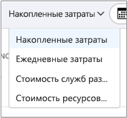
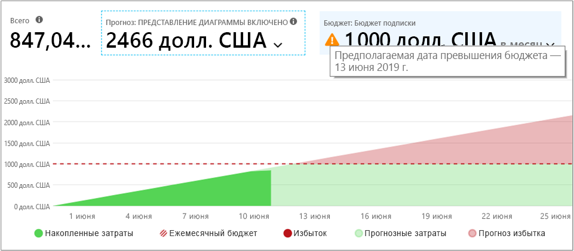
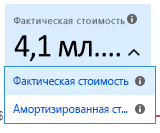
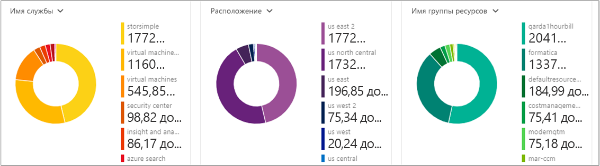

# <a name="quickstart-explore-and-analyze-costs-with-cost-analysis"></a>Краткое руководство. Изучение и анализ затрат с помощью функции анализа затрат

Прежде чем вы сможете правильно контролировать и оптимизировать свои затраты в Azure, вам необходимо понять, где они возникают в вашей организации. Также полезно понимать, сколько стоят ваши службы и какие среды и системы задействуются при их работе. Видимость всего спектра затрат имеет решающее значение для точного понимания тенденций расходов организации. Типичные расходы можно использовать для применения механизмов контроля затрат, таких как бюджеты.

В этом кратком руководстве вы можете использовать службу анализа затрат, чтобы изучить и проанализировать затраты своей организации. Вы просмотрите агрегированные затраты своей организации, чтобы понять, где возникают затраты с течением времени, и определить тенденции расходов. Вы просмотрите накопленные затраты с течением времени для оценки ежемесячных, квартальных или даже годовых тенденций затрат с учетом бюджета. Бюджет помогает соблюдать финансовые ограничения. С его помощью можно просматривать ежедневные или ежемесячные затраты для выявления нарушений. Вы можете скачать данные текущего отчета для дальнейшего анализа или использования во внешней системе.

Из этого краткого руководства вы узнаете, как выполнять следующие задачи:

- Просмотр затрат в функции анализа затрат
- Настройка представления затрат
- Скачивание данных анализа затрат


## <a name="prerequisites"></a>Предварительные требования

Анализ стоимости поддерживает различные типы учетных записей Azure. Полный список поддерживаемых типов учетных записей см. в статье [Understand Cost Management data](understand-cost-mgt-data.md) (Интерпретация данных службы "Управление затратами"). Чтобы просмотреть данные о затратах, нужен как минимум доступ на чтение для учетной записи Azure.

Для клиентов [Соглашения Enterprise (EA)](https://azure.microsoft.com/pricing/enterprise-agreement/) для просмотра данных о расходах необходимо по крайней мере иметь доступ на чтение к одной или нескольким следующим областям.

- учетная запись выставления счетов;
- Department
- учетная запись регистрации;
- группа управления;
- Подписка
- Группа ресурсов

Дополнительные сведения о назначении доступа к данным службы "Управление затратами" см. в [этой статье](assign-access-acm-data.md).

## <a name="sign-in-to-azure"></a>Вход в Azure

- Войдите на портал Azure по адресу https://portal.azure.com.

## <a name="review-costs-in-cost-analysis"></a>Просмотр затрат в функции анализа затрат

Для просмотра затрат с помощью функции анализа затрат выберите нужную область на портале Azure, а в меню — **Анализ затрат**. Например, перейдите к разделу **Подписки**, выберите подписку из списка и щелкните в меню **Анализ затрат**. Менять области для анализа затрат можно с помощью меню **Область**. См. [основные сведения об областях и работе с ними](understand-work-scopes.md).

Выбранная пользователем область распространяется на всю среду "Управление затратами", чтобы обеспечить консолидацию данных и ограничить доступ к сведениям о затратах. При использовании области не нужно выбирать по отдельности. Вместо этого выберите более широкую область, в которую входят другие области, и отфильтруйте по нужным дочерним областям. Важно понимать такой подход, так как некоторым пользователям не требуется доступ к родительской области, в которую входят дочерние области.

В первоначальном представлении анализа затрат содержатся следующие области:

**Представление накопленных затрат** — отображает заранее заданную конфигурацию представления анализа затрат. Каждое представление содержит диапазон дат, степень детализации, настройки группировки и фильтрации. Представление по умолчанию отображает затраты, накопленные за текущий период выставления счетов, но его можно изменить на другие встроенные представления. Дополнительные сведения см. в разделе [Настройка представления затрат](#customize-cost-views).

**Фактическая стоимость** —показаны общие затраты на потребление и покупки за текущий месяц по мере их возникновения. Эти затраты отображаются в вашем счете.

**Прогноз** —показаны общие прогнозируемые затраты на установленный период (эта область доступна в предварительной версии).

**Бюджет** — показана запланированная предельная сумма расходов (при наличии) для выбранной области.

**Степень детализации накопленных затрат** — показана общая совокупная сумма дневных расходов с начала периода выставления счетов. После [создания бюджета](tutorial-acm-create-budgets.md) для учетной записи выставления счетов или подписки вы можете быстро просмотреть тенденцию расходов по отношению к бюджету. Наведите курсор на дату для просмотра накопленных затрат до этого дня.

**Сводные (круговые) диаграммы** предоставляют динамические сводные данные, разделяя общие затраты на набор стандартных вариантов. На них показаны минимальные и максимальные затраты, накопленные за текущий месяц. Вы можете изменить сводные диаграммы в любое время, выбрав другую сводку. Затраты разделены по категориям: служба (категория единиц измерения), расположение (регион) и дочерняя область по умолчанию. Например, учетные записи регистрации в учетных записях выставления счетов, группы ресурсов в подписках и ресурсы в группах ресурсов.


## <a name="customize-cost-views"></a>Настройка представления затрат

Анализ затрат предоставляет четыре встроенных представления, которые оптимизированы для наиболее распространенных целей.

Просмотр | Ответы на вопросы.
--- | ---
Накопленные затраты. | Сколько средств уже потрачено в этом месяце? Выхожу ли я за пределы бюджета?
Ежедневные затраты. | Повышались ли ежедневные затраты в течение последних 30 дней?
Затраты по службам. | Как изменялась сумма за ежемесячное использование в последних 3 счетах?
Стоимость ресурсов раздельно. | Какие ресурсы стоят больше всего в этом месяце?



Однако есть много случаев, когда вам нужен более глубокий анализ. Настройка начинается с выбора даты в верхней части страницы.

В разделе анализа затрат по умолчанию отображаются данные за текущий месяц. Используйте селектор даты, чтобы быстро переключаться на распространенные диапазоны дат. Например, прошлая неделя, прошлый месяц, текущий календарный год или пользовательский диапазон дат. Подписка с оплатой по мере использования также включает диапазоны дат, основанные на вашем расчетном периоде, который не привязан к календарному месяцу, например текущий платежный период или последний счет. Чтобы перейти к предыдущему или следующему периоду, используйте ссылки **<Назад** и **Далее>** в верхней части меню соответственно. Например, с помощью ссылки **<Назад** можно переключиться с последних семи дней на 8–14 дней назад, а затем на 15–21 день назад.


В разделе анализа затрат по умолчанию отображаются **накопленные** затраты. Накопленные затраты включают в себя все расходы за каждый день в дополнение к предыдущим дням. Вы можете видеть постоянно растущее представление ваших ежедневно начисляемых расходов. Это представление оптимизировано для отображения наблюдаемых тенденций по отношению к бюджету для выбранного диапазона времени.

При использовании представления прогноза в виде диаграммы можно определить потенциальные бреши в бюджете. При наличии потенциальной бреши в бюджете прогнозируемые чрезмерные затраты будут показаны красным цветом. На диаграмме также отображается символ индикатора. При наведении курсора на этот символ отображается предположительная дата возникновения бреши в бюджете.



Для просмотра затрат за каждый день доступно **ежедневное** представление. В ежедневном представлении не отображается тенденция роста. Представление показывает ежедневные нарушения в виде максимумов и минимумов затрат. После выбора бюджета ежедневное представление также отображает оценку того, как может выглядеть ваш дневной бюджет. Если ваши ежедневные расходы постоянно превышают ожидаемый суточный бюджет, вы, вероятно, превысите ежемесячный бюджет. Ожидаемый дневной бюджет позволяет вам визуализировать ваш бюджет на более низком уровне. При наличии колебания в ежедневных расходах сравнение предполагаемого ежедневного бюджета с ежемесячным бюджетом будет менее точным.

Это разбитое по дням представление недавних расходов с включенным прогнозом расходов.


Если отключить прогноз расходов, прогнозируемые расходы на будущие даты не отображаются. Кроме того, для затрат за прошлый период времени также не будут отображаться прогнозируемые затраты.

Обычно данные или уведомления для использованных ресурсов отображаются в течение 8–12 часов.


Можно выполнять **группировку по** общим свойствам, чтобы разбить затраты и выявить наивысшие показатели. Например, чтобы выполнить группирование по тегам ресурсов, выберите ключ тега, с помощью которого необходимо выполнить группировку. В результате отобразится разбивка затрат по каждому значению тега с одной дополнительной категорией для ресурсов, к которым не применялся тег.

Большинство [ресурсов Azure поддерживают теги](../azure-resource-manager/tag-support.md), однако некоторые теги не доступны в Управлении затратами и выставлении счетов. Кроме того, не поддерживаются теги группы ресурсов. Управление затратами поддерживает только теги ресурсов с момента непосредственного применения тегов к ресурсу. Просмотрите видео [How to review tag policies with Azure Cost Management](https://www.youtube.com/watch?v=nHQYcYGKuyw) (Как просматривать политики тегов с помощью службы "Управление затратами Azure"), чтобы узнать, как использовать политику тегов Azure для улучшения видимости данных о расходах.

Это представление затрат на службы Azure за текущий месяц.


В службе анализа затрат по умолчанию отображается полная стоимость потребления и покупок по мере их возникновения. Эта стоимость и будет отображаться в вашем счете (**фактическая стоимость**). Просмотр фактических затрат идеально подходит для сверки счета. Тем не менее резкое повышение затрат на покупки может быть настораживающим, если вы следите за аномалиями расходов и другими изменениями затрат. Для выравнивания резкого роста затрат, вызванного приобретением резервирования, переключитесь на представление **амортизированной стоимости**. 



Представление амортизированной стоимости разбивает покупки резервирования на ежедневные блоки и распределяет их на срок резервирования. Например, стоимость покупки в 365 долл. США за 1 января будет отображена в виде 1 долл. США ежедневного расхода с 1 января до 31 декабря. Кроме основной амортизации, эти затраты также можно перераспределить и привязать к конкретным ресурсам, использующим резервирование. Например, если оплата за сутки в 1 долл. США была разделена между двумя виртуальными машинами, вы увидите два списания по 0,50 долл. США в день. Если часть резервирования не используется в определенный день, вы увидите списание в 0,50 долл. США, которое будет закреплено за используемой виртуальной машиной, и списание остальных 0,50 долл. США с типом `UnusedReservation`. Обратите внимание, что неиспользованные средства для резервирования можно увидеть только в представлении амортизированных затрат.

Важно отметить, что в связи с различиями в отображении расходов в представлениях фактической и амортизированной стоимости будет показана разная общая сумма. Как правило, общие месячные затраты с покупками резервирования уменьшаются в представлении амортизированной стоимости, а месячные затраты после покупки резервирования возрастают. Амортизация стоимости доступна только для покупок резервирования и не имеет отношения к покупкам в Marketplace в этот период времени.

На следующем рисунке показаны имена групп ресурсов. Вы можете группировать по тегу для просмотра общей стоимости по нему или использовать **представление затрат по ресурсам**, чтобы увидеть все теги для конкретного ресурса.


При группировании затрат по определенным атрибутам первые десять основных факторов затрат будут отображаться в порядке убывания. При наличии более десяти групп отображаются первые девять основных факторов затрат, а также группа **Другие**, которая охватывает не уместившиеся группы. При группировании по тегам вы можете обнаружить группу затрат **Без тегов**, к компонентам которой ключ тега не применялся. Категория **Без тегов** всегда указана последней в списке, даже если величина затрат в ней больше, чем в других категориях. Если категорий с тегами больше 10, статьи затрат без тегов включаются в категорию **Прочие**.

Ресурсы *классических* виртуальных машин, сетевые ресурсы и ресурсы хранения не предоставляют детальную информацию о данных выставления счетов. При группировании затрат они объединяются в группу **Классические службы**.

На сводных графиках под основным графиком отображаются соотношения компонентов затрат. Это дает более четкое представление об общих затратах в указанном интервале и с учетом используемых фильтров. Выберите свойство или тег, чтобы просмотреть совокупные затраты в любом измерении.



Вы можете просмотреть полный набор данных для любого представления. Любые параметры или фильтры влияют на представленные данные. Чтобы просмотреть полный набор данных, щелкните список **типов диаграмм**, а затем представление **Таблица**.


## <a name="understanding-grouping-and-filtering-options"></a>Основные сведения о параметрах группирования и фильтрации

В следующей таблице перечислены некоторые наиболее распространенные параметры группирования и фильтрации, а также случаи их использования.

| Свойство | Сценарии использования |
| --- | --- |
| **Расчетный период** | Разделение затрат за месяц выставления счета. Этот параметр играет важную роль для подписок с оплатой по мере использования, а также подписок для разработки и тестирования, которые не привязаны к календарному месяцу. Для достижения тех же целей в учетных записях EA и MCA можно использовать в управляющем элементе выбора даты календарные месяцы или месячную степень детализации. |
| **Charge Type** (Тип платежей) | Разделение затрат на потребление, покупки, возмещение и неиспользованное резервирование. Покупки резервирования и затраты на возмещения доступны только при просмотре фактических, а не амортизированных затрат. Затраты на неиспользованные резервирования доступны только при просмотре амортизированных затрат. |
| **Облако** | Разделение затрат на расходы на Amazon Web Services и Azure. Затраты на Amazon Web Services доступны только в группах управления, внешних учетных записях выставления счетов и внешних подписках. |
| **Раздел затрат по отделу** / **или счету** | Разбиение затрат по отделу EA или счету MCA. Доступно только для учетных записей выставления счетов EA и MCA, а также для профилей выставления счетов MCA. |
| **Учетная запись регистрации** | Разделение затрат по владельцу учетной записи EA. Доступно только для учетных записей выставления счетов EA и отделов. |
| **Frequency** | Разделение затрат на затраты на основе потребления, одноразовые и повторяющиеся затраты. |
| **Метрика** | Разделение затрат по метрике использования Azure. Доступно только для потребления Azure. Для всех покупок или затрат потребления в Marketplace будет отображаться состояние "Не указано" или "Не присвоено". |
| **Тип издателя** | Разделение затрат на расходы на Amazon Web Services, Azure и Marketplace. |
| **Резервирование** | Разделение затрат по резервированию. Любым затратам на потребление, которые не включают в себя резервирование, будет присвоено состояние "Не указано". |
| **Ресурс** | Разделение затрат по ресурсу. Всем затратам на покупки будет присвоено состояние "Не указано", так как они применены в учетной записи выставления счетов EA/PAYG или на уровне профиля выставления счетов MCA.  |
| **Группа ресурсов** | Разделение затрат по группе ресурсов. Доступно только для потребления неклассических ресурсов. При потреблении классического ресурса будет отображаться состояние "Другие", а покупкам будет присвоено состояние "Не указано". |
| **Тип ресурса** | Разделение затрат по типу ресурса. Доступно только для потребления неклассических ресурсов. При потреблении классического ресурса будет отображаться состояние "Другие", а покупкам будет присвоено состояние "Не указано". |
| **Имя службы** или **Категория измерения** | Разделение затрат по службам Azure. Доступно только для потребления Azure. Для всех покупок или затрат потребления в Marketplace будет отображаться состояние "Не указано" или "Не присвоено". |
| **Уровень служб** или **Подкатегория измерения** | Разделение затрат по подклассам измерения потребления Azure. Доступно только для потребления Azure. Для всех покупок или затрат потребления в Marketplace будет отображаться состояние "Не указано" или "Не присвоено". |
| **Подписка** | Разделение затрат по подписке. Для всех покупок отображается состояние "Не указано". |
| **Tag** | Разделение затрат по значениям тегов для конкретного ключа тега. |

Дополнительные сведения о терминах см. в разделе [Understand the terms used in the Azure usage and charges file](../billing/billing-understand-your-usage.md) (Общие сведения о терминах в файле об использовании и затратах на Azure).


## <a name="saving-and-sharing-customized-views"></a>Сохранение и совместное использование настроенных представлений

Чтобы сохранить и совместно использовать настроенные представления с другими лицами, необходимо закрепить анализ затрат на панели мониторинга портала Azure или скопировать ссылку на анализ затрат. 

Для закрепления анализа затрат щелкните значок "Закрепить" в правом верхнем углу. При закреплении анализа затрат будет сохранена только основная диаграмма или представление таблицы (в зависимости от выбора). Предоставьте общий доступ к панели мониторинга, чтобы другие пользователи могли перейти к вашей плитке. Обратите внимание, что так вы только предоставляете общий доступ к конфигурации панели мониторинга, но не к исходным данным. Если у пользователя отсутствует доступ к затратам, но есть общий доступ к панели мониторинга, ему отобразится сообщение "Доступ запрещен".

Чтобы отправить ссылку на анализ затрат, щелкните команду **Поделиться** вверху колонки. Будет отображен пользовательский URL-адрес, который открывает конкретное представление для конкретной области. Если у пользователя нет доступа к анализу затрат, при переходу по URL-адресу ему отобразится сообщение "Доступ запрещен". 

Дополнительные сведения о предоставлении доступа к затратам для каждой из поддерживаемых областей см. в статье [Общие сведения об областях и работа с ними](understand-work-scopes.md).

## <a name="automation-and-offline-analysis"></a>Автоматизация и автономный анализ

В некоторых случаях необходимо загрузить данные для дальнейшего анализа. Для этого объедините новые данные с собственными или интегрируйте их в свои системы. На такой случай служба "Управление затратами" предлагает несколько вариантов. Если вам требуется специальная высокоуровневая сводка, какую вы получаете при анализе затрат, в качестве отправной точки настройте нужное представление и скачайте его, щелкнув **Экспорт** и выбрав **Скачать данные в формате CSV** или **Скачать данные в Excel**. Загрузив данные в формате Excel, вы получаете дополнительный контекст в представлении, используемом для загрузки, например область, конфигурацию запроса, общие показатели и дату создания.

Если вам потребуется полный неагрегированный набор данных, скачайте его из учетной записи выставления счетов. В списке служб на портале в левой панели навигации выберите пункты "Управление затратами + выставление счетов" > (выберите учетную запись выставления счетов, если применимо) > "Использование+расходы", а затем щелкните значок загрузки для нужного периода выставления счетов.

Если необходимо автоматизировать процесс получения данных по затратам, можно использовать похожий метод. Используйте [API запросов](/rest/api/cost-management/query) для более глубокого анализа с применением динамических фильтров, группирования и агрегирования или [API сведений об использовании](/rest/api/consumption/usageDetails) для получения полного неагрегированного набора данных. Общедоступная версия этих API — 2019-01-01. В предварительной версии **2019-04-01-preview** можно получить доступ к предварительному просмотру покупок резервирования и покупок в Marketplace в этих API-интерфейсах. 

Например, давайте разобьем общее представление амортизированной стоимости по типу расходов (потребление, покупки или возмещения), типу издателя (Azure или Marketplace), группе ресурсов (пусто для покупок) и резервированию (пусто, если неприменимо).

```
POST https://management.azure.com/{scope}/providers/Microsoft.CostManagement/query?api-version=2019-04-01-preview
Content-Type: application/json
 
{
  "type": "AmortizedCost",
  "timeframe": "Custom",
  "timePeriod": { "from": "2019-04-01", "to": "2019-04-30" },
  "dataset": {
    "granularity": "None",
    "aggregation": {
      "totalCost": { "name": "PreTaxCost", "function": "Sum" }
    },
    "grouping": [
      { "type": "dimension", "name": "ChargeType" },
      { "type": "dimension", "name": "PublisherType" },
      { "type": "dimension", "name": "Frequency" },
      { "type": "dimension", "name": "ResourceGroup" },
      { "type": "dimension", "name": "SubscriptionName" },
      { "type": "dimension", "name": "SubscriptionId" },
      { "type": "dimension", "name": "ReservationName" },
      { "type": "dimension", "name": "ReservationId" },
    ]
  },
}
```

Если вам не требуется общее представление, а нужен полный необработанный набор данных:

```
GET https://management.azure.com/{scope}/providers/Microsoft.Consumption/usageDetails?metric=AmortizedCost&$filter=properties/usageStart+ge+'2019-04-01'+AND+properties/usageEnd+le+'2019-04-30'&api-version=2019-04-01-preview
```

Если вы хотите увидеть фактические затраты на покупки по мере их возникновения, укажите для атрибута **type**/**metric** значение **ActualCost**. Подробности об интерфейсах API см. в документации об [API запросов](/rest/api/cost-management/query) и [API сведений об использовании](/rest/api/consumption/usageDetails). Обратите внимание, что опубликованные документы относятся к общедоступной версии API, но они также подходят для работы с предварительной версией API 2019-04-01-preview без учета атрибута type/metric и измененных имен свойств. (См. дополнительные сведения о работе с именами свойств ниже.)
 
API управления затратами работает со всеми упомянутыми выше областями ресурсов, а именно: с группой ресурсов, подпиской и группой управления с помощью доступа к Azure RBAC, учетными записями выставления счетов (через регистрации), отделами и учетными записями регистрации с помощью доступа к порталу EA и т. д. Дополнительные сведения об областях, а также об определении собственного идентификатора области и об управлении доступом к ним см. в статье [Общие сведения об областях и работа с ними](understand-work-scopes.md).

## <a name="next-steps"></a>Дополнительная информация

Перейдите к первому руководству, чтобы узнать, как создать бюджет и управлять им.

> [!div class="nextstepaction"]
> [Создание бюджетов и управление ими](tutorial-acm-create-budgets.md)
