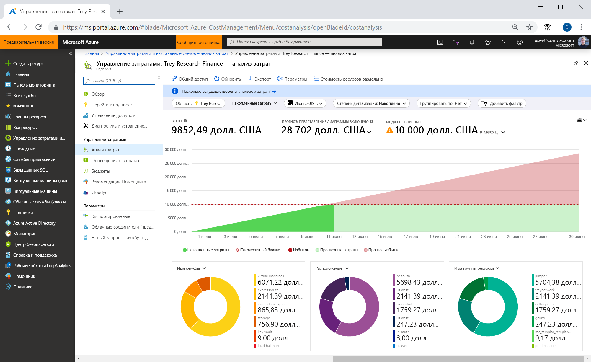
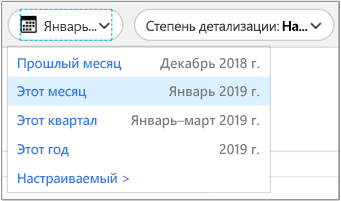
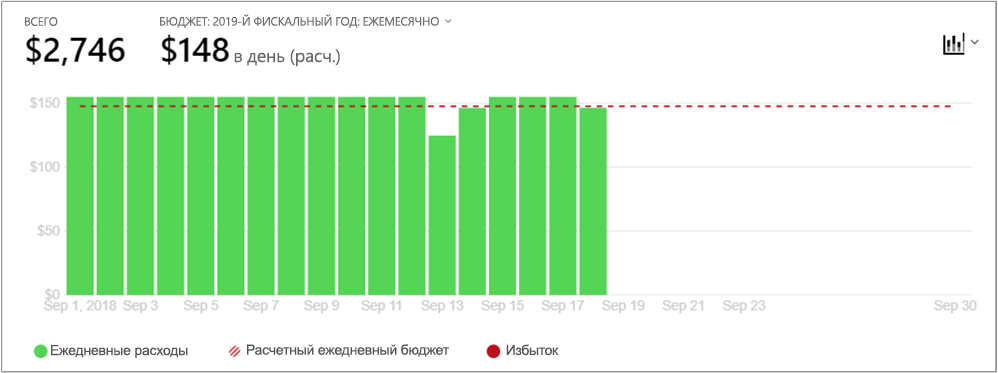
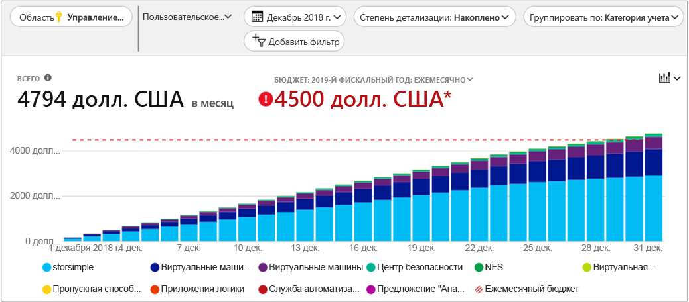
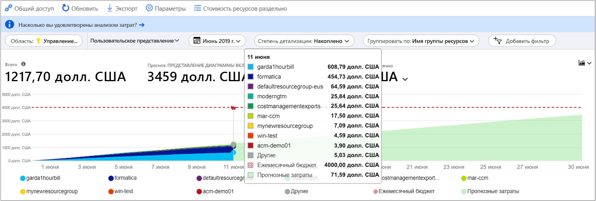
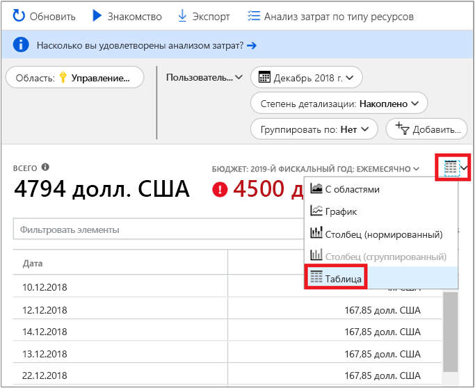

# Краткое руководство. Изучение и анализ затрат с помощью функции анализа затрат

Прежде чем вы сможете правильно контролировать и оптимизировать свои затраты в Azure, вам необходимо понять, где они возникают в вашей организации. Также полезно понимать, сколько стоят ваши службы и какие среды и системы задействуются при их работе. Видимость всего спектра затрат имеет решающее значение для точного понимания тенденций расходов организации. Типичные расходы можно использовать для применения механизмов контроля затрат, таких как бюджеты.

В этом кратком руководстве вы можете использовать службу анализа затрат, чтобы изучить и проанализировать затраты своей организации. Вы просмотрите агрегированные затраты своей организации, чтобы понять, где возникают затраты с течением времени, и определить тенденции расходов. Вы просмотрите накопленные затраты с течением времени для оценки ежемесячных, квартальных или даже годовых тенденций затрат с учетом бюджета. Бюджет помогает соблюдать финансовые ограничения. С его помощью можно просматривать ежедневные или ежемесячные затраты для выявления нарушений. Вы можете скачать данные текущего отчета для дальнейшего анализа или использования во внешней системе.

Из этого краткого руководства вы узнаете, как выполнять следующие задачи:

- Просмотр затрат в функции анализа затрат
- Настройка представления затрат
- Скачивание данных анализа затрат

## Предварительные требования

Анализ стоимости поддерживает различные типы учетных записей Azure. Дополнительные сведения о полном списке типов поддерживаемых учетных записей см. в статье [Understand Cost Management data](understand-cost-mgt-data.md) (Интерпретация данных службы "Управление затратами"). Чтобы просмотреть данные о затратах, нужен как минимум доступ на чтение для учетной записи Azure.

Для клиентов [Соглашения Enterprise (EA)](https://azure.microsoft.com/pricing/enterprise-agreement/) для просмотра данных о расходах необходимо по крайней мере иметь доступ на чтение к одной или нескольким следующим областям.

- учетная запись выставления счетов;
- Department
- учетная запись регистрации;
- группа управления;
- Подписка
- Группа ресурсов

Дополнительные сведения о назначении доступа к данным службы "Управление затратами" см. в [этой статье](assign-access-acm-data.md).

## Вход в Azure

- Войдите на портал Azure по адресу https://portal.azure.com.

## Просмотр затрат в функции анализа затрат

Чтобы просмотреть данные о затратах с помощью функции анализа стоимости, на портале Azure последовательно выберите **Управление затратами + выставление счетов** &gt; **Анализ стоимости**. Выберите **Область: _имя_области_** и нажмите кнопку **Выбрать**.

Выбранная вами область используется на протяжении всего процесса управление затратами, чтобы обеспечить консолидацию данных и управление доступом к сведениям о затратах. При использовании области не нужно выбирать по отдельности. Вместо этого выберите более широкую область, в которую входят другие области, и отфильтруйте по нужным областям. Это важно понимать, так как некоторым пользователям не требуется доступ к родительской области, в которую входят дочерние области.

Щелкните **Открыть анализ затрат**.

В первоначальном представлении анализа затрат содержатся следующие области:

**Всего** — показаны общие затраты на текущий месяц.

**Бюджет** — показана запланированная предельная сумма расходов (при наличии) для выбранной области.

**Accumulated cost** (Накопленные затраты) — показаны общие накопленные ежедневные затраты начиная с начала месяца. После [создания бюджета](tutorial-acm-create-budgets.md) для учетной записи выставления счетов или подписки вы можете быстро просмотреть тенденцию расходов по отношению к бюджету. Наведите курсор на дату для просмотра накопленных затрат до этого дня.

**Сводные (круговые) диаграммы** предоставляют динамические сводные данные, разделяя общие затраты на набор стандартных вариантов. На них показаны минимальные и максимальные затраты, накопленные за текущий месяц. Вы можете изменить сводные диаграммы в любое время, выбрав другую сводку. Затраты разделены по категориям: служба (категория единиц измерения), расположение (регион) и дочерняя область по умолчанию. Например, учетные записи регистрации в учетных записях выставления счетов, группы ресурсов в подписках и ресурсы в группах ресурсов.

## Настройка представления затрат

Представление по умолчанию позволяет получить быстрые ответы на общие вопросы, такие как:

- Сколько потрачено?
- Выхожу ли я за пределы бюджета?

Однако есть много случаев, когда вам нужен более глубокий анализ. Настройка начинается с выбора даты в верхней части страницы.

В разделе анализа затрат по умолчанию отображаются данные за текущий месяц. Используйте селектор даты, чтобы быстро переключиться на последний месяц, этот месяц, этот календарный квартал, текущий календарный год или пользовательский диапазон дат по вашему выбору. Выбор последнего месяца — это самый быстрый способ проанализировать ваш последний счет Azure и с легкостью выверить платежи. Варианты за текущий квартал и год помогают отслеживать расходы по отношению к долгосрочным бюджетам. Вы также можете выбрать другой диапазон дат. Например, можно выбрать один день, последние семь дней или любую дату за год до текущего месяца.

В разделе анализа затрат по умолчанию отображаются **накопленные** затраты. Накопленные затраты включают в себя все расходы за каждый день в дополнение к предыдущим дням. Вы можете видеть постоянно растущее представление ваших ежедневно начисляемых расходов. Это представление оптимизировано для отображения наблюдаемых тенденций по отношению к бюджету для выбранного диапазона времени.

Для просмотра затрат за каждый день доступно **ежедневное** представление. В ежедневном представлении не отображается тенденция роста. Представление показывает ежедневные нарушения в виде максимумов и минимумов затрат. После выбора бюджета ежедневное представление также отображает оценку того, как может выглядеть ваш дневной бюджет. Если ваши ежедневные расходы постоянно превышают ожидаемый суточный бюджет, вы, вероятно, превысите ежемесячный бюджет. Ожидаемый дневной бюджет позволяет вам визуализировать ваш бюджет на более низком уровне. При наличии колебания в ежедневных расходах сравнение предполагаемого ежедневного бюджета с ежемесячным бюджетом будет менее точным.

Обычно данные или уведомления для использованных ресурсов отображаются в течение восьми часов.

Вы можете выполнить **группирование**, чтобы выбрать категорию группы для изменения данных, отображаемых в верхнем графике общей области. Группирование позволяет быстро оценить распределение затрат по общим свойствам ресурсов или использования, таким как теги ресурсов или групп ресурсов. Чтобы выполнить группирование по тегам, выберите ключ тега, с помощью которого необходимо выполнить группировку. В результате отобразится разбивка затрат по каждому значению тега с одной дополнительной категорией для ресурсов, к которым не применялся тег.

Большинство [ресурсов Azure поддерживают теги](../azure-resource-manager/tag-support.md), однако некоторые теги не доступны в Управлении затратами и выставлении счетов. Кроме того, не поддерживаются теги группы ресурсов. Управление затратами поддерживает только теги ресурсов с момента непосредственного применения тегов к ресурсу.

Ниже мы видим представление затрат на службы Azure за последний месяц.

На сводных графиках под основным графиком отображаются соотношения компонентов затрат. Это дает более четкое представление об общих затратах в указанном интервале и с учетом используемых фильтров. Выберите свойство или тег, чтобы просмотреть совокупные затраты в любом измерении.

На предыдущем рисунке показаны имена групп ресурсов. Группирование можно выполнять по тегу, чтобы просмотреть общие затраты по нему. Но просмотреть все теги ресурса или группы ресурсов нельзя ни в одном из представлений анализа затрат.

При группировании затрат по определенным атрибутам первые десять основных факторов затрат будут отображаться в порядке убывания. При наличии более чем десяти групп отображаются первые девять основных участников затрат. Также отображается группа **Другие**, которая включает все остальные группы. При группировании по тегам вы можете обнаружить группу затрат **Без тегов**, к компонентам которой ключ тега не применялся. Категория **Без тегов** всегда указана последней в списке, даже если величина затрат в ней больше, чем в других категориях. Если категорий с тегами больше десяти, статьи затрат без тегов включаются в категорию **Другие**.

Ресурсы *классических* (Управление службами Azure или ASM) виртуальных машин, сетевые ресурсы и ресурсы хранения не предоставляют детальную информацию о данных выставления счетов. При группировании затрат они объединяются в группу **Классические службы**.

Вы можете просмотреть полный набор данных для любого представления. Любые параметры или фильтры влияют на представленные данные. Чтобы просмотреть полный набор данных, щелкните список **типов диаграмм**, а затем представление **Таблица**.

## Скачивание данных анализа затрат

Вы можете **Скачать** сведения из службы анализа затрат, чтобы создать CSV-файл для всех данных, отображаемых на портале Azure. Любые примененные фильтры или группы включены в файл. Базовые данные для верхней диаграммы "Итог", которая сейчас не отображается, включены в CSV-файл.

## Дополнительная информация

Перейдите к первому руководству, чтобы узнать, как создать бюджет и управлять им.

> [!div class="nextstepaction"]
> [Создание бюджетов и управление ими](tutorial-acm-create-budgets.md)
