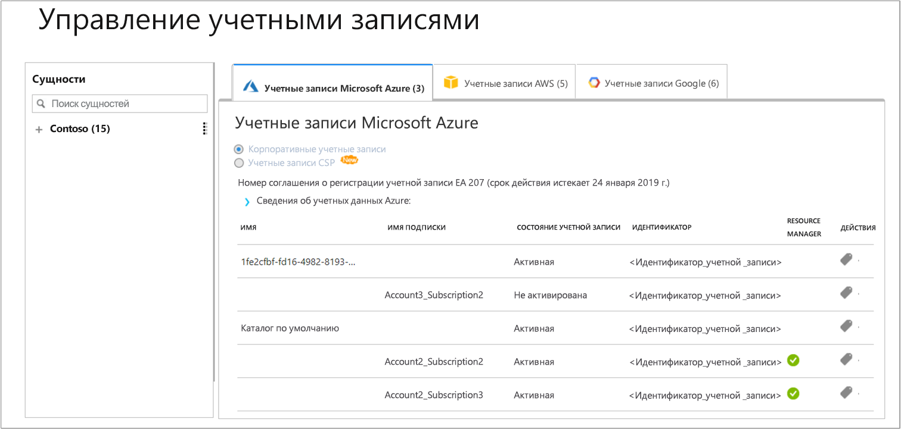

# Регистрация индивидуальной подписки Azure и просмотр данных о затратах

Используйте подписку Azure для регистрации в службе Cloudyn. Такая регистрация предоставляет доступ к порталу Cloudyn. В этом кратком руководстве описывается процесс регистрации, который необходимо пройти для создания пробной подписки Cloudyn и входа на портал Cloudyn. Здесь также показано, как начать просматривать данные о затратах.

## Вход в Azure

- Войдите на портал Azure по адресу http://portal.azure.com.

## Регистрация в Cloudyn

1. На портале Azure в списке служб выберите **Cost Management + Billing** (Управление затратами + Выставление счетов).
2. В разделе **Обзор** щелкните **Cloudyn**.  
    
3. На странице **Управление затратами** нажмите кнопку **Перейти в Cloudyn**, чтобы открыть страницу регистрации в Cloudyn в новом окне.
4. На странице пробной регистрации на портале Cloudyn введите название вашей компании, а затем выберите **Azure Individual Subscription Owner** (Владелец индивидуальной подписки Azure) и нажмите кнопку **Next** (Далее). Ваши имя учетной записи и идентификатор клиента автоматически добавляются в форму.  
    
5. В поле **Offer ID - Name** (Идентификатор предложения — имя) выберите значение, связанное с вашей подпиской. Если вы не уверены, какой у вашей подписки идентификатор скорости, то можно просмотреть счет Azure и найти значение **Идентификатор предложения**.
6. Примите условия использования, а затем проверьте свои данные и нажмите кнопку **Next** (Далее).
7. На странице **Gather additional data** (Сбор дополнительных данных) нажмите кнопку **Next** (Далее), чтобы авторизовать Cloudyn для сбора данных ресурсов Azure. Собранные данные включают в себя сведения об использовании, производительности, выставлении счетов, а также данные тегов из подписок.  
    
8. Браузер выполнит переход на страницу входа для Cloudyn. Войдите, используя учетные данные своей подписки Azure.
9. Щелкните **Go to Cloudyn** (Перейти к Cloudyn), чтобы открыть портал Cloudyn. Затем на странице **Accounts Management** (Управление учетными записями) должны отобразиться сведения вашей учетной записи подписки Azure.  
     (Управление учетными записями)

Руководство по регистрации подписки Azure см. в видео [Finding your Directory GUID and Rate ID for use in Azure Cost Management](https://youtu.be/PaRjnyaNGMI) (Поиск каталога GUID и идентификатора тарифа для использования в службе Cloudyn).

[!INCLUDE [cost-management-create-account-view-data](../../includes/cost-management-create-account-view-data.md)]

## Дополнительная информация

В этом кратком руководстве вы использовали данные подписки Azure для регистрации в службе Cloudyn. Вы также вошли на портал Cloudyn и начали просматривать данные о затратах. Дополнительные сведения о Cloudyn см. в руководстве для Cloudyn.

> [!div class="nextstepaction"]
> [Просмотр сведений об использовании и затратах](./tutorial-review-usage.md)
