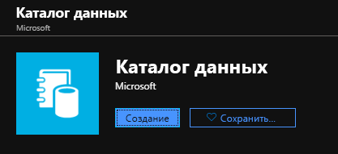
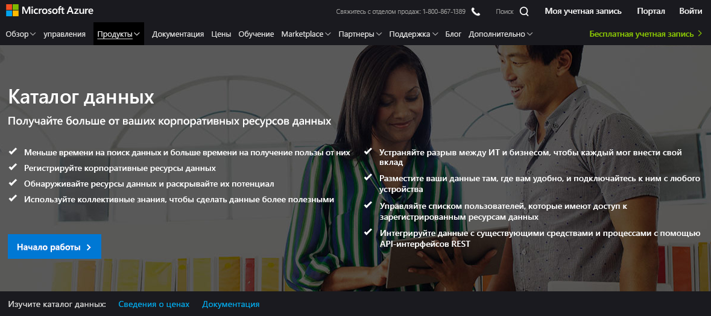
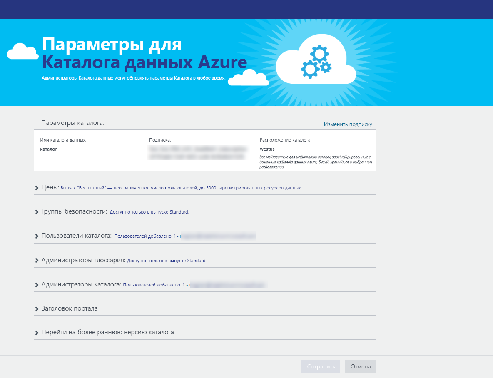
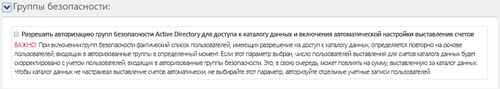
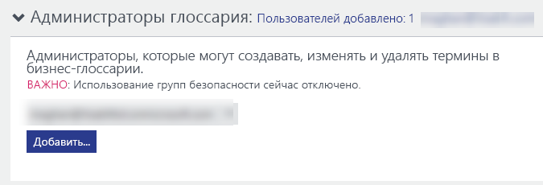
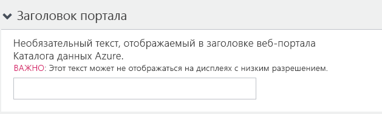
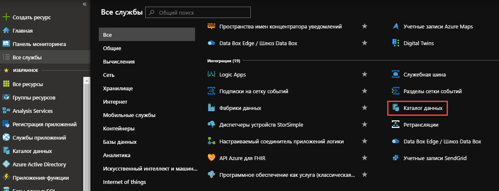
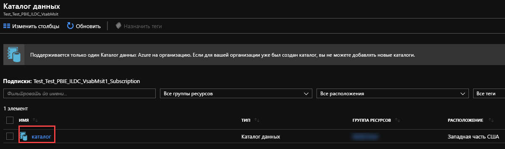
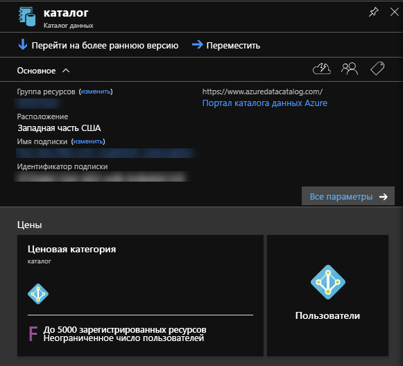
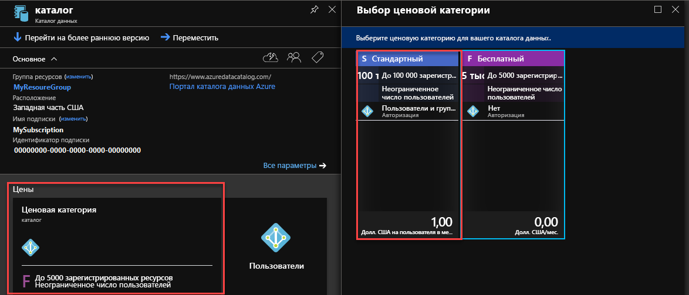

# Краткое руководство. Создание каталога данных Azure

Каталог данных Azure — это полностью управляемая облачная служба, выполняющая функции систем регистрации и обнаружения корпоративных ресурсов данных. Подробный обзор см. в статье [Что такое каталог данных Azure?](overview.md)

Это краткое руководство поможет вам приступить к созданию Каталога данных Azure.

Если у вас еще нет подписки Azure, [создайте бесплатную учетную запись Azure](https://azure.microsoft.com/free/?WT.mc_id=A261C142F), прежде чем начинать работу.

## Предварительные требования

Для начала работы необходимы перечисленные ниже компоненты и данные.

* [Подписка Microsoft Azure](https://azure.microsoft.com/).
* Вам потребуется собственный [арендатор Azure Active Directory](../active-directory/fundamentals/active-directory-access-create-new-tenant.md).

Чтобы настроить каталог данных, необходимо быть владельцем или совладельцем подписки Azure.

## Создание каталога данных

В рамках организации можно подготовить только один каталог данных (в домене Azure Active Directory). Таким образом, если владелец или совладелец подписки Azure, принадлежащий домену Azure Active Directory, уже создал каталог, создать еще один каталог невозможно, даже если в организации есть несколько подписок Azure. Чтобы проверить наличие каталога данных в домене Azure Active Directory, перейдите на [домашнюю страницу каталога данных Azure](http://azuredatacatalog.com). Если он создан, вы увидите его на этой странице. Если каталог уже создан, пропустите описанную ниже процедуру и перейдите к следующему разделу.

1. Перейдите на [портал Azure](https://portal.azure.com) > , выберите **Создать ресурс** и **Каталог данных**.

    

2. Укажите **имя** каталога данных, **подписку**, которую необходимо использовать, **расположение**, в котором будет находиться каталог, и **ценовую категорию**. Щелкните **Создать**.

3. Перейдите на [домашнюю страницу каталога данных Azure](http://azuredatacatalog.com) и нажмите кнопку **Опубликовать данные**.

   

   Доступ к домашней странице Каталога данных также можно получить со [страницы службы Каталога данных](https://azure.microsoft.com/services/data-catalog), выбрав **Начало работы**.

   

4. Перейдите на страницу **Параметры**.

    

5. Разверните раздел **Цены** и проверьте тип **выпуска** ("Стандартный" или "Бесплатный") для Каталога данных Azure.

    

6. При выборе ценовой категории *Стандартный* можно развернуть **Группы безопасности** и включить авторизацию групп безопасности Active Directory для доступа к Каталогу данных и включения автоматической настройки выставления счетов.

    

7. Разверните раздел **Пользователи каталога** и нажмите кнопку **Добавить**, чтобы добавить пользователей каталога данных. Вы автоматически добавлены в эту группу.

    

8. При выборе ценовой категории *Стандартный* можно развернуть **Администраторы глоссария** и нажать кнопку **Добавить** для добавления пользователей-администраторов глоссария. Вы автоматически добавлены в эту группу.

    

9. Разверните раздел **Администраторы каталога** и нажмите кнопку **Добавить**, чтобы добавить администраторов каталога данных. Вы автоматически добавлены в эту группу.

    

10. Разверните **Заголовок портала** и добавьте дополнительный текст, который будет отображаться в заголовке на портале.

    

11. Заполнив страницу **Параметры**, перейдите к странице **Опубликовать**.

    

## Поиск каталога данных на портале Azure

1. На отдельной вкладке в браузере или в отдельном окне браузера перейдите [на портал Azure](https://portal.azure.com) и войдите в систему с помощью той же учетной записи, используемой для создания каталога данных на предыдущем этапе.

2. Щелкните **Все службы**, а затем — **Каталог данных**.

    

     Отобразится созданный каталог данных.

    

3. Щелкните созданный вами каталог. На портале откроется колонка **Каталог данных** .

   

4. Вы можете просматривать и обновлять свойства каталога данных. Например, щелкните **Ценовая категория** , чтобы изменить выпуск.

    

## Дополнительная информация

В этом кратком руководстве вы узнали, как создать Каталог данных Azure для своей организации. Теперь вы можете зарегистрировать источники данных в каталоге данных.

> [!div class="nextstepaction"]
> [Регистрация источников данных в каталоге данных Azure](data-catalog-how-to-register.md)
