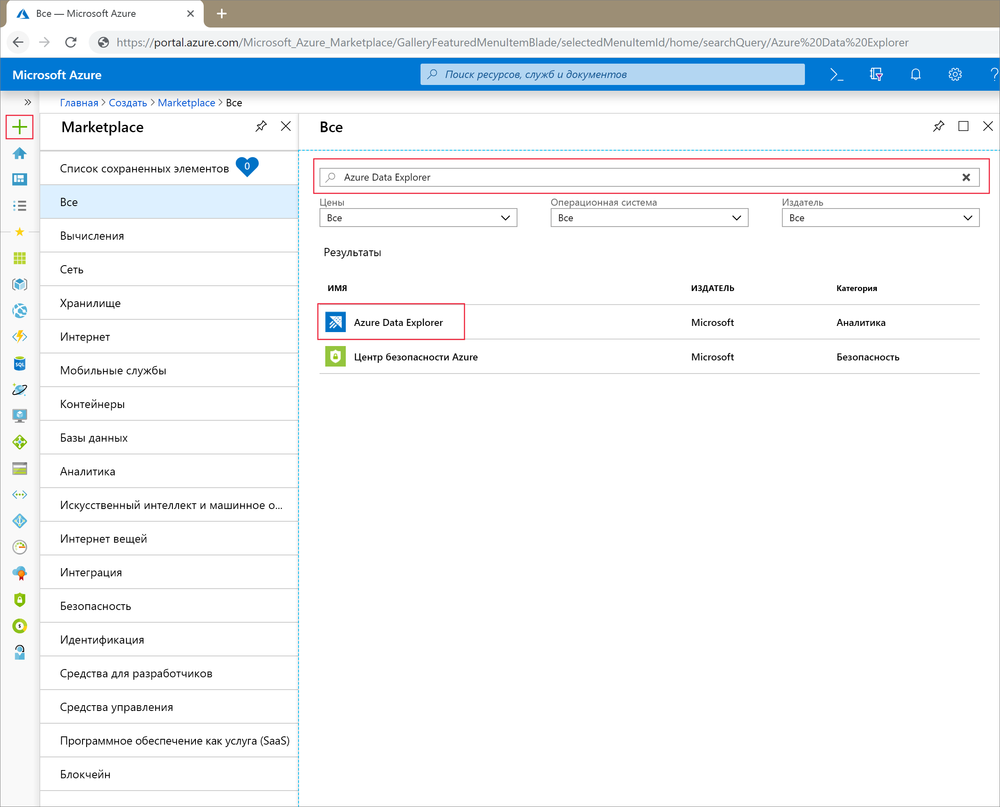
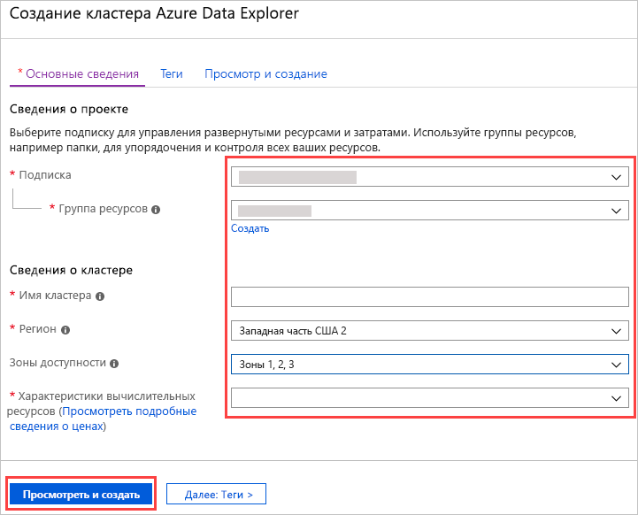
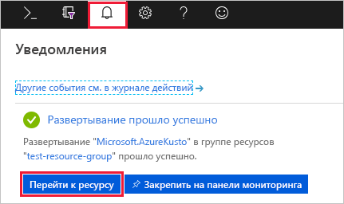
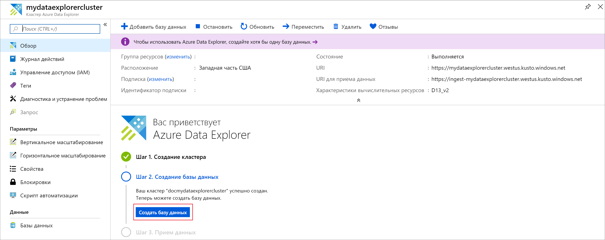
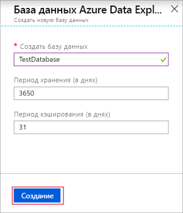
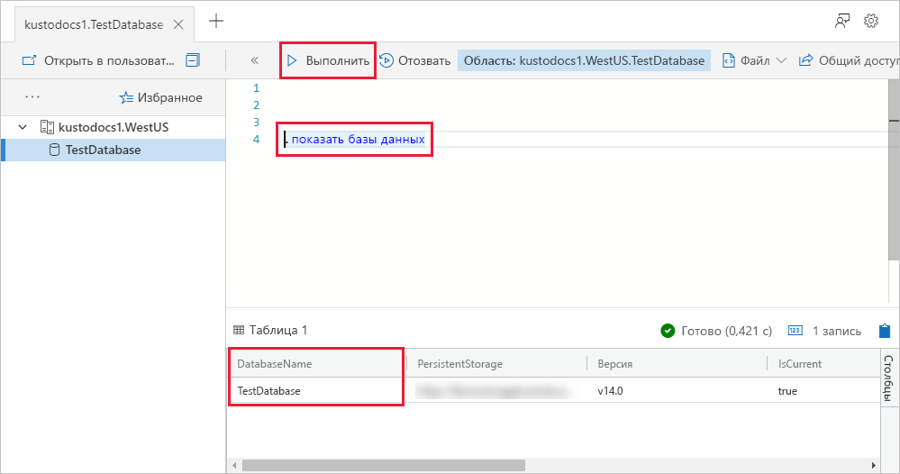

# Краткое руководство. Создание кластера и базы данных Azure Data Explorer

> [!div class="op_single_selector"]
> * [Портал](create-cluster-database-portal.md)
> * [ИНТЕРФЕЙС КОМАНДНОЙ СТРОКИ](create-cluster-database-cli.md)
> * [PowerShell](create-cluster-database-powershell.md)
> * [C#](create-cluster-database-csharp.md)
> * [Python](create-cluster-database-python.md)
> * [Шаблон ARM](create-cluster-database-resource-manager.md)

Обозреватель данных Azure — это быстрая и высокомасштабируемая служба для изучения данных журналов и телеметрии. Чтобы использовать обозреватель данных Azure, сначала нужно создать кластер и одну или несколько баз данных в этом кластере. Затем вы должны принять (загрузить) данные в базы данных, чтобы к ним можно было выполнять запросы. В этом кратком руководстве вы создадите кластер и базу данных.

Если у вас еще нет подписки Azure, создайте [бесплатную учетную запись](https://azure.microsoft.com/free/) Azure, прежде чем начинать работу.

## Вход на портал Azure

Войдите на [портале Azure](https://portal.azure.com/).

## Создание кластера

Создайте кластер Azure Data Explorer с определенным набором вычислительных ресурсов и ресурсов хранилища в группе ресурсов Azure.

1. Нажмите кнопку **Создать ресурс** (+) в левом верхнем углу окна портала.

1. Найдите *Azure Data Explorer*.

   

1. В разделе **Azure Data Explorer** нажмите кнопку **Создать** внизу экрана.

1. Заполните форму основных сведений о кластере, указав следующую информацию.

   

    **Параметр** | **Рекомендуемое значение** | **Описание поля**
    |---|---|---|
    | Subscription | Ваша подписка | Выберите подписку Azure, которую вы хотите использовать для кластера.|
    | группа ресурсов. | Ваша группа ресурсов | Воспользуйтесь существующей группой ресурсов или создайте новую. |
    | Имя кластера | Уникальное имя кластера | Выберите уникальное имя для кластера. К введенному имени кластера добавляется имя домена *[region].kusto.windows.net*. Имя должно содержать только строчные буквы и цифры. Его длина должна составлять от 4 до 22 символов.
    | Регион | *Западная часть США* или *Западная часть США 2* | В нашем примере используется *Западная часть США* или *Западная часть США 2* (если используются зоны доступности). Для производственной системы выберите регион, лучше всего соответствующий вашим потребностям.
    | Зоны доступности | *1*, *2* и (или) *3* | Разместите экземпляры кластера в разных зонах доступности в одном регионе (необязательно). [Зоны доступности Azure](/azure/availability-zones/az-overview) — это уникальные физические расположения в пределах одного региона Azure. Они защищают кластер Azure Data Explorer и данные от сбоя региона с частичной утратой доступности. Узлы кластера по умолчанию создаются в одном центре обработки данных. Выбрав несколько зон доступности, можно исключить единую точку отказа и обеспечить высокий уровень доступности. Развертывание в зонах доступности возможно только во время создания кластера и не может быть изменено позже.
    | Спецификации вычислительных ресурсов | *D13_v2* | Для этого краткого руководства выберите спецификацию с наименьшей ценой. Для производственной системы выберите спецификацию, лучше всего соответствующую вашим потребностям.
    | | | |

1. Выберите **Отзыв и создание**, чтобы просмотреть свои сведения о кластере, и нажмите кнопку **Создать**, чтобы подготовить кластер. Подготовка обычно занимает около 10 минут.

1. Когда развертывание будет завершено, выберите **Перейти ресурсу**.

    

## Создание базы данных

Теперь все готово для второго этапа процесса — создания базы данных.

1. На вкладке **Обзор** выберите **Создать базу данных**.

    

1. Заполните форму, указав следующую информацию.

    

    **Параметр** | **Рекомендуемое значение** | **Описание поля**
    |---|---|---|
    | Имя базы данных | *TestDatabase* | Имя базы данных должно быть уникальным в пределах кластера.
    | Срок хранения | *3650* | Интервал времени (в днях), в течение которого данные будут гарантированно доступны для запросов. Интервал времени измеряется с момента приема данных.
    | Период кэша | *31* | Интервал времени (в днях), в течение которого необходимо хранить часто запрашиваемые данные в хранилище SSD или ОЗУ, а не в долговременном хранилище.
    | | | |

1. Чтобы создать базу данных, выберите **Создать**. Создание обычно занимает меньше минуты. По завершении процесса вы вернетесь на вкладку **Обзор** в кластере.

## Выполнения базовых команд в базе данных

Теперь, когда у вас есть кластер и базы данных, можно выполнять запросы и команды. Пока в базе данных нет данных, но вы видите, как работают эти инструменты.

1. В кластере выберите **Запрос**. Вставьте команду `.show databases` в окно запросов, затем выберите **Выполнить**.

    

    Результирующий набор показывает **TestDatabase** — единственную базу данных в кластере.

1. Вставьте команду `.show tables` в окно запросов, а затем выберите **Выполнить**.

    Эта команда возвращает пустой результирующий набор, так как у вас еще нет таблиц. Вы добавите таблицу в следующей статье этой серии.

## Остановка и перезапуск кластера

Вы можете остановить и перезапустить кластер в зависимости от потребностей бизнеса.

1. Чтобы остановить кластер, в верхней части вкладки **Обзор** нажмите **Остановить**.

    Пока кластер остановлен, данные недоступны для запросов, и вы не можете принимать новые данные.

1. Чтобы перезапустить кластер, в верхней части вкладки **Обзор** нажмите **Перезапуск**.

    При перезапуске кластера он станет доступным примерно через 10 минут (как при первоначальной подготовке). Для загрузки данных в горячий кэш потребуется дополнительное время.  

## Очистка ресурсов

Если вы планируете работать с другими краткими и подробными руководствами, сохраните созданные ресурсы. В противном случае очистите свою группу ресурсов, чтобы избежать лишних расходов.

1. На портале Azure выберите **Группа ресурсов** слева, а затем выберите группу ресурсов, которая содержит кластер Data Explorer.  

1. Чтобы удалить всю группу ресурсов, выберите **Удалить группу ресурсов**. Если используется существующая группа ресурсов, можно удалить только кластер Data Explorer.

## Дополнительная информация

> [!div class="nextstepaction"]
> [Краткое руководство Прием данных из концентратора событий в Azure Data Explorer](ingest-data-event-hub.md)

