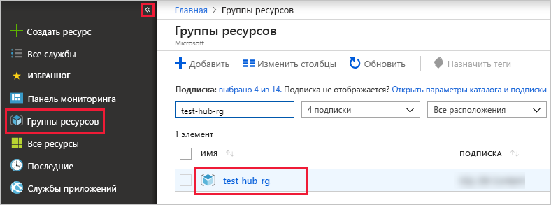

# <a name="ingest-data-from-iot-hub-into-azure-data-explorer-preview"></a>Прием данных из центра Интернета вещей в обозреватель данных Azure (Предварительная версия)

> [!div class="op_single_selector"]
> * [Microsoft Azure](ingest-data-iot-hub.md)
> * [C#](data-connection-iot-hub-csharp.md)
> * [Python](data-connection-iot-hub-python.md)
> * [Шаблон Azure Resource Manager](data-connection-iot-hub-resource-manager.md)

Обозреватель данных Azure — это быстрая и высокомасштабируемая служба для изучения данных журналов и телеметрии. Azure обозреватель данных обеспечивает прием (загрузку данных) из центра Интернета вещей, платформы потоковой передачи больших данных и службы приема Интернета вещей.

## <a name="prerequisites"></a>Технические условия

* Если у вас еще нет подписки Azure, создайте [бесплатную учетную запись](https://azure.microsoft.com/free/) Azure, прежде чем начинать работу.
* Создайте [тестовый кластер и базу данных](create-cluster-database-portal.md) с именем базы данных *TestDB*.
* [Пример приложения](https://github.com/Azure-Samples/azure-iot-samples-csharp) и документация по моделированию устройства.
* [Visual Studio 2019](https://visualstudio.microsoft.com/vs/) для запуска примера приложения.

## <a name="create-an-iot-hub"></a>Создание центра Интернета вещей

[!INCLUDE [iot-hub-include-create-hub](../../includes/iot-hub-include-create-hub.md)]

## <a name="register-a-device-to-the-iot-hub"></a>Регистрация устройства в центре Интернета вещей

[!INCLUDE [iot-hub-get-started-create-device-identity](../../includes/iot-hub-get-started-create-device-identity.md)]

## <a name="create-a-target-table-in-azure-data-explorer"></a>Создание целевой таблицы в обозревателе данных Azure

Теперь вы создадите таблицу в обозреватель данных Azure, к которой центры Интернета вещей будут отсылать данные. Создайте таблицу в кластере и базе данных, подготовленные в [**предварительных требованиях**](#prerequisites).

1. На портале Azure перейдите в свой кластер и выберите **Запрос**.

    

1. Скопируйте следующую команду в окно и выберите **Выполнить**, чтобы создать таблицу (TestTable), которая будет принимать входящие данные.

    ```Kusto
    .create table TestTable (temperature: real, humidity: real)
    ```
    
    

1. Скопируйте следующую команду в окно и выберите **Выполнить** для сопоставления входящих данных JSON с именами столбцов и типами данных таблицы (TestTable).

    ```Kusto
    .create table TestTable ingestion json mapping 'TestMapping' '[{"column":"humidity","path":"$.humidity","datatype":"real"},{"column":"temperature","path":"$.temperature","datatype":"real"}]'
    ```

## <a name="connect-azure-data-explorer-table-to-iot-hub"></a>Подключение таблицы обозреватель данных Azure к центру Интернета вещей

Теперь вы подключаетесь к центру Интернета вещей из обозреватель данных Azure. После завершения этого подключения данные, перенаправляемые в потоки центра Интернета вещей в [созданную вами целевую таблицу](#create-a-target-table-in-azure-data-explorer).

1. На панели инструментов выберите **уведомления** , чтобы убедиться, что развертывание центра Интернета вещей успешно завершено.

1. В созданном кластере **выберите базы данных и** выберите базу данных, созданную **TestDB**.
    
    

1. Выберите **Прием данных** и **Добавить подключение к данным**. Заполните форму, указав следующую информацию. Когда все будет готово, выберите **создать** .

    

    **Источник данных**:

    **Параметр** | **Описание поля**
    |---|---|
    | Имя подключения к данным | Имя подключения, которое необходимо создать в Azure обозреватель данных
    | Центр Интернета вещей | Имя Центра Интернета вещей |
    | Политика общего доступа | Имя политики общего доступа. Должны иметь разрешения на чтение |
    | Группа потребителей |  Группа потребителей, определенная в встроенной конечной точке центра Интернета вещей |
    | Свойства системы событий | [Свойства системы событий центра Интернета вещей](/azure/iot-hub/iot-hub-devguide-messages-construct#system-properties-of-d2c-iot-hub-messages). При добавлении системных свойств [Создайте](/azure/kusto/management/tables#create-table) или [Обновите](/azure/kusto/management/tables#alter-table-and-alter-merge-table) схему таблицы и [сопоставление](/azure/kusto/management/mappings) , чтобы включить выбранные свойства. | | | 

    > [!NOTE]
    > В случае [отработки отказа вручную](/azure/iot-hub/iot-hub-ha-dr#manual-failover)необходимо создать подключение к данным.

    **Целевая таблица**:

    Существуют два варианта маршрутизации принятых данных: *статическая* и *динамическая*. 
    В этой статье используется статическая маршрутизация, для которой нужно указать имя таблицы, формат данных и сопоставление. Поэтому не устанавливайте флажок **Мои данные содержат сведения о маршрутизации**.

     **Параметр** | **Рекомендуемое значение** | **Описание поля**
    |---|---|---|
    | Таблицы | *TestTable* | Таблица, созданная в **TestDB**. |
    | Формат данных | *JSON* | Поддерживаются форматы Avro, CSV, JSON, многострочные JSON, ПСВ, СОХСВ, СКСВ, TSV, ТСВЕ и TXT. |
    | Сопоставление столбцов | *TestMapping* | [Сопоставление](/azure/kusto/management/mappings) , созданное в **TestDB**, которое сопоставляет входящие данные JSON с именами столбцов и типами данных **TestDB**. Требуется для JSON, многострочного JSON и AVRO, а для других форматов — необязательно.|
    | | |

    > [!NOTE]
    > * Выберите **My data includes routing info** (Мои данные содержат сведения о маршрутизации) для использования динамической маршрутизации, при которой данные содержат необходимые сведения о маршрутизации, как показано в комментариях [примера приложения](https://github.com/Azure-Samples/event-hubs-dotnet-ingest). Если заданы свойства статической и динамической маршрутизации, то свойство динамической маршрутизации переопределяет свойство статической. 
    > * Принимаются только события, помещенные в очередь после создания подключения к данным.

## <a name="generate-sample-data-for-testing"></a>Создание демонстрационных данных для тестирования

Приложение имитированного устройства подключается к конечной точке конкретного устройства Центра Интернета вещей и отправляет имитированную телеметрию температуры и влажности.

1. Скачайте пример проекта C# по ссылке https://github.com/Azure-Samples/azure-iot-samples-csharp/archive/master.zip и извлеките ZIP-архив.

1. В окне терминала на локальном компьютере перейдите в корневую папку примера проекта C#. Затем перейдите в папку **iot-hub\Quickstarts\simulated-device**.

1. Откройте файл **SimulatedDevice.cs** в любом текстовом редакторе.

    Замените значение переменной `s_connectionString` строкой подключения устройства, [зарегистрируйте устройство в центре Интернета вещей](#register-a-device-to-the-iot-hub). Сохраните изменения в файле **SimulatedDevice.cs**.

1. Установите необходимые пакеты приложения имитированного устройства, выполнив в окне терминала на локальном компьютере следующие команды:

    ```cmd/sh
    dotnet restore
    ```

1. Создайте и запустите приложение имитированного устройства, выполнив в окне терминала на локальном компьютере следующие команды:

    ```cmd/sh
    dotnet run
    ```

    На следующем снимке экрана показан пример выходных данных, когда приложение имитированного устройства отправляет данные телеметрии в Центр Интернета вещей:

    

## <a name="review-the-data-flow"></a>Просмотр потока данных

После создания данных приложение теперь может видеть поток данных из центра Интернета вещей в таблицу в кластере.

1. В портал Azure в центре Интернета вещей вы увидите пиковое действие во время работы приложения.

    

1. Чтобы проверить, сколько сообщений поступило в базу данных к этому моменту, выполните следующий запрос в тестовой базе данных.

    ```Kusto
    TestTable
    | count
    ```

1. Чтобы увидеть содержимое сообщений, выполните следующий запрос:

    ```Kusto
    TestTable
    ```

    Результирующий набор:
    
    

    > [!NOTE]
    > * В Azure Data Explorer настроена политика агрегирования (пакетной обработки) для приема данных, предназначенных для оптимизации процесса. По умолчанию для политики настроено 5 минут или 500 МБ данных, поэтому может возникнуть задержка. См. раздел [Политика пакетной](/azure/kusto/concepts/batchingpolicy) обработки для параметров статистической обработки. 
    > * Настройте таблицу для поддержки потоковой передачи и отмените задержку в времени отклика. См. раздел [Политика потоковой передачи](/azure/kusto/concepts/streamingingestionpolicy). 

## <a name="clean-up-resources"></a>Очистка ресурсов

Если вы не планируете использовать центр Интернета вещей еще раз, очистите раздел **Test-Hub-RG**, чтобы избежать появления непостоянных затрат.

1. На портале Azure выберите **Группа ресурсов** слева, а затем выберите созданную группу ресурсов.  

    Если левое меню свернуто, нажмите  чтобы развернуть его.

   

1. В разделе **test-resource-group** выберите **Удалить группу ресурсов**.

1. В новом окне введите имя удаляемой группы ресурсов (*test-hub-rg*) и нажмите кнопку **Удалить**.

## <a name="next-steps"></a>Дальнейшие действия

* [Запрос данных в обозреватель данных Azure](web-query-data.md)
