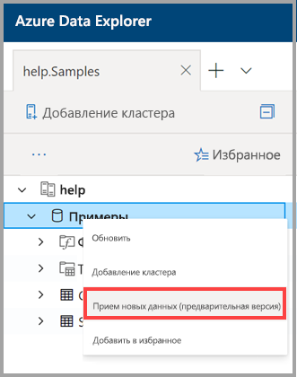

# Использование приема одним щелчком для приема данных в Azure обозреватель данных

В этой статье показано, как использовать прием одним щелчком для быстрого приема новой таблицы в формате JSON или CSV. Данные могут быть приняты из хранилища или из локального файла в существующую таблицу или новую таблицу. Используйте интуитивно понятный мастер однократного щелчка и ваши данные поступают в течение нескольких минут. Затем можно изменить таблицу и выполнить запросы с помощью пользовательского веб-интерфейса Azure обозреватель данных.

## Технические условия

* Если у вас еще нет подписки Azure, создайте [бесплатную учетную запись](https://azure.microsoft.com/free/) Azure, прежде чем начинать работу.
* Выполните [вход в приложение](https://dataexplorer.azure.com/).
* Создайте [кластер Azure обозреватель данных и базу данных](create-cluster-database-portal.md).
* Войдите в [Пользовательский веб-интерфейс](https://dataexplorer.azure.com/) и [Добавьте подключение к кластеру](/azure/data-explorer/web-query-data#add-clusters).
* Создайте источник данных в службе хранилища Azure.

## Прием новых данных

1. Щелкните правой кнопкой мыши *базу данных* или строку *таблицы* в левом меню веб-интерфейса и выберите пункт принять **новые данные (Предварительная версия)** .

       
 
1. В окне прием **новых данных (Предварительная версия)** выберите вкладку **источник** и заполните **сведения о проекте**:

    * В поле **Таблица**выберите имя существующей таблицы из раскрывающегося меню или щелкните **создать** , чтобы создать новую таблицу.
    * Для **типа приема**выберите либо **из хранилища** , либо **из файла**.
        * Если вы выбрали **из хранилища**, выберите **ссылку на хранилище** , чтобы добавить URL-адрес. Используйте [URL-адрес SAS BLOB](/azure/vs-azure-tools-storage-explorer-blobs#get-the-sas-for-a-blob-container) для частных учетных записей хранения. 
            * Если вы выбрали **из файла**, нажмите кнопку **Обзор** и перетащите файл в поле.
    * Выберите **изменить схему** , чтобы просмотреть и изменить конфигурацию столбца таблицы.
 
     

    > [!TIP]
    > Если выбрать параметр принять **новые данные (Предварительная версия)** в строке *таблицы* , то выбранное имя таблицы появится в **сведениях о проекте**.

1. Если выбрана существующая таблица, откроется окно **Map Columns** , в котором сопоставляются столбцы исходных данных с целевыми столбцами таблицы. 
    * Используйте **параметр опустить столбец** , чтобы удалить целевой столбец из таблицы. 
    * Используйте **новый столбец** , чтобы добавить новый столбец в таблицу. 

    

1. На вкладке **схема** выполните следующие действия.

    * Выберите **тип сжатия** в раскрывающемся меню и выберите **несжатые** **файлы или gzip**.
    * Выберите **Формат данных** из раскрывающегося меню, а затем выберите **JSON**, **CSV**, **TSV**, **сксв**, **сохсв**, **тсве**или **ПСВ**. 
        * При выборе формата **JSON** также необходимо выбрать **уровни JSON**— от 1 до 10. Уровни влияют на отображение данных столбца таблицы. 
        * При выборе формата, отличного от JSON, необходимо установить флажок **включить имена столбцов** , чтобы игнорировать строку заголовка файла.
    * **Имя сопоставления** задается автоматически, но может быть изменено.
    * Если выбрана существующая таблица, можно выбрать пункт **Map Columns (сопоставлять столбцы** ), чтобы открыть окно « **Map Columns** ».

    

1. Над панелью **редактора** нажмите кнопку **v** , чтобы открыть редактор. В редакторе можно просматривать и копировать автоматические запросы, созданные на основе входных данных. 

1.  В таблице: 
    * Щелкните правой кнопкой мыши заголовки новых столбцов, чтобы **изменить тип данных**, **Переименовать столбец**, **удалить столбец**, **Сортировать по возрастанию**или **Сортировать по убыванию**. В существующих столбцах доступна только сортировка данных. 
    * Дважды щелкните имя нового столбца, чтобы изменить его.

1. Выберите **начать** прием, чтобы создать таблицу и сопоставление и начать прием данных.

     
 
## Запрашивание данных

1. В окне **приема данных завершено** все три шага будут отмечены зелеными галочками, если прием данных завершается успешно.
 
    

1. Нажмите кнопку **v** , чтобы открыть запрос. Скопируйте в пользовательский веб-интерфейс, чтобы изменить запрос.

1. Меню справа содержит **быстрые запросы** и параметры **инструментов** . 

    * **Быстрые запросы** включают ссылки на веб-интерфейс с примерами запросов.
    * **Средства** содержат ссылку на **Удаление команд** в веб-интерфейсе, что позволяет устранять неполадки, запуская соответствующие команды `.drop`.

    > [!TIP]
    > Данные могут быть потеряны с помощью команд `.drop`. Внимательно используйте их.

## Дальнейшие действия

* [Запрос данных в веб-ИНТЕРФЕЙСе обозреватель данных Azure](web-query-data.md)
* [Написание запросов для обозреватель данных Azure с помощью языка запросов Kusto](write-queries.md)
