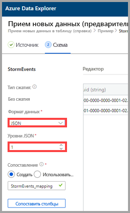
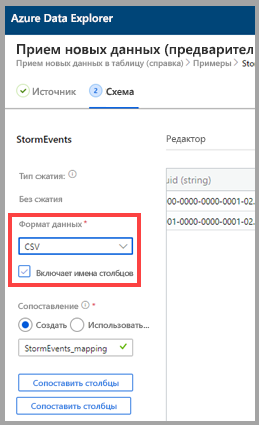
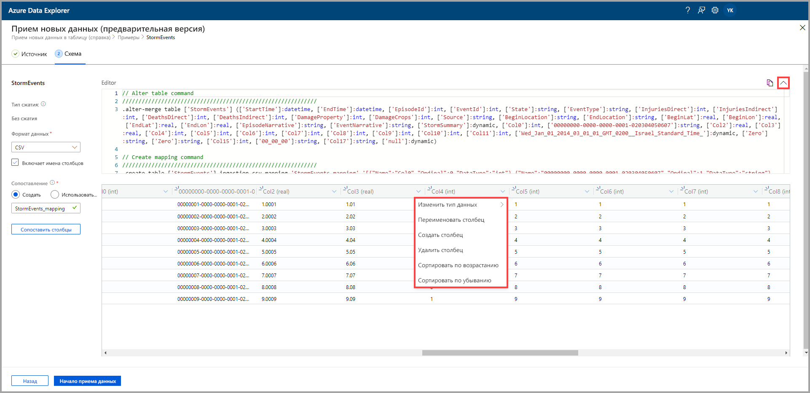
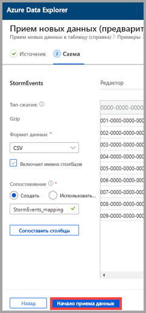
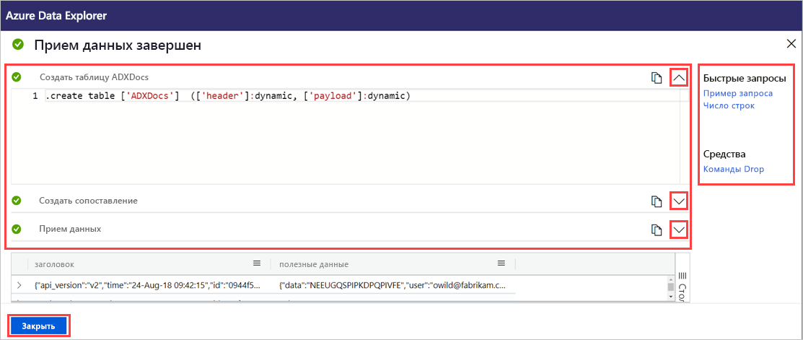

# Использование обработки "одним щелчком" для приема данных в существующую таблицу Azure Data Explorer

Функция приема одним щелчком позволяет быстро принимать данные в формате JSON, CSV и других форматах в таблицу. Используя пользовательский веб-интерфейс Azure Data Explorer, вы можете принимать данные из хранилища, локального файла или контейнера. 

В этом документе описывается использование интуитивно понятного мастера "одним щелчком" для приема данных JSON из файла в существующую таблицу. Затем вы можете изменить таблицу и выполнить запросы с помощью пользовательского веб-интерфейса Azure Data Explorer.

Возможность приема данных одним щелчком особенно полезна при первом приеме данных или в случае, когда схема данных вам незнакома. 

Общие сведения об обработке "одним щелчком" и списке необходимых компонентов см. в статье [Использование обработки "одним нажатием" для приема данных в Azure Data Explorer](ingest-data-one-click.md).
Сведения о приеме данных в новую таблицу в Azure Data Explorer см. в статье [Использование обработки "одним нажатием" для приема данных в новую таблицу в Azure Data Explorer](one-click-ingestion-new-table.md)

## Прием новых данных

1. В левом меню веб-интерфейса щелкните правой кнопкой мыши *базу данных* или *таблицу* и выберите **Ingest new data (Preview)** (Прием новых данных (предварительная версия)).

       
 
1. В окне **Ingest new data (Preview)** (Прием новых данных (предварительная версия)) автоматически выбирается вкладка **Источник**.

1. Если поле **Таблица** не заполнено автоматически, выберите имя существующей таблицы из раскрывающегося меню.
    > [!TIP]
    > Если выбрать **Ingest new data (Preview)** (Прием новых данных (предварительная версия)) в строке *таблицы*, выбранное имя таблицы появится в области **Сведения о проекте**.

[!INCLUDE [data-explorer-one-click-ingestion-types](../../includes/data-explorer-one-click-ingestion-types.md)]
    
Выберите **Изменение схемы**, чтобы просмотреть и изменить конфигурацию столбца таблицы.

## Изменение схемы

1. Откроется диалоговое окно **Сопоставить столбцы**, в котором можно сопоставлять столбцы исходных данных с целевыми столбцами таблицы. 
    * В полях **Исходные столбцы** введите имена столбцов, которые нужно сопоставлять со столбцами **Целевые столбцы**.
    * Чтобы удалить сопоставление, выберите значок удаления.

    

1. Нажмите кнопку **Обновить**.
1. На вкладке **Схема** выполните следующее.
    1. Выберите **тип сжатия**, а затем — либо **Без сжатия**, либо **GZip**.

        [!INCLUDE [data-explorer-one-click-ingestion-edit-schema](../../includes/data-explorer-one-click-ingestion-edit-schema.md)]
        
    1. При выборе **JSON** необходимо также выбрать **уровни JSON**, от 1 до 10. Уровни влияют на отображение данных столбца таблицы.

    

    * Если выбран формат, отличный от JSON, можно установить флажок **Include column names** (Включить имена столбцов), чтобы не учитывать строку заголовка файла.
        
    

    > [!Note]
    > Табличные форматы в таблице Azure Data Explorer могут принимать данные столбцов только в один столбец. 

    * Новые сопоставления устанавливаются автоматически, но вы можете изменить их, чтобы использовать существующие. 
    * Чтобы открыть окно **Сопоставить столбцы**, можно выбрать **Сопоставить столбцы**.

## Копирование и вставка запросов

1. Над областью **Редактор** нажмите кнопку **v**, чтобы открыть редактор. В редакторе можно просматривать и копировать автоматические команды, созданные на основе входных данных. 
1. В этой таблице выполните следующие действия. 
    * Выберите новые заголовки столбцов, чтобы добавить **Новый столбец**, **Удалить столбец**, **Сортировать по возрастанию** или **Сортировать по убыванию**. В существующих столбцах доступна только сортировка данных.

    > [!Note]
    > * Для существующих таблиц невозможно обновить имя и тип данных.
    > * Команды удаления отменяют только изменения, которые были внесены потоком приема данных (новые экстенты и столбцы). Другие не будут удалены.

 

## Начало приема

Выберите **Start ingestion** (Начать прием), чтобы создать таблицу и сопоставление и начать прием данных.

## Прием данных завершен

Если прием данных завершается успешно, в окне **Data ingestion completed** (Прием данных завершен) все три шага будут отмечены зелеными галочками.
 

[!INCLUDE [data-explorer-one-click-ingestion-query-data](../../includes/data-explorer-one-click-ingestion-query-data.md)]

## Дальнейшие действия

* [Краткое руководство. Запрос данных в пользовательском веб-интерфейсе Azure Data Explorer](/azure/data-explorer/web-query-data)
* [Написание запросов для Azure Data Explorer](/azure/data-explorer/write-queries)
