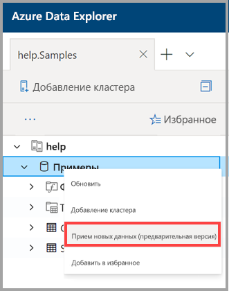
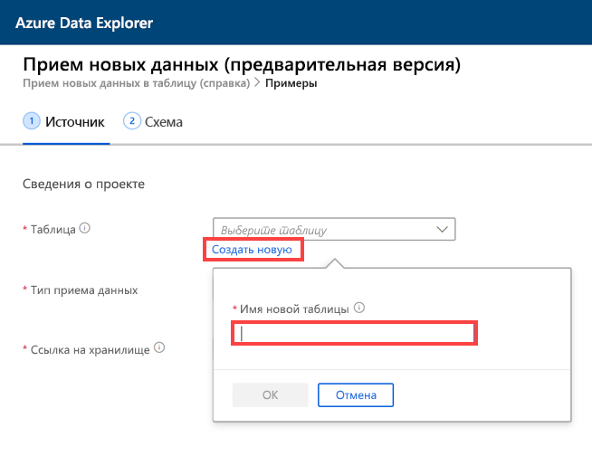
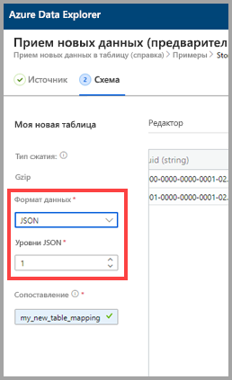
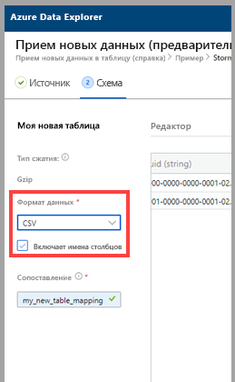
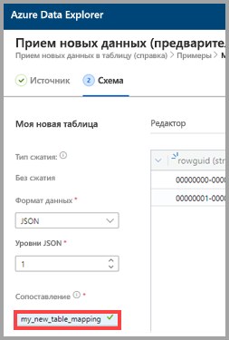
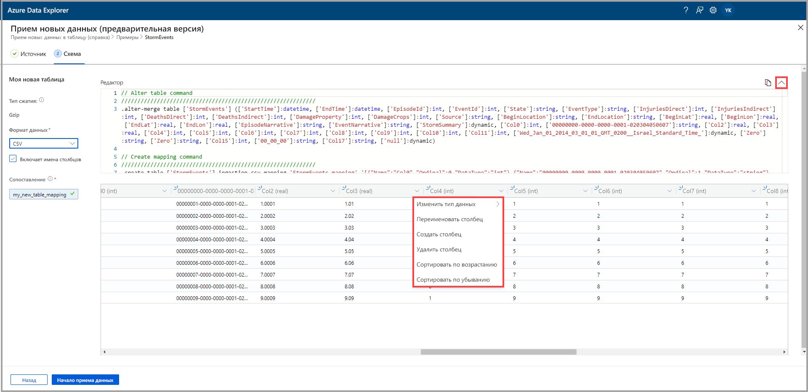
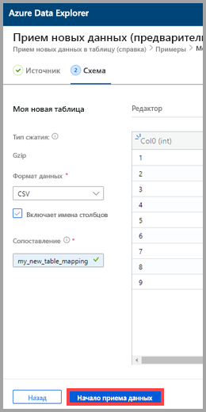
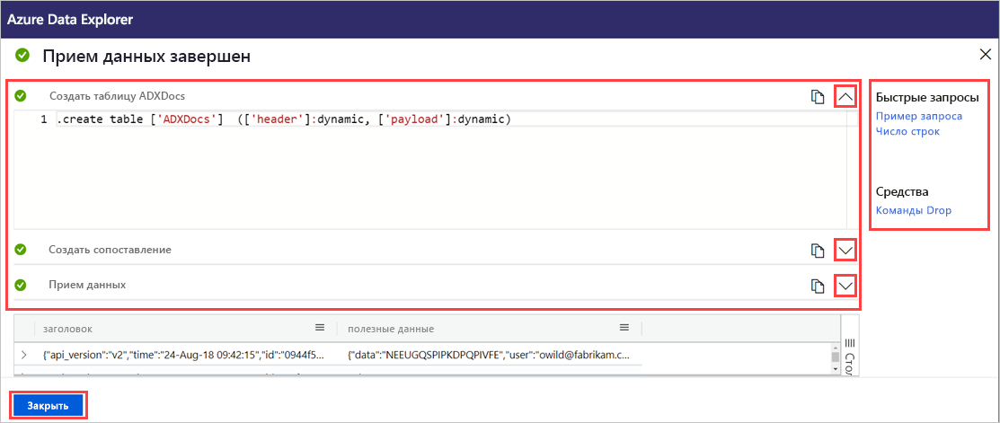

# Прием данных в новую таблицу Azure Data Explorer одним щелчком

Функция приема одним щелчком позволяет быстро принимать данные в формате JSON, CSV и других форматах в таблицу. Используя пользовательский веб-интерфейс Azure Data Explorer, вы можете принимать данные из хранилища, локального файла или контейнера. 

В этом документе описывается использование интуитивно понятного мастера выполнения операций одним щелчком для приема данных CSV из контейнера в новую таблицу. Затем вы можете изменить таблицу и выполнить запросы с помощью пользовательского веб-интерфейса Azure Data Explorer. Вы также можете настроить непрерывный прием данных, чтобы принимать их автоматически в таблицу при обновлении исходных данных.

Возможность приема данных одним щелчком особенно полезна при первом приеме данных или в случае, когда схема данных вам незнакома. 

Общие сведения о приеме одним щелчком и список предварительных условий см. в [этой статье](ingest-data-one-click.md).
Сведения о приеме данных в имеющуюся таблицу в Azure Data Explorer см. в [этой статье](one-click-ingestion-existing-table.md).

## Прием новых данных

1. В меню веб-интерфейса пользователя слева щелкните правой кнопкой мыши *базу данных* и выберите **Ingest new data (Preview)** (Прием новых данных (предварительная версия)).

       
 
1. В окне **Ingest new data (Preview)** (Прием новых данных (предварительная версия)) будет автоматически выбрана вкладка **Источник**. 

1. Выберите **Создать таблицу** и введите имя новой таблицы. Вы можете использовать буквенно-цифровые символы, дефисы и символы подчеркивания. Специальные символы не поддерживаются.

 

[!INCLUDE [data-explorer-one-click-ingestion-types](../../includes/data-explorer-one-click-ingestion-types.md)]

Выберите **Изменение схемы**, чтобы просмотреть и изменить конфигурацию столбца таблицы. Система случайным образом выберет один из больших двоичных объектов и создаст схему на основе этого объекта. Проанализировав имя источника, служба автоматически определяет, сжат он или нет.

## Изменение схемы

1. На вкладке **Схема** выполните следующие действия:

    1. Выберите **Формат данных**:

        [!INCLUDE [data-explorer-one-click-ingestion-edit-schema](../../includes/data-explorer-one-click-ingestion-edit-schema.md)]

    1. При выборе **JSON** необходимо также задать значение для поля **JSON levels** (Уровни JSON), выбрав от 1 до 10. Уровни влияют на отображение данных столбца таблицы. 

    

    * Выбрав формат, отличный от JSON, вы можете установить флажок **Include column names** (Включить имена столбцов), чтобы игнорировать строку заголовка файла.

        
        
1. В поле **Mapping name** (Имя сопоставления) укажите имя сопоставления. Вы можете использовать буквенно-цифровые символы и символы подчеркивания. Пробелы, специальные символы и дефисы не поддерживаются.
    
    

## Копирование и вставка запросов

1. Над панелью **Редактор** нажмите кнопку **v**, чтобы открыть редактор. В редакторе вы можете просматривать и копировать автоматические запросы, сгенерированные на основе входных данных. 
1. В таблице выполните следующие действия: 
    * Дважды щелкните имя нового столбца, чтобы изменить его.
    * Выберите новые заголовки столбцов и выполните любое из следующих действий:
    
|Действие         |Описание                                  |
|-----------------|-------------------------------------------|
|Изменение типа данных |Изменение типа данных с автоматически выбранного службой на один из [поддерживаемых типов данных](#edit-the-schema)|
|Переименование столбца    |Изменение имени столбца |
|Новый столбец       |Добавление нового столбца|
|Удаление столбца    |Удаление выбранного столбца|
|Сортировка по возрастанию   |Сортировка таблицы по выделенным столбцам в порядке возрастания (только имеющиеся столбцы)|
|Сортировка по убыванию  |Сортировка таблицы по выделенным столбцам в порядке убывания (только имеющиеся столбцы) |

> [!Note]
> Табличные форматы поддерживают прием столбцов в один столбец в Azure Data Explorer.
> Вы можете создавать столбцы из разных уровней JSON.

 

## Начало приема данных

Выберите **Start ingestion** (Начать прием данных), чтобы создать таблицу и сопоставление и начать прием данных.

## Завершение приема данных

Если прием данных завершается успешно, в окне **Data ingestion completed** (Прием данных завершен) все три этапа будут отмечены зелеными галочками.
 

[!INCLUDE [data-explorer-one-click-ingestion-query-data](../../includes/data-explorer-one-click-ingestion-query-data.md)]

**Непрерывный прием**

Функция непрерывного приема позволяет создать сетку событий, которая прослушивает исходный контейнер. Любой новый большой двоичный объект, который соответствует критериям предварительно определенных параметров (префикса, суффикса и т. д.), будет автоматически включен в целевую таблицу.

> [!Note]
> Функция непрерывного приема применима только к приему из контейнера.

1. Выберите **Continuous ingestion** (Непрерывный прием), чтобы открыть портал Azure. Страница подключения к данным отображается с открытым соединителем данных сетки событий и уже введенными исходными и целевыми параметрами (контейнер источника, таблицы и сопоставления).

1. Выберите **Создать**, чтобы создать подключение к данным, которое будет прослушивать любые изменения в этом контейнере. 

## Дальнейшие действия

* [Краткое руководство. Запрос данных в пользовательском веб-интерфейсе Azure Data Explorer](/azure/data-explorer/web-query-data)
* [Написание запросов для Azure Data Explorer на языке запросов Kusto](/azure/data-explorer/write-queries)
