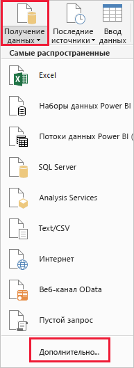
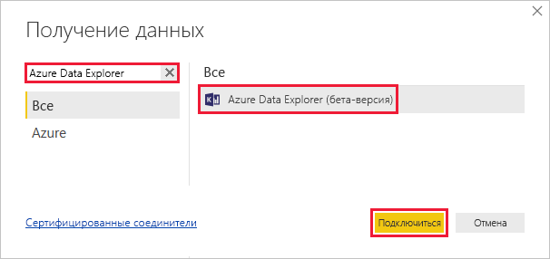
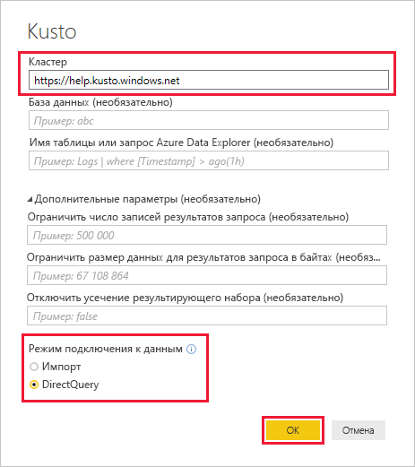
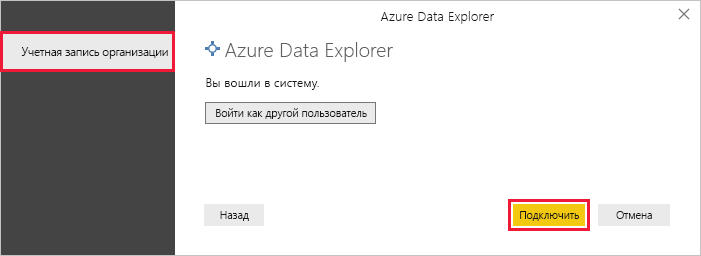
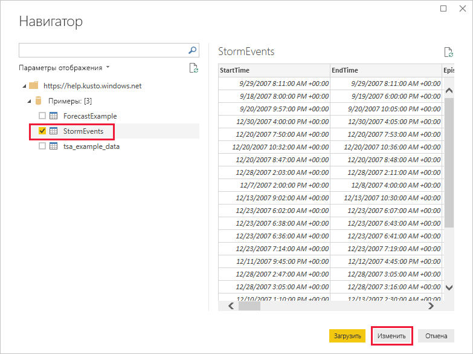
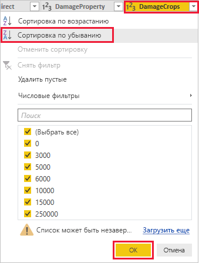
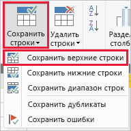
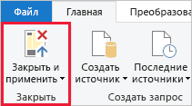

# Визуализация данных с помощью соединителя Azure Data Explorer для Power BI

Обозреватель данных Azure — это быстрая и высокомасштабируемая служба для изучения данных журналов и телеметрии. Power BI — это решение бизнес-аналитики, позволяющее визуализировать данные и делиться результатами с коллегами.

Azure Data Explorer поддерживает три варианта подключения к данным в Power BI: использование встроенного соединителя, импорт запроса из Azure Data Explorer и использование SQL-запроса. В этой статье показано, как использовать встроенный соединитель для получения данных и их визуализации в отчете Power BI.

Если у вас еще нет подписки Azure, создайте [бесплатную учетную запись](https://azure.microsoft.com/free/) Azure, прежде чем начинать работу.

## Технические условия

Вам потребуется для работы с этой статьей:

* учетная запись электронной почты организации, подключенной к Azure Active Directory, для доступа к [кластеру help в Azure Data Explorer](https://dataexplorer.azure.com/clusters/help/databases/samples);

* [Power BI Desktop](https://powerbi.microsoft.com/get-started/) (выберите **Скачать бесплатно**);

## Получение данных из Azure Data Explorer

Сначала подключитесь к кластеру help Azure Data Explorer, а затем добавьте часть данных из таблицы *StormEvents*. [!INCLUDE [data-explorer-storm-events](../../includes/data-explorer-storm-events.md)]

1. В Power BI Desktop на вкладке **Главная** выберите **Получение данных**, а затем — **Дополнительно**.

    

1. Поиск *обозреватель данных Azure*выберите **обозреватель данных Azure** затем **Connect**.

    

1. На **обозреватель данных Azure (Kusto)** экрана, заполните форму, указав следующие сведения.

    

    **Параметр** | **Значение** | **Описание поля**
    |---|---|---|
    | HDInsight | *https://help.kusto.windows.net* | URL-адрес кластера help. Для других кластеров URL-адрес имеет вид *https://\<Имя_кластера\>.\<Регион\>.kusto.windows.net*. |
    | База данных | Не указывайте | База данных, размещенная в кластере, к которому вы подключаетесь. Это будет указано позже. |
    | Имя таблицы | Не указывайте | Одна из таблиц в базе данных или запрос, например <code>StormEvents \| take 1000</code>. Это будет указано позже. |
    | Расширенные параметры | Не указывайте | Варианты запроса, например размер результирующего набора. |
    | Режим подключения к данным | *DirectQuery* | Определяет, должно ли решение Power BI импортировать данные или подключаться непосредственно к источнику данных. С этим соединителем можно использовать любой вариант. |
    | | | |

1. Если вы еще не установили подключение к кластеру help, выполните вход. Войдите с помощью учетной записи организации и выберите **Подключение**.

    

1. На экране **Навигатор** разверните базу данных **Примеры**, выберите **StormEvents**, а затем **Изменить**.

    

    Таблица откроется в редакторе запросов Power, где можно изменить строки и столбцы перед импортом данных.

1. В редакторе Power Query щелкните стрелку рядом со столбцом **DamageCrops** и выберите **Сортировка по убыванию**.

    

1. На вкладке **Главная** выберите **Сохранить строки**, а затем **Сохранить верхние строки**. Введите значение *1000* для сохранения 1000 верхних строк отсортированной таблицы.

    

1. На вкладке **Главная** выберите **Закрыть и применить**.

    

## Визуализация данных в отчете

[!INCLUDE [data-explorer-power-bi-visualize-basic](../../includes/data-explorer-power-bi-visualize-basic.md)]

## Очистка ресурсов

Если больше не требуется отчет, который вы создали в этой статье, удалите файл Power BI Desktop (pbix).

## Дальнейшие действия

[Визуализация данных с помощью запроса импортированных в Power BI](power-bi-imported-query.md)
