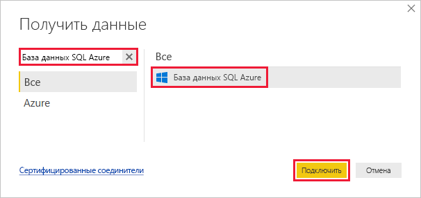
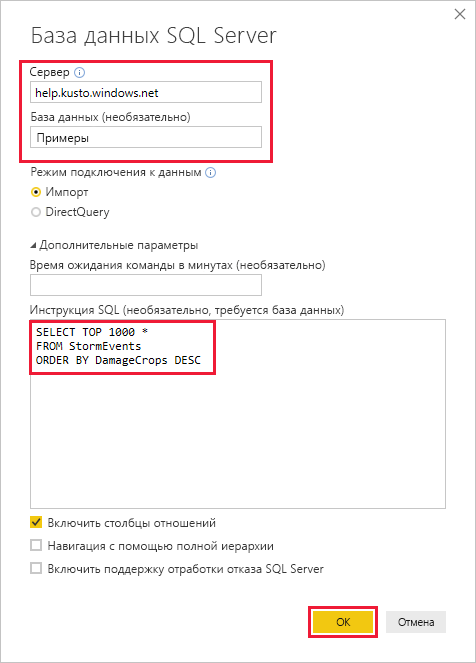
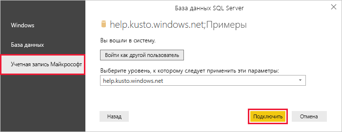
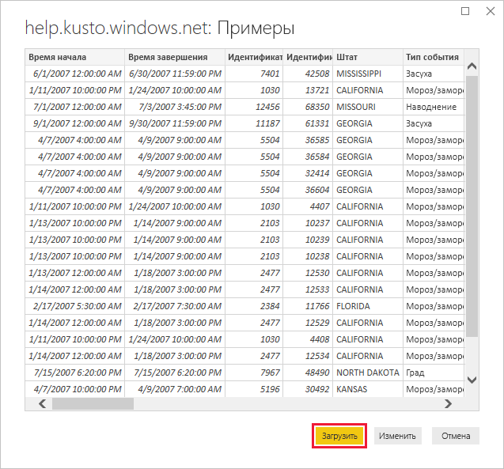

# <a name="quickstart-visualize-data-using-the-azure-data-explorer-connector-for-power-bi"></a>Краткое руководство. Визуализация данных с использованием соединителя Azure Data Explorer для Power BI

Обозреватель данных Azure — это быстрая и высокомасштабируемая служба для изучения данных журналов и телеметрии. Power BI — это решение бизнес-аналитики, позволяющее визуализировать данные и делиться результатами с коллегами.

Azure Data Explorer поддерживает три варианта подключения к данным в Power BI: использование встроенного соединителя, импорт запроса из Azure Data Explorer или использование SQL-запроса. В этом кратком руководстве показано, как использовать SQL-запрос для получения и визуализации данных в отчете Power BI.

Если у вас еще нет подписки Azure, создайте [бесплатную учетную запись](https://azure.microsoft.com/free/) Azure, прежде чем начинать работу.

## <a name="prerequisites"></a>Предварительные требования

Для работы с этим кратким руководством вам понадобится следующее:

* рабочая учетная запись электронной почты, входящая в Azure Active Directory, для подключения к [кластеру help Azure Data Explorer](https://dataexplorer.azure.com/clusters/help/databases/samples);

* [Power BI Desktop](https://powerbi.microsoft.com/get-started/) (выберите **СКАЧАТЬ БЕСПЛАТНО**).

## <a name="get-data-from-azure-data-explorer"></a>Получение данных из Azure Data Explorer

Сначала подключитесь к кластеру help Azure Data Explorer, а затем выведите часть данных из таблицы *StormEvents*. [!INCLUDE [data-explorer-storm-events](../../includes/data-explorer-storm-events.md)]

Обычно можно использовать собственный язык запросов Azure Data Explorer, но эта служба также поддерживает SQL-запросы, которые мы используем в нашем примере. Azure Data Explorer автоматически преобразует SQL-запрос в собственный запрос.

1. В Power BI Desktop на вкладке **Главная** выберите **Получение данных**, а затем — **Дополнительно**.

    

1. Введите в поле поиска *База данных SQL Azure*, выберите элемент **База данных SQL Azure** и нажмите кнопку **Подключить**.

    

1. В окне **База данных SQL Server** введите в поля формы следующие сведения.

    

    **Параметр** | **Значение** | **Описание поля**
    |---|---|---|
    | сервер; | *help.kusto.windows.net* | URL-адрес кластера help (без *https://*). Для других кластеров URL-адрес имеет вид *\<имя_кластера\>.\<регион\>.kusto.windows.net*. |
    | База данных | *Примеры* | Пример базы данных размещен в кластере, к которому вы подключаетесь. |
    | Режим подключения к данным | *Импорт* | Определяет, должно ли решение Power BI импортировать данные или подключаться непосредственно к источнику данных. С этим соединителем можно использовать любой вариант. |
    | Время ожидания команды | Не указывайте | Длительность выполнения запроса до того, как будет выдана ошибка превышения времени ожидания. |
    | Инструкция SQL | Скопируйте запрос под этой таблицей | Инструкция SQL, которую Azure Data Explorer преобразует в собственный запрос. |
    | Другие варианты | Оставьте значения по умолчанию | Параметры, которые не применимы к кластерам Azure Data Explorer. |
    | | | |

    ```SQL
    SELECT TOP 1000 *
    FROM StormEvents
    ORDER BY DamageCrops DESC
    ```

1. Если вы еще не установили подключение к кластеру help, выполните вход. Выполните вход с учетной записью Майкрософт, а затем нажмите кнопку **Подключить**.

    

1. В окне **help.kusto.windows.net: Samples** нажмите кнопку **Загрузить**.

    

    Таблица откроется в представлении отчета главного окна Power BI, где можно создавать отчеты на основе примера данных.

## <a name="visualize-data-in-a-report"></a>Визуализация данных в отчете

[!INCLUDE [data-explorer-power-bi-visualize-basic](../../includes/data-explorer-power-bi-visualize-basic.md)]

## <a name="clean-up-resources"></a>Очистка ресурсов

Если отчет, созданный в рамках этого краткого руководства, вам больше не нужен, удалите файл Power BI Desktop (PBIX).

## <a name="next-steps"></a>Дополнительная информация

> [!div class="nextstepaction"]
> [Quickstart: Visualize data using the Azure Data Explorer connector for Power BI](power-bi-connector.md) (Краткое руководство. Визуализация данных с помощью соединителя Azure Data Explorer для Power BI)