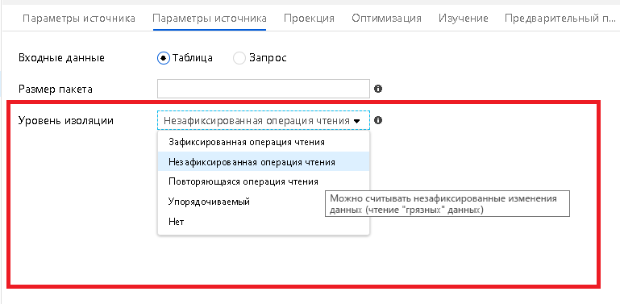

# <a name="mapping-data-flows-performance-and-tuning-guide"></a>Сопоставление потоков данных о производительности и настройке

[!INCLUDE [notes](../../includes/data-factory-data-flow-preview.md)]

Потоки данных сопоставления фабрики данных Azure предоставляют интерфейс браузера без поддержки кода для проектирования, развертывания и координации преобразований данных в масштабе.

> [!NOTE]
> Если вы не знакомы с потоками данных сопоставления ADF в целом, см. статью [Общие сведения о потоках данных](concepts-data-flow-overview.md) перед прочтением этой статьи.
>

> [!NOTE]
> При проектировании и тестировании потоков данных из пользовательского интерфейса ADF обязательно включите параметр отладки, чтобы можно было выполнять потоки данных в режиме реального времени, не дожидаясь прогрева кластера.
>


## <a name="monitor-data-flow-performance"></a>Мониторинг производительности потока данных

При проектировании потоков данных сопоставления в браузере можно выполнять модульное тестирование каждого отдельного преобразования, щелкнув вкладку Предварительный просмотр данных в нижней области параметров для каждого преобразования. Следующим шагом является проверка готовности потока данных в конструкторе конвейеров. Добавьте действие выполнение потока данных и используйте кнопку Отладка для проверки производительности потока данных. В нижней области окна конвейера в разделе "действия" появится значок эйегласс:


При щелчке этого значка отображается план выполнения и последующий профиль производительности потока данных. Эти сведения можно использовать для оценки производительности потока данных по различным источникам данных. Обратите внимание, что время выполнения задания кластера в общих вычислениях производительности может быть равно 1 минуте, и если вы используете Azure Integration Runtime по умолчанию, может также потребоваться добавить 5 минут для запуска кластера.


## <a name="optimizing-for-azure-sql-database-and-azure-sql-data-warehouse"></a>Оптимизация для базы данных SQL Azure и хранилища данных SQL Azure


### <a name="partition-your-source-data"></a>Секционирование исходных данных

* Перейдите в раздел "оптимизация" и выберите "источник". Задайте в запросе либо конкретный столбец таблицы, либо тип.
* Если выбрано значение "столбец", выберите столбец секционирования.
* Кроме того, задайте максимальное число подключений к базе данных SQL Azure. Вы можете использовать более высокий параметр для получения параллельных подключений к базе данных. Однако в некоторых случаях может повыситься производительность с ограниченным числом подключений.
* Таблицы базы данных источника не обязательно должны быть секционированы.
* Задание запроса в преобразовании источника, совпадающего со схемой секционирования таблицы базы данных, позволит ядру базы данных-источника использовать исключение секций.
* Если источник еще не секционирован, ADF будет по-прежнему использовать секционирование данных в среде преобразования Spark на основе ключа, выбранного в преобразовании «источник».

### <a name="set-batch-size-and-query-on-source"></a>Установка размера пакета и запроса к источнику


* Установка размера пакета позволит службе ADF хранить данные в наборах памяти, а не построчно. Это необязательный параметр, и в случае неправильного их размера на этих узлах могут быть исчерпаны ресурсы.
* Задание запроса позволяет фильтровать строки прямо в источнике, прежде чем они поступают в поток данных для обработки, что может ускорить получение начального значения данных.
* При использовании запроса можно добавить дополнительные указания запросов для базы данных SQL Azure, т. е. READ UNCOMMITTED.

### <a name="set-isolation-level-on-source-transformation-settings-for-sql-datasets"></a>Установка уровня изоляции в параметрах преобразования источника для наборов данных SQL

* Чтение незафиксированных данных обеспечит более быстрый результат выполнения запроса при преобразовании источника



### <a name="set-sink-batch-size"></a>Задать размер пакета приемника


* Чтобы избежать построчной обработки потоков данных, установите значение параметра "размер пакета" в параметрах приемника для базы данных SQL Azure. Это позволит ADF обрабатывать записи базы данных в пакетах на основе указанного размера.

### <a name="set-partitioning-options-on-your-sink"></a>Настройка параметров секционирования в приемнике

* Даже если у вас нет данных, секционированных в целевых таблицах базы данных SQL Azure, перейдите на вкладку оптимизировать и задайте секционирование.
* Очень часто, просто указывая ADF, что использование циклического перебора секционирования в кластерах выполнения Spark приводит к значительному ускорению загрузки данных вместо принудительного выполнения всех подключений с одного узла или раздела.

### <a name="increase-size-of-your-compute-engine-in-azure-integration-runtime"></a>Увеличение размера модуля вычислений в Azure Integration Runtime


* Увеличьте число ядер, что увеличит количество узлов и предоставит дополнительные вычислительные мощности для запросов и записи в базу данных SQL Azure.
* Воспользуйтесь параметрами "оптимизировано для вычислений" и "оптимизировано для памяти", чтобы применить дополнительные ресурсы к вашим узлам вычислений.

### <a name="unit-test-and-performance-test-with-debug"></a>Модульный тест и тест производительности с отладкой

* При использовании потоков данных модульного тестирования установите для кнопки "Отладка потока данных" значение "вкл.".
* В конструкторе потока данных используйте вкладку Предварительный просмотр данных в преобразованиях для просмотра результатов логики преобразования.
* Модульное тестирование потоков данных из конструктора конвейера путем размещения действия потока данных на холсте конструктора конвейера и использования кнопки "Отладка" для проверки.
* Тестирование в режиме отладки будет работать в среде с действующей средой кластера без необходимости дожидаться раскрутки JIT-кластера.

### <a name="disable-indexes-on-write"></a>Отключить индексы при записи
* Используйте действие хранимой процедуры конвейера ADF перед действием потока данных, которое отключает индексы в целевых таблицах, записываемых из приемника.
* После действия потока данных добавьте еще одно действие хранимой процедуры, которое позволило бы использовать эти индексы.

### <a name="increase-the-size-of-your-azure-sql-db"></a>Увеличение размера базы данных SQL Azure
* Запланируйте изменение размера источника и приемника базы данных SQL Azure перед запуском конвейера, чтобы увеличить пропускную способность и снизить регулирование Azure после достижения ограничений DTU.
* После завершения выполнения конвейера можно изменить размер баз данных до нормальной скорости выполнения.

## <a name="optimizing-for-azure-sql-data-warehouse"></a>Оптимизация для хранилища данных SQL Azure

### <a name="use-staging-to-load-data-in-bulk-via-polybase"></a>Использование промежуточного хранения для загрузки данных с помощью polybase

* Чтобы избежать построчной обработки потоков данных, установите параметр промежуточного хранения в параметрах приемника, чтобы ADF-файл мог использовать polybase, чтобы избежать вставки строк в хранилище. Это позволит ADF использовать polybase, чтобы данные можно было загружать в небольшого объема.
* При выполнении действия потока данных из конвейера с включенной промежуточной версией необходимо выбрать расположение хранилища больших двоичных объектов для хранения промежуточных данных для выполнения групповой загрузки.

### <a name="increase-the-size-of-your-azure-sql-dw"></a>Увеличение размера хранилища данных SQL Azure

* Запланируйте изменение размера исходного и приемника хранилища данных SQL Azure перед запуском конвейера, чтобы увеличить пропускную способность и снизить регулирование Azure после достижения ограничений DWU.

* После завершения выполнения конвейера можно изменить размер баз данных до нормальной скорости выполнения.

## <a name="optimize-for-files"></a>Оптимизировать для файлов

* Вы можете управлять количеством секций, которые будет использовать ADF. В каждом преобразовании «источник & приемника», а также в каждом отдельном преобразовании можно задать схему секционирования. Для небольших файлов может оказаться, что выбор одной секции может работать лучше и быстрее, чем при запросе Spark разбивать небольшие файлы.
* Если у вас недостаточно сведений об исходных данных, можно выбрать секционирование с циклическим перебором и задать количество секций.
* Если вы изучаете данные и обнаружите, что у вас есть столбцы, которые могут быть хорошими хэш-ключами, используйте параметр хэш-секционирования.

### <a name="file-naming-options"></a>Параметры именования файлов

* По умолчанию преобразование преобразованных данных в потоки данных сопоставления ADF осуществляется в набор данных, имеющий связанную службу BLOB-объекта или ADLS. Необходимо задать этот набор данных, указывающий на папку или контейнер, а не на именованный файл.
* Потоки данных используют Azure Databricks Spark для выполнения. Это означает, что выходные данные будут разделены на несколько файлов на основе секционирования Spark по умолчанию или схемы секционирования, которая была выбрана явно.
* Очень распространенной операцией в потоках данных ADF является выбор параметра «вывод в отдельный файл», чтобы все файлы выходных данных были объединены вместе в один выходной файл.
* Однако эта операция требует, чтобы выходные данные уменьшились до одной секции на одном узле кластера.
* При выборе этого популярного варианта помните об этом. Если многие большие исходные файлы объединяются в один раздел выходного файла, можно запустить ресурсы узла кластера.
* Чтобы избежать исчерпания ресурсов кластерных узлов, можно использовать схему секционирования по умолчанию или явную в ADF, которая оптимизирует производительность, а затем добавить в конвейер последующее действие копирования, которое объединяет все файлы частей из выходной папки в новый единый файл. File. По сути, этот метод отделяет действие преобразования от слияния файлов и достигает того же результата, что и параметр "вывод в отдельный файл".

### <a name="looping-through-file-lists"></a>Цикл по спискам файлов

В большинстве случаев потоки данных в ADF будут работать лучше из конвейера, позволяющего преобразованиям источника потока данных выполнять итерацию по нескольким файлам. Иными словами, рекомендуется использовать подстановочные знаки или списки файлов внутри источника в потоке данных, чем для прохода по большому списку файлов с помощью ForEach в конвейере, вызывая поток выполнения данных для каждой итерации. Процесс потока данных будет выполняться быстрее, позволяя выполнять цикл в потоке данных.

Например, если у меня есть список файлов данных с июля 2019, которые я хочу обработать в папке в хранилище BLOB-объектов, будет более производительно вызывать действие "выполнение потока данных" один раз из конвейера и использовать подстановочный знак в источнике следующим образом. :

```DateFiles/*_201907*.txt```

Это будет выполняться лучше, чем поиск хранилища больших двоичных объектов в конвейере, который затем проходит по всем соответствующим файлам с помощью ForEach с действием «выполнение потока данных» внутри.

## <a name="next-steps"></a>Следующие шаги

См. Другие статьи о потоках данных, связанные с производительностью:

- [Вкладка «оптимизация потока данных»](concepts-data-flow-optimize-tab.md)
- [Действие потока данных](control-flow-execute-data-flow-activity.md)
- [Мониторинг производительности потока данных](concepts-data-flow-monitoring.md)
