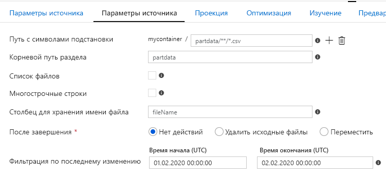
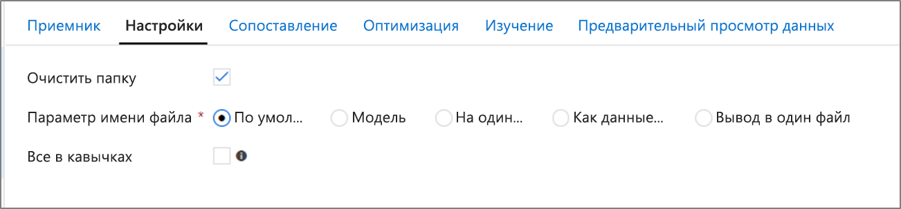

# <a name="copy-and-transform-data-in-azure-blob-storage-by-using-azure-data-factory"></a>Копирование данных в хранилище больших двоичных объектов Azure и обратно с помощью фабрики данных Azure

> [!div class="op_single_selector" title1="Выберите используемую версию службы "Фабрика данных":"]
> * [Версия 1](v1/data-factory-azure-blob-connector.md)
> * [Текущая версия](connector-azure-blob-storage.md)

[!INCLUDE[appliesto-adf-asa-md](includes/appliesto-adf-asa-md.md)]

В этой статье описано, как с помощью действия копирования в фабрике данных Azure копировать данные из хранилища BLOB-объектов Azure и в него. В нем также описывается, как использовать действие потока данных для преобразования данных в хранилище BLOB-объектов Azure. Дополнительные сведения о Фабрике данных Azure см. во [вводной статье](introduction.md).

>[!TIP]
>Сведения о сценарии миграции для Data Lake или хранилища данных см. в статье [Использование фабрики данных Azure для переноса данных из хранилища данных в Azure](data-migration-guidance-overview.md).

## <a name="supported-capabilities"></a>Поддерживаемые возможности

Этот соединитель хранилища BLOB-объектов Azure поддерживается для следующих действий:

- [Действие копирования](copy-activity-overview.md) с использованием матрицы [поддерживаемых источников и приемников](copy-activity-overview.md).
- [Поток данных для сопоставления](concepts-data-flow-overview.md)
- [Действие поиска](control-flow-lookup-activity.md)
- [Действие получения метаданных в Фабрике данных Azure](control-flow-get-metadata-activity.md)
- [Действие удаления](delete-activity.md)

Для действия копирования этот соединитель хранилища BLOB-объектов поддерживает:

- Копирование больших двоичных объектов в учетные записи хранения Azure общего назначения, в хранилище горячих и холодных BLOB-объектов и из них. 
- Копирование больших двоичных объектов с помощью ключа учетной записи, подписанного URL-адресу службы (SAS), субъекта-службы или управляемых удостоверений для проверки подлинности ресурсов Azure.
- Копирование больших двоичных объектов из блочных, добавочных или страничных BLOB-объектов, а также копирование данных только в блочные BLOB-объекты.
- Копирование больших двоичных объектов как есть, анализ или создание больших двоичных объектов с [поддерживаемыми форматами файлов и кодеками сжатия](supported-file-formats-and-compression-codecs.md).
- [Сохранение метаданных файлов во время копирования](#preserving-metadata-during-copy).

>[!IMPORTANT]
>Если включить параметр **разрешить доверенным службам Майкрософт доступ к этой учетной записи хранения** в параметрах брандмауэра службы хранилища Azure и вы хотите использовать среду выполнения интеграции Azure для подключения к хранилищу BLOB-объектов, необходимо использовать [проверку подлинности управляемого удостоверения](#managed-identity).

## <a name="get-started"></a>Начало работы

[!INCLUDE [data-factory-v2-connector-get-started](../../includes/data-factory-v2-connector-get-started.md)]

Следующие разделы содержат сведения о свойствах, которые используются для определения сущностей фабрики данных, характерных для хранилища BLOB-объектов.

## <a name="linked-service-properties"></a>Свойства связанной службы

Этот соединитель хранилища BLOB-объектов поддерживает следующие типы проверки подлинности. Дополнительные сведения см. в соответствующих разделах.

- [Проверка подлинности на основе ключа учетной записи](#account-key-authentication)
- [Аутентификация SAS](#shared-access-signature-authentication)
- [Проверка подлинности субъекта-службы](#service-principal-authentication)
- [Управляемые удостоверения для проверки подлинности ресурсов Azure](#managed-identity)

>[!NOTE]
>При использовании Polybase для загрузки данных в хранилище данных SQL Azure, если в исходном или промежуточном хранилище BLOB-объектов настроена конечная точка виртуальной сети Azure, необходимо использовать управляемую проверку подлинности с идентификацией в соответствии с требованиями Polybase. Также необходимо использовать локальную среду выполнения интеграции версии 3,18 или более поздней. Дополнительные требования к конфигурации см. в разделе [Проверка подлинности управляемого удостоверения](#managed-identity) .

>[!NOTE]
>Действия Azure HDInsight и Машинное обучение Azure поддерживают только проверку подлинности, которая использует ключи учетной записи хранилища BLOB-объектов Azure.

### <a name="account-key-authentication"></a>Проверка подлинности на основе ключа учетной записи

Фабрика данных поддерживает следующие свойства для проверки подлинности с помощью ключа учетной записи хранения.

| Свойство | Описание | Обязательно |
|:--- |:--- |:--- |
| type | Для свойства **Type** необходимо задать значение **AzureBlobStorage** (предложено) или **AzureStorage** (см. следующие примечания). |Да |
| connectionString | Укажите сведения, необходимые для подключения к хранилищу для свойства **ConnectionString** . <br/> Можно также поместить ключ учетной записи в Azure Key Vault и извлечь `accountKey` конфигурацию из строки подключения. Дополнительные сведения см. в следующих примерах и в статье [хранение учетных данных в Azure Key Vault](store-credentials-in-key-vault.md) . |Да |
| connectVia | [Среда выполнения интеграции](concepts-integration-runtime.md), используемая для подключения к хранилищу данных. Вы можете использовать среду выполнения интеграции Azure или локальную среду выполнения интеграции (если хранилище данных находится в частной сети). Если это свойство не указано, служба использует среду выполнения интеграции Azure по умолчанию. |Нет |

>[!NOTE]
>Дополнительная конечная точка службы BLOB-объектов не поддерживается при использовании проверки подлинности ключа учетной записи. Можно использовать другие типы аутентификации.

>[!NOTE]
>Если вы используете связанную службу типа "AzureStorage", она по-прежнему поддерживается как есть. Но мы рекомендуем использовать новый тип связанной службы "AzureBlobStorage", который будет передаваться вперед.

**Пример**.

```json
{
    "name": "AzureBlobStorageLinkedService",
    "properties": {
        "type": "AzureBlobStorage",
        "typeProperties": {
            "connectionString": "DefaultEndpointsProtocol=https;AccountName=<accountname>;AccountKey=<accountkey>"
        },
        "connectVia": {
            "referenceName": "<name of Integration Runtime>",
            "type": "IntegrationRuntimeReference"
        }
    }
}
```

**Пример. Сохранение ключа учетной записи в Azure Key Vault**

```json
{
    "name": "AzureBlobStorageLinkedService",
    "properties": {
        "type": "AzureBlobStorage",
        "typeProperties": {
            "connectionString": "DefaultEndpointsProtocol=https;AccountName=<accountname>;",
            "accountKey": { 
                "type": "AzureKeyVaultSecret", 
                "store": { 
                    "referenceName": "<Azure Key Vault linked service name>", 
                    "type": "LinkedServiceReference" 
                }, 
                "secretName": "<secretName>" 
            }
        },
        "connectVia": {
            "referenceName": "<name of Integration Runtime>",
            "type": "IntegrationRuntimeReference"
        }            
    }
}
```

### <a name="shared-access-signature-authentication"></a>Аутентификация SAS

Подпись общего доступа обеспечивает делегированный доступ к ресурсам в вашей учетной записи хранения. Вы можете использовать подписанный URL-адрес, чтобы предоставить клиенту ограниченные разрешения на работу с объектами в вашей учетной записи хранения на определенный период. 

Не нужно предоставлять совместный доступ к ключам доступа для учетной записи. Подписанный URL-адрес — это универсальный код ресурса (URI), который в своих параметрах запроса содержит все сведения, необходимые для доступа к ресурсу хранилища с прохождением аутентификации. Для доступа к ресурсам хранилища с помощью подписанного URL-адреса клиенту достаточно передать SAS в соответствующий конструктор или метод. 

Дополнительные сведения о подписанных URL-адресах см. в разделе [Использование подписанных URL-адресов (SAS): Что такое подписанный URL-адрес?](../storage/common/storage-dotnet-shared-access-signature-part-1.md)

> [!NOTE]
>- Сейчас Фабрика данных поддерживает как *подписанные URL-адреса уровня службы*, так и *подписанные URL-адреса уровня учетной записи*. Дополнительные сведения о подписанных URL см. [в статье предоставление ограниченного доступа к ресурсам службы хранилища Azure с помощью подписанных](../storage/common/storage-sas-overview.md)URL.
>- В последующих конфигурациях набора данных путь к папке — это абсолютный путь, начинающийся с уровня контейнера. Вам нужно настроить такой путь, соответствующий пути в вашем URI SAS.

Фабрика данных поддерживает следующие свойства для использования проверки подлинности подписанного URL:

| Свойство | Описание | Обязательно |
|:--- |:--- |:--- |
| type | Для свойства **Type** необходимо задать значение **AzureBlobStorage** (предложено) или **AzureStorage** (см. следующую заметку). |Да |
| sasUri | Укажите URI подписанного URL-адрес для ресурсов хранилища, таких как BLOB-объект или контейнер. <br/>Пометьте это поле как **SecureString** , чтобы безопасно хранить его в фабрике данных. Также можно разместить маркер SAS в Azure Key Vault, чтобы использовать автоматическое вращение и удалить часть токена. Дополнительные сведения см. в следующих примерах и [хранение учетных данных в Azure Key Vault](store-credentials-in-key-vault.md). |Да |
| connectVia | [Среда выполнения интеграции](concepts-integration-runtime.md), используемая для подключения к хранилищу данных. Вы можете использовать среду выполнения интеграции Azure или локальную среду выполнения интеграции (если хранилище данных находится в частной сети). Если это свойство не указано, служба использует среду выполнения интеграции Azure по умолчанию. |Нет |

>[!NOTE]
>Если вы используете связанную службу типа "AzureStorage", она по-прежнему поддерживается как есть. Но мы рекомендуем использовать новый тип связанной службы "AzureBlobStorage", который будет передаваться вперед.

**Пример**.

```json
{
    "name": "AzureBlobStorageLinkedService",
    "properties": {
        "type": "AzureBlobStorage",
        "typeProperties": {
            "sasUri": {
                "type": "SecureString",
                "value": "<SAS URI of the Azure Storage resource e.g. https://<accountname>.blob.core.windows.net/?sv=<storage version>&st=<start time>&se=<expire time>&sr=<resource>&sp=<permissions>&sip=<ip range>&spr=<protocol>&sig=<signature>>"
            }
        },
        "connectVia": {
            "referenceName": "<name of Integration Runtime>",
            "type": "IntegrationRuntimeReference"
        }
    }
}
```

**Пример. Сохранение ключа учетной записи в Azure Key Vault**

```json
{
    "name": "AzureBlobStorageLinkedService",
    "properties": {
        "type": "AzureBlobStorage",
        "typeProperties": {
            "sasUri": {
                "type": "SecureString",
                "value": "<SAS URI of the Azure Storage resource without token e.g. https://<accountname>.blob.core.windows.net/>"
            },
            "sasToken": { 
                "type": "AzureKeyVaultSecret", 
                "store": { 
                    "referenceName": "<Azure Key Vault linked service name>", 
                    "type": "LinkedServiceReference" 
                }, 
                "secretName": "<secretName with value of SAS token e.g. ?sv=<storage version>&st=<start time>&se=<expire time>&sr=<resource>&sp=<permissions>&sip=<ip range>&spr=<protocol>&sig=<signature>>" 
            }
        },
        "connectVia": {
            "referenceName": "<name of Integration Runtime>",
            "type": "IntegrationRuntimeReference"
        }
    }
}
```

При создании URI подписанного URL-адреса необходимо учитывать следующее.

- Задайте для объектов соответствующие разрешения на чтение или запись. Они устанавливаются с учетом назначения связанной службы (чтение, запись, чтение и запись) в фабрике данных.
- Задайте **время окончания срока действия** соответствующим образом. Убедитесь, что срок действия доступа к объектам хранилища не истекает в период активности конвейера.
- Универсальный код ресурса (URI) должен быть создан в правильном контейнере или большом двоичном объекте в зависимости от необходимости. URI подписанного URL-адреса для большого двоичного объекта позволяет фабрике данных получить доступ к определенному большому двоичному объекту. URI подписанного URL-адреса для контейнера хранилища BLOB-объектов позволяет Фабрике данных выполнить итерацию по большим двоичным объектам в этом контейнере. Чтобы предоставить доступ к большему или меньшему количеству объектов позднее или обновить URI подписанного URL-адреса, не забудьте обновить связанную службу с помощью нового URI.

### <a name="service-principal-authentication"></a>Проверка подлинности субъекта-службы

Общие сведения о проверке подлинности субъекта-службы хранилища Azure см. [в статье аутентификация доступа к службе хранилища Azure с помощью Azure Active Directory](../storage/common/storage-auth-aad.md).

Чтобы использовать проверку подлинности субъекта-службы, выполните следующие действия.

1. Чтобы зарегистрировать сущность приложения в Azure Active Directory (Azure AD), необходимо следовать указаниям из раздела [Регистрация приложения в клиенте Azure AD](../storage/common/storage-auth-aad-app.md#register-your-application-with-an-azure-ad-tenant). Запишите эти значения, которые можно использовать для определения связанной службы:

    - Идентификатор приложения
    - Ключ приложения
    - Tenant ID

2. Предоставьте правильное разрешение субъекта-службы в Хранилище BLOB-объектов Azure. Дополнительные сведения о ролях см. в статье [Управление правами доступа к данным службы хранилища Azure с помощью RBAC](../storage/common/storage-auth-aad-rbac.md).

    - В **качестве источника**в **элементе управления доступом (IAM)** предоставьте по крайней мере роль **читателя данных BLOB-объекта хранилища** .
    - В **качестве приемника**в **элементе управления доступом (IAM)** предоставьте по крайней мере роль **участника данных BLOB-объекта хранилища** .

Для связанной службы хранилища BLOB-объектов Azure поддерживаются следующие свойства.

| Свойство | Описание | Обязательно |
|:--- |:--- |:--- |
| type | Для свойства **Type** необходимо задать значение **AzureBlobStorage**. |Да |
| serviceEndpoint | Укажите конечную точку хранилища больших двоичных объектов Azure с шаблоном `https://<accountName>.blob.core.windows.net/`. |Да |
| servicePrincipalId | Укажите идентификатора клиента приложения. | Да |
| servicePrincipalKey | Укажите ключ приложения. Пометьте это поле как **SecureString** , чтобы безопасно хранить его в фабрике данных, или [сослаться на секрет, хранящийся в Azure Key Vault](store-credentials-in-key-vault.md). | Да |
| tenant | Укажите сведения о клиенте (доменное имя или идентификатор клиента), в котором находится приложение. Извлеките его, наведя указатель мыши на правый верхний угол портал Azure. | Да |
| азуреклаудтипе | Для проверки подлинности субъекта-службы укажите тип облачной среды Azure, в которую зарегистрировано приложение Azure Active Directory. <br/> Допустимые значения: **азурепублик**, **AzureChina**, **AzureUsGovernment**и **азурежермани**. По умолчанию используется облачная среда фабрики данных. | Нет |
| connectVia | [Среда выполнения интеграции](concepts-integration-runtime.md), используемая для подключения к хранилищу данных. Вы можете использовать среду выполнения интеграции Azure или локальную среду выполнения интеграции (если хранилище данных находится в частной сети). Если это свойство не указано, служба использует среду выполнения интеграции Azure по умолчанию. |Нет |

>[!NOTE]
>Проверка подлинности субъекта-службы поддерживается только связанной службой типа "AzureBlobStorage", а не предыдущей связанной службой типа "AzureStorage".

**Пример**.

```json
{
    "name": "AzureBlobStorageLinkedService",
    "properties": {
        "type": "AzureBlobStorage",
        "typeProperties": {            
            "serviceEndpoint": "https://<accountName>.blob.core.windows.net/",
            "servicePrincipalId": "<service principal id>",
            "servicePrincipalKey": {
                "type": "SecureString",
                "value": "<service principal key>"
            },
            "tenant": "<tenant info, e.g. microsoft.onmicrosoft.com>" 
        },
        "connectVia": {
            "referenceName": "<name of Integration Runtime>",
            "type": "IntegrationRuntimeReference"
        }
    }
}
```

### <a name="managed-identities-for-azure-resource-authentication"></a><a name="managed-identity"></a> Управляемые удостоверения для проверки подлинности ресурсов Azure

Фабрика данных может быть связана с [управляемым удостоверением для ресурсов Azure](data-factory-service-identity.md), которое представляет эту фабрику данных. Вы можете напрямую использовать это управляемое удостоверение для проверки подлинности хранилища BLOB-объектов, похожее на использование собственного субъекта-службы. Она позволяет этой назначенной фабрике получать доступ к данным и копировать их из хранилища BLOB-объектов.

Общие сведения о проверке подлинности службы хранилища Azure см. [в статье аутентификация доступа к службе хранилища Azure с помощью Azure Active Directory](../storage/common/storage-auth-aad.md). Чтобы использовать управляемые удостоверения для проверки подлинности ресурсов Azure, выполните следующие действия.

1. [Получите управляемые сведения об удостоверении фабрики данных](data-factory-service-identity.md#retrieve-managed-identity) , СКОПИРОВАВ значение идентификатора управляемого объекта идентификатора, созданного вместе с фабрикой.

2. Предоставьте разрешение на управляемое удостоверение в хранилище BLOB-объектов Azure. Дополнительные сведения о ролях см. в статье [Управление правами доступа к данным службы хранилища Azure с помощью RBAC](../storage/common/storage-auth-aad-rbac.md).

    - В **качестве источника**в **элементе управления доступом (IAM)** предоставьте по крайней мере роль **читателя данных BLOB-объекта хранилища** .
    - В **качестве приемника**в **элементе управления доступом (IAM)** предоставьте по крайней мере роль **участника данных BLOB-объекта хранилища** .

>[!IMPORTANT]
>Если вы используете Polybase для загрузки данных из хранилища BLOB-объектов (в качестве источника или промежуточного хранения) в хранилище данных SQL, то при использовании проверки подлинности управляемого удостоверения для хранилища BLOB-объектов обязательно выполните шаги 1 и 2 [этого руководства](../azure-sql/database/vnet-service-endpoint-rule-overview.md#impact-of-using-vnet-service-endpoints-with-azure-storage). Эти действия позволят зарегистрировать сервер в Azure AD и назначить серверу роль участника данных BLOB-объекта хранилища. Фабрика данных обрабатывает остальные компоненты. Если вы настроили хранилище BLOB-объектов с помощью конечной точки виртуальной сети Azure, чтобы использовать Polybase для загрузки данных из нее, необходимо использовать управляемую проверку подлинности с идентификацией в соответствии с требованиями Polybase.

Для связанной службы хранилища BLOB-объектов Azure поддерживаются следующие свойства.

| Свойство | Описание | Обязательно |
|:--- |:--- |:--- |
| type | Для свойства **Type** необходимо задать значение **AzureBlobStorage**. |Да |
| serviceEndpoint | Укажите конечную точку хранилища больших двоичных объектов Azure с шаблоном `https://<accountName>.blob.core.windows.net/`. |Да |
| connectVia | [Среда выполнения интеграции](concepts-integration-runtime.md), используемая для подключения к хранилищу данных. Вы можете использовать среду выполнения интеграции Azure или локальную среду выполнения интеграции (если хранилище данных находится в частной сети). Если это свойство не указано, служба использует среду выполнения интеграции Azure по умолчанию. |Нет |

> [!NOTE]
> Управляемые удостоверения для проверки подлинности ресурсов Azure поддерживаются только связанной службой типа "AzureBlobStorage", а не предыдущей связанной службой типа "AzureStorage".

**Пример**.

```json
{
    "name": "AzureBlobStorageLinkedService",
    "properties": {
        "type": "AzureBlobStorage",
        "typeProperties": {            
            "serviceEndpoint": "https://<accountName>.blob.core.windows.net/"
        },
        "connectVia": {
            "referenceName": "<name of Integration Runtime>",
            "type": "IntegrationRuntimeReference"
        }
    }
}
```

## <a name="dataset-properties"></a>Свойства набора данных

Полный список разделов и свойств, доступных для определения наборов данных, см. в статье о [наборах данных](concepts-datasets-linked-services.md). 

[!INCLUDE [data-factory-v2-file-formats](../../includes/data-factory-v2-file-formats.md)] 

Следующие свойства поддерживаются для хранилища BLOB-объектов Azure в `location` параметрах набора данных на основе формата:

| Свойство   | Описание                                                  | Обязательно |
| ---------- | ------------------------------------------------------------ | -------- |
| type       | Свойство **Type** расположения в наборе данных должно иметь значение **азуреблобсторажелокатион**. | Да      |
| контейнер  | Контейнер больших двоичных объектов.                                          | Да      |
| folderPath | Путь к папке в заданном контейнере. Если вы хотите использовать подстановочный знак для фильтрации папки, пропустите этот параметр и укажите его в параметрах источника действия. | Нет       |
| fileName   | Имя файла в заданном контейнере и пути к папке. Если вы хотите использовать подстановочный знак для фильтрации файлов, пропустите этот параметр и укажите значение в параметрах источника действия. | Нет       |

**Пример**.

```json
{
    "name": "DelimitedTextDataset",
    "properties": {
        "type": "DelimitedText",
        "linkedServiceName": {
            "referenceName": "<Azure Blob Storage linked service name>",
            "type": "LinkedServiceReference"
        },
        "schema": [ < physical schema, optional, auto retrieved during authoring > ],
        "typeProperties": {
            "location": {
                "type": "AzureBlobStorageLocation",
                "container": "containername",
                "folderPath": "folder/subfolder"
            },
            "columnDelimiter": ",",
            "quoteChar": "\"",
            "firstRowAsHeader": true,
            "compressionCodec": "gzip"
        }
    }
}
```

## <a name="copy-activity-properties"></a>Свойства действия копирования

Полный список разделов и свойств, используемых для определения действий, см. в статье [Конвейеры и действия в фабрике данных Azure](concepts-pipelines-activities.md). В этом разделе содержится список свойств, которые поддерживаются источником и приемником хранилища BLOB-объектов.

### <a name="blob-storage-as-a-source-type"></a>Хранилище BLOB-объектов в качестве типа источника

[!INCLUDE [data-factory-v2-file-formats](../../includes/data-factory-v2-file-formats.md)] 

Следующие свойства поддерживаются для хранилища BLOB-объектов Azure в `storeSettings` параметрах в источнике копирования на основе формата:

| Свойство                 | Описание                                                  | Обязательно                                      |
| ------------------------ | ------------------------------------------------------------ | --------------------------------------------- |
| type                     | Свойство **Type** в разделе `storeSettings` должно иметь значение **азуреблобсторажереадсеттингс**. | Да                                           |
| ***Поиск файлов для копирования*** |  |  |
| ВАРИАНТ 1. Статический путь<br> | Копирование из указанного контейнера или папки/пути к файлу, которые указаны в наборе данных. Если вы хотите скопировать все большие двоичные объекты из контейнера или папки, дополнительно укажите `wildcardFileName` в качестве `*` . |  |
| ВАРИАНТ 2. Префикс BLOB-объекта<br>- prefix | Префикс для имени большого двоичного объекта в заданном контейнере, настроенном в наборе данных для фильтрации исходных больших двоичных объектов. Будут выбраны большие двоичные объекты, имена которых начинаются с `container_in_dataset/this_prefix` . Он использует фильтр на стороне службы для хранилища BLOB-объектов, что обеспечивает лучшую производительность по сравнению с фильтром с подстановочными знаками. | нет                                                          |
| ВАРИАНТ 3. Подстановочный знак<br>- wildcardFolderPath | Путь к папке с подстановочными знаками в заданном контейнере, настроенном в наборе данных для фильтрации исходных папок. <br>Допустимые знаки подстановки: `*` (соответствует нулю или нескольким символам) и `?` (соответствует нулю или одному символу). Используйте `^` для экранирования, если имя папки содержит подстановочный знак или escape-символ внутри. <br>Дополнительные примеры приведены в разделе [Примеры фильтров папок и файлов](#folder-and-file-filter-examples). | нет                                            |
| ВАРИАНТ 3. Подстановочный знак<br>- wildcardFileName | Имя файла с подстановочными знаками в указанном контейнере и пути к папке (или пути к папке с подстановочными знаками) для фильтрации исходных файлов. <br>Допустимые знаки подстановки: `*` (соответствует нулю или нескольким символам) и `?` (соответствует нулю или одному символу). Используйте `^` для экранирования, если имя папки содержит подстановочный знак или escape-символ внутри. Дополнительные примеры приведены в разделе [Примеры фильтров папок и файлов](#folder-and-file-filter-examples). | Да |
| ВАРИАНТ 4. Список файлов<br>- fileListPath | Указывает, что нужно скопировать заданный набор файлов. Укажите текстовый файл, содержащий список файлов, которые необходимо скопировать, по одному файлу в строке, который является относительным путем к пути, настроенному в наборе данных.<br/>Если вы используете этот параметр, не указывайте имя файла в наборе данных. Ознакомьтесь с дополнительными примерами в разделе [Примеры списков файлов](#file-list-examples). |Нет |
| ***Дополнительные параметры*** |  | |
| recursive | Указывает, следует ли читать данные рекурсивно из вложенных папок или только из указанной папки. Обратите внимание, что если параметру **recursive** присвоено значение **true** и приемник является хранилищем на основе файлов, пустая папка или подпапка не копируется и не создается в приемнике. <br>Допустимые значения: **true** (по умолчанию) и **false**.<br>Это свойство не применяется при настройке `fileListPath`. |Нет |
| делетефилесафтеркомплетион | Указывает, будут ли удалены двоичные файлы из исходного хранилища после успешного перемещения в целевое хранилище. Файл удаляется для каждого файла, поэтому при сбое действия копирования вы увидите, что некоторые файлы уже скопированы в место назначения и удалены из источника, а остальные остаются в исходном хранилище. <br/>Это свойство допустимо только в сценариях двоичного копирования, где хранилища источников данных являются BLOB-объектами, ADLS 1-го поколения, ADLS 2-го поколения, S3, облачное хранилище Google, файл, файл Azure, SFTP или FTP. Значение по умолчанию: false. |Нет |
| modifiedDatetimeStart    | Файлы фильтруются с учетом атрибута: Последнее изменение. <br>Файлы будут выбраны, если время их последнего изменения находится в диапазоне времени `modifiedDatetimeStart` и `modifiedDatetimeEnd`. Время применяется к часовому поясу UTC в формате "2018-12-01T05:00:00Z". <br> Свойства могут иметь **значение NULL**, что означает, что фильтр атрибутов файла не будет применяться к набору данных.  Если `modifiedDatetimeStart` имеет значение DateTime, но `modifiedDatetimeEnd` равно **null**, то будут выбраны файлы, атрибут последнего изменения которых больше или равен значению DateTime.  Если `modifiedDatetimeEnd` имеет значение DateTime, но `modifiedDatetimeStart` равно **null**, то будут выбраны файлы, атрибут последнего изменения которых меньше значения DateTime.<br/>Это свойство не применяется при настройке `fileListPath`. | Нет                                            |
| modifiedDatetimeEnd      | То же, что и выше.                                               | Нет                                            |
| енаблепартитиондисковери | Для секционированных файлов укажите, следует ли анализировать секции из пути к файлу и добавить их в качестве дополнительных исходных столбцов.<br/>Допустимые значения: **false** (по умолчанию) и **true**. | Неверно                                            |
| партитионрутпас | Если обнаружение секций включено, укажите абсолютный корневой путь для чтения секционированных папок в виде столбцов данных.<br/><br/>Если значение не указано, по умолчанию<br/>— При использовании пути к файлу в наборе данных или списке файлов в источнике корневой путь к разделу — это путь, настроенный в наборе данных.<br/>— При использовании фильтра папки с подстановочными знаками корневой путь к разделу является вложенным путем перед первым подстановочным знаком.<br/>— При использовании префикса корневой путь к разделу является вложенным путем перед последним "/". <br/><br/>Например, предположим, что вы настроили путь в наборе данных как «root/папка/year = 2020/месяц = 08/Day = 27»:<br/>— Если указать корневой путь к разделу "root/папка/year = 2020", действие копирования создаст еще два столбца `month` и `day` со значением "08" и "27" соответственно в дополнение к столбцам внутри файлов.<br/>— Если корневой путь секции не указан, лишний столбец не будет создан. | Неверно                                            |
| maxConcurrentConnections | Количество одновременных подключений к хранилищу. Указывайте, только если требуется ограничить количество параллельных подключений к хранилищу данных. | Нет                                            |

> [!NOTE]
> Для формата текста Parquet/с разделителями тип **BlobSource** для источника действия копирования, упомянутый в следующем разделе, по-прежнему поддерживается в целях обратной совместимости. Мы рекомендуем использовать новую модель, пока пользовательский интерфейс создания фабрики данных не переключится на создание новых типов.

**Пример**.

```json
"activities":[
    {
        "name": "CopyFromBlob",
        "type": "Copy",
        "inputs": [
            {
                "referenceName": "<Delimited text input dataset name>",
                "type": "DatasetReference"
            }
        ],
        "outputs": [
            {
                "referenceName": "<output dataset name>",
                "type": "DatasetReference"
            }
        ],
        "typeProperties": {
            "source": {
                "type": "DelimitedTextSource",
                "formatSettings":{
                    "type": "DelimitedTextReadSettings",
                    "skipLineCount": 10
                },
                "storeSettings":{
                    "type": "AzureBlobStorageReadSettings",
                    "recursive": true,
                    "wildcardFolderPath": "myfolder*A",
                    "wildcardFileName": "*.csv"
                }
            },
            "sink": {
                "type": "<sink type>"
            }
        }
    }
]
```

### <a name="blob-storage-as-a-sink-type"></a>Хранилище BLOB-объектов в качестве типа приемника

[!INCLUDE [data-factory-v2-file-sink-formats](../../includes/data-factory-v2-file-sink-formats.md)] 

Следующие свойства поддерживаются для хранилища BLOB-объектов Azure в `storeSettings` параметрах в приемнике копирования на основе формата:

| Свойство                 | Описание                                                  | Обязательно |
| ------------------------ | ------------------------------------------------------------ | -------- |
| type                     | Свойство **Type** в разделе `storeSettings` должно иметь значение **азуреблобсторажевритесеттингс**. | Да      |
| copyBehavior             | Определяет поведение копирования, когда источником являются файлы из файлового хранилища данных.<br/><br/>Допустимые значения:<br/><b>— PreserveHierarchy (по умолчанию)</b>. Сохраняет иерархию файлов в целевой папке. Относительный путь исходного файла в исходной папке идентичен относительному пути целевого файла в целевой папке.<br/><b>— FlattenHierarchy</b>. Все файлы из исходной папки размещаются на первом уровне в целевой папке. Целевые файлы имеют автоматически сформированные имена. <br/><b>— MergeFiles</b>. Объединяет все файлы из исходной папки в один файл. Если указано имя Blob-объекта или имя файла, то оно присваивается объединенному файлу. В противном случае присваивается автоматически созданное имя файла. | Нет       |
| blockSizeInMB | Укажите размер блока в мегабайтах, используемый для записи данных в блочные BLOB-объекты. Узнайте больше [о блочных BLOB-объектaх](https://docs.microsoft.com/rest/api/storageservices/understanding-block-blobs--append-blobs--and-page-blobs#about-block-blobs). <br/>Допустимое значение — *от 4 МБ до 100 МБ*. <br/>По умолчанию фабрика данных автоматически определяет размер блока на основе типа и данных хранилища источника. Для недвоичного копирования в хранилище BLOB-объектов размер блока по умолчанию составляет 100 МБ, поэтому он может вместить не более 4,95 ТБ данных. Это может оказаться неоптимальным, если данные не велики, особенно если используется локальная среда выполнения интеграции с плохими сетевыми подключениями, приводящие к превышению времени ожидания операций или проблемам с производительностью. Можно явно указать размер блока, убедившись, что `blockSizeInMB*50000` он достаточно велик для хранения данных. В противном случае выполнение действия копирования завершится ошибкой. | Нет |
| maxConcurrentConnections | Количество одновременных подключений к хранилищу. Указывайте, только если требуется ограничить количество параллельных подключений к хранилищу данных. | Нет       |

**Пример**.

```json
"activities":[
    {
        "name": "CopyFromBlob",
        "type": "Copy",
        "inputs": [
            {
                "referenceName": "<input dataset name>",
                "type": "DatasetReference"
            }
        ],
        "outputs": [
            {
                "referenceName": "<Parquet output dataset name>",
                "type": "DatasetReference"
            }
        ],
        "typeProperties": {
            "source": {
                "type": "<source type>"
            },
            "sink": {
                "type": "ParquetSink",
                "storeSettings":{
                    "type": "AzureBlobStorageWriteSettings",
                    "copyBehavior": "PreserveHierarchy"
                }
            }
        }
    }
]
```

### <a name="folder-and-file-filter-examples"></a>Примеры фильтров папок и файлов

В этом разделе описываются результаты применения фильтров с подстановочными знаками к пути папки и имени файла.

| folderPath | fileName | recursive | Структура исходной папки и результат фильтрации (извлекаются файлы, выделенные **полужирным** шрифтом)|
|:--- |:--- |:--- |:--- |
| `container/Folder*` | (пусто, используйте по умолчанию) | false | контейнер<br/>&nbsp;&nbsp;&nbsp;&nbsp;ПапкаA<br/>&nbsp;&nbsp;&nbsp;&nbsp;&nbsp;&nbsp;&nbsp;&nbsp;**Файл1.csv**<br/>&nbsp;&nbsp;&nbsp;&nbsp;&nbsp;&nbsp;&nbsp;&nbsp;**Файл2.json**<br/>&nbsp;&nbsp;&nbsp;&nbsp;&nbsp;&nbsp;&nbsp;&nbsp;Вложенная_папка1<br/>&nbsp;&nbsp;&nbsp;&nbsp;&nbsp;&nbsp;&nbsp;&nbsp;&nbsp;&nbsp;&nbsp;&nbsp;Файл3.csv<br/>&nbsp;&nbsp;&nbsp;&nbsp;&nbsp;&nbsp;&nbsp;&nbsp;&nbsp;&nbsp;&nbsp;&nbsp;Файл4.json<br/>&nbsp;&nbsp;&nbsp;&nbsp;&nbsp;&nbsp;&nbsp;&nbsp;&nbsp;&nbsp;&nbsp;&nbsp;Файл5.csv<br/>&nbsp;&nbsp;&nbsp;&nbsp;Другая_папкаB<br/>&nbsp;&nbsp;&nbsp;&nbsp;&nbsp;&nbsp;&nbsp;&nbsp;Файл6.csv |
| `container/Folder*` | (пусто, используйте по умолчанию) | Да | контейнер<br/>&nbsp;&nbsp;&nbsp;&nbsp;ПапкаA<br/>&nbsp;&nbsp;&nbsp;&nbsp;&nbsp;&nbsp;&nbsp;&nbsp;**Файл1.csv**<br/>&nbsp;&nbsp;&nbsp;&nbsp;&nbsp;&nbsp;&nbsp;&nbsp;**Файл2.json**<br/>&nbsp;&nbsp;&nbsp;&nbsp;&nbsp;&nbsp;&nbsp;&nbsp;Вложенная_папка1<br/>&nbsp;&nbsp;&nbsp;&nbsp;&nbsp;&nbsp;&nbsp;&nbsp;&nbsp;&nbsp;&nbsp;&nbsp;**Файл3.csv**<br/>&nbsp;&nbsp;&nbsp;&nbsp;&nbsp;&nbsp;&nbsp;&nbsp;&nbsp;&nbsp;&nbsp;&nbsp;**Файл4.json**<br/>&nbsp;&nbsp;&nbsp;&nbsp;&nbsp;&nbsp;&nbsp;&nbsp;&nbsp;&nbsp;&nbsp;&nbsp;**Файл5.csv**<br/>&nbsp;&nbsp;&nbsp;&nbsp;Другая_папкаB<br/>&nbsp;&nbsp;&nbsp;&nbsp;&nbsp;&nbsp;&nbsp;&nbsp;Файл6.csv |
| `container/Folder*` | `*.csv` | false | контейнер<br/>&nbsp;&nbsp;&nbsp;&nbsp;ПапкаA<br/>&nbsp;&nbsp;&nbsp;&nbsp;&nbsp;&nbsp;&nbsp;&nbsp;**Файл1.csv**<br/>&nbsp;&nbsp;&nbsp;&nbsp;&nbsp;&nbsp;&nbsp;&nbsp;Файл2.json<br/>&nbsp;&nbsp;&nbsp;&nbsp;&nbsp;&nbsp;&nbsp;&nbsp;Вложенная_папка1<br/>&nbsp;&nbsp;&nbsp;&nbsp;&nbsp;&nbsp;&nbsp;&nbsp;&nbsp;&nbsp;&nbsp;&nbsp;Файл3.csv<br/>&nbsp;&nbsp;&nbsp;&nbsp;&nbsp;&nbsp;&nbsp;&nbsp;&nbsp;&nbsp;&nbsp;&nbsp;Файл4.json<br/>&nbsp;&nbsp;&nbsp;&nbsp;&nbsp;&nbsp;&nbsp;&nbsp;&nbsp;&nbsp;&nbsp;&nbsp;Файл5.csv<br/>&nbsp;&nbsp;&nbsp;&nbsp;Другая_папкаB<br/>&nbsp;&nbsp;&nbsp;&nbsp;&nbsp;&nbsp;&nbsp;&nbsp;Файл6.csv |
| `container/Folder*` | `*.csv` | Да | контейнер<br/>&nbsp;&nbsp;&nbsp;&nbsp;ПапкаA<br/>&nbsp;&nbsp;&nbsp;&nbsp;&nbsp;&nbsp;&nbsp;&nbsp;**Файл1.csv**<br/>&nbsp;&nbsp;&nbsp;&nbsp;&nbsp;&nbsp;&nbsp;&nbsp;Файл2.json<br/>&nbsp;&nbsp;&nbsp;&nbsp;&nbsp;&nbsp;&nbsp;&nbsp;Вложенная_папка1<br/>&nbsp;&nbsp;&nbsp;&nbsp;&nbsp;&nbsp;&nbsp;&nbsp;&nbsp;&nbsp;&nbsp;&nbsp;**Файл3.csv**<br/>&nbsp;&nbsp;&nbsp;&nbsp;&nbsp;&nbsp;&nbsp;&nbsp;&nbsp;&nbsp;&nbsp;&nbsp;Файл4.json<br/>&nbsp;&nbsp;&nbsp;&nbsp;&nbsp;&nbsp;&nbsp;&nbsp;&nbsp;&nbsp;&nbsp;&nbsp;**Файл5.csv**<br/>&nbsp;&nbsp;&nbsp;&nbsp;Другая_папкаB<br/>&nbsp;&nbsp;&nbsp;&nbsp;&nbsp;&nbsp;&nbsp;&nbsp;Файл6.csv |

### <a name="file-list-examples"></a>Примеры списков файлов

В этом разделе описывается результирующее поведение при использовании пути к списку файлов в источнике действия копирования.

Предположим, что у вас есть следующая исходная структура папок и вы хотите скопировать файлы полужирным шрифтом:

| Пример исходной структуры                                      | Содержимое файла FileListToCopy.txt                             | Конфигурация фабрики данных                                            |
| ------------------------------------------------------------ | --------------------------------------------------------- | ------------------------------------------------------------ |
| контейнер<br/>&nbsp;&nbsp;&nbsp;&nbsp;ПапкаA<br/>&nbsp;&nbsp;&nbsp;&nbsp;&nbsp;&nbsp;&nbsp;&nbsp;**Файл1.csv**<br/>&nbsp;&nbsp;&nbsp;&nbsp;&nbsp;&nbsp;&nbsp;&nbsp;Файл2.json<br/>&nbsp;&nbsp;&nbsp;&nbsp;&nbsp;&nbsp;&nbsp;&nbsp;Вложенная_папка1<br/>&nbsp;&nbsp;&nbsp;&nbsp;&nbsp;&nbsp;&nbsp;&nbsp;&nbsp;&nbsp;&nbsp;&nbsp;**Файл3.csv**<br/>&nbsp;&nbsp;&nbsp;&nbsp;&nbsp;&nbsp;&nbsp;&nbsp;&nbsp;&nbsp;&nbsp;&nbsp;Файл4.json<br/>&nbsp;&nbsp;&nbsp;&nbsp;&nbsp;&nbsp;&nbsp;&nbsp;&nbsp;&nbsp;&nbsp;&nbsp;**Файл5.csv**<br/>&nbsp;&nbsp;&nbsp;&nbsp;Метаданные<br/>&nbsp;&nbsp;&nbsp;&nbsp;&nbsp;&nbsp;&nbsp;&nbsp;FileListToCopy.txt | Файл1.csv<br>Вложенная_папка1/Файл3.csv<br>Вложенная_папка1/Файл5.csv | **В наборе данных:**<br>- Контейнер: `container`<br>- Путь к папке: `FolderA`<br><br>**В источнике действия копирования:**<br>— Путь к списку файлов: `container/Metadata/FileListToCopy.txt` <br><br>Путь к списку файлов указывает на текстовый файл в том же хранилище данных, который содержит список файлов, которые необходимо скопировать, по одному файлу в строке с относительным путем к пути, заданному в наборе данных. |

### <a name="some-recursive-and-copybehavior-examples"></a>Некоторые примеры recursive и copyBehavior

В этом разделе описывается результирующее поведение операции копирования для различных сочетаний **рекурсивных** и **copyBehavior** значений.

| recursive | copyBehavior | Структура папок источника | Результаты цели |
|:--- |:--- |:--- |:--- |
| Да |preserveHierarchy | Папка1<br/>&nbsp;&nbsp;&nbsp;&nbsp;Файл1<br/>&nbsp;&nbsp;&nbsp;&nbsp;Файл2<br/>&nbsp;&nbsp;&nbsp;&nbsp;Вложенная_папка1<br/>&nbsp;&nbsp;&nbsp;&nbsp;&nbsp;&nbsp;&nbsp;&nbsp;Файл3<br/>&nbsp;&nbsp;&nbsp;&nbsp;&nbsp;&nbsp;&nbsp;&nbsp;Файл4<br/>&nbsp;&nbsp;&nbsp;&nbsp;&nbsp;&nbsp;&nbsp;&nbsp;Файл5 | Целевая папка папка1 создается с той же структурой, что и источник:<br/><br/>Папка1<br/>&nbsp;&nbsp;&nbsp;&nbsp;Файл1<br/>&nbsp;&nbsp;&nbsp;&nbsp;Файл2<br/>&nbsp;&nbsp;&nbsp;&nbsp;Вложенная_папка1<br/>&nbsp;&nbsp;&nbsp;&nbsp;&nbsp;&nbsp;&nbsp;&nbsp;Файл3<br/>&nbsp;&nbsp;&nbsp;&nbsp;&nbsp;&nbsp;&nbsp;&nbsp;Файл4<br/>&nbsp;&nbsp;&nbsp;&nbsp;&nbsp;&nbsp;&nbsp;&nbsp;Файл5 |
| Да |flattenHierarchy | Папка1<br/>&nbsp;&nbsp;&nbsp;&nbsp;Файл1<br/>&nbsp;&nbsp;&nbsp;&nbsp;Файл2<br/>&nbsp;&nbsp;&nbsp;&nbsp;Вложенная_папка1<br/>&nbsp;&nbsp;&nbsp;&nbsp;&nbsp;&nbsp;&nbsp;&nbsp;Файл3<br/>&nbsp;&nbsp;&nbsp;&nbsp;&nbsp;&nbsp;&nbsp;&nbsp;Файл4<br/>&nbsp;&nbsp;&nbsp;&nbsp;&nbsp;&nbsp;&nbsp;&nbsp;Файл5 | Целевая папка папка1 создается со следующей структурой: <br/><br/>Папка1<br/>&nbsp;&nbsp;&nbsp;&nbsp;автоматически созданное имя для "Файл1"<br/>&nbsp;&nbsp;&nbsp;&nbsp;автоматически созданное имя для "Файл2"<br/>&nbsp;&nbsp;&nbsp;&nbsp;автоматически созданное имя для "Файл3"<br/>&nbsp;&nbsp;&nbsp;&nbsp;автоматически созданное имя для "Файл4"<br/>&nbsp;&nbsp;&nbsp;&nbsp;автоматически созданное имя для "Файл5" |
| Да |mergeFiles | Папка1<br/>&nbsp;&nbsp;&nbsp;&nbsp;Файл1<br/>&nbsp;&nbsp;&nbsp;&nbsp;Файл2<br/>&nbsp;&nbsp;&nbsp;&nbsp;Вложенная_папка1<br/>&nbsp;&nbsp;&nbsp;&nbsp;&nbsp;&nbsp;&nbsp;&nbsp;Файл3<br/>&nbsp;&nbsp;&nbsp;&nbsp;&nbsp;&nbsp;&nbsp;&nbsp;Файл4<br/>&nbsp;&nbsp;&nbsp;&nbsp;&nbsp;&nbsp;&nbsp;&nbsp;Файл5 | Целевая папка папка1 создается со следующей структурой: <br/><br/>Папка1<br/>&nbsp;&nbsp;&nbsp;&nbsp;Содержимое файлов "Файл1", "Файл2", "Файл3", "Файл4" и "Файл5" объединяется в один файл с автоматически созданным именем. |
| false |preserveHierarchy | Папка1<br/>&nbsp;&nbsp;&nbsp;&nbsp;Файл1<br/>&nbsp;&nbsp;&nbsp;&nbsp;Файл2<br/>&nbsp;&nbsp;&nbsp;&nbsp;Вложенная_папка1<br/>&nbsp;&nbsp;&nbsp;&nbsp;&nbsp;&nbsp;&nbsp;&nbsp;Файл3<br/>&nbsp;&nbsp;&nbsp;&nbsp;&nbsp;&nbsp;&nbsp;&nbsp;Файл4<br/>&nbsp;&nbsp;&nbsp;&nbsp;&nbsp;&nbsp;&nbsp;&nbsp;Файл5 | Целевая папка папка1 создается со следующей структурой: <br/><br/>Папка1<br/>&nbsp;&nbsp;&nbsp;&nbsp;Файл1<br/>&nbsp;&nbsp;&nbsp;&nbsp;Файл2<br/><br/>Папка "Вложенная_папка1" с файлами "Файл3", "Файл4" и "Файл5" не будет включена в эту папку. |
| false |flattenHierarchy | Папка1<br/>&nbsp;&nbsp;&nbsp;&nbsp;Файл1<br/>&nbsp;&nbsp;&nbsp;&nbsp;Файл2<br/>&nbsp;&nbsp;&nbsp;&nbsp;Вложенная_папка1<br/>&nbsp;&nbsp;&nbsp;&nbsp;&nbsp;&nbsp;&nbsp;&nbsp;Файл3<br/>&nbsp;&nbsp;&nbsp;&nbsp;&nbsp;&nbsp;&nbsp;&nbsp;Файл4<br/>&nbsp;&nbsp;&nbsp;&nbsp;&nbsp;&nbsp;&nbsp;&nbsp;Файл5 | Целевая папка папка1 создается со следующей структурой: <br/><br/>Папка1<br/>&nbsp;&nbsp;&nbsp;&nbsp;автоматически созданное имя для "Файл1"<br/>&nbsp;&nbsp;&nbsp;&nbsp;автоматически созданное имя для "Файл2"<br/><br/>Папка "Вложенная_папка1" с файлами "Файл3", "Файл4" и "Файл5" не будет включена в эту папку. |
| false |mergeFiles | Папка1<br/>&nbsp;&nbsp;&nbsp;&nbsp;Файл1<br/>&nbsp;&nbsp;&nbsp;&nbsp;Файл2<br/>&nbsp;&nbsp;&nbsp;&nbsp;Вложенная_папка1<br/>&nbsp;&nbsp;&nbsp;&nbsp;&nbsp;&nbsp;&nbsp;&nbsp;Файл3<br/>&nbsp;&nbsp;&nbsp;&nbsp;&nbsp;&nbsp;&nbsp;&nbsp;Файл4<br/>&nbsp;&nbsp;&nbsp;&nbsp;&nbsp;&nbsp;&nbsp;&nbsp;Файл5 | Целевая папка папка1 создается со следующей структурой:<br/><br/>Папка1<br/>&nbsp;&nbsp;&nbsp;&nbsp;Содержимое файлов "Файл1" и "Файл2" объединяется в один файл с автоматически созданным именем. автоматически созданное имя для "Файл1"<br/><br/>Папка "Вложенная_папка1" с файлами "Файл3", "Файл4" и "Файл5" не будет включена в эту папку. |

## <a name="preserving-metadata-during-copy"></a>Сохранение метаданных во время копирования

При копировании файлов из Amazon S3, хранилища BLOB-объектов Azure или Azure Data Lake Storage 2-го поколения в Azure Data Lake Storage 2-го поколения или хранилище BLOB-объектов Azure можно сохранить метаданные файла вместе с данными. Подробнее см. в разделе [Сохранение метаданных](copy-activity-preserve-metadata.md#preserve-metadata).

## <a name="mapping-data-flow-properties"></a>Свойства потока данных для сопоставления

При преобразовании данных в сопоставление потоков данных можно читать и записывать файлы из хранилища BLOB-объектов Azure в следующих форматах:
* [Avro](format-avro.md#mapping-data-flow-properties)
* [Текст с разделителями](format-delimited-text.md#mapping-data-flow-properties)
* [Разностная версия](format-delta.md#mapping-data-flow-properties)
* [Excel](format-excel.md#mapping-data-flow-properties)
* [JSON](format-json.md#mapping-data-flow-properties)
* [Parquet](format-parquet.md#mapping-data-flow-properties)

Конкретные параметры форматирования находятся в документации по этому формату. Дополнительные сведения см. в статье [Преобразование источника в преобразование потока данных сопоставления](data-flow-source.md) и [приемника в потоке данных сопоставления](data-flow-sink.md).

### <a name="source-transformation"></a>Преобразование источника

В преобразовании «источник» можно выполнять чтение из контейнера, папки или отдельного файла в хранилище BLOB-объектов Azure. Используйте вкладку **Параметры источника** для управления чтением файлов. 



**Пути с подстановочными знаками:** При использовании шаблона с подстановочными знаками фабрика данных будет перебирать каждую соответствующую папку и файл в одном преобразовании источника. Это эффективный способ обработки нескольких файлов в одном потоке. Добавьте несколько шаблонов сопоставления с подстановочными знаками со знаком «плюс», который появляется при наведении указателя мыши на существующий шаблон шаблона.

В исходном контейнере выберите файлы, соответствующие шаблону. В наборе данных можно указать только контейнер. Путь с подстановочными знаками должен также включать путь к папке из корневой папки.

Примеры подстановочных знаков:

* ```*``` Представляет любой набор символов.
* ```**``` Представляет рекурсивную вложенность каталога.
* ```?``` Заменяет один символ.
* ```[]``` Соответствует одному или нескольким символам в квадратных скобках.

* ```/data/sales/**/*.csv``` Получает все CSV-файлы в/Дата/Салес.
* ```/data/sales/20??/**/``` Возвращает все файлы в 20 века.
* ```/data/sales/*/*/*.csv``` Получает CSV-файлы на двух уровнях в разделе/Дата/Салес.
* ```/data/sales/2004/*/12/[XY]1?.csv``` Получает все CSV-файлы в декабре 2004, начиная с префикса X или Y и заканчивая двузначным числом.

**Корневой путь к разделу:** Если в источнике файла имеются секционированные папки с ```key=value``` форматом (например, `year=2019` ), то верхний уровень этого дерева папок секционирования можно присвоить имени столбца в потоке потока данных потока данных.

Во-первых, задайте подстановочный знак, чтобы включить все пути, которые являются секционированными папками, а также конечные файлы, которые требуется считать.


Для определения верхнего уровня структуры папок используйте параметр **путь к корневому каталогу секции** . При просмотре содержимого данных с помощью предварительной версии данных вы увидите, что фабрика данных добавит разрешенные секции, найденные на каждом уровне папок.


**Список файлов.** Это набор файлов. Создайте текстовый файл, который включает список относительных путей файлов для обработки. Укажите на этот текстовый файл.

**Столбец для хранения имени файла.** Сохраните имя исходного файла в столбце данных. Укажите здесь новое имя столбца для хранения строки имени файла.

**После завершения.** Укажите, что делать после завершения: ничего не делать с исходным файлом после выполнения потока данных, удалить или переместить исходные файлы. Пути для перемещения являются относительными.

Чтобы переместить исходные файлы в другое расположение после обработки, сначала выберите "Переместить" для операции с файлом. Затем задайте исходный каталог. Если вы не используете подстановочные знаки в пути, исходным каталогом будет та же папка, что и исходная папка.

Если у вас есть исходный путь с подстановочным знаком, синтаксис будет выглядеть следующим образом:

```/data/sales/20??/**/*.csv```

Можно указать "от" в качестве:

```/data/sales```

Можно указать "to" как:

```/backup/priorSales```

В этом случае все файлы, источником которых является папка /data/sales, перемещаются в папку /backup/priorSales.

> [!NOTE]
> Операции с файлами выполняются только в том случае, если поток данных выполняется из запуска конвейера (отладка конвейера или запуск выполнения) с использованием действия выполнения потока данных в конвейере. Операции с файлами *не* выполняются в режиме отладки потока данных.

**Фильтровать по дате последнего изменения.** Вы можете отфильтровать обрабатываемые файлы, указав диапазон дат последнего изменения. Все значения DateTime указаны в формате UTC. 

### <a name="sink-properties"></a>Свойства приемника

В преобразовании приемника можно выполнять запись в контейнер или папку в хранилище BLOB-объектов Azure. Используйте вкладку **Параметры** для управления записью файлов.



**Очистить папку.** Определяет, следует ли удалять конечную папку перед записью данных.

**Параметр имени файла.** Определяет способ присвоения имени целевым файлам в папке назначения. Доступные параметры имени файла:
   * **По умолчанию**: разрешить Spark присваивать имена файлам на основе значений по умолчанию PART.
   * **Шаблон**: введите шаблон, в котором перечислены выходные файлы для каждого раздела. Например, при использовании шаблона **loans[n].csv** будут создаваться файлы loans1.csv, loans2.csv и т. д.
   * **На один раздел**: введите имя файла для одного раздела.
   * **Как данные в столбце**: задайте для выходного файла значение столбца. Путь задается относительно контейнера набора данных, а не папки назначения. Если в наборе данных имеется путь к папке, он будет переопределен.
   * **Вывод в один файл**: объединение секционированных выходных файлов в один именованный файл. Путь задается относительно папки набора данных. Имейте в виду, что операция слияния может завершиться сбоем в зависимости от размера узла. Этот параметр не рекомендуется использовать для больших наборов данных.

**Цитата:** Определяет, следует ли заключать все значения в кавычки.

## <a name="lookup-activity-properties"></a>Свойства действия поиска

Подробные сведения об этих свойствах см. в разделе [Действие поиска](control-flow-lookup-activity.md).

## <a name="getmetadata-activity-properties"></a>Свойства действия GetMetadata

Чтобы получить сведения о свойствах, проверьте [действие with Metadata](control-flow-get-metadata-activity.md). 

## <a name="delete-activity-properties"></a>Свойства действия удаления

Чтобы получить сведения о свойствах, установите флажок [действие удаления](delete-activity.md).

## <a name="legacy-models"></a>Устаревшие модели

>[!NOTE]
>Следующие модели по-прежнему поддерживаются в соответствии с обратной совместимостью. Мы рекомендуем использовать новую модель, упомянутую ранее. Пользовательский интерфейс создания фабрики данных переключился на создание новой модели.

### <a name="legacy-dataset-model"></a>Устаревшая модель набора данных

| Свойство | Описание | Обязательно |
|:--- |:--- |:--- |
| type | Свойство **Type** набора данных должно иметь значение **AzureBlob**. |Да |
| folderPath | Путь к контейнеру и папке в хранилище BLOB-объектов. <br/><br/>Для пути поддерживается подстановочный фильтр, исключая имя контейнера. Допустимые знаки подстановки: `*` (соответствует нулю или нескольким символам) и `?` (соответствует нулю или одному символу). Используйте `^` для экранирования, если имя папки содержит подстановочный знак или escape-символ внутри. <br/><br/>Пример: myblobcontainer/myblobfolder/. Дополнительные примеры приведены в разделе [Примеры фильтров папок и файлов](#folder-and-file-filter-examples). |Да для действия "Копировать" или "Поиск", "нет" для действия "неметаданные" |
| fileName | Имя или фильтр с подстановочными знаками для больших двоичных объектов с указанным значением **FolderPath** . Если этому свойству не присвоить значение, набор данных будет указывать на все большие двоичные объекты в папке. <br/><br/>Для фильтра разрешены подстановочные знаки: `*` (соответствует нулю или большему числу символов) и `?` (соответствует нулю или одиночному символу).<br/>Пример 1. `"fileName": "*.csv"`<br/>Пример 2. `"fileName": "???20180427.txt"`<br/>Используйте `^` для экранирования, если имя файла содержит подстановочный знак или escape-символ внутри.<br/><br/>Если параметр **filename** не указан для выходного набора данных, а **preserveHierarchy** не указан в приемнике действия, действие копирования автоматически создает имя большого двоичного объекта в следующем формате: "*Data. [ Идентификатор запуска действия GUID]. [GUID if FlattenHierarchy]. [Format, если настроено]. [compression, если настроено]*". Например: "Data.0a405f8a-93ff-4c6f-b3be-f69616f1df7a.txt. gz". <br/><br/>При копировании из табличного источника с использованием имени таблицы вместо запроса используется шаблон имени "*[имя таблицы]. [ format]. [compression, если настроено]*". Например: "MyTable.csv". |Нет |
| modifiedDatetimeStart | Файлы фильтруются с учетом атрибута: Последнее изменение. Файлы будут выбраны, если время их последнего изменения находится в диапазоне времени `modifiedDatetimeStart` и `modifiedDatetimeEnd`. Время представлено часовым поясом UTC в формате "2018-12-01T05:00:00Z". <br/><br/> Имейте в виду, что включение этого параметра повлияет на общую производительность перемещения данных при необходимости фильтрации огромных объемов файлов. <br/><br/> Свойства могут иметь **значение NULL**, что означает, что фильтр атрибутов файла не будет применяться к набору данных.  Если `modifiedDatetimeStart` имеет значение DateTime, но `modifiedDatetimeEnd` равно **null**, то будут выбраны файлы, атрибут последнего изменения которых больше или равен значению DateTime.  Если `modifiedDatetimeEnd` имеет значение DateTime, но `modifiedDatetimeStart` равно **null**, то будут выбраны файлы, атрибут последнего изменения которых меньше значения DateTime.| Нет |
| modifiedDatetimeEnd | Файлы фильтруются с учетом атрибута: Последнее изменение. Файлы будут выбраны, если время их последнего изменения находится в диапазоне времени `modifiedDatetimeStart` и `modifiedDatetimeEnd`. Время представлено часовым поясом UTC в формате "2018-12-01T05:00:00Z". <br/><br/> Имейте в виду, что включение этого параметра повлияет на общую производительность перемещения данных при необходимости фильтрации огромных объемов файлов. <br/><br/> Свойства могут иметь **значение NULL**, что означает, что фильтр атрибутов файла не будет применяться к набору данных.  Если `modifiedDatetimeStart` имеет значение DateTime, но `modifiedDatetimeEnd` равно **null**, то будут выбраны файлы, атрибут последнего изменения которых больше или равен значению DateTime.  Если `modifiedDatetimeEnd` имеет значение DateTime, но `modifiedDatetimeStart` равно **null**, то будут выбраны файлы, атрибут последнего изменения которых меньше значения DateTime.| Нет |
| format | Если требуется скопировать файлы между файловыми хранилищами "как есть" (двоичное копирование), можно пропустить раздел форматирования в определениях входного и выходного наборов данных.<br/><br/>Если необходимо проанализировать или создать файлы определенного формата, поддерживаются следующие форматы файлов: **TextFormat**, **JsonFormat**, **AvroFormat**, **OrcFormat** и **ParquetFormat**. Свойству **type** в разделе **format** необходимо присвоить одно из этих значений. Дополнительные сведения см. в разделах о [текстовом формате](supported-file-formats-and-compression-codecs-legacy.md#text-format), [формате JSON](supported-file-formats-and-compression-codecs-legacy.md#json-format), [формате Avro](supported-file-formats-and-compression-codecs-legacy.md#avro-format), [формате Orc](supported-file-formats-and-compression-codecs-legacy.md#orc-format) и [формате Parquet](supported-file-formats-and-compression-codecs-legacy.md#parquet-format). |Нет (только для сценария двоичного копирования) |
| compression | Укажите тип и уровень сжатия данных. Дополнительные сведения см. в разделе [Поддержка сжатия](supported-file-formats-and-compression-codecs-legacy.md#compression-support).<br/>Поддерживаемые типы: **GZip**, **Deflate**, **BZip2** и **ZipDeflate**.<br/>Поддерживаемые уровни: **Optimal** и **Fastest**. |нет |

>[!TIP]
>Чтобы скопировать все большие двоичные объекты в папке, укажите только **folderPath**.<br>Чтобы скопировать один большой двоичный объект с заданным именем, укажите параметр **FolderPath** для части **папки и имя файла для** его имени.<br>Чтобы скопировать подмножество больших двоичных объектов в папке, укажите параметр **FolderPath** для части папки и **имени файла** с фильтром с подстановочными знаками. 

**Пример**.

```json
{
    "name": "AzureBlobDataset",
    "properties": {
        "type": "AzureBlob",
        "linkedServiceName": {
            "referenceName": "<Azure Blob storage linked service name>",
            "type": "LinkedServiceReference"
        },
        "typeProperties": {
            "folderPath": "mycontainer/myfolder",
            "fileName": "*",
            "modifiedDatetimeStart": "2018-12-01T05:00:00Z",
            "modifiedDatetimeEnd": "2018-12-01T06:00:00Z",
            "format": {
                "type": "TextFormat",
                "columnDelimiter": ",",
                "rowDelimiter": "\n"
            },
            "compression": {
                "type": "GZip",
                "level": "Optimal"
            }
        }
    }
}
```

### <a name="legacy-source-model-for-the-copy-activity"></a>Устаревшая исходная модель для действия копирования

| Свойство | Описание | Обязательно |
|:--- |:--- |:--- |
| type | Свойство **Type** источника действия копирования должно иметь значение **BlobSource**. |Да |
| recursive | Указывает, следует ли читать данные рекурсивно из вложенных папок или только из указанной папки. Обратите внимание, что если параметру **recursive** присвоено значение **true** и приемник является хранилищем на основе файлов, пустая папка или подпапка не копируется и не создается в приемнике.<br/>Допустимые значения: **true** (по умолчанию) и **false**. | Нет |
| maxConcurrentConnections | Количество одновременных подключений к хранилищу. Указывайте, только если требуется ограничить количество параллельных подключений к хранилищу данных. | Нет |

**Пример**.

```json
"activities":[
    {
        "name": "CopyFromBlob",
        "type": "Copy",
        "inputs": [
            {
                "referenceName": "<Azure Blob input dataset name>",
                "type": "DatasetReference"
            }
        ],
        "outputs": [
            {
                "referenceName": "<output dataset name>",
                "type": "DatasetReference"
            }
        ],
        "typeProperties": {
            "source": {
                "type": "BlobSource",
                "recursive": true
            },
            "sink": {
                "type": "<sink type>"
            }
        }
    }
]
```

### <a name="legacy-sink-model-for-the-copy-activity"></a>Устаревшая модель приемника для действия копирования

| Свойство | Описание | Обязательно |
|:--- |:--- |:--- |
| type | Свойство **Type** приемника действия копирования должно иметь значение **BlobSink**. |Да |
| copyBehavior | Определяет поведение копирования, когда источником являются файлы из файлового хранилища данных.<br/><br/>Допустимые значения:<br/><b>— PreserveHierarchy (по умолчанию)</b>. Сохраняет иерархию файлов в целевой папке. Относительный путь исходного файла в исходной папке идентичен относительному пути целевого файла в целевой папке.<br/><b>— FlattenHierarchy</b>. Все файлы из исходной папки размещаются на первом уровне в целевой папке. Целевые файлы имеют автоматически сформированные имена. <br/><b>— MergeFiles</b>. Объединяет все файлы из исходной папки в один файл. Если указано имя Blob-объекта или имя файла, то оно присваивается объединенному файлу. В противном случае присваивается автоматически созданное имя файла. | Нет |
| maxConcurrentConnections | Количество одновременных подключений к хранилищу. Указывайте, только если требуется ограничить количество параллельных подключений к хранилищу данных. | Нет |

**Пример**.

```json
"activities":[
    {
        "name": "CopyToBlob",
        "type": "Copy",
        "inputs": [
            {
                "referenceName": "<input dataset name>",
                "type": "DatasetReference"
            }
        ],
        "outputs": [
            {
                "referenceName": "<Azure Blob output dataset name>",
                "type": "DatasetReference"
            }
        ],
        "typeProperties": {
            "source": {
                "type": "<source type>"
            },
            "sink": {
                "type": "BlobSink",
                "copyBehavior": "PreserveHierarchy"
            }
        }
    }
]
```

## <a name="next-steps"></a>Дальнейшие действия

Список хранилищ данных, которые действие копирования в фабрике данных поддерживает в качестве источников и приемников, см. в разделе [Поддерживаемые хранилища данных](copy-activity-overview.md#supported-data-stores-and-formats).
