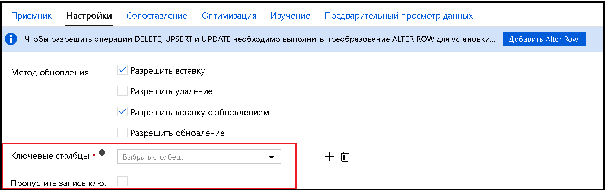

# <a name="copy-and-transform-data-in-azure-sql-database-by-using-azure-data-factory"></a>Копирование и преобразование данных в базе данных SQL Azure с помощью фабрики данных Azure

> [!div class="op_single_selector" title1="Выберите версию Фабрики данных, которую вы используете:"]
>
> - [Версия 1](v1/data-factory-azure-sql-connector.md)
> - [Текущая версия](connector-azure-sql-database.md)

[!INCLUDE[appliesto-adf-asa-md](includes/appliesto-adf-asa-md.md)]

В этой статье описывается, как с помощью действия копирования в фабрике данных Azure копировать данные в базу данных SQL Azure и в нее, а затем использовать поток данных для преобразования данных в базе данных SQL Azure. Дополнительные сведения о Фабрике данных Azure см. во [вводной статье](introduction.md).

## <a name="supported-capabilities"></a>Поддерживаемые возможности

Этот соединитель базы данных SQL Azure поддерживается для следующих действий:

- [действия копирования](copy-activity-overview.md) с таблицей [поддерживаемой матрицы источника/приемника](copy-activity-overview.md);
- [потока данных для сопоставления](concepts-data-flow-overview.md);
- [Действие поиска](control-flow-lookup-activity.md)
- [Действие получения метаданных в Фабрике данных Azure](control-flow-get-metadata-activity.md)

Для действия копирования этот соединитель базы данных SQL Azure поддерживает следующие функции:

- Копирование данных с помощью проверки подлинности SQL и Azure Active Directory (Azure AD) маркера приложения с помощью субъекта-службы или управляемых удостоверений для ресурсов Azure.
- В качестве источника, получая данные с помощью SQL-запроса или хранимой процедуры.
- В качестве приемника автоматически создает целевую таблицу, если она не существует на основе исходной схемы. Добавление данных в таблицу или вызов хранимой процедуры с пользовательской логикой во время копирования.

>[!NOTE]
> [Always encrypted](https://docs.microsoft.com/sql/relational-databases/security/encryption/always-encrypted-database-engine?view=azuresqldb-current) базы данных SQL Azure сейчас не поддерживается этим соединителем. Для решения этой проблемы можно использовать [универсальный соединитель ODBC](connector-odbc.md) и драйвер SQL Server ODBC через локальную среду выполнения интеграции. Дополнительные сведения см. в разделе [Always encrypted](#using-always-encrypted) . 

> [!IMPORTANT]
> При копировании данных с помощью среды выполнения интеграции Azure настройте [правило брандмауэра на уровне сервера](https://docs.microsoft.com/azure/sql-database/sql-database-firewall-configure) , чтобы службы Azure могли получить доступ к серверу.
> При копировании данных с помощью локальной среды выполнения интеграции настройте брандмауэр таким образом, чтобы он разрешал соответствующий диапазон IP-адресов. Этот диапазон включает IP-адрес компьютера, используемый для подключения к базе данных SQL Azure.

## <a name="get-started"></a>Начало работы

[!INCLUDE [data-factory-v2-connector-get-started](../../includes/data-factory-v2-connector-get-started.md)]

Следующие разделы содержат сведения о свойствах, которые используются для определения сущностей фабрики данных Azure, относящихся к соединителю базы данных SQL Azure.

## <a name="linked-service-properties"></a>Свойства связанной службы

Для связанной службы Базы данных SQL Azure поддерживаются следующие свойства:

| Свойство | Описание | Обязательно |
|:--- |:--- |:--- |
| type | Для свойства **type** необходимо задать значение **AzureSqlDatabase**. | Да |
| connectionString | Укажите сведения, необходимые для подключения к экземпляру базы данных SQL Azure для свойства **ConnectionString** . <br/>Вы также можете добавить пароль или ключ субъекта-службы в Azure Key Vault. Если это проверка подлинности SQL, вытяните `password` конфигурацию из строки подключения. Дополнительные сведения см. в примере JSON, который следует за таблицей, и [Храните учетные данные в Azure Key Vault](store-credentials-in-key-vault.md). | Да |
| servicePrincipalId | Укажите идентификатора клиента приложения. | Да, при использовании проверки подлинности Azure AD с субъектом-службой |
| servicePrincipalKey | Укажите ключ приложения. Пометьте это поле как **SecureString** , чтобы безопасно хранить его в фабрике данных Azure, или [сослаться на секрет, хранящийся в Azure Key Vault](store-credentials-in-key-vault.md). | Да, при использовании проверки подлинности Azure AD с субъектом-службой |
| tenant | Укажите сведения о клиенте, например имя домена или идентификатор клиента, в котором находится приложение. Эти сведения можно получить, наведя указатель мыши на правый верхний угол страницы портала Azure. | Да, при использовании проверки подлинности Azure AD с субъектом-службой |
| connectVia | Это [среда выполнения интеграции](concepts-integration-runtime.md) для подключения к хранилищу данных. Вы можете использовать Azure Integration Runtime или локальную среду IR (если хранилище данных расположено в частной сети). Если не указано другое, используется среда выполнения интеграции Azure по умолчанию. | Нет |

В разделах ниже описываются требования и приводятся примеры JSON для разных типов проверки подлинности.

- [Проверка подлинности SQL](#sql-authentication).
- [Проверка подлинности маркера приложения Azure AD: субъект-служба](#service-principal-authentication)
- [Проверка подлинности маркера приложения Azure AD: управляемые удостоверения для ресурсов Azure](#managed-identity)

>[!TIP]
>Если вы столкнулись с ошибкой с кодом "UserErrorFailedToConnectToSqlServer" и сообщением, например "ограничение сеанса для базы данных равно XXX и достигнут," добавьте `Pooling=false` в строку подключения и повторите попытку.

### <a name="sql-authentication"></a>Проверка подлинности SQL

**Пример. Использование проверки подлинности SQL**

```json
{
    "name": "AzureSqlDbLinkedService",
    "properties": {
        "type": "AzureSqlDatabase",
        "typeProperties": {
            "connectionString": "Data Source=tcp:<servername>.database.windows.net,1433;Initial Catalog=<databasename>;User ID=<username>@<servername>;Password=<password>;Trusted_Connection=False;Encrypt=True;Connection Timeout=30"
        },
        "connectVia": {
            "referenceName": "<name of Integration Runtime>",
            "type": "IntegrationRuntimeReference"
        }
    }
}
```

**Пример: пароль в Azure Key Vault**

```json
{
    "name": "AzureSqlDbLinkedService",
    "properties": {
        "type": "AzureSqlDatabase",
        "typeProperties": {
            "connectionString": "Data Source=tcp:<servername>.database.windows.net,1433;Initial Catalog=<databasename>;User ID=<username>@<servername>;Trusted_Connection=False;Encrypt=True;Connection Timeout=30",
            "password": {
                "type": "AzureKeyVaultSecret",
                "store": {
                    "referenceName": "<Azure Key Vault linked service name>",
                    "type": "LinkedServiceReference"
                },
                "secretName": "<secretName>"
            }
        },
        "connectVia": {
            "referenceName": "<name of Integration Runtime>",
            "type": "IntegrationRuntimeReference"
        }
    }
}
```

### <a name="service-principal-authentication"></a>Проверка подлинности субъекта-службы

Чтобы использовать проверку подлинности по маркеру приложения Azure AD на основе субъекта-службы, выполните следующие действия:

1. [Создайте приложение Azure Active Directory](../active-directory/develop/howto-create-service-principal-portal.md#register-an-application-with-azure-ad-and-create-a-service-principal) на портале Azure. Запишите имя приложения и следующие значения, которые используются для определения связанной службы:

    - Идентификатор приложения
    - Ключ приложения
    - Tenant ID

2. [Предоставьте администратору Azure Active Directory](../azure-sql/database/authentication-aad-configure.md#provision-azure-ad-admin-sql-database) для сервера на портал Azure, если вы еще этого не сделали. Администратор Azure AD должен быть пользователем Azure AD или группой Azure AD, но он не может быть субъектом-службой. Этот шаг нужен, чтобы затем можно было использовать удостоверение Azure AD для создания пользователя автономной базы данных для субъекта-службы.

3. [Создайте пользователей автономной базы данных](../azure-sql/database/authentication-aad-configure.md#create-contained-users-mapped-to-azure-ad-identities) для субъекта-службы. Подключитесь к базе данных из или, в которую необходимо скопировать данные с помощью таких средств, как SQL Server Management Studio, с удостоверением Azure AD, имеющим по крайней мере разрешение ALTER ANY USER. Выполните следующий код T-SQL:
  
    ```sql
    CREATE USER [your application name] FROM EXTERNAL PROVIDER;
    ```

4. Предоставьте субъекту-службе необходимые разрешения точно так же, как вы предоставляете разрешения пользователям SQL или другим пользователям. Выполните следующий код. Дополнительные параметры см. в [этом документе](https://docs.microsoft.com/sql/relational-databases/system-stored-procedures/sp-addrolemember-transact-sql?view=sql-server-2017).

    ```sql
    ALTER ROLE [role name] ADD MEMBER [your application name];
    ```

5. Настройте связанную службу Базы данных SQL Azure в фабрике данных Azure.

#### <a name="linked-service-example-that-uses-service-principal-authentication"></a>Пример использования аутентификации на основе субъекта-службы в связанной службе

```json
{
    "name": "AzureSqlDbLinkedService",
    "properties": {
        "type": "AzureSqlDatabase",
        "typeProperties": {
            "connectionString": "Data Source=tcp:<servername>.database.windows.net,1433;Initial Catalog=<databasename>;Connection Timeout=30",
            "servicePrincipalId": "<service principal id>",
            "servicePrincipalKey": {
                "type": "SecureString",
                "value": "<service principal key>"
            },
            "tenant": "<tenant info, e.g. microsoft.onmicrosoft.com>"
        },
        "connectVia": {
            "referenceName": "<name of Integration Runtime>",
            "type": "IntegrationRuntimeReference"
        }
    }
}
```

### <a name="managed-identities-for-azure-resources-authentication"></a><a name="managed-identity"></a> Управляемые удостоверения для аутентификации ресурсов Azure

Фабрика данных может быть связана с [управляемым удостоверением ресурсов Azure](data-factory-service-identity.md), которое представляет отдельную фабрику данных. Это управляемое удостоверение можно использовать для проверки подлинности базы данных SQL Azure. С помощью этого удостоверения назначенная фабрика может обращаться к данным и копировать их из вашей базы данных или в нее.

Чтобы использовать аутентификацию управляемого удостоверения, выполните следующие действия.

1. [Предоставьте администратору Azure Active Directory](../azure-sql/database/authentication-aad-configure.md#provision-azure-ad-admin-sql-database) для сервера на портал Azure, если вы еще этого не сделали. Администратор Azure AD может быть пользователем Azure AD или группой Azure AD. Если вы предоставляете группе с управляемым удостоверением роль администратора, пропустите шаги 3 и 4. Администратор имеет полный доступ к базе данных.

2. [Создание пользователей автономной базы данных](../azure-sql/database/authentication-aad-configure.md#create-contained-users-mapped-to-azure-ad-identities) для управляемого удостоверения в фабрике данных Azure. Подключитесь к базе данных из или, в которую необходимо скопировать данные с помощью таких средств, как SQL Server Management Studio, с удостоверением Azure AD, имеющим по крайней мере разрешение ALTER ANY USER. Выполните следующий код T-SQL:
  
    ```sql
    CREATE USER [your Data Factory name] FROM EXTERNAL PROVIDER;
    ```

3. Предоставьте управляемому удостоверению фабрики данных необходимые разрешения, как обычно для пользователей SQL и других. Выполните следующий код. Дополнительные параметры см. в [этом документе](https://docs.microsoft.com/sql/relational-databases/system-stored-procedures/sp-addrolemember-transact-sql?view=sql-server-2017).

    ```sql
    ALTER ROLE [role name] ADD MEMBER [your Data Factory name];
    ```

4. Настройте связанную службу Базы данных SQL Azure в фабрике данных Azure.

**Пример**

```json
{
    "name": "AzureSqlDbLinkedService",
    "properties": {
        "type": "AzureSqlDatabase",
        "typeProperties": {
            "connectionString": "Data Source=tcp:<servername>.database.windows.net,1433;Initial Catalog=<databasename>;Connection Timeout=30"
        },
        "connectVia": {
            "referenceName": "<name of Integration Runtime>",
            "type": "IntegrationRuntimeReference"
        }
    }
}
```

## <a name="dataset-properties"></a>Свойства набора данных

Полный список разделов и свойств, доступных для определения наборов данных, см. в разделе [наборы данных](https://docs.microsoft.com/azure/data-factory/concepts-datasets-linked-services).

Для набора данных SQL Azure поддерживаются следующие свойства:

| Свойство | Описание | Обязательно |
|:--- |:--- |:--- |
| type | Свойство **Type** набора данных должно иметь значение **AzureSqlTable**. | Да |
| схема | Имя схемы. |"Нет" для источника, "Да" для приемника  |
| table | Имя таблицы или представления. |"Нет" для источника, "Да" для приемника  |
| tableName | Имя таблицы или представления со схемой. Это свойство поддерживается только для обеспечения обратной совместимости. Для новой рабочей нагрузки используйте `schema` и `table`. | "Нет" для источника, "Да" для приемника |

### <a name="dataset-properties-example"></a>Пример свойств набора данных

```json
{
    "name": "AzureSQLDbDataset",
    "properties":
    {
        "type": "AzureSqlTable",
        "linkedServiceName": {
            "referenceName": "<Azure SQL Database linked service name>",
            "type": "LinkedServiceReference"
        },
        "schema": [ < physical schema, optional, retrievable during authoring > ],
        "typeProperties": {
            "schema": "<schema_name>",
            "table": "<table_name>"
        }
    }
}
```

## <a name="copy-activity-properties"></a>Свойства действия копирования

Полный список разделов и свойств, доступных для определения действий, см. в разделе [Конвейеры и действия в фабрике данных Azure](concepts-pipelines-activities.md). Этот раздел содержит список свойств, поддерживаемых источником и приемником базы данных SQL Azure.

### <a name="azure-sql-database-as-the-source"></a>База данных SQL Azure в качестве источника

Чтобы скопировать данные из базы данных SQL Azure, в разделе **источник** действия копирования поддерживаются следующие свойства.

| Свойство | Описание | Обязательно |
|:--- |:--- |:--- |
| type | Свойство **Type** источника действия копирования должно иметь значение **азуресклсаурце**. Тип "SqlSource" по-прежнему поддерживается для обратной совместимости. | Да |
| sqlReaderQuery | Это свойство применяет пользовательский SQL-запрос для чтения данных. Например, `select * from MyTable`. | Нет |
| sqlReaderStoredProcedureName | Имя хранимой процедуры, которая считывает данные из исходной таблицы. Последней инструкцией SQL должна быть инструкция SELECT в хранимой процедуре. | Нет |
| storedProcedureParameters | Параметры для хранимой процедуры.<br/>Допустимые значения: пары имен или значений. Имена и регистр параметров должны совпадать с именами и регистром параметров хранимой процедуры. | Нет |
| isolationLevel | Задает режим блокировки транзакций для источника данных SQL. Допустимые значения: **ReadCommitted** (по умолчанию), **ReadUncommitted**, **RepeatableRead**, **Serializable**, **Snapshot**. Дополнительные сведения см. в [этом документе](https://docs.microsoft.com/dotnet/api/system.data.isolationlevel). | Нет |

**Примечания:**

- Если для **азуресклсаурце**указан **sqlReaderQuery** , действие копирования выполняет этот запрос к источнику базы данных SQL Azure для получения данных. Есть и другой вариант: создать хранимую процедуру, указав ее имя в **sqlReaderStoredProcedureName** и параметры в **storedProcedureParameters**, если она принимает параметры.
- Если не указать ни **sqlReaderQuery** , ни **sqlReaderStoredProcedureName**, то для создания запроса используются столбцы, определенные в разделе Structure набора данных JSON. Запрос `select column1, column2 from mytable` выполняется к базе данных SQL Azure. Если в определении набора данных нет раздела structure, выбираются все столбцы из таблицы.

#### <a name="sql-query-example"></a>Пример SQL-запроса

```json
"activities":[
    {
        "name": "CopyFromAzureSQLDatabase",
        "type": "Copy",
        "inputs": [
            {
                "referenceName": "<Azure SQL Database input dataset name>",
                "type": "DatasetReference"
            }
        ],
        "outputs": [
            {
                "referenceName": "<output dataset name>",
                "type": "DatasetReference"
            }
        ],
        "typeProperties": {
            "source": {
                "type": "AzureSqlSource",
                "sqlReaderQuery": "SELECT * FROM MyTable"
            },
            "sink": {
                "type": "<sink type>"
            }
        }
    }
]
```

#### <a name="stored-procedure-example"></a>Пример хранимой процедуры

```json
"activities":[
    {
        "name": "CopyFromAzureSQLDatabase",
        "type": "Copy",
        "inputs": [
            {
                "referenceName": "<Azure SQL Database input dataset name>",
                "type": "DatasetReference"
            }
        ],
        "outputs": [
            {
                "referenceName": "<output dataset name>",
                "type": "DatasetReference"
            }
        ],
        "typeProperties": {
            "source": {
                "type": "AzureSqlSource",
                "sqlReaderStoredProcedureName": "CopyTestSrcStoredProcedureWithParameters",
                "storedProcedureParameters": {
                    "stringData": { "value": "str3" },
                    "identifier": { "value": "$$Text.Format('{0:yyyy}', <datetime parameter>)", "type": "Int"}
                }
            },
            "sink": {
                "type": "<sink type>"
            }
        }
    }
]
```

### <a name="stored-procedure-definition"></a>Определение хранимой процедуры

```sql
CREATE PROCEDURE CopyTestSrcStoredProcedureWithParameters
(
    @stringData varchar(20),
    @identifier int
)
AS
SET NOCOUNT ON;
BEGIN
     select *
     from dbo.UnitTestSrcTable
     where dbo.UnitTestSrcTable.stringData != stringData
    and dbo.UnitTestSrcTable.identifier != identifier
END
GO
```

### <a name="azure-sql-database-as-the-sink"></a>База данных SQL Azure в качестве приемника

> [!TIP]
> Дополнительные сведения о поддерживаемых поведениях записи, конфигурациях и рекомендациях см. в статье рекомендации [по загрузке данных в базу данных SQL Azure](#best-practice-for-loading-data-into-azure-sql-database).

Чтобы скопировать данные в базу данных SQL Azure, в разделе **приемника** действия копирования поддерживаются следующие свойства.

| Свойство | Описание | Обязательно |
|:--- |:--- |:--- |
| type | Свойство **Type** приемника действия копирования должно иметь значение **азуресклсинк**. Тип "SqlSink" по-прежнему поддерживается для обратной совместимости. | Да |
| preCopyScript | Укажите SQL-запрос для выполнения действия копирования перед записью данных в базу данных SQL Azure. Он вызывается однократно при каждом запуске копирования. Это свойство используется для очистки предварительно загруженных данных. | нет |
| tableOption | Указывает, следует ли [автоматически создавать таблицу приемника, если она](copy-activity-overview.md#auto-create-sink-tables) не существует на основе исходной схемы. <br>Автоматическое создание таблицы не поддерживается, если приемник указывает, что хранимая процедура или промежуточное копирование настроены в действии копирования. <br>Допустимые значения: `none` (по умолчанию), `autoCreate`. | нет |
| sqlWriterStoredProcedureName | Имя хранимой процедуры, в которой определяется, как применить исходные данные в целевой таблице. <br/>Эта хранимая процедура будет *вызываться для каждого пакета*. Для операций, выполняемых только один раз и не имеющих никаких действий с исходными данными, например Delete или TRUNCATE, используйте `preCopyScript` свойство.<br>См. пример из [вызова хранимой процедуры из приемника SQL](#invoke-a-stored-procedure-from-a-sql-sink). | Нет |
| сторедпроцедуретаблетипепараметернаме |Имя параметра табличного типа, указанного в хранимой процедуре.  |Нет |
| sqlWriterTableType |Имя типа таблицы, используемое в хранимой процедуре. Действие копирования предоставляет доступ к перемещаемым данным во временной таблице с указанным здесь типом. Это позволяет при выполнении хранимой процедуры объединить копируемые и существующие данные. |Нет |
| storedProcedureParameters |Параметры для хранимой процедуры.<br/>Допустимые значения: пары "имя — значение". Имена и регистр параметров должны совпадать с именами и регистром параметров хранимой процедуры. | Нет |
| writeBatchSize | Число строк, вставляемых в таблицу SQL для *каждого пакета*.<br/> Допустимое значение: **целое число** (количество строк). По умолчанию фабрика данных Azure динамически определяет соответствующий размер пакета в зависимости от размера строки. | Нет |
| writeBatchTimeout | Время ожидания до выполнения операции пакетной вставки, пока не закончится срок ее действия.<br/> Допустимое значение — **timespan**. Например, "00:30:00" (30 минут). | нет |
| disableMetricsCollection | Фабрика данных собирает такие метрики, как база данных SQL Azure DTU для оптимизации и рекомендации по копированию производительности. Если вас не устраивает такое поведение, укажите `true`, чтобы отключить его. | Нет (значение по умолчанию — `false`) |

**Пример 1. Добавление данных**

```json
"activities":[
    {
        "name": "CopyToAzureSQLDatabase",
        "type": "Copy",
        "inputs": [
            {
                "referenceName": "<input dataset name>",
                "type": "DatasetReference"
            }
        ],
        "outputs": [
            {
                "referenceName": "<Azure SQL Database output dataset name>",
                "type": "DatasetReference"
            }
        ],
        "typeProperties": {
            "source": {
                "type": "<source type>"
            },
            "sink": {
                "type": "AzureSqlSink",
                "tableOption": "autoCreate",
                "writeBatchSize": 100000
            }
        }
    }
]
```

**Пример 2. вызов хранимой процедуры во время копирования**

Дополнительные сведения см. в разделе [Вызов хранимой процедуры из приемника SQL](#invoke-a-stored-procedure-from-a-sql-sink).

```json
"activities":[
    {
        "name": "CopyToAzureSQLDatabase",
        "type": "Copy",
        "inputs": [
            {
                "referenceName": "<input dataset name>",
                "type": "DatasetReference"
            }
        ],
        "outputs": [
            {
                "referenceName": "<Azure SQL Database output dataset name>",
                "type": "DatasetReference"
            }
        ],
        "typeProperties": {
            "source": {
                "type": "<source type>"
            },
            "sink": {
                "type": "AzureSqlSink",
                "sqlWriterStoredProcedureName": "CopyTestStoredProcedureWithParameters",
                "storedProcedureTableTypeParameterName": "MyTable",
                "sqlWriterTableType": "MyTableType",
                "storedProcedureParameters": {
                    "identifier": { "value": "1", "type": "Int" },
                    "stringData": { "value": "str1" }
                }
            }
        }
    }
]
```

## <a name="best-practice-for-loading-data-into-azure-sql-database"></a>Рекомендации по загрузке данных в базу данных SQL Azure

При копировании данных в базу данных SQL Azure может потребоваться другое поведение при записи.

- [Append](#append-data): мои исходные данные имеют только новые записи.
- [Upsert](#upsert-data): исходные данные имеют как вставки, так и обновления.
- [Перезаписать](#overwrite-the-entire-table): я хочу каждый раз загружать всю таблицу измерения.
- [Запись с помощью пользовательской логики](#write-data-with-custom-logic): требуется дополнительные операции перед окончательным вставкой в целевую таблицу.

Дополнительные сведения о настройке в фабрике данных Azure и рекомендациях см. в соответствующих разделах.

### <a name="append-data"></a>Добавление данных.

Добавление данных — это поведение по умолчанию для соединителя приемников базы данных SQL Azure. Фабрика данных Azure обеспечивает эффективную запись в таблицу с помощью операций групповой вставки. Источник и приемник можно настроить соответствующим образом в действии копирования.

### <a name="upsert-data"></a>Операция upsert с данными

**Вариант 1.** При наличии большого объема данных для копирования можно выполнить загрузку всех записей в промежуточную таблицу с помощью действия копирования, а затем запустить действие хранимой процедуры, чтобы применить инструкцию [Merge](https://docs.microsoft.com/sql/t-sql/statements/merge-transact-sql?view=azuresqldb-current) или INSERT или Update в одном снимке. 

В настоящее время действие копирования не поддерживает загрузку данных во временную таблицу базы данных. Существует более сложный способ настройки с помощью сочетания нескольких действий. см. статью [Оптимизация Upsert сценариев для базы данных SQL Azure](https://github.com/scoriani/azuresqlbulkupsert). Ниже показан пример использования постоянной таблицы в качестве промежуточного.

Например, в фабрике данных Azure можно создать конвейер с **действием копирования** , связанным с **действием хранимой процедуры**. Первый копирует данные из исходного хранилища в промежуточную таблицу базы данных SQL Azure, например **упсертстагингтабле**, как имя таблицы в наборе данных. Затем второй вызовет хранимую процедуру для слияния исходных данных из промежуточной таблицы в целевую таблицу и очистки промежуточной таблицы.


В базе данных Определите хранимую процедуру с помощью логики слияния, как показано в следующем примере, на который указывает действие из предыдущего действия хранимой процедуры. Предположим, что целевым объектом является **маркетинговая** таблица с тремя столбцами: **ProfileID**, **State**и **Category**. Выполните Upsert на основе столбца **ProfileID** .

```sql
CREATE PROCEDURE [dbo].[spMergeData]
AS
BEGIN
   MERGE TargetTable AS target
   USING UpsertStagingTable AS source
   ON (target.[ProfileID] = source.[ProfileID])
   WHEN MATCHED THEN
      UPDATE SET State = source.State
    WHEN NOT matched THEN
       INSERT ([ProfileID], [State], [Category])
      VALUES (source.ProfileID, source.State, source.Category);
    TRUNCATE TABLE UpsertStagingTable
END
```

**Вариант 2.** Можно выбрать [вызов хранимой процедуры в рамках действия копирования](#invoke-a-stored-procedure-from-a-sql-sink). Этот подход запускает каждый пакет (в соответствии со `writeBatchSize` свойством) в исходной таблице, а не использует инструкцию INSERT в качестве метода по умолчанию в действии копирования.

**Вариант 3.** Можно использовать [поток данных сопоставления](#sink-transformation) , который предоставляет встроенные методы вставки, Upsert и обновления.

### <a name="overwrite-the-entire-table"></a>Перезаписать всю таблицу

Свойство **preCopyScript** можно настроить в приемнике действия копирования. В этом случае для каждого выполняемого действия копирования фабрика данных Azure сначала запускает сценарий. Затем выполняется копирование для вставки данных. Например, чтобы перезаписать всю таблицу последними данными, укажите скрипт, чтобы сначала удалить все записи, прежде чем выполнять пакетную загрузку новых данных из источника.

### <a name="write-data-with-custom-logic"></a>Запись данных с помощью пользовательской логики

Действия по записи данных с помощью пользовательской логики похожи на процедуры, описанные в разделе [данных Upsert](#upsert-data) . Если необходимо применить дополнительные операции перед окончательной вставкой исходных данных в целевую таблицу, можно загрузить в промежуточную таблицу, затем вызвать действие хранимой процедуры или вызвать хранимую процедуру в приемнике действия копирования для применения данных или использовать поток данных сопоставления.

## <a name="invoke-a-stored-procedure-from-a-sql-sink"></a><a name="invoke-a-stored-procedure-from-a-sql-sink"></a> Вызов хранимой процедуры из приемника SQL

При копировании данных в базу данных SQL Azure можно также настроить и вызвать указанную пользователем хранимую процедуру с дополнительными параметрами для каждого пакета исходной таблицы. Функция хранимой процедуры использует возможности [возвращающих табличное значение параметров](https://msdn.microsoft.com/library/bb675163.aspx).

Вы можете использовать хранимую процедуру, когда встроенные механизмы копирования не подходят. Примером может быть применение дополнительной обработки перед окончательной вставкой исходных данных в целевую таблицу. Некоторые дополнительные примеры обработки позволяют объединить столбцы, найти дополнительные значения и вставить их в несколько таблиц.

В следующем примере показано, как использовать хранимую процедуру для выполнения операции Upsert в таблице базы данных SQL Azure. Предположим, что у входных данных и **маркетинговой** таблицы приемника есть три столбца: **ProfileID**, **State**и **Category**. Выполните Upsert на основе столбца **ProfileID** и примените его только к определенной категории с названием «Product а».

1. В базе данных определите тип таблицы с тем же именем, что и **и sqlwritertabletype**. Для типа таблицы укажите ту же схему, которая возвращается для входных данных.

    ```sql
    CREATE TYPE [dbo].[MarketingType] AS TABLE(
        [ProfileID] [varchar](256) NOT NULL,
        [State] [varchar](256) NOT NULL,
        [Category] [varchar](256) NOT NULL
    )
    ```

2. В базе данных Определите хранимую процедуру с тем же именем, что и **sqlWriterStoredProcedureName**. Она обрабатывает входные данные из указанного источника и выполняет их слияние в выходную таблицу. Имя параметра типа таблицы в хранимой процедуре совпадает с именем **TableName** , определенным в наборе данных.

    ```sql
    CREATE PROCEDURE spOverwriteMarketing @Marketing [dbo].[MarketingType] READONLY, @category varchar(256)
    AS
    BEGIN
    MERGE [dbo].[Marketing] AS target
    USING @Marketing AS source
    ON (target.ProfileID = source.ProfileID and target.Category = @category)
    WHEN MATCHED THEN
        UPDATE SET State = source.State
    WHEN NOT MATCHED THEN
        INSERT (ProfileID, State, Category)
        VALUES (source.ProfileID, source.State, source.Category);
    END
    ```

3. В фабрике данных Azure Определите раздел **SQL Sink** в действии копирования следующим образом:

    ```json
    "sink": {
        "type": "AzureSqlSink",
        "sqlWriterStoredProcedureName": "spOverwriteMarketing",
        "storedProcedureTableTypeParameterName": "Marketing",
        "sqlWriterTableType": "MarketingType",
        "storedProcedureParameters": {
            "category": {
                "value": "ProductA"
            }
        }
    }
    ```

## <a name="mapping-data-flow-properties"></a>Свойства потока данных для сопоставления

При преобразовании данных в потоке сопоставления данных можно выполнять чтение и запись в таблицы из базы данных SQL Azure. Дополнительные сведения см. в описаниях [преобразования источника](data-flow-source.md) и [преобразования приемника](data-flow-sink.md) в разделе, посвященном потокам данных для сопоставления.

### <a name="source-transformation"></a>Преобразование источника

Параметры, относящиеся к базе данных SQL Azure, доступны на вкладке " **Параметры источника** " преобразования "источник".

**Входные данные**. Выберите, будете ли вы указывать источник в таблице (аналогично инструкции ```Select * from <table-name>```) или вводить пользовательский SQL-запрос.

**Запрос.** Если в поле входных данных вы выбрали запрос, введите здесь SQL-запрос для источника. Этот параметр переопределяет любую таблицу, выбранную в наборе данных. Предложения **Order By** здесь не поддерживаются, но можно задать полную инструкцию SELECT FROM. Кроме того, можно использовать табличные функции, определяемые пользователем. Пример использования такой функции в SQL — инструкция **select * from udfGetData()** , возвращающая таблицу. Этот запрос создаст исходную таблицу, которую можно использовать в потоке данных. Использование запросов — также отличный способ сокращения количества строк для тестирования или поиска.

- Пример SQL: ```Select * from MyTable where customerId > 1000 and customerId < 2000```

**Размер пакета.** Введите размер пакета для разделения больших наборов данных на блоки для чтения.

**Уровень изоляции**. Значение по умолчанию для источников SQL в потоке данных для сопоставления — Read Uncommitted (чтение незафиксированных данных). Здесь можно изменить уровень изоляции на одно из следующих значений.

- Read Committed (чтение зафиксированных данных)
- Read Uncommitted (чтение незафиксированных данных)
- Повторяющаяся операция чтения
- Упорядочиваемый уровень изоляции
- None (игнорировать уровень изоляции)


### <a name="sink-transformation"></a>Преобразование приемника

Параметры, относящиеся к базе данных SQL Azure, доступны на вкладке " **Параметры** " преобразования "приемник".

**Метод обновления**. Определяет, какие операции разрешены в назначении базы данных. По умолчанию разрешены только операции вставки. Для выполнения обновления (update), обновления или вставки (upsert) или удаления (delete) строк требуется преобразование alter-row строк, отмеченных для этих действий. Для выполнения обновления (update), обновления или вставки (upsert) или удаления (delete) должен быть установлен ключевой столбец (или столбцы), позволяющий определить строки для изменения.



Имя столбца, которое вы выбираете в качестве ключа, будет использоваться ADF в ходе последующего обновления, Upsert, DELETE. Поэтому необходимо выбрать столбец, существующий в сопоставлении приемника. Если вы не хотите записывать значение в этот ключевой столбец, нажмите кнопку "пропустить запись ключевых столбцов".

**Действие таблицы**. Определяет, следует ли повторно создавать или удалять все строки в целевой таблице перед записью.

- None (нет): никакие действия над таблицей не выполняются.
- Recreate (создать повторно): таблица будет удалена и создана повторно. Это действие необходимо, если новая таблица создается динамически.
- Truncate (усечь): все строки из целевой таблицы будут удалены.

**Размер пакета.** Определяет, сколько строк записывается в каждую группу. Более крупные размеры пакетов улучшают сжатие и оптимизацию памяти, но при кэшировании данных возникает риск нехватки памяти.

**Скрипты SQL предобработки и постобработки**. Введите многострочные скрипты SQL, которые будут выполняться до (предобработка) и после (постобработка) записи данных в базу данных-приемник.


## <a name="data-type-mapping-for-azure-sql-database"></a>Сопоставление типов данных для Базы данных SQL Azure

При копировании данных из базы данных SQL Azure или в нее используются следующие сопоставления типов данных базы данных SQL Azure с промежуточными типами данных фабрики данных Azure. Дополнительные сведения о том, как действие копирования сопоставляет исходную схему и типы данных для приемника, см. в статье [Сопоставление схем в действии копирования](copy-activity-schema-and-type-mapping.md).

| Тип данных в Базе данных SQL Azure | Промежуточный тип данных Фабрики данных Azure |
|:--- |:--- |
| BIGINT |Int64 |
| binary |Byte[] |
| bit |Логическое |
| char |String, Char[] |
| Дата |Дата и время |
| Datetime |Дата и время |
| datetime2 |Дата и время |
| Datetimeoffset |DateTimeOffset |
| Decimal |Decimal |
| FILESTREAM attribute (varbinary(max)) |Byte[] |
| Float |Double |
| Изображение |Byte[] |
| INT |Int32 |
| money |Decimal |
| nchar |String, Char[] |
| ntext |String, Char[] |
| NUMERIC |Decimal |
| nvarchar |String, Char[] |
| real |Один |
| rowversion |Byte[] |
| smalldatetime |Дата и время |
| smallint |Int16 |
| smallmoney |Decimal |
| sql_variant |Объект |
| text |String, Char[] |
| time |TimeSpan |
| TIMESTAMP |Byte[] |
| tinyint |Byte |
| UNIQUEIDENTIFIER |Guid |
| varbinary |Byte[] |
| varchar |String, Char[] |
| Xml |Xml |

>[!NOTE]
> Для типов данных, которые сопоставляются с промежуточным типом Decimal, в настоящее время действие копирования поддерживает точность до 28. Если у вас есть данные с точностью больше 28, рассмотрите возможность преобразования в строку в SQL-запросе.

## <a name="lookup-activity-properties"></a>Свойства действия поиска

Подробные сведения об этих свойствах см. в разделе [Действие поиска](control-flow-lookup-activity.md).

## <a name="getmetadata-activity-properties"></a>Свойства действия GetMetadata

Подробные сведения об этих свойствах см. в разделе [Действие GetMetadata](control-flow-get-metadata-activity.md)

## <a name="using-always-encrypted"></a>Использование Always Encrypted

При копировании данных из базы данных SQL Azure или в нее с [Always encrypted](https://docs.microsoft.com/sql/relational-databases/security/encryption/always-encrypted-database-engine?view=azuresqldb-current)используйте [универсальный соединитель ODBC](connector-odbc.md) и SQL Server драйвер ODBC через локально размещенную Integration Runtime. Этот соединитель базы данных SQL Azure не поддерживает Always Encrypted сейчас. 

В частности:

1. Настройте автономную Integration Runtime, если у вас ее нет. Дополнительные сведения см. в статье [Создание и настройка локальной среды выполнения интеграции](create-self-hosted-integration-runtime.md).

2. Скачайте 64-разрядный драйвер ODBC для SQL Server [отсюда](https://docs.microsoft.com/sql/connect/odbc/download-odbc-driver-for-sql-server?view=azuresqldb-current)и установите на компьютер Integration Runtime. Дополнительные сведения о том, как работает этот драйвер, см. в статье [использование Always encrypted с драйвером ODBC для SQL Server](https://docs.microsoft.com/sql/connect/odbc/using-always-encrypted-with-the-odbc-driver?view=azuresqldb-current#using-the-azure-key-vault-provider).

3. Создание связанной службы с типом ODBC для подключения к базе данных SQL см. следующие примеры:

    - Чтобы использовать **проверку подлинности SQL**: Укажите строку подключения ODBC, как показано ниже, и выберите **Обычная** проверка подлинности, чтобы задать имя пользователя и пароль.

        ```
        Driver={ODBC Driver 17 for SQL Server};Server=<serverName>;Database=<databaseName>;ColumnEncryption=Enabled;KeyStoreAuthentication=KeyVaultClientSecret;KeyStorePrincipalId=<servicePrincipalKey>;KeyStoreSecret=<servicePrincipalKey>
        ```

    - Использование **проверки подлинности управляемого удостоверения в фабрике данных**: 

        1. Выполните те же [Предварительные требования](#managed-identity) , чтобы создать пользователя базы данных для управляемого удостоверения и предоставить соответствующую роль в базе данных.
        2. В поле связанная служба укажите строку подключения ODBC, как показано ниже, и выберите **Анонимная** проверка подлинности, так как сама строка подключения указывает `Authentication=ActiveDirectoryMsi` .

        ```
        Driver={ODBC Driver 17 for SQL Server};Server=<serverName>;Database=<databaseName>;ColumnEncryption=Enabled;KeyStoreAuthentication=KeyVaultClientSecret;KeyStorePrincipalId=<servicePrincipalKey>;KeyStoreSecret=<servicePrincipalKey>; Authentication=ActiveDirectoryMsi;
        ```

4. Создайте набор данных и действие копирования с соответствующим типом ODBC. Дополнительные сведения см. в статье о [соединителе ODBC](connector-odbc.md) .

## <a name="next-steps"></a>Дальнейшие действия

Список хранилищ данных, поддерживаемых действием копирования в фабрике данных Azure в качестве источников и приемников, см. в разделе [Поддерживаемые хранилища данных и форматы](copy-activity-overview.md#supported-data-stores-and-formats).
