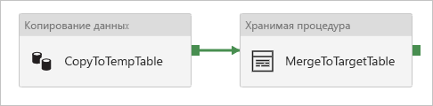

# <a name="copy-data-to-or-from-azure-sql-database-by-using-azure-data-factory"></a>Копирование данных в базу данных Azure SQL и из нее с помощью фабрики данных Azure
> [!div class="op_single_selector" title1="Выберите версию фабрики данных Azure, которую вы используете:"]
> * [Версия 1](v1/data-factory-azure-sql-connector.md)
> * [Текущая версия](connector-azure-sql-database.md)

В этой статье описано, как копировать данные в базу данных SQL Azure и из нее. Дополнительные сведения о Фабрике данных Azure см. во [вводной статье](introduction.md).

## <a name="supported-capabilities"></a>Поддерживаемые возможности

Этот соединитель базы данных SQL Azure поддерживается для следующих действий:

- [Действие копирования](copy-activity-overview.md) с поддерживаемой таблицей [источника или приемника](copy-activity-overview.md)
- [Поток данных сопоставления](concepts-data-flow-overview.md)
- [Действие поиска](control-flow-lookup-activity.md)
- [Действие получения метаданных в Фабрике данных Azure](control-flow-get-metadata-activity.md)

Этот соединитель Базы данных SQL Azure поддерживает такие функции:

- Копирование данных с помощью проверки подлинности SQL и Azure Active Directory (Azure AD) маркера приложения с помощью субъекта-службы или управляемых удостоверений для ресурсов Azure.
- В качестве источника, получая данные с помощью SQL-запроса или хранимой процедуры.
- В качестве приемника: Добавление данных в целевую таблицу или вызов хранимой процедуры с пользовательской логикой во время копирования.

>[!NOTE]
>[Always encrypted](https://docs.microsoft.com/sql/relational-databases/security/encryption/always-encrypted-database-engine?view=azuresqldb-current) базы данных SQL Azure сейчас не поддерживается этим соединителем. Для решения этой проблемы можно использовать [универсальный соединитель ODBC](connector-odbc.md) и драйвер SQL Server ODBC через локальную среду выполнения интеграции. Следуйте указаниям [по](https://docs.microsoft.com/sql/connect/odbc/using-always-encrypted-with-the-odbc-driver?view=azuresqldb-current) загрузке драйвера ODBC и настройке строки подключения.

> [!IMPORTANT]
> При копировании данных с помощью среды выполнения интеграции фабрики данных Azure настройте [брандмауэр SQL Server Azure](https://msdn.microsoft.com/library/azure/ee621782.aspx#ConnectingFromAzure) , чтобы службы Azure могли получить доступ к серверу.
> При копировании данных с помощью локальной среды выполнения интеграции настройте брандмауэр SQL Server Azure, чтобы разрешить соответствующий диапазон IP-адресов. Этот диапазон включает IP-адрес компьютера, используемый для подключения к базе данных SQL Azure.

## <a name="get-started"></a>Начало работы

[!INCLUDE [data-factory-v2-connector-get-started](../../includes/data-factory-v2-connector-get-started.md)]

Следующие разделы содержат сведения о свойствах, которые используются для определения сущностей фабрики данных Azure, относящихся к соединителю базы данных SQL Azure.

## <a name="linked-service-properties"></a>Свойства связанной службы

Для связанной службы Базы данных SQL Azure поддерживаются следующие свойства:

| Свойство | Описание | Обязательно для заполнения |
|:--- |:--- |:--- |
| type | Для свойства **type** необходимо задать значение **AzureSqlDatabase**. | Да |
| connectionString | В свойстве **connectionString** указываются сведения, необходимые для подключения к экземпляру Базы данных SQL Azure. <br/>Пометьте это поле как **SecureString** , чтобы безопасно хранить его в фабрике данных Azure. Вы также можете добавить пароль или ключ субъекта-службы в Azure Key Vault. Если это проверка подлинности SQL, `password` вытяните конфигурацию из строки подключения. Дополнительные сведения см. в примере JSON, который следует за таблицей, и [Храните учетные данные в Azure Key Vault](store-credentials-in-key-vault.md). | Да |
| servicePrincipalId | Укажите идентификатора клиента приложения. | Да, при использовании проверки подлинности Azure AD с субъектом-службой |
| servicePrincipalKey | Укажите ключ приложения. Пометьте это поле как **SecureString** , чтобы безопасно хранить его в фабрике данных Azure, или сослаться на [секрет, хранящийся в Azure Key Vault](store-credentials-in-key-vault.md). | Да, при использовании проверки подлинности Azure AD с субъектом-службой |
| клиент | Укажите сведения о клиенте, например имя домена или идентификатор клиента, в котором находится приложение. Извлеките его, наведя указатель мыши на правый верхний угол портал Azure. | Да, при использовании проверки подлинности Azure AD с субъектом-службой |
| connectVia | Это [среда выполнения интеграции](concepts-integration-runtime.md) для подключения к хранилищу данных. Вы можете использовать среду выполнения интеграции Azure или локальную среду выполнения интеграции, если хранилище данных находится в частной сети. Если значение не указано, используется среда выполнения интеграции Azure по умолчанию. | Нет |

В разделах ниже описываются требования и приводятся примеры JSON для разных типов проверки подлинности.

- [Проверка подлинности SQL](#sql-authentication).
- [Аутентификация по маркеру безопасности приложения Azure AD на основе субъекта-службы](#service-principal-authentication).
- [Аутентификация по маркеру безопасности приложения Azure AD на основе управляемых удостоверений для ресурсов Azure](#managed-identity).

>[!TIP]
>Если вы столкнулись с ошибкой с кодом "UserErrorFailedToConnectToSqlServer" и сообщением, например "ограничение сеанса для базы данных равно XXX и достигнут," добавьте `Pooling=false` в строку подключения и повторите попытку.

### <a name="sql-authentication"></a>Аутентификация SQL

#### <a name="linked-service-example-that-uses-sql-authentication"></a>Пример использования проверки подлинности SQL в связанной службе

```json
{
    "name": "AzureSqlDbLinkedService",
    "properties": {
        "type": "AzureSqlDatabase",
        "typeProperties": {
            "connectionString": {
                "type": "SecureString",
                "value": "Server=tcp:<servername>.database.windows.net,1433;Database=<databasename>;User ID=<username>@<servername>;Password=<password>;Trusted_Connection=False;Encrypt=True;Connection Timeout=30"
            }
        },
        "connectVia": {
            "referenceName": "<name of Integration Runtime>",
            "type": "IntegrationRuntimeReference"
        }
    }
}
```

**Пароль в Azure Key Vault** 

```json
{
    "name": "AzureSqlDbLinkedService",
    "properties": {
        "type": "AzureSqlDatabase",
        "typeProperties": {
            "connectionString": {
                "type": "SecureString",
                "value": "Server=tcp:<servername>.database.windows.net,1433;Database=<databasename>;User ID=<username>@<servername>;Trusted_Connection=False;Encrypt=True;Connection Timeout=30"
            },
            "password": { 
                "type": "AzureKeyVaultSecret", 
                "store": { 
                    "referenceName": "<Azure Key Vault linked service name>", 
                    "type": "LinkedServiceReference" 
                }, 
                "secretName": "<secretName>" 
            }
        },
        "connectVia": {
            "referenceName": "<name of Integration Runtime>",
            "type": "IntegrationRuntimeReference"
        }
    }
}
```

### <a name="service-principal-authentication"></a>Проверка подлинности субъекта-службы

Чтобы использовать проверку подлинности по маркеру приложения Azure AD на основе субъекта-службы, выполните следующие действия:

1. [Создайте приложение Azure Active Directory](../active-directory/develop/howto-create-service-principal-portal.md#create-an-azure-active-directory-application) из портал Azure. Запишите имя приложения и следующие значения, которые используются для определения связанной службы:

    - ИД приложения
    - Ключ приложения
    - Идентификатор клиента

2. [Предоставьте администратору Azure Active Directory](../sql-database/sql-database-aad-authentication-configure.md#provision-an-azure-active-directory-administrator-for-your-azure-sql-database-server) SQL Server Azure на портал Azure, если вы еще этого не сделали. Администратор Azure AD должен быть пользователем Azure AD или группой Azure AD, но он не может быть субъектом-службой. Этот шаг нужен, чтобы затем можно было использовать удостоверение Azure AD для создания пользователя автономной базы данных для субъекта-службы.

3. [Создайте пользователей автономной базы данных](../sql-database/sql-database-aad-authentication-configure.md#create-contained-database-users-in-your-database-mapped-to-azure-ad-identities) для субъекта-службы. Подключитесь к базе данных из или, в которую необходимо скопировать данные с помощью таких средств, как SQL Server Management Studio, с удостоверением Azure AD, имеющим по крайней мере разрешение ALTER ANY USER. Выполните следующую инструкцию T-SQL: 
  
    ```sql
    CREATE USER [your application name] FROM EXTERNAL PROVIDER;
    ```

4. Предоставьте субъекту-службе необходимые разрешения, как обычно для пользователей SQL или других. Выполните следующий код. Дополнительные параметры см. в [этом документе](https://docs.microsoft.com/sql/relational-databases/system-stored-procedures/sp-addrolemember-transact-sql?view=sql-server-2017).

    ```sql
    EXEC sp_addrolemember [role name], [your application name];
    ```

5. Настройка связанной службы базы данных SQL Azure в фабрике данных Azure.


#### <a name="linked-service-example-that-uses-service-principal-authentication"></a>Пример использования аутентификации на основе субъекта-службы в связанной службе

```json
{
    "name": "AzureSqlDbLinkedService",
    "properties": {
        "type": "AzureSqlDatabase",
        "typeProperties": {
            "connectionString": {
                "type": "SecureString",
                "value": "Server=tcp:<servername>.database.windows.net,1433;Database=<databasename>;Connection Timeout=30"
            },
            "servicePrincipalId": "<service principal id>",
            "servicePrincipalKey": {
                "type": "SecureString",
                "value": "<service principal key>"
            },
            "tenant": "<tenant info, e.g. microsoft.onmicrosoft.com>"
        },
        "connectVia": {
            "referenceName": "<name of Integration Runtime>",
            "type": "IntegrationRuntimeReference"
        }
    }
}
```

### <a name="managed-identity"></a> Управляемые удостоверения для аутентификации ресурсов Azure

Фабрика данных может быть связана с [управляемым удостоверением ресурсов Azure](data-factory-service-identity.md), которое представляет отдельную фабрику данных. Это управляемое удостоверение можно использовать для проверки подлинности базы данных SQL Azure. Назначенная фабрика может получить доступ и скопировать данные из вашей базы данных или в нее, используя этот идентификатор.

Чтобы использовать аутентификацию управляемого удостоверения, выполните следующие действия.

1. [Предоставьте администратору Azure Active Directory](../sql-database/sql-database-aad-authentication-configure.md#provision-an-azure-active-directory-administrator-for-your-azure-sql-database-server) SQL Server Azure на портал Azure, если вы еще этого не сделали. Администратор Azure AD может быть пользователем Azure AD или группой Azure AD. Если предоставить группе с управляемым удостоверением роль администратора, пропустите шаги 3 и 4. Администратор имеет полный доступ к базе данных.

2. [Создание пользователей автономной базы данных](../sql-database/sql-database-aad-authentication-configure.md#create-contained-database-users-in-your-database-mapped-to-azure-ad-identities) для управляемого удостоверения в фабрике данных Azure. Подключитесь к базе данных из или, в которую необходимо скопировать данные с помощью таких средств, как SQL Server Management Studio, с удостоверением Azure AD, имеющим по крайней мере разрешение ALTER ANY USER. Выполните следующую инструкцию T-SQL: 
  
    ```sql
    CREATE USER [your Data Factory name] FROM EXTERNAL PROVIDER;
    ```

3. Предоставьте управляемому удостоверению фабрики данных необходимые разрешения, как обычно для пользователей SQL и других. Выполните следующий код. Дополнительные параметры см. в [этом документе](https://docs.microsoft.com/sql/relational-databases/system-stored-procedures/sp-addrolemember-transact-sql?view=sql-server-2017).

    ```sql
    EXEC sp_addrolemember [role name], [your Data Factory name];
    ```

4. Настройка связанной службы базы данных SQL Azure в фабрике данных Azure.

**Пример**

```json
{
    "name": "AzureSqlDbLinkedService",
    "properties": {
        "type": "AzureSqlDatabase",
        "typeProperties": {
            "connectionString": {
                "type": "SecureString",
                "value": "Server=tcp:<servername>.database.windows.net,1433;Database=<databasename>;Connection Timeout=30"
            }
        },
        "connectVia": {
            "referenceName": "<name of Integration Runtime>",
            "type": "IntegrationRuntimeReference"
        }
    }
}
```

## <a name="dataset-properties"></a>Свойства набора данных

Полный список разделов и свойств, доступных для определения наборов данных, см. в разделе [наборы данных](https://docs.microsoft.com/azure/data-factory/concepts-datasets-linked-services). Этот раздел содержит список свойств, поддерживаемых набором данных Базы данных SQL Azure.

Чтобы скопировать данные из базы данных SQL Azure или в нее, поддерживаются следующие свойства:

| Свойство | Описание | Обязательно для заполнения |
|:--- |:--- |:--- |
| type | Свойство **type** для набора данных должно иметь значение: **AzureSqlTable**. | Да |
| tableName | Имя таблицы или представления в экземпляре Базы данных SQL Azure, на которое ссылается связанная служба. | "Нет" для источника, "Да" для приемника |

#### <a name="dataset-properties-example"></a>Пример свойств набора данных

```json
{
    "name": "AzureSQLDbDataset",
    "properties":
    {
        "type": "AzureSqlTable",
        "linkedServiceName": {
            "referenceName": "<Azure SQL Database linked service name>",
            "type": "LinkedServiceReference"
        },
        "schema": [ < physical schema, optional, retrievable during authoring > ],
        "typeProperties": {
            "tableName": "MyTable"
        }
    }
}
```

## <a name="copy-activity-properties"></a>Свойства действия копирования

Полный список разделов и свойств, доступных для определения действий, см. в разделе [Конвейеры и действия в фабрике данных Azure](concepts-pipelines-activities.md). Этот раздел содержит список свойств, поддерживаемых источником и приемником базы данных SQL Azure.

### <a name="azure-sql-database-as-the-source"></a>База данных SQL Azure в качестве источника

Чтобы скопировать данные из базы данных SQL Azure, в разделе **источник** действия копирования поддерживаются следующие свойства.

| Свойство | Описание | Обязательно для заполнения |
|:--- |:--- |:--- |
| type | Свойство **Type** источника действия копирования должно иметь значение **азуресклсаурце**. Тип "SqlSource" по-прежнему поддерживается для обратной совместимости. | Да |
| sqlReaderQuery | Это свойство применяет пользовательский SQL-запрос для чтения данных. Например, `select * from MyTable`. | Нет |
| sqlReaderStoredProcedureName | Имя хранимой процедуры, которая считывает данные из исходной таблицы. Последней инструкцией SQL должна быть инструкция SELECT в хранимой процедуре. | Нет |
| storedProcedureParameters | Параметры для хранимой процедуры.<br/>Допустимые значения: пары имен или значений. Имена и регистр параметров должны совпадать с именами и регистром параметров хранимой процедуры. | Нет |

**Примечания:**

- Если для **азуресклсаурце**указан **sqlReaderQuery** , действие копирования выполняет этот запрос к источнику базы данных SQL Azure для получения данных. Есть и другой вариант: создать хранимую процедуру, указав ее имя в **sqlReaderStoredProcedureName** и параметры в **storedProcedureParameters**, если она принимает параметры.
- Если не указать ни **sqlReaderQuery** , ни **sqlReaderStoredProcedureName**, то для создания запроса используются столбцы, определенные в разделе Structure набора данных JSON. Запрос `select column1, column2 from mytable` выполняется к базе данных SQL Azure. Если в определении набора данных нет раздела structure, выбираются все столбцы из таблицы.

#### <a name="sql-query-example"></a>Пример SQL-запроса

```json
"activities":[
    {
        "name": "CopyFromAzureSQLDatabase",
        "type": "Copy",
        "inputs": [
            {
                "referenceName": "<Azure SQL Database input dataset name>",
                "type": "DatasetReference"
            }
        ],
        "outputs": [
            {
                "referenceName": "<output dataset name>",
                "type": "DatasetReference"
            }
        ],
        "typeProperties": {
            "source": {
                "type": "AzureSqlSource",
                "sqlReaderQuery": "SELECT * FROM MyTable"
            },
            "sink": {
                "type": "<sink type>"
            }
        }
    }
]
```

#### <a name="stored-procedure-example"></a>Пример хранимой процедуры

```json
"activities":[
    {
        "name": "CopyFromAzureSQLDatabase",
        "type": "Copy",
        "inputs": [
            {
                "referenceName": "<Azure SQL Database input dataset name>",
                "type": "DatasetReference"
            }
        ],
        "outputs": [
            {
                "referenceName": "<output dataset name>",
                "type": "DatasetReference"
            }
        ],
        "typeProperties": {
            "source": {
                "type": "AzureSqlSource",
                "sqlReaderStoredProcedureName": "CopyTestSrcStoredProcedureWithParameters",
                "storedProcedureParameters": {
                    "stringData": { "value": "str3" },
                    "identifier": { "value": "$$Text.Format('{0:yyyy}', <datetime parameter>)", "type": "Int"}
                }
            },
            "sink": {
                "type": "<sink type>"
            }
        }
    }
]
```

### <a name="stored-procedure-definition"></a>Определение хранимой процедуры

```sql
CREATE PROCEDURE CopyTestSrcStoredProcedureWithParameters
(
    @stringData varchar(20),
    @identifier int
)
AS
SET NOCOUNT ON;
BEGIN
     select *
     from dbo.UnitTestSrcTable
     where dbo.UnitTestSrcTable.stringData != stringData
    and dbo.UnitTestSrcTable.identifier != identifier
END
GO
```

### <a name="azure-sql-database-as-the-sink"></a>База данных SQL Azure в качестве приемника

> [!TIP]
> Дополнительные сведения о поддерживаемых поведениях записи, конфигурациях и рекомендациях см. в статье рекомендации [по загрузке данных в базу данных SQL Azure](#best-practice-for-loading-data-into-azure-sql-database).

Чтобы скопировать данные в базу данных SQL Azure, в разделе приемника действия копирования поддерживаются следующие свойства.

| Свойство | Описание | Обязательно для заполнения |
|:--- |:--- |:--- |
| type | Свойство **Type** приемника действия копирования должно иметь значение **азуресклсинк**. Тип "SqlSink" по-прежнему поддерживается для обратной совместимости. | Да |
| writeBatchSize | Число строк, вставляемых в таблицу SQL для *каждого пакета*.<br/> Допустимое значение: **целое число** (количество строк). По умолчанию фабрика данных Azure динамически определяет соответствующий размер пакета в зависимости от размера строки. | Нет |
| writeBatchTimeout | Время ожидания до выполнения операции пакетной вставки, пока не закончится срок ее действия.<br/> Допустимое значение — **timespan**. Например, "00:30:00" (30 минут). | Нет |
| preCopyScript | Укажите SQL-запрос для выполнения действия копирования перед записью данных в базу данных SQL Azure. Он вызывается однократно при каждом запуске копирования. Это свойство используется для очистки предварительно загруженных данных. | Нет |
| sqlWriterStoredProcedureName | Имя хранимой процедуры, в которой определяется, как применить исходные данные в целевой таблице. <br/>Эта хранимая процедура будет *вызываться для каждого пакета*. Для операций, выполняемых только один раз и не имеющих никаких действий с исходными данными, например Delete или TRUNCATE, используйте `preCopyScript` свойство. | Нет |
| storedProcedureTableTypeParameterName |Имя параметра табличного типа, указанного в хранимой процедуре.  |Нет |
| sqlWriterTableType |Имя типа таблицы, используемое в хранимой процедуре. Действие копирования предоставляет доступ к перемещаемым данным во временной таблице с указанным здесь типом. Это позволяет при выполнении хранимой процедуры объединить копируемые и существующие данные. |Нет |
| storedProcedureParameters |Параметры для хранимой процедуры.<br/>Допустимые значения: пары "имя — значение". Имена и регистр параметров должны совпадать с именами и регистром параметров хранимой процедуры. | Нет |
| дисаблеметриксколлектион | Фабрика данных собирает такие метрики, как база данных SQL Azure DTU для оптимизации и рекомендации по копированию производительности. Если вы отвечаете за такое поведение, укажите `true` для его отключения. | Нет (значение по умолчанию — `false`) |

**Пример 1. Добавление данных**.

```json
"activities":[
    {
        "name": "CopyToAzureSQLDatabase",
        "type": "Copy",
        "inputs": [
            {
                "referenceName": "<input dataset name>",
                "type": "DatasetReference"
            }
        ],
        "outputs": [
            {
                "referenceName": "<Azure SQL Database output dataset name>",
                "type": "DatasetReference"
            }
        ],
        "typeProperties": {
            "source": {
                "type": "<source type>"
            },
            "sink": {
                "type": "AzureSqlSink",
                "writeBatchSize": 100000
            }
        }
    }
]
```

**Пример 2. Вызов хранимой процедуры во время копирования**

Дополнительные сведения см. в разделе [Вызов хранимой процедуры из приемника SQL](#invoke-a-stored-procedure-from-a-sql-sink).

```json
"activities":[
    {
        "name": "CopyToAzureSQLDatabase",
        "type": "Copy",
        "inputs": [
            {
                "referenceName": "<input dataset name>",
                "type": "DatasetReference"
            }
        ],
        "outputs": [
            {
                "referenceName": "<Azure SQL Database output dataset name>",
                "type": "DatasetReference"
            }
        ],
        "typeProperties": {
            "source": {
                "type": "<source type>"
            },
            "sink": {
                "type": "AzureSqlSink",
                "sqlWriterStoredProcedureName": "CopyTestStoredProcedureWithParameters",
                "storedProcedureTableTypeParameterName": "MyTable",
                "sqlWriterTableType": "MyTableType",
                "storedProcedureParameters": {
                    "identifier": { "value": "1", "type": "Int" },
                    "stringData": { "value": "str1" }
                }
            }
        }
    }
]
```

## <a name="best-practice-for-loading-data-into-azure-sql-database"></a>Рекомендации по загрузке данных в базу данных SQL Azure

При копировании данных в базу данных SQL Azure может потребоваться другое поведение при записи.

- [Добавить](#append-data): Исходные данные имеют только новые записи.
- [Upsert](#upsert-data): Исходные данные имеют как вставки, так и обновления.
- [Перезаписать](#overwrite-the-entire-table): Я хочу каждый раз загружать всю таблицу измерения.
- [Запись с помощью пользовательской логики](#write-data-with-custom-logic): Перед окончательным вставкой в целевую таблицу требуется дополнительный процесс обработки.

Дополнительные сведения о настройке в фабрике данных Azure и рекомендациях см. в соответствующих разделах.

### <a name="append-data"></a>Добавить данные

Добавление данных — это поведение по умолчанию для соединителя приемников базы данных SQL Azure. Фабрика данных Azure обеспечивает эффективную запись в таблицу с помощью операций групповой вставки. Источник и приемник можно настроить соответствующим образом в действии копирования.

### <a name="upsert-data"></a>Операция upsert с данными

**Вариант 1.** При наличии большого объема данных для копирования используйте следующий подход для выполнения Upsert: 

- Во-первых, используйте [временную таблицу с областью действия базы данных](https://docs.microsoft.com/sql/t-sql/statements/create-table-transact-sql?view=azuresqldb-current#database-scoped-global-temporary-tables-azure-sql-database) для выполнения групповой загрузки всех записей с помощью действия копирования. Поскольку операции с временными таблицами в области базы данных не регистрируются, можно загружать миллионы записей за считаные секунды.
- Выполните действие хранимой процедуры в фабрике данных Azure, чтобы применить инструкцию [Merge](https://docs.microsoft.com/sql/t-sql/statements/merge-transact-sql?view=azuresqldb-current) или INSERT или Update. Используйте временную таблицу в качестве источника для выполнения всех операций обновления или вставки как одной транзакции. Таким образом уменьшается количество циклов обработки и операций с журналом. В конце действия хранимой процедуры можно усечь временную таблицу, чтобы она была готова к следующему циклу Upsert.

Например, в фабрике данных Azure можно создать конвейер с **действием копирования** , связанным с действием хранимой **процедуры**. Первый копирует данные из исходного хранилища в временную таблицу базы данных SQL Azure, например **# #UpsertTempTable**, как имя таблицы в наборе данных. Затем второй вызывает хранимую процедуру для слияния исходных данных из временной таблицы в целевую таблицу и очистки временной таблицы.



В базе данных Определите хранимую процедуру с помощью логики слияния, как показано в следующем примере, на который указывает действие из предыдущего действия хранимой процедуры. Предположим, что целевым объектом является **маркетинговая** таблица с тремя столбцами: **ProfileID**, **State** и **Category**. Выполните Upsert на основе столбца **ProfileID** .

```sql
CREATE PROCEDURE [dbo].[spMergeData]
AS
BEGIN
    MERGE TargetTable AS target
    USING ##UpsertTempTable AS source
    ON (target.[ProfileID] = source.[ProfileID])
    WHEN MATCHED THEN
        UPDATE SET State = source.State
    WHEN NOT matched THEN
        INSERT ([ProfileID], [State], [Category])
      VALUES (source.ProfileID, source.State, source.Category);
    
    TRUNCATE TABLE ##UpsertTempTable
END
```

**Вариант 2.** Можно также выбрать [вызов хранимой процедуры в рамках действия копирования](#invoke-a-stored-procedure-from-a-sql-sink). Этот подход выполняет каждую строку в исходной таблице вместо использования инструкции массовой вставки в качестве подхода по умолчанию в действии копирования, которое не подходит для крупномасштабных Upsert.

### <a name="overwrite-the-entire-table"></a>Перезаписать всю таблицу

Свойство **preCopyScript** можно настроить в приемнике действия копирования. В этом случае для каждого выполняемого действия копирования фабрика данных Azure сначала запускает сценарий. Затем выполняется копирование для вставки данных. Например, чтобы перезаписать всю таблицу последними данными, укажите скрипт, чтобы сначала удалить все записи, прежде чем выполнять пакетную загрузку новых данных из источника.

### <a name="write-data-with-custom-logic"></a>Запись данных с помощью пользовательской логики

Действия по записи данных с помощью пользовательской логики похожи на процедуры, описанные в разделе [данных Upsert](#upsert-data) . Если необходимо применить дополнительную обработку перед окончательной вставкой исходных данных в целевую таблицу, можно выполнить одно из двух действий.

- Загрузка в временную таблицу с областью действия базы данных, а затем вызов хранимой процедуры. 
- Вызов хранимой процедуры во время копирования.

## <a name="invoke-a-stored-procedure-from-a-sql-sink"></a> Вызов хранимой процедуры из приемника SQL

При копировании данных в базу данных SQL Azure можно также настроить и вызвать указанную пользователем хранимую процедуру с дополнительными параметрами. В этой хранимой процедуре используются [параметры с табличным значением](https://msdn.microsoft.com/library/bb675163.aspx).

> [!TIP]
> При вызове хранимой процедуры строка данных обрабатывается, а не с помощью массовой операции, которая не рекомендуется для крупномасштабной копии. Ознакомьтесь с [рекомендациями по загрузке данных в базу данных SQL Azure](#best-practice-for-loading-data-into-azure-sql-database).

Вы можете использовать хранимую процедуру, когда встроенные механизмы копирования не подходят. Примером может быть применение дополнительной обработки перед окончательной вставкой исходных данных в целевую таблицу. Некоторые дополнительные примеры обработки позволяют объединить столбцы, найти дополнительные значения и вставить их в несколько таблиц.

В следующем примере показано, как использовать хранимую процедуру для выполнения операции Upsert в таблице базы данных SQL Azure. Предположим, что у входных данных и **маркетинговой** таблицы приемника есть три столбца: **ProfileID**, **State** и **Category**. Выполните Upsert на основе столбца **ProfileID** и примените его только к определенной категории с названием «Product а».

1. В базе данных определите тип таблицы с тем же именем, что и **и sqlwritertabletype**. Для типа таблицы укажите ту же схему, которая возвращается для входных данных.

    ```sql
    CREATE TYPE [dbo].[MarketingType] AS TABLE(
        [ProfileID] [varchar](256) NOT NULL,
        [State] [varchar](256) NOT NULL，
        [Category] [varchar](256) NOT NULL
    )
    ```

2. В своей базе данных определите хранимую процедуру с тем же именем, что и **SqlWriterStoredProcedureName**. Она обрабатывает входные данные из указанного источника и выполняет их слияние в выходную таблицу. Имя параметра типа таблицы в хранимой процедуре совпадает с именем **TableName** , определенным в наборе данных.

    ```sql
    CREATE PROCEDURE spOverwriteMarketing @Marketing [dbo].[MarketingType] READONLY, @category varchar(256)
    AS
    BEGIN
    MERGE [dbo].[Marketing] AS target
    USING @Marketing AS source
    ON (target.ProfileID = source.ProfileID and target.Category = @category)
    WHEN MATCHED THEN
        UPDATE SET State = source.State
    WHEN NOT MATCHED THEN
        INSERT (ProfileID, State, Category)
        VALUES (source.ProfileID, source.State, source.Category);
    END
    ```

3. В фабрике данных Azure Определите раздел **SQL Sink** в действии копирования следующим образом:

    ```json
    "sink": {
        "type": "AzureSqlSink",
        "SqlWriterStoredProcedureName": "spOverwriteMarketing",
        "storedProcedureTableTypeParameterName": "Marketing",
        "SqlWriterTableType": "MarketingType",
        "storedProcedureParameters": {
            "category": {
                "value": "ProductA"
            }
        }
    }
    ```

## <a name="mapping-data-flow-properties"></a>Сопоставление свойств потока данных

Дополнительные сведения см. в статье преобразование [источника](data-flow-source.md) и [Преобразование приемника](data-flow-sink.md) в потоке данных сопоставления.

## <a name="data-type-mapping-for-azure-sql-database"></a>Сопоставление типов данных для Базы данных SQL Azure

При копировании данных из базы данных SQL Azure или в нее используются следующие сопоставления типов данных базы данных SQL Azure с промежуточными типами данных фабрики данных Azure. Дополнительные сведения о том, как действие копирования сопоставляет исходную схему и типы данных для приемника, см. в статье [Сопоставление схем в действии копирования](copy-activity-schema-and-type-mapping.md).

| Тип данных в Базе данных SQL Azure | Промежуточный тип данных Фабрики данных Azure |
|:--- |:--- |
| bigint |Int64 |
| binary |Byte[] |
| bit |Boolean |
| char |String, Char[] |
| date |DateTime |
| DateTime |DateTime |
| datetime2 |DateTime |
| Datetimeoffset |DateTimeOffset |
| Decimal |Decimal |
| FILESTREAM attribute (varbinary(max)) |Byte[] |
| Плавающая область |Double |
| image |Byte[] |
| ssNoversion |Int32 |
| money |Decimal |
| nchar |String, Char[] |
| ntext |String, Char[] |
| numeric |Decimal |
| nvarchar |String, Char[] |
| real |Single |
| rowversion |Byte[] |
| smalldatetime |DateTime |
| smallint |Int16 |
| smallmoney |Decimal |
| sql_variant |Object |
| text |String, Char[] |
| time |TimeSpan |
| timestamp |Byte[] |
| tinyint |Byte |
| uniqueidentifier |Guid |
| varbinary |Byte[] |
| varchar |String, Char[] |
| Xml |Xml |

>[!NOTE]
> В настоящее время для типов данных, которые сопоставляются с промежуточными типом Decimal, Фабрика данных Azure поддерживает точность до 28. Если у вас есть данные с точностью больше 28, рассмотрите возможность преобразования в строку в SQL-запросе.

## <a name="next-steps"></a>Следующие шаги
Список хранилищ данных, поддерживаемых действием копирования в фабрике данных Azure в качестве источников и приемников, см. в разделе [Поддерживаемые хранилища данных и форматы](copy-activity-overview.md##supported-data-stores-and-formats).
