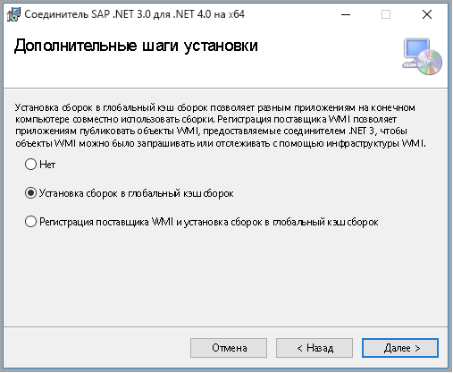

# <a name="copy-data-from-sap-table-using-azure-data-factory"></a>Копирование данных из таблицы SAP с помощью фабрики данных Azure

В этой статье описывается, как с помощью действия копирования в фабрике данных Azure копировать данные из таблицы SAP. Это продолжение [статьи об обзоре действия копирования](copy-activity-overview.md), в которой представлены общие сведения о действии копирования.

## <a name="supported-capabilities"></a>Поддерживаемые возможности

Данные можно скопировать из таблицы SAP в любой поддерживаемый приемник данных. Список хранилищ данных, которые поддерживаются в качестве источников и приемников для действия копирования, приведен в таблице [Поддерживаемые хранилища данных и форматы](copy-activity-overview.md#supported-data-stores-and-formats).

В частности этот соединитель SAP таблицы поддерживает:

- Копирование данных из таблицы SAP в:

    - **SAP ECC** версии 7.01 или выше (в последних SAP поддержки пакета стопка выпущено после 2015 г.)
    - **SAP BW** с 7.01 или более поздней версии
    - **SAP S/4HANA для виртуальных машин Linux в Azure**
    - **Другие продукты в SAP Business Suite** с 7.01 или более поздней версии 

- Копирование данных из обоих **прозрачного таблицы SAP** и **представление**.
- Копирование данных с использованием **обычной проверки подлинности** или **SNC** (безопасные сетевого подключения) при настройке SNC.
- Подключение к **сервера приложений** или **сервер сообщений**.

## <a name="prerequisites"></a>Технические условия

Чтобы использовать этот соединитель SAP таблицы, вам потребуется:

- Настройте локальную среду IR с версией 3.17 или более поздней версии. Дополнительные сведения см. в статье [Создание и настройка локальной среды выполнения интеграции](create-self-hosted-integration-runtime.md).

- Скачайте **64-разрядную версию [соединителя SAP .NET 3.0](https://support.sap.com/en/product/connectors/msnet.html)** с сайта SAP и установите ее на компьютере с локальной средой IR. При установке в окне действия установки дополнительных обязательно выберите **Установка сборок в глобальный кэш СБОРОК** параметр. 

    

- Пользователь SAP, используется в соединителе таблицы SAP фабрики данных должен иметь следующие разрешения: 

    - Авторизация для RFC. 
    - Разрешения объекта авторизации «S_SDSAUTH» действие «Выполнить».

## <a name="getting-started"></a>Приступая к работе

[!INCLUDE [data-factory-v2-connector-get-started](../../includes/data-factory-v2-connector-get-started.md)]

Следующие разделы содержат сведения о свойствах, которые используются для определения сущностей фабрики данных, относящихся к соединителю SAP таблицы.

## <a name="linked-service-properties"></a>Свойства связанной службы

Для связанной службы SAP Business Warehouse (BW) Open Hub поддерживаются следующие свойства:

| Свойство | ОПИСАНИЕ | Обязательно для заполнения |
|:--- |:--- |:--- |
| type | Свойству type необходимо задать значение **SapTable** | Да |
| server | Имя сервера, на котором размещен экземпляр SAP.<br/>Применимо, если вы хотите подключиться к **сервера приложений SAP**. | Нет |
| systemNumber | Номер системы системы SAP.<br/>Применимо, если вы хотите подключиться к **сервера приложений SAP**.<br/>Допустимые значения: двузначное десятичное число, представленное в виде строки. | Нет |
| messageServer | Имя узла сервера сообщений SAP.<br/>Применимо, если вы хотите подключиться к **сервер сообщений SAP**. | Нет |
| messageServerService | Имя службы или порт номер сервера сообщений.<br/>Применимо, если вы хотите подключиться к **сервер сообщений SAP**. | Нет |
| systemId | SystemID системы SAP, в которой находится таблица.<br/>Применимо, если вы хотите подключиться к **сервер сообщений SAP**. | Нет |
| logonGroup | Группа входа для системы SAP.<br/>Применимо, если вы хотите подключиться к **сервер сообщений SAP**. | Нет |
| clientid | Идентификатор клиента для клиента в системе SAP.<br/>Допустимые значения: трехзначное десятичное число, представленное в виде строки. | Да |
| language | Язык, используемый в системе SAP. | Нет (по умолчанию задано значение **EN**)|
| userName | Имя пользователя, имеющего доступ к серверу SAP. | Yes |
| password | Пароль для пользователя Пометьте это поле как SecureString, чтобы безопасно хранить его в фабрике данных, или [добавьте ссылку на секрет, хранящийся в Azure Key Vault](store-credentials-in-key-vault.md). | Да |
| sncMode | Индикатор SNC активации для доступа к серверу SAP, в которой находится таблица.<br/>Применяется, если вы хотите использовать SNC для подключения к серверу SAP.<br/>Допустимые значения: **0** (оно отключено, по умолчанию) или **1** (вкл.). | Нет |
| sncMyName | Имя инициатора SNC для доступа к серверу SAP, в которой находится таблица.<br/>Применимо, если `sncMode` включен. | Нет |
| sncPartnerName | Обмен данными партнера SNC name для доступа к серверу SAP, в которой находится таблица.<br/>Применимо, если `sncMode` включен. | Нет |
| sncLibraryPath | Где находится таблица библиотека внешней безопасности продукта для доступа к серверу SAP.<br/>Применимо, если `sncMode` включен. | Нет |
| sncQop | SNC качество защиты.<br/>Применимо, если `sncMode` включен. <br/>Допустимые значения: **1** (проверка подлинности), **2** (целостность), **3** (конфиденциальность), **8** (по умолчанию), **9** (максимум). | Нет |
| connectVia | [Среда выполнения интеграции](concepts-integration-runtime.md), используемая для подключения к хранилищу данных. Требуется локальная среда IR, как упоминалось в разделе [Предварительные требования](#prerequisites). |Да |

**Пример 1: подключение к серверу приложений SAP**

```json
{
    "name": "SapTableLinkedService",
    "properties": {
        "type": "SapTable",
        "typeProperties": {
            "server": "<server name>",
            "systemNumber": "<system number>",
            "clientId": "<client id>",
            "userName": "<SAP user>",
            "password": {
                "type": "SecureString",
                "value": "<Password for SAP user>"
            }
        },
        "connectVia": {
            "referenceName": "<name of Integration Runtime>",
            "type": "IntegrationRuntimeReference"
        }
    }
}
```

**Пример 2: подключение к сервер сообщений SAP**

```json
{
    "name": "SapTableLinkedService",
    "properties": {
        "type": "SapTable",
        "typeProperties": {
            "messageServer": "<message server name>",
            "messageServerService": "<service name or port>",
            "systemId": "<system id>",
            "logonGroup": "<logon group>",
            "clientId": "<client id>",
            "userName": "<SAP user>",
            "password": {
                "type": "SecureString",
                "value": "<Password for SAP user>"
            }
        },
        "connectVia": {
            "referenceName": "<name of Integration Runtime>",
            "type": "IntegrationRuntimeReference"
        }
    }
}
```

**Пример 3: подключение с использованием SNC**

```json
{
    "name": "SapTableLinkedService",
    "properties": {
        "type": "SapTable",
        "typeProperties": {
            "server": "<server name>",
            "systemNumber": "<system number>",
            "clientId": "<client id>",
            "userName": "<SAP user>",
            "password": {
                "type": "SecureString",
                "value": "<Password for SAP user>"
            },
            "sncMode": 1,
            "sncMyName": "snc myname",
            "sncPartnerName": "snc partner name",
            "sncLibraryPath": "snc library path",
            "sncQop": "8"
        },
        "connectVia": {
            "referenceName": "<name of Integration Runtime>",
            "type": "IntegrationRuntimeReference"
        }
    }
}
```

## <a name="dataset-properties"></a>Свойства набора данных

Полный список разделов и свойств, доступных для определения наборов данных, см. в статье о [наборах данных](concepts-datasets-linked-services.md). Этот раздел содержит список свойств, поддерживаемых набором данных таблицы SAP.

Чтобы скопировать данные из и откройте Центр SAP BW, поддерживаются следующие свойства.

| Свойство | ОПИСАНИЕ | Обязательно для заполнения |
|:--- |:--- |:--- |
| type | Свойство type должно быть присвоено **SapTableResource**. | Да |
| tableName | Имя таблицы для копирования данных из SAP. | Да |

**Пример.**

```json
{
    "name": "SAPTableDataset",
    "properties": {
        "type": "SapTableResource",
        "linkedServiceName": {
            "referenceName": "<SAP Table linked service name>",
            "type": "LinkedServiceReference"
        },
        "typeProperties": {
            "tableName": "<SAP table name>"
        }
    }
}
```

## <a name="copy-activity-properties"></a>Свойства действия копирования

Полный список разделов и свойств, используемых для определения действий, см. в статье [Конвейеры и действия в фабрике данных Azure](concepts-pipelines-activities.md). Этот раздел содержит список свойств, поддерживаемых источником SAP таблицы.

### <a name="sap-table-as-source"></a>Таблица SAP в качестве источника

Чтобы скопировать данные из таблицы SAP, поддерживаются следующие свойства.

| Свойство                         | ОПИСАНИЕ                                                  | Обязательно для заполнения |
| :------------------------------- | :----------------------------------------------------------- | :------- |
| type                             | Свойство type должно быть присвоено **SapTableSource**.         | Да      |
| Количество строк                         | Количество строк, которые требуется извлечь.                              | Нет       |
| rfcTableFields                   | Полей, копируемых из таблицы SAP. Например, `column0, column1`. | Нет       |
| rfcTableOptions                  | Параметры для фильтрации строк таблицы SAP. Например, `COLUMN0 EQ 'SOMEVALUE'`. См. описание под этой таблицей. | Нет       |
| customRfcReadTableFunctionModule | Пользовательские RFC функция модуль, который может использоваться для чтения данных из таблицы SAP.<br>Можно использовать пользовательский модуль функции RFC для определения того, как данные извлекаются из системы SAP и возвращается к ADF. While, обратите внимание, что модуль пользовательскую функцию имел аналогичный интерфейс, реализованный (импорт, экспорт, таблицы), аналогично как/SAPDS/RFC_READ_TABLE2 по умолчанию, используемые ADF. | Нет       |
| partitionOption                  | Механизм секционирования для считывания из таблицы SAP. Поддерживаемые параметры: <br/>- **Нет**<br/>- **PartitionOnInt** (обычным целым числом или целочисленных значений ноль заполнения слева, например 0000012345)<br/>- **PartitionOnCalendarYear** (4 цифр в формате «YYYY»)<br/>- **PartitionOnCalendarMonth** (6 цифр в формате «YYYYMM»)<br/>- **PartitionOnCalendarDate** (8 цифр в формате «ГГГГММДД») | Нет       |
| partitionColumnName              | Имя столбца для секционирования данных.                | Нет       |
| partitionUpperBound              | Максимальное значение для столбца, указанного в `partitionColumnName` , будет использоваться для секционирования продолжением. | Нет       |
| partitionLowerBound              | Минимальное значение для столбца, указанного в `partitionColumnName` , будет использоваться для секционирования продолжением. | Нет       |
| maxPartitionsNumber              | Максимальное число секций для разделения данных в.     | Нет       |

>[!TIP]
>- Если в таблице SAP есть большое количество данных, такие как несколько миллиарды строк, используйте `partitionOption` и `partitionSetting` для разбиения данных на небольших секций, в этом случае данные считываются секций, каждая секция данных извлекается из ваш сервер SAP через один одним Вызов RFC.<br/>
>- Принимая `partitionOption` как `partitionOnInt` в качестве примера вычисляется количество строк в каждой секции путем (Итого строк диапазоне *partitionUpperBound* и *partitionLowerBound*) /*maxPartitionsNumber*.<br/>
>- Если вы хотите Дополнительно выполните секций в параллельном режиме для ускорения копирования, рекомендуется сделать `maxPartitionsNumber` кратными значение `parallelCopies` (Дополнительные сведения из [параллельное копирование](copy-activity-performance.md#parallel-copy)).

В `rfcTableOptions`, например следующие распространенные SAP операторы запросов можно использовать для фильтрации строк: 

| Оператор | Описание |
| :------- | :------- |
| EQ | Равно |
| NE | Не равно |
| LT | Менее |
| LE | Меньше или равно |
| GT | Больше |
| GE | Больше или равно |
| КАК И | Как в LIKE '% Эмма' |

**Пример.**

```json
"activities":[
    {
        "name": "CopyFromSAPTable",
        "type": "Copy",
        "inputs": [
            {
                "referenceName": "<SAP Table input dataset name>",
                "type": "DatasetReference"
            }
        ],
        "outputs": [
            {
                "referenceName": "<output dataset name>",
                "type": "DatasetReference"
            }
        ],
        "typeProperties": {
            "source": {
                "type": "SapTableSource",
                "partitionOption": "PartitionOnInt",
                "partitionSettings": {
                     "partitionColumnName": "<partition column name>",
                     "partitionUpperBound": "2000",
                     "partitionLowerBound": "1",
                     "maxPartitionsNumber": 500
                 }
            },
            "sink": {
                "type": "<sink type>"
            }
        }
    }
]
```

## <a name="data-type-mapping-for-sap-table"></a>Сопоставление типов данных для таблицы SAP

При копировании данных из таблицы SAP, из таблицы SAP типы данных для промежуточных типов данных фабрики данных Azure используются следующие сопоставления. Дополнительные сведения о том, как действие копирования сопоставляет исходную схему и типы данных для приемника, см. в статье [Сопоставление схем в действии копирования](copy-activity-schema-and-type-mapping.md).

| Тип данных ABAP в SAP | Тип промежуточных данных фабрики данных |
|:--- |:--- |
| C (строка) | String |
| Я (Integer) | Int32 |
| F (с плавающей запятой) | Double |
| D (дата) | String |
| T (время) | String |
| P (пакеты данных конфигурации загрузки, валюта, десятичное число, количество) | Decimal |
| N (числовой) | String |
| X (двоичные и необработанные данные) | String |

## <a name="next-steps"></a>Дальнейшие действия
В таблице [Поддерживаемые хранилища данных](copy-activity-overview.md#supported-data-stores-and-formats) приведен список хранилищ данных, которые поддерживаются в качестве источников и приемников для действия копирования в фабрике данных Azure.
