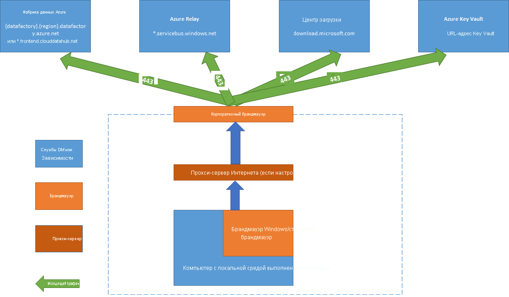

# <a name="create-and-configure-a-self-hosted-integration-runtime"></a>Создание и настройка локальной среды выполнения интеграции
Среда выполнения интеграции (IR) — это инфраструктура вычислений, которую Фабрика данных Azure использует для обеспечения интеграции данных в разных сетевых средах. Дополнительные сведения о среде выполнения интеграции см. [в этом обзоре](concepts-integration-runtime.md).

Локальная среда выполнения интеграции может запускать операции копирования между облачным хранилищем данных и хранилищем данных в частной сети, а также организовывать действия преобразования для вычислительных ресурсов в локальной сети или виртуальной сети Azure. Локальная среда выполнения интеграции устанавливается на локальном компьютере или виртуальной машине в частной сети.  

Из этого документа вы узнаете, как создать и настроить локальную среду IR.

## <a name="high-level-steps-to-install-a-self-hosted-ir"></a>Список действий по установке локальной среды IR
1. Создайте локальную среду выполнения интеграции. Для этой задачи можно использовать интерфейс Фабрики данных Azure. Ниже приведен пример скрипта PowerShell.

    ```powershell
    Set-AzureRmDataFactoryV2IntegrationRuntime -ResourceGroupName $resourceGroupName -DataFactoryName $dataFactoryName -Name $selfHostedIntegrationRuntimeName -Type SelfHosted -Description "selfhosted IR description"
    ```
  
2. [Скачайте](https://www.microsoft.com/download/details.aspx?id=39717) и установите на локальном компьютере локальную среду выполнения интеграции.

3. Получите ключ проверки подлинности и зарегистрируйте локальную среду выполнения интеграции с помощью этого ключа. Ниже приведен пример скрипта PowerShell.

    ```powershell
    Get-AzureRmDataFactoryV2IntegrationRuntimeKey -ResourceGroupName $resourceGroupName -DataFactoryName $dataFactoryName -Name $selfHostedIntegrationRuntime.  
    ```

## <a name="setting-up-a-self-hosted-ir-on-an-azure-vm-by-using-an-azure-resource-manager-template-automation"></a>Настройка локальной среды IR на виртуальной машине Azure с помощью шаблона Azure Resource Manager (автоматизация)
Настройку локальной среды IR на виртуальной машине Azure можно автоматизировать с помощью [этого шаблона Azure Resource Manager](https://github.com/Azure/azure-quickstart-templates/tree/master/101-vms-with-selfhost-integration-runtime). Этот шаблон позволяет легко создать полностью функциональную локальную среду IR внутри виртуальной сети Azure с функциями высокой доступности и масштабируемости (при условии, что количество узлов будет не меньше двух).

## <a name="command-flow-and-data-flow"></a>Поток команд и поток данных
Когда вы копируете данные между локальной средой и облаком, действие копирования применяет среду выполнения интеграции для фактической передачи данных из локального хранилища данных в облачное или обратно.

Вот общая схема потока данных при копировании с использованием локальной среды IR:


1. Разработчик данных создает локальную среду выполнения интеграции в Фабрике данных Azure с помощью командлета PowerShell. На портале Azure эта функция пока не поддерживается.
2. Разработчик данных создает связанную службу для локального хранилища данных, указывая экземпляр локальной среды выполнения интеграции, который он намерен использовать для подключения к хранилищам данных. В ходе настройки связанной службы разработчик указывает типы проверки подлинности и учетные данные в приложении "Диспетчер учетных данных" (пока не поддерживается). Диспетчер учетных данных проверяет подключение к хранилищу данных и сохраняет учетные данные в локальной среде выполнения интеграции.
3. Узел локальной среды выполнения интеграции шифрует учетные данные с помощью программного интерфейса защиты данных (API защиты данных) и сохраняет учетные данные локально. Если вы настроили несколько узлов для обеспечения высокой доступности, учетные данные дополнительно синхронизируются между этими узлами. Каждый узел шифрует учетные данные с помощью API защиты данных и сохраняет их локально. Синхронизация учетных данных выполняется локальной средой выполнения интеграции, и разработчик данных может отслеживать этот процесс.    
4. Служба "Фабрика данных" взаимодействует с локальной средой выполнения интеграции для планирования заданий и управления ими через *канал управления*, который использует общую очередь Служебной шины Azure. Когда нужно выполнить задание действия, фабрика данных помещает в очередь запрос и соответствующие учетные данные (если они не сохранены в локальной среде выполнения интеграции). Локальная среда выполнения интеграции опрашивает очередь и запускает задание.
5. Локальная среда выполнения интеграции копирует данные из локального хранилища в облачное или из облачного в локальное в зависимости от настроек действия копирования в конвейере данных. На этом этапе локальная среда выполнения интеграции напрямую взаимодействует с облачными службами хранилища, такими как хранилище BLOB-объектов Azure, через защищенный канал (HTTPS).

## <a name="considerations-for-using-a-self-hosted-ir"></a>Рекомендации по использованию локальной среды выполнения интеграции

- Один экземпляр локальной среды выполнения интеграции можно использовать для нескольких локальных источников данных. Одну локальную среду выполнения интеграции можно использовать совместно с другой фабрикой данных в пределах одного клиента Azure Active Directory. Дополнительные сведения см. в разделе о [совместном использовании локальной среды выполнения интеграции](#sharing-the-self-hosted-integration-runtime-with-multiple-data-factories).
- На компьютере может быть установлен только один экземпляр локальной среды выполнения интеграции. Если у вас есть две фабрики данных, которым необходим доступ к локальным источникам данных, потребуется установить локальную среду выполнения интеграции на двух локальных компьютерах. Другими словами, локальная среда выполнения интеграции привязана к конкретной фабрике данных.
- Локальную среду выполнения интеграции не обязательно устанавливать на том же компьютере, где установлен источник данных. Но чем ближе она будет расположена к источнику данных, тем меньше потребуется времени на подключение к источнику данных. Рекомендуем устанавливать локальную среду выполнения интеграции на компьютере, отличном от того, на котором размещен локальный источник данных. Если локальная среда выполнения интеграции и источник данных будут выполняться на разных компьютерах, между ними не возникнет конкуренции за ресурсы компьютера.
- Вы можете установить несколько локальных сред выполнения интеграции на разных компьютерах и подключить их к одному локальному источнику данных. Например, можно создать две локальные среды выполнения интеграции для работы с двумя фабриками данных, в которых зарегистрирован один и тот же локальный источник данных.
- Если вы уже установили шлюз на компьютер, который обслуживает сценарий Power BI, установите отдельную локальную среду выполнения интеграции для Фабрики данных Azure на другой компьютер.
- Локальная среда выполнения интеграции является обязательным элементом для поддержки интеграции данных в виртуальной сети Azure.
- Источник данных следует считать локальным и находящимся за брандмауэром, даже если используется Azure ExpressRoute. Для связи между службой и источником данных следует использовать локальную среду выполнения интеграции.
- Локальная среда выполнения интеграции является обязательной, даже если хранилище данных размещено в облаке на виртуальной машине Azure IaaS.
- Задачи могут завершаться ошибкой в локальной среде выполнения интеграции, установленной на сервере Windows Server, на котором включено шифрование, совместимое с FIPS. Чтобы устранить эту проблему, отключите на сервере шифрование, совместимое с FIPS. Чтобы отключить шифрование, совместимое с FIPS, измените следующее значение реестра с "1" (включено) на "0" (отключено): `HKLM\System\CurrentControlSet\Control\Lsa\FIPSAlgorithmPolicy\Enabled`.

## <a name="prerequisites"></a>Предварительные требования

- Поддерживаемые операционные системы: Windows 7 с пакетом обновления 1, Windows 8.1, Windows 10, Windows Server 2008 R2 с пакетом обновления 1 (SP1), Windows Server 2012, Windows Server 2012 R2 и Windows Server 2016. Установка локальной среды выполнения интеграции на контроллер домена не поддерживается.
- Требуется .NET Framework 4.6.1 или более поздней версии. Если локальная среда выполнения интеграции устанавливается на компьютер под управлением Windows 7, установите .NET Framework 4.6.1 или более поздней версии. Дополнительные сведения см. в разделе [Требования к системе для .NET Framework](/dotnet/framework/get-started/system-requirements).
- Минимальная рекомендуемая конфигурация для компьютера, на котором устанавливается локальная среда выполнения интеграции: четырехъядерный процессор с тактовой частотой 2 ГГц, 8 ГБ ОЗУ и 80 ГБ дискового пространства.
- Когда хост-компьютер переходит в режим гибернации, локальная среда выполнения интеграции не может отвечать на запросы данных. Перед установкой локальной среды выполнения интеграции на компьютере следует настроить соответствующую схему управления питанием. Если компьютер использует режим гибернации, программа установки локальной среды выполнения интеграции отобразит соответствующее сообщение.
- Для успешной установки и настройки локальной среды выполнения интеграции вам потребуются права администратора на компьютере.
- Действие копирования выполняется с определенной периодичностью. Потребление ресурсов (ЦП, памяти) на компьютере следует той же закономерности с периодами пиковой нагрузки и простоя. Использование ресурсов также зависит от объема перемещаемых данных. Когда выполняется несколько заданий копирования, в пиковые периоды уровень использования ресурсов системы повышается.

## <a name="installation-best-practices"></a>Рекомендации по установке
Можно установить локальную среду выполнения интеграции выполнения, скачав пакет установки MSI из [Центра загрузки Майкрософт](https://www.microsoft.com/download/details.aspx?id=39717). Пошаговые инструкции вы найдете в разделе [Перемещение данных между локальными источниками и облаком с помощью шлюза управления данными](tutorial-hybrid-copy-powershell.md).

- На компьютере, где устанавливается локальная среда выполнения интеграции, нужно настроить схему управления питанием так, чтобы компьютер не переходил в режим гибернации. Если хост-компьютер перейдет в режим гибернации, локальная среда выполнения интеграции будет отключена.
- Регулярно выполняйте резервное копирование учетных данных, настроенных в локальной среде выполнения интеграции.

## <a name="install-and-register-self-hosted-ir-from-the-download-center"></a>Установка и регистрация локальной среды IR из Центра загрузки Майкрософт

1. Перейдите на [страницу загрузки среды выполнения интеграции Майкрософт](https://www.microsoft.com/download/details.aspx?id=39717).
2. Нажмите кнопку **Скачать**, выберите нужную версию (**32-разрядную** или **64-разрядную**) и нажмите кнопку **Далее**.
3. Выполните MSI-файл сразу или сохраните его на жесткий диск и затем выполните.
4. На странице **приветствия** выберите язык и нажмите кнопку **Далее**.
5. Примите условия лицензионного соглашения об использовании программного обеспечения Майкрософт и выберите **Далее**.
6. Выберите **папку** для установки локальной среды выполнения интеграции и нажмите кнопку **Далее**.
7. На странице **Готово к установке** выберите **Установить**.
8. Нажмите кнопку **Готово** для завершения установки.
9. Получите ключ проверки подлинности с помощью Azure PowerShell. Ниже представлен код PowerShell для получения ключа проверки подлинности.

    ```powershell
    Get-AzureRmDataFactoryV2IntegrationRuntimeKey -ResourceGroupName $resourceGroupName -DataFactoryName $dataFactoryName -Name $selfHostedIntegrationRuntime
    ```
11. В диспетчере конфигураций Microsoft Integration Runtime откройте страницу **Регистрация Integration Runtime (Self-hosted)** и выполните следующие действия.

    a. Вставьте в текстовое поле ключ проверки подлинности.

    b. Чтобы просмотреть текст ключа, щелкните **Show authentication key** (Показать ключ проверки подлинности).

    c. Выберите **Зарегистрировать**.


## <a name="high-availability-and-scalability"></a>Высокий уровень доступности и масштабируемости
Локальную среду выполнения интеграции можно связывать с несколькими локальными компьютерами. Такие компьютеры называются узлами. Для локальной среды выполнения интеграции можно использовать до четырех узлов. Ниже перечислены преимущества связывания нескольких узлов (локальных компьютеров с установленным шлюзом) с логическим шлюзом.
* Высокая доступность локальной среды выполнения интеграции при использовании нескольких узлов (до 4) избавляет от единой точки отказа в решении больших данных или облачных данных в Фабрике данных Azure.
* Повышение производительности и пропускной способности при перемещении данных между локальными и облачными хранилищами данных. Узнайте больше о [сравнении производительности](copy-activity-performance.md).

Можно связать несколько узлов, установив программное обеспечение локальной среды выполнения интеграции из [Центра загрузки](https://www.microsoft.com/download/details.aspx?id=39717). Затем следует зарегистрировать его с помощью одного из ключей проверки подлинности, полученных в результате выполнения командлета **New-AzureRmDataFactoryV2IntegrationRuntimeKey**, как описано в этом [руководстве](tutorial-hybrid-copy-powershell.md).

> [!NOTE]
> Для дополнительных узлов не нужно создавать отдельную локальную среду выполнения интеграции. Вы можете установить эту среду на другом компьютере и зарегистрировать ее, используя тот же ключ проверки подлинности. 

> [!NOTE]
> Прежде чем добавить еще один узел для обеспечения высокого уровня доступности и масштабируемости, убедитесь, что включен параметр **Remote access to intranet** (Удаленный доступ к интрасети) на первом узле (**Диспетчер конфигураций Microsoft Integration Runtime** > **Параметры** > **Remote access to intranet** (Удаленный доступ к интрасети)). 

### <a name="scale-considerations"></a>Рекомендации по масштабированию

#### <a name="scale-out"></a>Масштабирование

Когда доступной памяти в локальной среде IR недостаточно, а ЦП сильно загружен, можно добавить новый узел, чтобы распределить нагрузку по нескольким компьютерам. Если действия не выполняются из-за истечения времени ожидания или из-за того, что узел локальной среды IR находится в автономном режиме, будет полезно добавить узел к шлюзу.

#### <a name="scale-up"></a>Увеличение масштаба

Если доступная память и ЦП используются неэффективно, но выполнение параллельных заданий достигает ограничения, следует увеличить масштаб, увеличив количество параллельных заданий, которые могут выполняться на узле. Кроме того, масштаб можно увеличить, если время ожидания действия истекает из-за перегрузки локальной среды IR. Как показано на следующем рисунке, можно увеличить максимальную емкость для узла:  


### <a name="tlsssl-certificate-requirements"></a>Требования к TLS- и SSL-сертификатам

Ниже приведены требования к TLS- и SSL-сертификатам, используемым для защиты взаимодействия между узлами Integration Runtime.

- Сертификат должен быть общедоступным доверенным сертификатом X509 v3. Мы рекомендуем использовать сертификаты, выданные общедоступным (партнерским) центром сертификации.
- Все узлы среды выполнения интеграции должны доверять этому сертификату.
- Не рекомендуем использовать сертификаты с альтернативным именем субъекта (SAN), так как в текущей реализации применяется только последнее из альтернативных имен, а остальные игнорируются. Например, если у вас есть сертификат SAN с альтернативными именами субъекта **node1.domain.contoso.com** и **node2.domain.contoso.com**, его можно применить только для компьютера с полным доменным именем **node2.domain.contoso.com**.
- Сертификат поддерживает любой размер ключей, поддерживаемый в Windows Server 2012 R2 для SSL-сертификатов.
- Сертификаты на основе ключей CNG не поддерживаются.  

## <a name="sharing-the-self-hosted-integration-runtime-with-multiple-data-factories"></a>Совместное использование локальной среды выполнения интеграции с несколькими фабриками данных

Вы можете повторно использовать существующую инфраструктуру локальной среды IR, которую вы уже настроили в фабрике данных. Это позволяет создать *связанную локальную среду IR* в другой фабрике данных, ссылаясь на имеющуюся локальную среду IR (общую).

Сведения о предоставлении общего доступа к локальной среде выполнения интеграции с помощью PowerShell см. в статье о [создании локальной среды выполнения интеграции в Фабрике данных Azure с помощью PowerShell](create-shared-self-hosted-integration-runtime-powershell.md).

Уделите 12 минут своего времени, чтобы просмотреть следующее видео с кратким обзором и демонстрацией этой функции:

> [!VIDEO https://channel9.msdn.com/Shows/Azure-Friday/Hybrid-data-movement-across-multiple-Azure-Data-Factories/player]

### <a name="terminology"></a>Терминология

- **Общая среда IR** — исходная локальная среда IR, работающая в физической инфраструктуре.  
- **Связанная среда IR** — среда выполнения интеграции, которая ссылается на другую общую среду IR. Это логическая среда IR, которая использует инфраструктуру другой локальной среды IR (общей).

### <a name="high-level-steps-for-creating-a-linked-self-hosted-ir"></a>Общие шаги для создания связанной локальной среды IR

1. В локальной среде выполнения интеграции для совместного использования предоставьте разрешения фабрике данных, в которой нужно создать связанную среду IR. 

   

   

2. Запишите идентификатор ресурса локальной среды IR, к которой нужно предоставить общий доступ.

   

3. В фабрике данных, которой были предоставлены разрешения, создайте новую локальную среду IR (связанную) и введите идентификатор ресурса.

   

   

### <a name="monitoring"></a>Мониторинг 

- **Общая среда выполнения интеграции**

  

  

- **Связанная среда выполнения интеграции**

  

  

### <a name="known-limitations-of-self-hosted-ir-sharing"></a>Известные ограничения общего доступа к локальной среде IR

* Фабрика данных, в которой будет создана связанная среда выполнения интеграции, должна иметь [управляемое удостоверение службы](https://docs.microsoft.com/azure/active-directory/managed-service-identity/overview) (MSI). По умолчанию для фабрик данных, создаваемых на портале Azure или с помощью командлетов PowerShell, управляемые удостоверения службы генерируются неявным образом. Но когда фабрика данных создается с помощью шаблона Azure Resource Manager или пакета SDK, свойство **Identity** (Идентификатор) нужно задать явным образом, чтобы с помощью Azure Resource Manager создать фабрику данных с управляемым удостоверением службы. 

* Версия пакета SDK Фабрики данных Azure для .NET, который поддерживает эту функцию, — 1.1.0 или выше.

* Версия Azure PowerShell с поддержкой этой функции — 6.6.0 или более поздняя (AzureRM.DataFactoryV2, 0.5.7 или более поздней версии).

* Чтобы предоставить разрешение, пользователю нужна роль "Владелец" или наследование этой роли в фабрике данных, где существует общая среда выполнения интеграции.

* Функция совместного использования работает только у фабрик данных, относящихся к одному клиенту Azure Active Directory.

* Для [гостевых пользователей](https://docs.microsoft.com/azure/active-directory/governance/manage-guest-access-with-access-reviews) Active Directory функция поиска (вывод списка всех фабрик данных с помощью поиска по ключевому слову) в пользовательском интерфейсе [не работает](https://msdn.microsoft.com/library/azure/ad/graph/howto/azure-ad-graph-api-permission-scopes#SearchLimits). Но пока гостевой пользователь является владельцем этой фабрики данных, он может совместно использовать среду выполнения интеграции без функции поиска, непосредственно указав MSI фабрики данных, которой необходимо предоставить среду выполнения интеграции, в текстовом поле **Assign Permission** (Назначить разрешение) и выбрав **Добавить** в пользовательском интерфейсе Фабрики данных Azure. 

  > [!NOTE]
  > Эта функция доступна только в Фабрике данных Azure версии 2. 

## <a name="notification-area-icons-and-notifications"></a>Значки и уведомления в области уведомлений

Если навести курсор на значок или уведомление в области уведомлений, вы получите сведения о состоянии локальной среды выполнения интеграции.


## <a name="ports-and-firewall"></a>Порты и брандмауэр
Описанные здесь рекомендации относятся к двум брандмауэрам: к *корпоративному брандмауэру*, работающему на центральном маршрутизаторе организации, и к *брандмауэру Windows*, настроенному на локальном компьютере, на котором установлена локальная среда выполнения интеграции.



На уровне *корпоративного брандмауэра* необходимо настроить следующие домены и исходящие порты.

Имена доменов | порты; | ОПИСАНИЕ
------------ | ----- | ------------
*.servicebus.windows.net | 443 | Используется для связи с серверной частью службы перемещения данных
*.core.windows.net | 443 | Используется для промежуточного копирования с помощью хранилища BLOB-объектов Azure (если оно настроено)
*.frontend.clouddatahub.net | 443 | Используется для связи с серверной частью службы перемещения данных
download.microsoft.com | 443 | Используется для скачивания обновлений.

Эти исходящие порты, как правило, уже разрешены на уровне *брандмауэра Windows* (на уровне компьютера). Если это не так, аналогичные настройки доменов и портов следует указать на компьютере, где установлена локальная среда выполнения интеграции.

> [!NOTE]
> В зависимости от того, какие источники и приемники используются, может потребоваться добавить в список разрешений корпоративного брандмауэра или брандмауэра Windows дополнительные домены и исходящие порты.
>
> Для некоторых баз данных в облаке (например, базы данных SQL Azure и Azure Data Lake) нужно добавить IP-адреса компьютеров, на которых работает локальная среда выполнения интеграции, в список разрешений брандмауэра.

### <a name="copy-data-from-a-source-to-a-sink"></a>Копирование данных из источника в приемник
Настройте все нужные правила на корпоративном брандмауэре и на брандмауэре Windows на компьютере, где выполняется локальная среда выполнения интеграции, а также в самом хранилище данных. Если правила настроены верно, локальная среда выполнения интеграции сможет успешно подключаться как к источнику, так и к приемнику. Активируйте правила для каждого хранилища данных, задействованного в операции копирования.

Например, при копировании данных из локального хранилища данных в приемник, размещенный в базе данных SQL Azure или хранилище данных SQL Azure, выполните следующие действия.

1. Разрешите исходящий трафик TCP через порт 1433 для брандмауэра Windows и корпоративного брандмауэра.
2. В параметрах брандмауэра базы данных Azure SQL добавьте в список разрешенных IP-адресов адрес компьютера, на котором выполняется локальная среда выполнения интеграции.

> [!NOTE]
> Если брандмауэр блокирует исходящий порт 1433, локальная среда выполнения интеграции не сможет получить доступ к базе данных SQL Azure напрямую. В этом случае можно использовать [поэтапное копирование](copy-activity-performance.md) в базу данных SQL Azure и хранилище данных SQL Azure. Тогда для перемещения данных понадобится только протокол HTTPS (порт 443).


## <a name="proxy-server-considerations"></a>Рекомендации для прокси-сервера
Если для доступа в Интернет в вашей корпоративной среде используется прокси-сервер, настройте параметры этого прокси-сервера в локальной среде выполнения интеграции. Прокси-сервер можно настроить на этапе начальной регистрации.


Локальная среда выполнения интеграции использует прокси-сервер для подключения к облачной службе. Щелкните ссылку **Изменить** во время начальной настройки. Появится диалоговое окно параметров прокси-сервера.


Доступны три варианта конфигурации.

- **Без прокси**. Локальная среда выполнения интеграции не использует явно настроенный прокси-сервер для подключения к облачным службам.
- **Использовать системный прокси**. Локальная среда выполнения интеграции использует параметры прокси-сервера, настроенные в файлах diahost.exe.config и diawp.exe.config. Если в файлах diahost.exe.config и diawp.exe.config параметры прокси-сервера не указаны, локальная среда выполнения интеграции подключается к облачной службе напрямую, не используя прокси-сервер.
- **Использовать настраиваемый прокси**. локальная среда выполнения интеграции использует собственные параметры прокси-сервера HTTP вместо конфигурации, настроенной в файлах diahost.exe.config и diawp.exe.config. Необходимо указать **адрес** и **порт**. **Имя пользователя** и **пароль** являются необязательными и указываются в зависимости от параметров проверки подлинности прокси-сервера. Все параметры шифруются с помощью Windows DPAPI в локальной среде выполнения интеграции и хранятся локально на компьютере.

Служба узла локальной среды выполнения интеграции данными автоматически перезапускается после сохранения обновленных параметров прокси-сервера.

После успешной регистрации локальной среды выполнения интеграции вы можете просмотреть или изменить параметры прокси-сервера с помощью диспетчера конфигурации для среды выполнения интеграции.

1. Откройте **диспетчер конфигураций Microsoft Integration Runtime**.
2. Переключитесь на вкладку **Параметры** .
3. Щелкните ссылку **Изменить** в разделе **HTTP-прокси**, чтобы открыть диалоговое окно **Указание HTTP-прокси**.
4. Щелкните **Далее**. Далее появится окно предупреждения, запрашивающее разрешение на сохранение настроек прокси-сервера и перезапуск службы узла среды выполнения интеграции.

При помощи диспетчера конфигурации можно просмотреть и обновить HTTP-прокси.


> [!NOTE]
> Если настроить на прокси-сервере проверку подлинности NTLM, служба узла среды выполнения интеграции будет запускаться под учетной записью домена. Если через какое-то время вы измените пароль для учетной записи домена, не забудьте обновить параметры конфигурации службы и перезапустить ее. Учитывая это требование, для доступа к прокси-серверу рекомендуется использовать выделенную учетную запись домена, для которой не требуется часто менять пароль.

### <a name="configure-proxy-server-settings"></a>Настройка параметров прокси-сервера

Если для HTTP-прокси выбран вариант конфигурации **Use system proxy** (Использовать системный прокси-сервер), локальная среда выполнения интеграции использует параметры прокси-сервера, заданные в файлах diahost.exe.config и diawp.exe.config. Если в файлах diahost.exe.config и diawp.exe.config параметры прокси-сервера не настроены, локальная среда выполнения интеграции подключается к облачной службе напрямую, не используя прокси-сервер. Ниже приводится процедура обновления файла конфигурации diahost.exe.config:

1. В проводнике создайте резервную копию исходного файла C:\Program Files\Microsoft Integration Runtime\3.0\Shared\diahost.exe.config.
2. Запустите Блокнот с правами администратора и откройте текстовый файл C:\Program Files\Microsoft Integration Runtime\3.0\Shared\diahost.exe.config. Найдите тег по умолчанию для system.net, как показано в коде ниже.

    ```xml
    <system.net>
        <defaultProxy useDefaultCredentials="true" />
    </system.net>
    ```
    Затем можно добавить данные прокси-сервера, как показано в следующем примере:

    ```xml
    <system.net>
        <defaultProxy enabled="true">
              <proxy bypassonlocal="true" proxyaddress="http://proxy.domain.org:8888/" />
        </defaultProxy>
    </system.net>
    ```

    Внутри тега прокси-сервера можно указать дополнительные свойства, чтобы задать требуемые параметры, например `scriptLocation`. Сведения о синтаксисе вы найдете в статье [Элемент <proxy> (параметры сети)](https://msdn.microsoft.com/library/sa91de1e.aspx).

    ```xml
    <proxy autoDetect="true|false|unspecified" bypassonlocal="true|false|unspecified" proxyaddress="uriString" scriptLocation="uriString" usesystemdefault="true|false|unspecified "/>
    ```
3. Сохраните файл конфигурации в исходном расположении. Затем перезапустите службу узла локальной среды выполнения интеграции, чтобы она учла эти изменения. 

   Чтобы перезапустить службу, используйте приложение "Службы" на панели управления. Или нажмите в диспетчере конфигураций Integration Runtime кнопку **Остановить службу**, а затем выберите **Запустить службу**. 
   
   Если служба не запускается, вероятно, в измененном файле конфигурации приложения был добавлен неправильный синтаксис тегов XML.

> [!IMPORTANT]
> Не забудьте обновить оба файла (diahost.exe.config и diawp.exe.config).

Необходимо также убедиться, что Microsoft Azure находится в списке разрешений вашей компании. Список допустимых IP-адресов Microsoft Azure можно скачать из [Центра загрузки Майкрософт](https://www.microsoft.com/download/details.aspx?id=41653).

### <a name="possible-symptoms-for-firewall-and-proxy-server-related-issues"></a>Возможные признаки проблем, связанных с брандмауэром и прокси-сервером
Вероятная причина приведенных ниже ошибок — неправильная конфигурация брандмауэра или прокси-сервера, которая блокирует подключение локальной среды выполнения интеграции к Фабрике данных для проверки подлинности. Чтобы убедиться, что брандмауэр и прокси-сервер настроены должным образом, см. предыдущий раздел.

* При попытке регистрации локальной среды выполнения интеграции появляется следующая ошибка: "Failed to register this Integration Runtime node! Confirm that the Authentication key is valid and the integration service Host Service is running on this machine." (Зарегистрировать этот узел Integration Runtime не удалось! Убедитесь, что используется действительный ключ проверки подлинности и что служба узла Integration Runtime запущена на этом компьютере).
* При открытии диспетчера конфигураций среды выполнения интеграции отображается состояние **Отключено** или **Подключение**. В средстве просмотра событий Windows в разделе **Просмотр событий** > **Application and Services Logs (Журналы приложений и служб)** > **Microsoft Integration Runtime** отображаются сообщения об ошибках следующего вида:

    ```
    Unable to connect to the remote server
    A component of Integration Runtime has become unresponsive and restarts automatically. Component name: Integration Runtime (Self-hosted).
    ```

### <a name="enabling-remote-access-from-an-intranet"></a>Разрешение удаленного доступа из интрасети  
Если вы используете PowerShell или приложение диспетчера учетных данных для шифрования учетных данных на другом компьютере (в сети), отличном от того, на котором установлена локальная среда выполнения интеграции, можно включить параметр **Remote Access from Intranet** (Удаленный доступ из интрасети). Если вы используете PowerShell или приложение диспетчера учетных данных для шифрования учетных данных на том же компьютере, где установлена локальная среда выполнения интеграции, параметр **Remote Access from Intranet** (Удаленный доступ из интрасети) включить нельзя.

Параметр **Remote Access from Intranet** (Удаленный доступ из интрасети) нужно включить перед добавлением еще одного узла для обеспечения высокой доступности и масштабируемости.  

Во время установки локальной среды выполнения интеграции (версии 3.3.xxxx.x или более поздней) программа установки по умолчанию отключает параметр **Remote Access from Intranet** (Удаленный доступ из интрасети) на компьютере, где будет работать локальная среда выполнения интеграции.

При использовании стороннего брандмауэра вы сможете открыть порт 8060 (или настроенный пользователем порт) вручную. Если во время установки локальной среды выполнения интеграции возникли проблемы с брандмауэром, попробуйте установить локальную среду выполнения интеграции без настройки брандмауэра, используя следующую команду.

```
msiexec /q /i IntegrationRuntime.msi NOFIREWALL=1
```
> [!NOTE]
> Приложение диспетчера учетных данных пока недоступно для шифрования учетных данных в Фабрике данных Azure версии 2.  

Если вы не хотите открывать порт 8060 на компьютере, где работает локальная среда выполнения интеграции, то для настройки учетных данных для хранилища данных вам придется использовать другой механизм, а не приложение "Настройка учетных данных". Например, вы можете применить командлет PowerShell  **New-AzureRmDataFactoryV2LinkedServiceEncryptCredential**.


## <a name="next-steps"></a>Дополнительная информация
Пошаговые инструкции представлены в следующем руководстве: [Руководство. Копирование данных из локальной базы данных SQL Server в хранилище BLOB-объектов Azure](tutorial-hybrid-copy-powershell.md).
