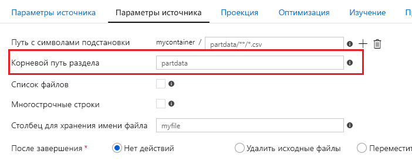
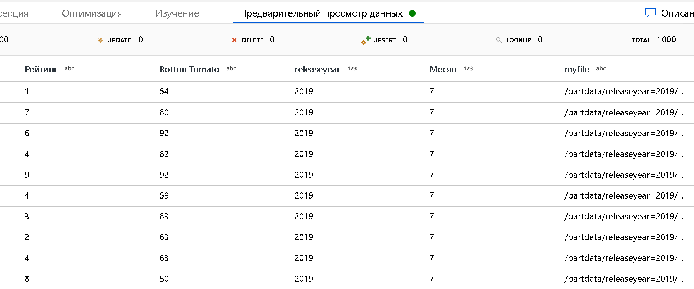

# <a name="source-transformation-for-mapping-data-flow"></a>Преобразование источника для потока данных сопоставления 

[!INCLUDE [notes](../../includes/data-factory-data-flow-preview.md)]

Преобразование «источник» настраивает источник данных для потока данных. Поток данных может включать более одного преобразования источника. При проектировании потоков данных всегда начинайте с преобразования источника.

Для каждого потока данных требуется по крайней мере одно преобразование источника. Добавьте столько источников, сколько необходимо для завершения преобразований данных. Вы можете соединить эти источники вместе с преобразованием «соединение» или «объединение».

> [!NOTE]
> При отладке потока данных данные считываются из источника с помощью параметра выборки или ограничений источника отладки. Чтобы записать данные в приемник, необходимо запустить поток данных из действия потока данных конвейера. 


Свяжите Преобразование источника потока данных с одним набором данных фабрики данных. Набор данных определяет форму и расположение данных, которые необходимо записать или прочитать. В источнике можно использовать подстановочные знаки и списки файлов для работы с несколькими файлами за раз.

Использование **шаблона** с подстановочными знаками указывает, что ADF будет циклически проходить по всем соответствующим папкам и файлам в одном преобразовании источника. Это очень эффективный способ обработки нескольких файлов в одном потоке. Чтобы отслеживание имени файла, обрабатываемого в данный момент, задайте имя поля для поля "столбец для хранения имени файла" в параметрах источника.

> [!NOTE]
> Задайте несколько шаблонов сопоставления с подстановочными знаками с символом + рядом с существующим шаблоном шаблона, чтобы добавить дополнительные правила с подстановочными знаками.

## <a name="data-flow-staging-areas"></a>Промежуточные области потока данных
Поток данных работает с *промежуточными* DataSets, которые находятся в Azure. Используйте эти наборы данных для промежуточного хранения при их преобразовании. 

Фабрика данных имеет доступ почти 80 собственных соединителей. Чтобы включить данные из других источников в потоке данных, используйте средство действия копирования для размещения данных в одной из промежуточных областей набора данных потока данных.

## <a name="options"></a>Параметры

Выберите схему и параметры выборки для данных.

### <a name="schema-drift"></a>Смещение схемы
[Смещение схемы](concepts-data-flow-schema-drift.md) — это способность ADF в собственном коде управлять гибкими схемами в потоках данных без необходимости явно определять изменения столбцов.

* Установите флажок **Разрешить смещение схемы** , если исходные столбцы будут часто меняться. Этот параметр позволяет всем входящим полям источника проходить через преобразования в приемник.

* Выбор **типов столбцов** с пересечением указывает, что ADF определяет типы данных для каждого обнаруженного нового столбца. Если эта функция отключена, ADF считает строку.

### <a name="validate-schema"></a>Проверить схему

Если входящая версия исходных данных не соответствует заданной схеме, поток данных не будет запущен.


### <a name="sample-the-data"></a>Выборка данных
Включите **выборку** , чтобы ограничить количество строк в источнике. Используйте этот параметр при тестировании или выборки данных из источника для отладки.

## <a name="define-schema"></a>Определение схемы

Если исходные файлы не являются строго типизированными (например, неструктурированные файлы, а не Parquet файлы), определите типы данных для каждого поля в преобразовании «источник».  


Впоследствии можно изменить имена столбцов в преобразовании SELECT. Используйте преобразование «Производный столбец» для изменения типов данных. Для строго типизированных источников можно изменить типы данных в дальнейшем преобразовании «выбор». 


### <a name="optimize-the-source-transformation"></a>Оптимизация преобразования источника

На вкладке **Оптимизация** для преобразования источник может отображаться тип **исходной** секции. Этот параметр доступен, только если источником является база данных SQL Azure. Это связано с тем, что фабрика данных пытается сделать подключения параллельными для выполнения больших запросов к источнику базы данных SQL.


Вам не нужно секционировать данные в источнике базы данных SQL, но секции полезны для больших запросов. Вы можете создать секцию на основе столбца или запроса.

### <a name="use-a-column-to-partition-data"></a>Использование столбца для секционирования данных

В исходной таблице выберите столбец для секционирования. Также задайте количество секций.

### <a name="use-a-query-to-partition-data"></a>Использование запроса для секционирования данных

Можно выбрать секционирование соединений на основе запроса. Просто введите содержимое предиката WHERE. Например, введите year > 1980.

## <a name="source-file-management"></a>Управление исходными файлами

Выберите параметры для управления файлами в источнике. 


* **Путь**с подстановочными знаками: В исходном контейнере выберите ряд файлов, соответствующих шаблону. Этот параметр переопределяет любой файл в определении набора данных.

Примеры подстановочных знаков:

* ```*```Представляет любой набор символов
* ```**```Представляет рекурсивную вложенность каталога
* ```?```Заменяет один символ
* ```[]```Соответствует одному из более символов в квадратных скобках

* ```/data/sales/**/*.csv```Получает все CSV-файлы в/Дата/Салес
* ```/data/sales/20??/**```Возвращает все файлы в 20 века
* ```/data/sales/2004/*/12/[XY]1?.csv```Возвращает все CSV-файлы в 2004 в декабре, начиная с префикса X или Y и заканчивая двумя цифрами.

Контейнер должен быть указан в наборе данных. Путь к шаблону должен также включать путь к папке из корневой папки.

* **Корневой путь к разделу**: Если у вас есть секционированные папки в источнике ```key=value``` файлов формата (например, Year = 2019), можно попросить ADF назначить имя столбца в потоке данных потока в качестве верхнего уровня этого дерева папок секций.

Во-первых, задайте подстановочный знак, чтобы включить все пути, которые являются секционированными папками, а также конечные файлы, которые вы хотите прочитать.



Теперь используйте параметр путь к корневому каталогу раздела, чтобы сообщить ADF, что является верхним уровнем структуры папок. Теперь, когда вы просматриваете содержимое данных, вы увидите, что ADF добавит разрешенные секции, найденные на каждом уровне папок.



* **Список файлов**: Это набор файлов. Создайте текстовый файл, содержащий список файлов относительных путей для обработки. Наведите указатель на этот текстовый файл.
* **Столбец для хранения имени файла**: Сохраните имя исходного файла в столбце данных. Укажите здесь новое имя для хранения строки имени файла.
* **После завершения**: Выберите не выполнять никаких действий с исходным файлом после выполнения потока данных, удалите исходный файл или переместите исходный файл. Пути для перемещения являются относительными.

Чтобы переместить исходные файлы в другое расположение после обработки, сначала выберите "Переместить" для операции с файлом. Затем задайте каталог "from". Если для вашего пути не используются подстановочные знаки, параметр "от" будет иметь ту же папку, что и исходная папка.

Если у вас есть исходный путь с подстановочным знаком, синтаксис будет выглядеть следующим образом:

```/data/sales/20??/**/*.csv```

Можно указать "от" в качестве

```/data/sales```

И "to" как

```/backup/priorSales```

В этом случае все файлы, источником которых является/дата/Салес, перемещаются в/Баккуп/приорсалес.

### <a name="sql-datasets"></a>Наборы данных SQL

Если источник находится в базе данных SQL или хранилище данных SQL, у вас есть дополнительные возможности для управления исходными файлами.

* **Запрос.** Введите SQL-запрос для своего источника. Этот параметр переопределяет любую таблицу, выбранную в наборе данных. Обратите внимание, что предложения **ORDER BY** не поддерживаются здесь, но можно задать полную инструкцию SELECT FROM. Можно также использовать определяемые пользователем табличные функции. **SELECT * FROM удфжетдата ()** — это определяемая пользователем функция в SQL, возвращающая таблицу. Этот запрос приведет к созданию исходной таблицы, которую можно использовать в потоке данных.
* **Размер пакета**. Введите размер пакета для фрагментирования больших данных в операции чтения.
* **Уровень изоляции**: По умолчанию для источников SQL в потоках данных сопоставления ADF незафиксированные данные считываются. Здесь можно изменить уровень изоляции на одно из следующих значений:
* Чтение зафиксировано
* Незафиксированное чтение
* Повторяющаяся операция чтения
* Сериализует
* Нет (пропускать уровень изоляции)


> [!NOTE]
> Операции с файлами выполняются только при запуске потока данных из запуска конвейера (Отладка или выполнение конвейера), в котором используется действие «выполнение потока данных» в конвейере. Операции с файлами *не* выполняются в режиме отладки потока данных.

### <a name="projection"></a>Проекция

Подобно схемам в наборах данных, проекция в источнике определяет столбцы данных, типы и форматы из исходных. 


Если в текстовом файле не определена схема, выберите команду **определить тип данных** , чтобы фабрика данных выработала выборку и вывести типы данных. Выберите параметр **определить формат по умолчанию** , чтобы автоматически определить форматы данных по умолчанию. 

Типы данных столбцов можно изменить в последующем преобразовании «Производный столбец». Используйте преобразование SELECT, чтобы изменить имена столбцов.


### <a name="add-dynamic-content"></a>Добавить динамическое содержимое
Щелкнув внутри полей на панели параметров, вы увидите гиперссылку "добавить динамическое содержимое". При выборе запуска построителя выражений значения задаются динамически с помощью выражений, статических литеральных значений или параметров.


## <a name="next-steps"></a>Следующие шаги

Начните создавать [Преобразование «Производный столбец](data-flow-derived-column.md) » и [Преобразование «выбор](data-flow-select.md)».
