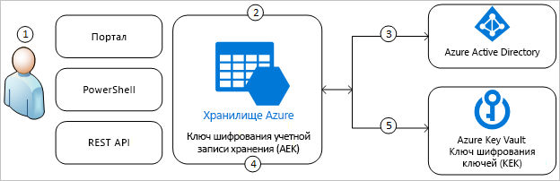
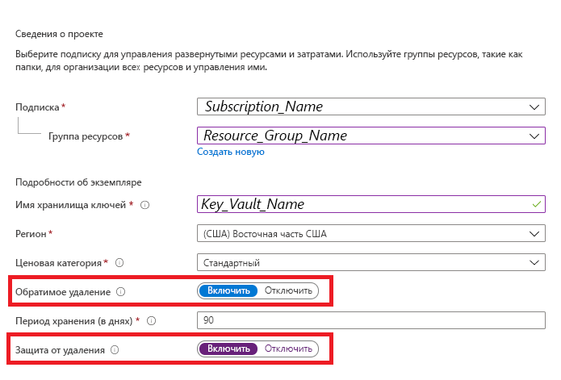
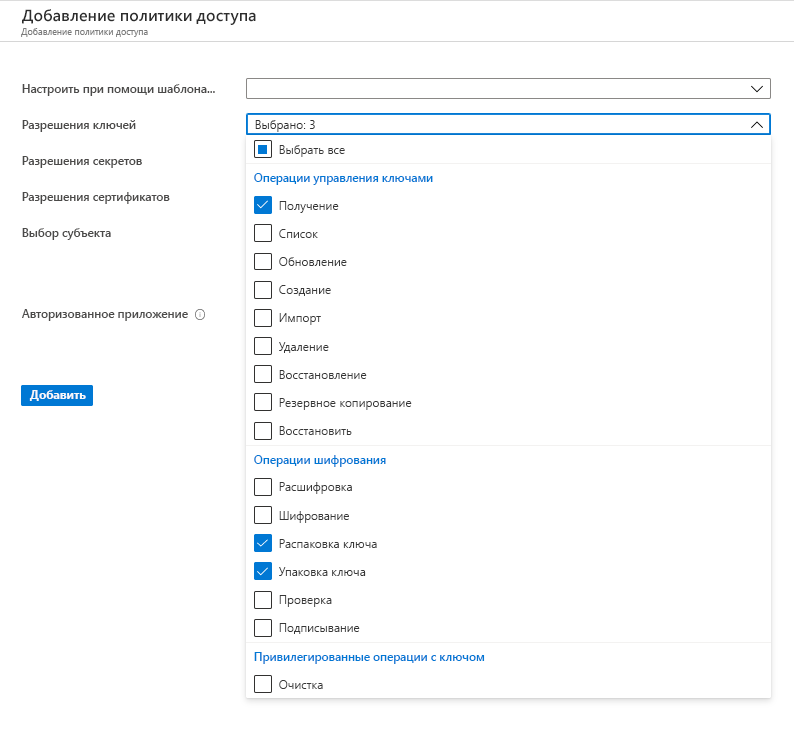
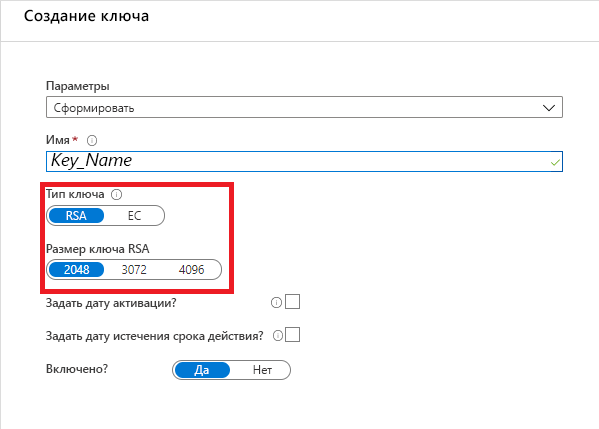
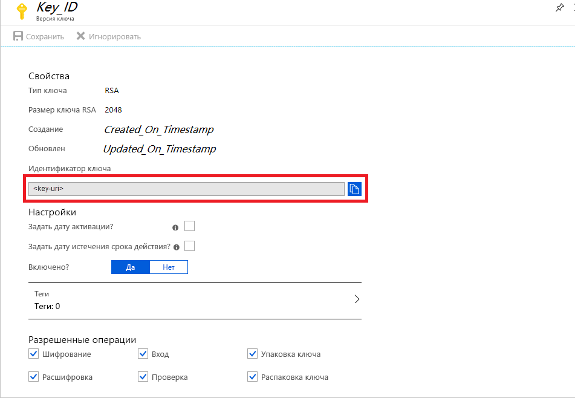
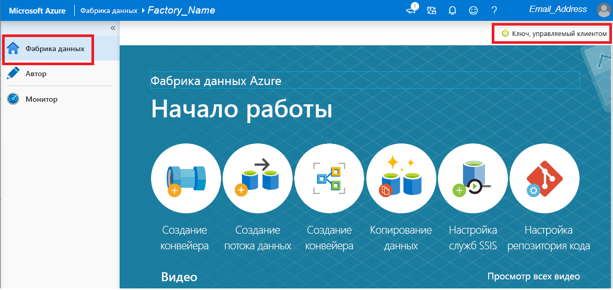

# Шифрование в Фабрике данных Azure с помощью управляемых клиентом ключей

[!INCLUDE[appliesto-adf-xxx-md](includes/appliesto-adf-xxx-md.md)]

Фабрика данных Azure шифрует неактивные данные, в том числе определения сущностей, все данные, кэшированные во время выполнения, а также данные, кэшированные для предварительного просмотра данных. По умолчанию данные шифруются с помощью генерируемого случайным образом ключа под управлением Майкрософт, который назначается фабрике данных с соблюдением уникальности. Благодаря возможности использовать управляемые клиентом ключи в Фабрике данных Azure теперь для обеспечения дополнительной безопасности можно включить создание собственных ключей (BYOK). Если задан управляемый клиентом ключ, Фабрика данных использует для шифрования данных клиента __как системный ключ фабрики, так и CMK__. Отсутствие любого из них может привести к отказу в доступе к данным и фабрике.

Для хранения управляемых клиентом ключей требуется Azure Key Vault. Можно либо создать собственные ключи и хранить их в хранилище ключей, либо использовать API-интерфейсы Azure Key Vault для их генерации. Хранилище ключей и фабрика данных должны находиться в одном и том же клиенте Azure Active Directory (Azure AD) и одном регионе, но они могут относиться к разным подпискам. Дополнительные сведения о хранилище ключей Azure см. в статье [Что такое хранилище ключей Azure?](../key-vault/general/overview.md)

> [!NOTE]
> Управляемый клиентом ключ, можно настроить только в пустой фабрике данных. Фабрика данных не может содержать такие ресурсы, как связанные службы, конвейеры и потоки данных. Рекомендуется разрешить использование управляемого клиентом ключа сразу после создания фабрики.

## Сведения об управляемых клиентом ключах

На следующей схеме показано, как Фабрика данных использует Azure Active Directory и Azure Key Vault для выполнения запросов с помощью управляемого клиентом ключа:

  

В следующем списке описаны шаги, пронумерованные на схеме.

1. Администратор Azure Key Vault предоставляет управляемому удостоверению, связанному с Фабрикой данных, разрешения на использование ключей шифрования.
1. Администратор Фабрики данных включает в фабрике возможность использовать управляемые клиентом ключи.
1. Фабрика данных использует управляемое удостоверение, связанное с фабрикой, для проверки подлинности при доступе к Azure Key Vault через Azure Active Directory.
1. Фабрика данных заключает в оболочку ключ шифрования фабрики, используя ключ клиента в Azure Key Vault.
1. В случае операций чтения и записи Фабрика данных отправляет запросы в Azure Key Vault для извлечения ключа шифрования учетной записи из оболочки с целью выполнения операций шифрования и расшифровки.

## Необходимые условия. Настройка Azure Key Vault и создание ключей

### Включение обратимого удаления и запрета на очистку Azure Key Vault

Для использования управляемых клиентом ключей с Фабрикой данных необходимо задать для хранилища ключей два свойства: __Обратимое удаление__ и __Do Not Purge__ (Не очищать). Эти свойства можно включить с помощью PowerShell или Azure CLI в новом или имеющемся хранилище ключей. Чтобы узнать, как включить эти свойства в имеющемся хранилище ключей, см. разделы _Включение обратимого удаления_ и _Включение защиты от очистки_ в одной из следующих статей:

- [Как использовать обратимое удаление в Key Vault с помощью PowerShell](../key-vault/general/soft-delete-powershell.md)
- [Как использовать обратимое удаление в Key Vault с помощью интерфейса командной строки](../key-vault/general/soft-delete-cli.md)

Если вы создаете новый Azure Key Vault с помощью портала Azure, свойства __Обратимое удаление__ и __Do Not Purge__ (Не очищать) можно задать следующим образом.

  

### Предоставление Фабрике данных доступа к Azure Key Vault

Убедитесь, что Azure Key Vault и Фабрика данных Azure находятся в одном и том же клиенте Azure Active Directory (Azure AD) и в _одном регионе_. Используя функцию управления доступом в Azure Key Vault предоставьте Управляемому удостоверению службы (MSI) фабрики данных следующие разрешения: _Получение_, _Распаковка ключа_ и _Упаковка ключа_. Эти разрешения необходимы для включения возможности использования управляемых клиентом ключей в Фабрике данных.

  

### Создание или передача управляемого клиентом ключа в Azure Key Vault

Можно либо создать собственные ключи и хранить их в хранилище ключей, либо использовать API-интерфейсы Azure Key Vault для их генерации. При шифровании Фабрики данных поддерживаются только 2048-разрядные ключи RSA. См. дополнительные сведения о [ключах, секретах и сертификатах](../key-vault/general/about-keys-secrets-certificates.md).

  

## Активация управляемых клиентом ключей

1. Убедитесь, что фабрика данных пуста. Фабрика данных не может содержать такие ресурсы, как связанные службы, конвейеры и потоки данных. На данный момент развертывание управляемого клиентом ключа в непустой фабрике приводит к ошибке.

1. Чтобы найти URI ключа на портале Azure, перейдите к Azure Key Vault и выберите параметр "Ключи". Выберите нужный ключ, а затем щелкните его, чтобы просмотреть его версии. Выберите версию ключа для просмотра параметров.

1. Скопируйте значение поля "Идентификатор ключа", которое предоставляет универсальный код ресурса (URI).

    

1. Запустите портал Фабрики данных Azure и перейдите с помощью панели навигации слева на домашнюю страницу Фабрики данных.

1. Щелкните значок __Управляемый клиентом ключ__.

    

1. Введите универсальный код ресурса (URI) для управляемого клиентом ключа, скопированного ранее.

1. Нажмите __Сохранить__, и для Фабрики данных будет включено шифрование управляемого клиентом ключа.

## Обновление версии ключа

При создании новой версии ключа обновите Фабрику данных, чтобы в ней использовалась эта новая версия. Выполните действия, аналогичные описанным в разделе _Активация управляемых клиентом ключей_, в том числе:

1. Найдите универсальный код ресурса (URI) для новой версии ключа с помощью портала Azure Key Vault.

1. Перейдите к параметру __Управляемый клиентом ключ__.

1. Замените в нем универсальный код ресурса (URI), вставив соответствующее значение для нового ключа

1. Нажмете __Сохранить__ и Фабрика данных теперь будет использовать для шифрования новую версию ключа.

## Использование другого ключа

Чтобы изменить ключ, используемый для шифрования фабрики данных, необходимо вручную обновить параметры в Фабрике данных. Выполните действия, аналогичные описанным в разделе _Активация управляемых клиентом ключей_, в том числе:

1. Найдите универсальный код ресурса (URI) для нового ключа с помощью портала Azure Key Vault.

1. Перейдите к параметру __Управляемый клиентом ключ__.

1. Замените в нем универсальный код ресурса (URI), вставив соответствующее значение для нового ключа

1. Нажмете __Сохранить__ и Фабрика данных теперь будет использовать для шифрования новый ключ.

## Отключение возможности использования управляемых клиентом ключей

После включения возможности использования управляемых клиентом ключей, исключить дополнительный шаг безопасности невозможно. Так и должно быть. Мы будем всегда рассчитывать, что клиент предоставит ключ для шифрования фабрики и данных.

## Дальнейшие действия

Перейдите к [руководствам](tutorial-copy-data-dot-net.md), чтобы узнать об использовании фабрики данных в различных сценариях.
