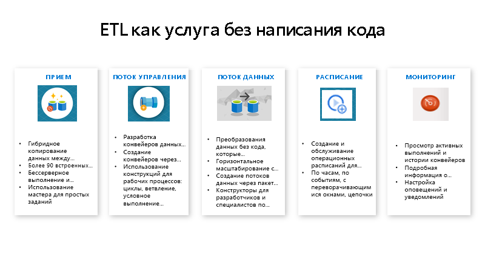

# Что такое фабрика данных Azure?

В мире больших данных в реляционных, нереляционных и других системах хранения часто хранятся необработанные и неорганизованные данные. Но необработанные данные сами по себе не содержат нужного контекста или значения, чтобы быть полезными для аналитиков, специалистов по анализу данных и руководителей компаний. 

Для больших данных нужна служба, которая поддерживает процессы организации и подготовки к использованию, чтобы просеять эти огромные хранилища необработанных данных и преобразовать их в полезные аналитические выводы. Фабрика данных Azure — это управляемая облачная служба, созданная для сложных гибридных процессов извлечения, преобразования и загрузки (или извлечения, загрузки и преобразования) и интеграции данных.

В качестве примера рассмотрим компанию, которая создает облачные игры и собирает петабайты информации в виде журналов этих игр. Компания хочет проанализировать эти журналы, чтобы получить сведения о предпочтениях клиентов, демографических параметрах и особенностях использования. Эти сведения помогут понять, как можно увеличить дополнительные и перекрестные продажи, разработать новые интересные функции, стимулировать развитие компании и улучшить качество обслуживания клиентов.

Чтобы проанализировать эти журналы, компании необходимо использовать справочные сведения, например информацию о клиентах, игре и маркетинговых действиях, которые хранятся в локальном хранилище данных. Компании нужно объединить эти данные из локального хранилища данных с дополнительными данными журналов, собранными в облачном хранилище данных. 

Чтобы получить аналитические данные, компания обработает объединенные данные с помощью кластера Spark в облаке (Azure HDInsight), а затем опубликует преобразованные данные в облачное хранилище данных, например в хранилище данных SQL Azure, из которого можно будет легко получать нужные отчеты. Этот рабочий процесс должен выполняться автоматически при помещении файлов в контейнер хранилища больших двоичных объектов и должен ежедневно отслеживаться. Кроме того, должно быть налажено ежедневное управление им.

Фабрика данных Azure является идеальной платформой для таких сценариев обработки данных. Это *облачная служба извлечения, преобразования, загрузки и интеграции данных, которая позволяет создавать управляемые данными рабочие процессы для оркестрации и автоматизации масштабных операций перемещения и преобразования данных*. С помощью фабрики данных Azure можно создавать и включать в расписание управляемые данными рабочие процессы (конвейеры), которые могут принимать данные из разнородных хранилищ данных, Вы можете создавать сложные процессы извлечения, преобразования и загрузки, которые преобразуют данные через визуальный интерфейс потоков данных или служб вычислений, таких как Azure HDInsight Hadoop, Azure Databricks и База данных SQL Azure. 

Кроме того, вы можете публиковать преобразованные данные в хранилищах данных (например, хранилище данных SQL Azure) для использования приложениями бизнес-аналитики. Необработанные данные с помощью фабрики данных Azure можно организовать в полезные хранилища данных и озера данных для принятия лучших деловых решений.

## Как это работает?

Фабрика данных содержит серию взаимосвязанных систем, которые предоставляют комплексную платформу для специалистов по инжинирингу данных.

### Подключение и сбор данных

Предприятия собирают данные различных типов в разнородных локальных и облачных источниках данных. Структурированные, неструктурированные или частично структурированные данные поступают с разными интервалами и с разной скоростью. 

Первым этапом в создании системы производства информации является подключение ко всем необходимым источникам данных и службам обработки, таким как службы SaaS (программное обеспечение как услуга), базы данных, файловые ресурсы с общим доступом, FTP и веб-службы, и перемещение данных, нуждающихся в последующей обработке, в централизованное расположение.

Не имея фабрики данных предприятия вынуждены создавать компоненты для перемещения пользовательских данных или писать пользовательские службы для интеграции этих источников данных и обработки. Такие системы дорого стоят, их сложно интегрировать и обслуживать. Кроме того, они часто не включают функции мониторинга и оповещений корпоративного уровня, а также элементы управления, которые может предложить полностью управляемая служба.

В фабрике данных вы можете использовать [действие копирования](copy-activity-overview.md) в конвейере данных для перемещения данных из локальных и облачных исходных хранилищ данных в централизованное хранилище данных в облаке для последующего анализа. Например, вы можете собирать данные в Azure Data Lake Storage и затем преобразовывать эти данные с помощью службы вычислений Azure Data Lake Analytics. Или же вы можете собрать данные в хранилище BLOB-объектов Azure и позже преобразовать их с помощью кластера Hadoop под управлением службы Azure HDInsight.

### Преобразование и дополнение данных
Обрабатывайте или преобразовывайте данные, собранные в централизованном облачном хранилище, с помощью потоков сопоставления данных ADF. Потоки данных позволяют специалистам по обработке данных создавать и обслуживать схемы преобразования данных, которые выполняются в Spark, даже без знаний о кластерах Spark и программировании Spark.

Если вы предпочитаете вручную писать код преобразований, воспользуйтесь поддерживаемыми в ADF внешними действиями для преобразований в таких службах вычислений, как HDInsight Hadoop, Spark, Data Lake Analytics и Машинное обучение.

### CI/CD и публикация
Фабрика данных обеспечивает полную поддержку CI/CD для конвейеров данных при использовании Azure DevOps и GitHub. Это позволяет постепенно разрабатывать и предоставлять процессы извлечения, преобразования и загрузки перед публикацией готового продукта. Когда необработанные данные преобразованы в готовую к использованию форму, вы можете передать данные в хранилище данных Azure, Базу данных SQL Azure, Azure Cosmos DB или в любую аналитическую платформу, которую могут выбрать бизнес-пользователи для своих средств бизнес-аналитики.

### Мониторинг
После создания и развертывания конвейера интеграции данных, который извлекает полезные данные из обработанных данных, вам понадобится отслеживать успешное выполнение и сбои запланированных операций и конвейеров. Фабрика данных Azure имеет встроенную поддержку мониторинга конвейеров с помощью Azure Monitor, API, PowerShell, журналов Azure Monitor и панелей работоспособности на портале Azure.

## Основные понятия
В подписке Azure может быть один или несколько экземпляров фабрики данных Azure. Фабрика данных Azure состоит из четырех основных компонентов. Они образуют платформу, на которой можно создавать управляемые данными рабочие процессы, предусматривающие перемещение и преобразование данных.

### Конвейер
В фабрике данных можно использовать один или несколько конвейеров. Конвейер — это логическая группа действий, которые выполняют определенный блок задач. Действия в конвейере совместно выполняют задачу. Например, конвейер может включать группу действий, которые принимают данные из большого двоичного объекта Azure и выполняют запрос Hive в кластере HDInsight для секционирования данных. 

Преимущество конвейера в том, что он позволяет управлять группами действий, а не каждым отдельным действием. Действия в конвейере можно связывать друг с другом последовательно или выполнять параллельно и независимо друг от друга.

### Сопоставление потоков данных
Создавайте и администрируйте графов логики преобразования данных, с помощью которых можно преобразовывать данные любого размера. Вы можете повторно создать используемую библиотеку подпрограмм преобразования данных и выполнять эти процессы из конвейеров ADF с поддержкой горизонтального масштабирования. Фабрика данных будет выполнять логику в кластере Spark, который увеличивается и уменьшается по мере необходимости. Вам не придется ни управлять кластерами, ни обслуживать их.

### Действие
Действия представляют отдельные этапы обработки в конвейере. Например, действие копирования может использоваться для копирования данных из одного хранилища данных в другое. Точно так же можно использовать действие Hive, которое выполняет запрос Hive к кластеру Azure HDInsight, для преобразования или анализа данных. Фабрика данных поддерживает три типа действий: действия перемещения данных, действия преобразования данных и действия управления.

### Наборы данных
Наборы данных представляют структуры данных в хранилищах. Эти структуры указывают данные, необходимые для использования в действиях, разделяя их на входные и выходные. 

### Связанные службы
Связанные службы напоминают строки подключения, определяющие сведения о подключении, необходимые для подключения фабрики данных к внешним ресурсам. Таким образом, набор данных представляет структуру данных, а связанная служба определяет подключение к источнику данных. Например, связанная служба хранилища Azure определяет строку подключения для подключения к учетной записи хранения Azure. Кроме того, набор данных больших двоичных объектов Azure определяет контейнер больших двоичных объектов и папку, которая содержит данные.

Связанные службы используются в фабрике данных для двух целей:

- Для представления **хранилища данных**, включая, помимо прочего, локальную базу данных SQL Server, базу данных Oracle, общий файловый ресурс и учетную запись хранилища BLOB-объектов Azure. Список поддерживаемых хранилищ см. в статье [о действии копирования](copy-activity-overview.md).

- Для представления **вычислительного ресурса**, в котором можно выполнить действие. Например, действие HDInsightHive выполняется в кластере Hadoop в HDInsight. Список поддерживаемых действий преобразования и вычислительных сред см. в статье [о преобразовании данных](transform-data.md).

### Триггеры
Триггеры обозначают единицу обработки, которая определяет время запуска для выполнения конвейера. Существует несколько типов триггеров для разных событий.

### Запуски конвейера
Запуск конвейера — это экземпляр выполнения конвейера. Запуск конвейера обычно создается путем передачи аргументов для параметров, определенных в конвейерах. Аргументы можно передавать вручную или в определении триггера.

### Параметры
Параметры представляют собой пары "ключ — значение" в конфигурации только для чтения.  Параметры определяются в конвейере, а аргументы для них передаются во время выполнения из контекста запуска, созданного триггером, или из конвейера, который выполняется вручную. Действия в конвейере используют значения параметров.

Набор данных — это строго типизированный параметр и сущность, доступная для ссылок и повторного использования. Действие может ссылаться на наборы данных и может использовать параметры, определенные в определении набора данных.

Связанная служба также является строго типизированным параметром, который содержит сведения о подключении к хранилищу данных или среде вычислений. Служба также доступна для ссылок и (или) повторного использования.

### Поток управления
Поток управления — это оркестрация действий в конвейере, которая включает цепочки действий в последовательности, ветвление, определение параметров на уровне конвейера и передачу аргументов во время вызова конвейера по запросу или из триггера. Кроме того, сюда входит передача пользовательского состояния и контейнеров зацикливания (то есть итераторы For-each).

### Переменные
Переменные можно использовать внутри конвейеров для хранения временных значений, а также в сочетании с параметрами для передачи значений между конвейерами, потоками данных и другими действиями.

## Дополнительная информация
Вот несколько важных документов, которые следует изучить на следующем этапе:

- [Datasets and linked services in Azure Data Factory](concepts-datasets-linked-services.md) (Наборы данных и связанные службы в фабрике данных Azure)
- [Конвейеры и действия](concepts-pipelines-activities.md)
- [Среда выполнения интеграции в фабрике данных Azure](concepts-integration-runtime.md)
- [Потоки сопоставления данных](concepts-data-flow-overview.md)
- [Пользовательский интерфейс фабрики данных на портале Azure](quickstart-create-data-factory-portal.md)
- [Средство копирования данных на портале Azure](quickstart-create-data-factory-copy-data-tool.md)
- [PowerShell](quickstart-create-data-factory-powershell.md)
- [.NET](quickstart-create-data-factory-dot-net.md)
- [Python](quickstart-create-data-factory-python.md)
- [REST](quickstart-create-data-factory-rest-api.md)
- [Шаблон Azure Resource Manager](quickstart-create-data-factory-resource-manager-template.md)
 
