# Краткое руководство. Создание фабрики данных с помощью пользовательского интерфейса службы "Фабрика данных Azure"

> [!div class="op_single_selector" title1="Выберите используемую версию службы "Фабрика данных":"]
> * [Версия 1](v1/data-factory-copy-data-from-azure-blob-storage-to-sql-database.md)
> * [Текущая версия](quickstart-create-data-factory-portal.md)

В этом кратком руководстве описано создание и мониторинг фабрики данных Azure с помощью пользовательского интерфейса службы "Фабрика данных Azure". Конвейер, который вы создадите в этой фабрике данных, *копирует* данные из одной папки в другую в хранилище BLOB-объектов Azure. Инструкции по *преобразованию* данных с помощью Фабрики данных Azure см. в статье[ Преобразование данных в облаке с помощью действия Spark в фабрике данных Azure](tutorial-transform-data-spark-portal.md).

> [!NOTE]
> Если вы еще не работали со службой "Фабрика данных Azure", ознакомьтесь с [общими сведениями](data-factory-introduction.md) о ней перед изучением этого руководства. 

[!INCLUDE [data-factory-quickstart-prerequisites](../../includes/data-factory-quickstart-prerequisites.md)] 

### Видео 
Это видео поможет составить представление о пользовательском интерфейсе службы "Фабрика данных": 
>[!VIDEO https://channel9.msdn.com/Shows/Azure-Friday/Visually-build-pipelines-for-Azure-Data-Factory-v2/Player]

## Создание фабрики данных

1. Запустите веб-браузер **Microsoft Edge** или **Google Chrome**. Сейчас только эти браузеры поддерживают пользовательский интерфейс фабрики данных.
1. Перейдите на [портал Azure](https://portal.azure.com). 
1. Выберите команду **Создать ресурс** в меню на портале Azure.
   
   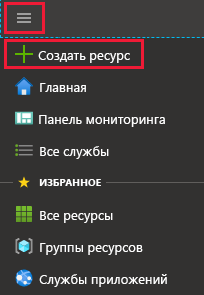
1. Выберите пункт **Аналитика**, а затем — **Фабрика данных**. 
   
   
1. На странице **Новая фабрика данных** введите **ADFTutorialDataFactory** в поле **Имя**. 
 
   Имя фабрики данных Azure должно быть *глобально уникальным*. При возникновении указанной ниже ошибки измените имя фабрики данных (например, на **&lt;ваше_имя_&gt;ADFTutorialDataFactory**) и попробуйте создать фабрику данных снова. Правила именования для артефактов службы "Фабрика данных" см. в [этой](naming-rules.md) статье.
  
   
1. В поле **Подписка** выберите подписку Azure, в рамках которой вы хотите создать фабрику данных. 
1. Для **группы ресурсов** выполните одно из следующих действий:
     
   - Выберите **Use existing** (Использовать имеющуюся) и выберите имеющуюся группу ресурсов в списке. 
   - Выберите **Создать новую**и укажите имя группы ресурсов.   
         
   Сведения о группах ресурсов см. в статье, где описывается [использование групп ресурсов для управления ресурсами Azure](../azure-resource-manager/resource-group-overview.md).  
1. Укажите **V2** при выборе **версии**.
1. В поле **Расположение** выберите расположение фабрики данных.

   В списке отображаются только расположения, которые поддерживаются Фабрикой данных и в которых будут храниться метаданные Фабрики данных Azure. Связанные хранилища данных (например, Служба хранилища Azure и База данных SQL Azure) и вычислительные среды (например, Azure HDInsight), используемые службой "Фабрика данных", могут выполняться в других регионах.

1. Нажмите кнопку **Создать**.

1. Когда создание завершится, откроется страница **Фабрика данных**. Выберите элемент **Author & Monitor** (Создание и мониторинг), чтобы открыть на отдельной вкладке приложение пользовательского интерфейса службы "Фабрика данных Azure".
   
   
1. На странице **Let's get started** (Начало работы) переключитесь на вкладку **Автор** на панели слева. 

    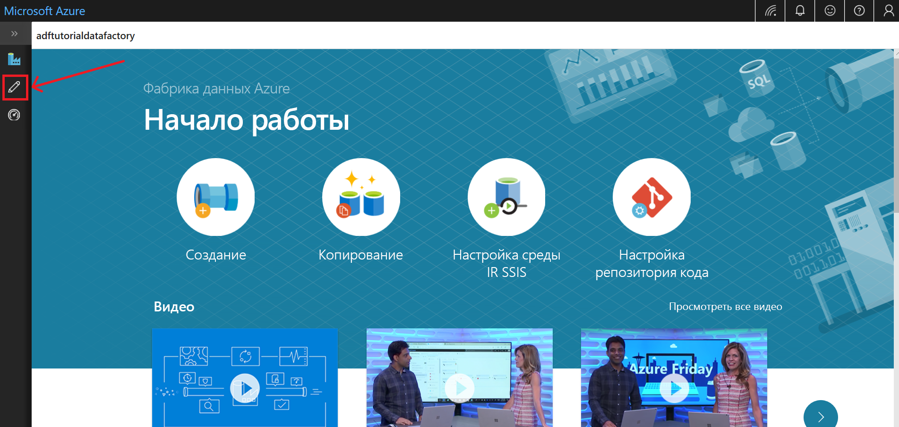

## Создание связанной службы
На этом этапе вы создадите связанную службу, чтобы связать учетную запись хранения Azure с фабрикой данных. Связанная служба содержит сведения о подключении, используемые фабрикой данных для подключения к ней в среде выполнения.

1. Выберите **Подключения** и нажмите кнопку **Создать** на панели инструментов (кнопка **Подключения** расположена внизу левого столбца в разделе **Ресурсы фабрики**). 

1. На странице **New Linked Service** (Новая связанная служба) выберите **Хранилище BLOB-объектов Azure** и щелкните **Продолжить**. 

   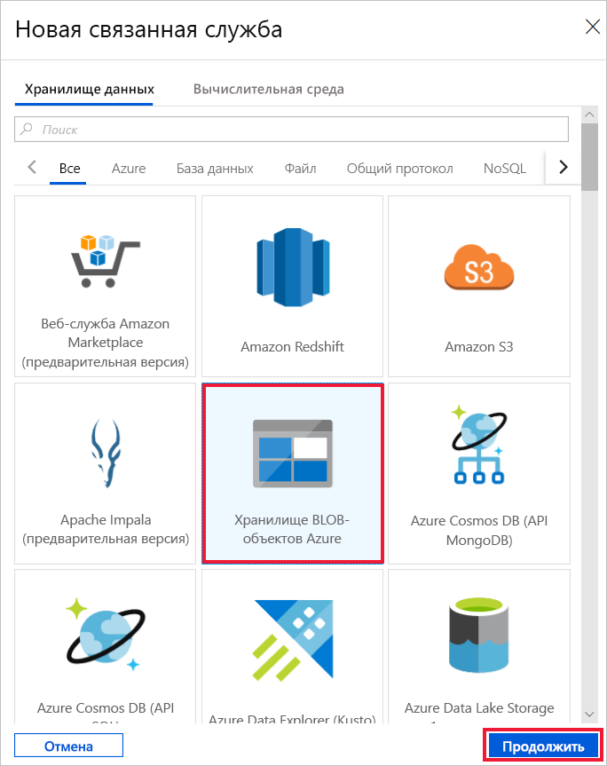
1. На странице New Linked Service (Azure Blob Storage) (Новая связанная служба (хранилище BLOB-объектов Azure)) выполните следующие действия: 

   a. Введите **AzureStorageLinkedService** в поле **имени**.

   b. Выберите имя учетной записи хранения Azure в списке **имен учетных записей хранения**.

   c. Нажмите кнопку **Test connection** (Проверка подключения), чтобы проверить подключение службы "Фабрика данных" к учетной записи хранения. 

   d. Чтобы сохранить связанную службу, щелкните **Готово**. 

## Создание наборов данных
В ходе этой процедуры вы создадите два набора данных, **InputDataset** и **OutputDataset**. Эти наборы данных имеют тип **AzureBlob**. Они будут ссылаться на связанную службу хранилища Azure, созданную в предыдущем разделе. 

Входной набор данных представляет исходные данные в папке входных данных. В определении входного набора данных укажите контейнер больших двоичных объектов (**adftutorial**), папку (**input**) и файл (**emp.txt**), определяющие расположение исходных данных. 

Выходной набор данных представляет данные, которые копируются в место назначения. В определении выходного набора данных укажите контейнер больших двоичных объектов (**adftutorial**), папку (**output**) и файл, определяющие расположение копируемых данных. С каждым запуском конвейера связан уникальный идентификатор, который можно получить из системной переменной **RunId**. Имя выходного файла вычисляется динамически на основе идентификатора выполнения текущего конвейера.   

В параметрах связанной службы вы указали учетную запись хранения Azure, которая содержит исходные данные. В параметрах исходного набора данных следует указать точное расположение исходных данных (контейнер больших двоичных объектов, папку и файл). В параметрах целевого набора данных следует указать точное расположение для копирования данных (контейнер больших двоичных объектов, папку и файл). 
 
1. Нажмите кнопку **+** (плюс) и выберите **Набор данных**.

   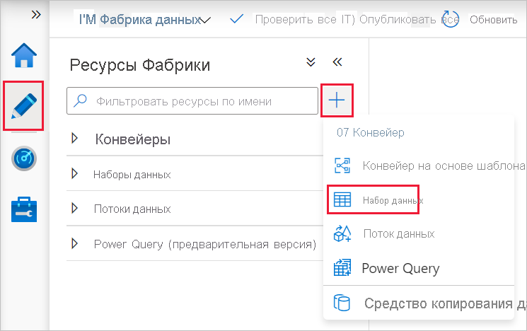
1. На странице **Новый набор данных** выберите **Хранилище BLOB-объектов Azure**, а затем нажмите кнопку **Продолжить**. 

   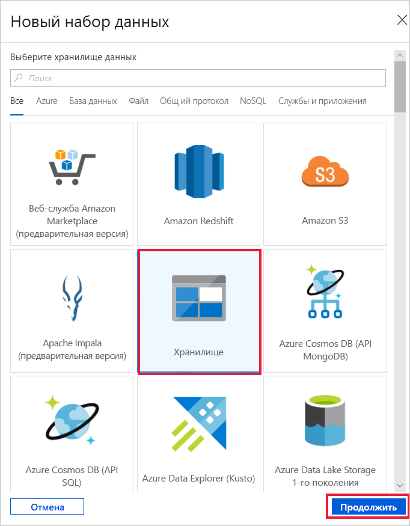
1. На странице **Select Format** (Выбор формата) выберите тип формата данных, а затем нажмите кнопку **Продолжить**. В этом случае выберите **Двоичный**, если копируете файлы как есть без анализа содержимого.

    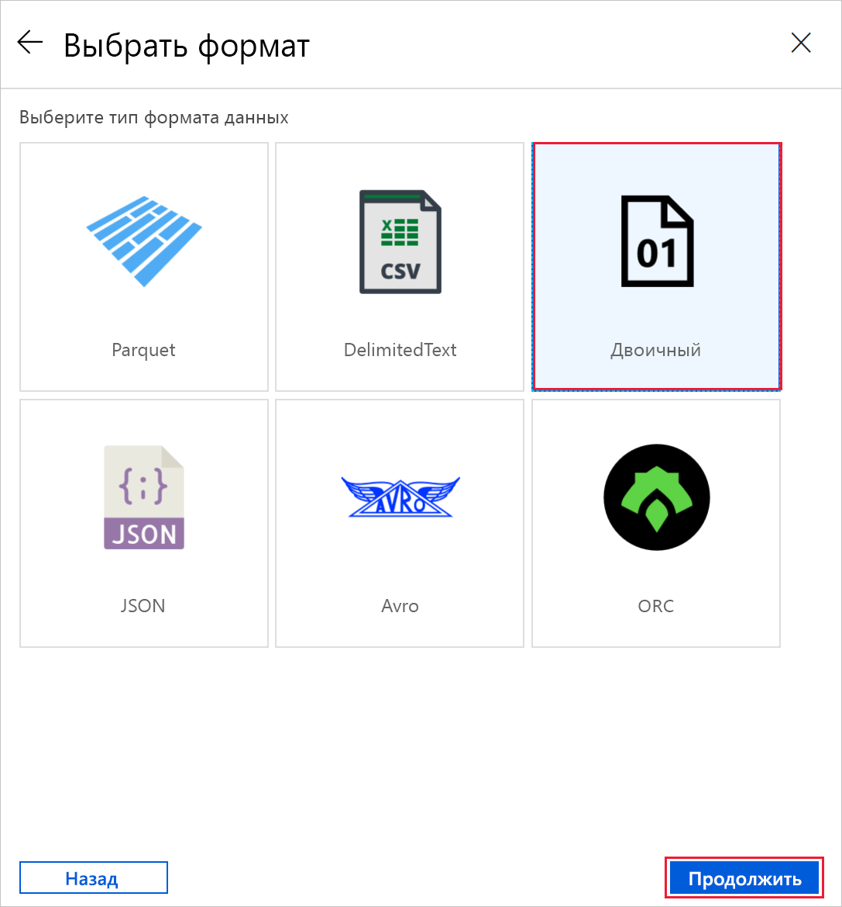

1. На странице **Set Properties** (Установка свойств) выполните следующие действия:

    a. В поле **Имя** введите **InputDataset**. 

    b. Выберите **AzureStorageLinkedService** в списке **Связанная служба**.

    c. Возле поля **Путь к файлу** нажмите кнопку **Обзор**.

    d. В окне **Choose a file or folder** (Выберите файл или папку) перейдите к папке **input** контейнера **adftutorial**, выберите файл **emp.txt** и нажмите кнопку **Готово**.
    
    д. Выберите **Продолжить**.   

    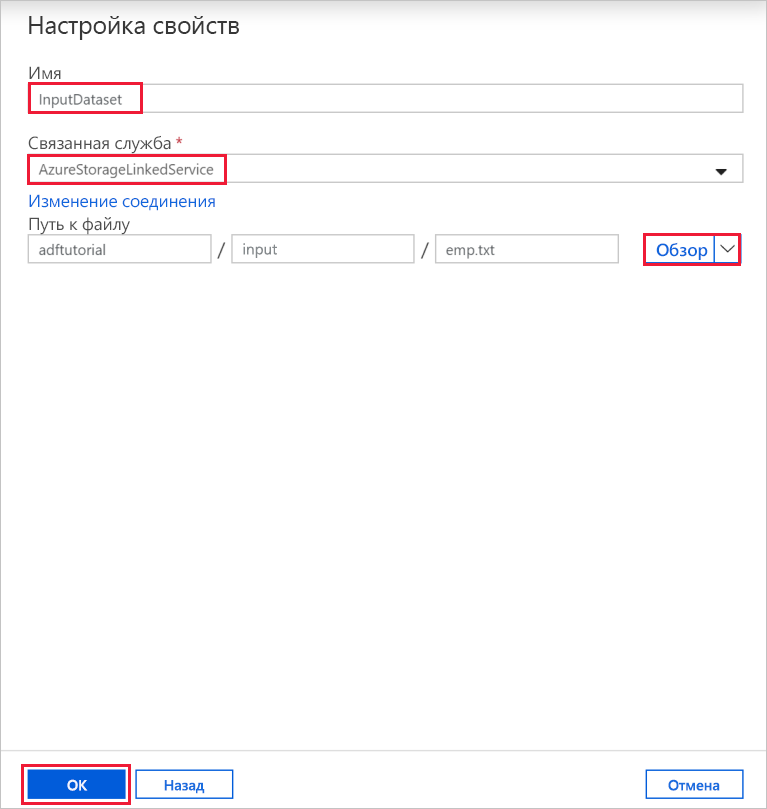
1. Повторите эти шаги, чтобы создать выходной набор данных:  

    a. Нажмите кнопку **+** (плюс) и выберите **Набор данных**.

    b. На странице **Новый набор данных** выберите **Хранилище BLOB-объектов Azure**, а затем нажмите кнопку **Продолжить**.

    c. На странице **Select Format** (Выбор формата) выберите тип формата данных, а затем нажмите кнопку **Продолжить**.

    d. На странице **Set Properties** (Установка свойств) укажите **OutputDataset** в качестве имени. Выберите **AzureStorageLinkedService** в качестве связанной службы.

    д. В разделе **Путь к файлу** введите **adftutorial/output**. Если папка **output** не существует, она будет создана во время выполнения действия копирования.

    Е. Выберите **Продолжить**.   

## Создание конвейера 
На этом этапе вы создадите и проверите конвейер с действием копирования, которое использует входной и выходной наборы данных. При помощи действия копирования данные копируются из файла, указанного в параметрах входного набора данных, в файл, указанный в параметрах выходного набора данных. Если входной набор данных определяет только папку (но не имя файла), при помощи действия копирования в место назначения копируются все файлы из исходной папки. 

1. Нажмите кнопку **+** (плюс) и выберите **Pipeline** (Конвейер). 

1. На вкладке **Общие** укажите значение **CopyPipeline** в поле **Имя**. 

1. На панели элементов **Действия** разверните **Переместить и преобразовать**. Перетащите действие **Копирование данных** из панели инструментов **Действия** в область конструктора конвейера. Также на панели элементов **Действия** можно применить поиск. Введите **CopyFromBlobToBlob** в поле **имя**.

1. Откройте вкладку **Источник** в параметрах действия копирования и выберите **InputDataset** в списке **исходных наборов данных**.

1. Откройте вкладку **Приемник** в параметрах действия копирования и выберите **OutputDataset** в списке **целевых наборов данных**.

1. На панели инструментов конвейера над холстом щелкните **Проверка**, чтобы проверить параметры конвейера. Убедитесь, что проверка конвейера прошла успешно. Чтобы закрыть окно проверки, нажмите кнопку **>>** (стрелка вправо). 

## Выполнение отладки конвейера
На этом этапе вы выполните отладку конвейера перед его развертыванием в службе "Фабрика данных". 

1. На панели инструментов конвейера над холстом щелкните **Отладка**, чтобы активировать тестовый запуск. 
    
1. Убедитесь, что сведения о состоянии запуска для конвейера отображаются на вкладке **Выходные данные** в нижней части окна. 

1. Убедитесь, что выходной файл появился в папке **output** конвейера **adftutorial**. Если указанной папки output нет, она будет автоматически создана службой "Фабрика данных". 

## Aктивация конвейера вручную
На этом шаге вы развернете сущности (связанные службы, наборы данных и конвейеры) в службе "Фабрика данных Azure". После этого вы вручную запустите конвейер. 

1. Перед запуском конвейера необходимо опубликовать сущности в службе "Фабрика данных Azure". Для этого щелкните **Publish All** (Опубликовать все) в верхней части окна. 

   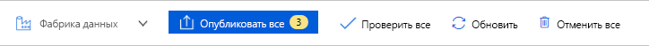
1. Чтобы запустить конвейер вручную, выберите **Добавить триггер** на панели инструментов конвейера, а затем выберите **Trigger Now** (Запустить сейчас). На странице **Pipeline Run** (Запуск конвейера) нажмите кнопку **Готово**.

## Мониторинг конвейера

1. Перейдите на вкладку **Мониторинг** слева. Нажмите кнопку **Обновить**, чтобы обновить этот список.

   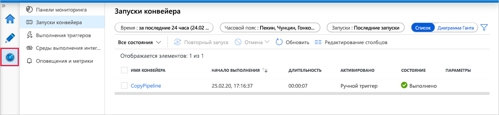
1. Щелкните ссылку **View Activity Runs** (Просмотр запусков действий) в списке **Действия**. На этой странице отображаются сведения о состоянии запуска для действия копирования. 

1. Чтобы просмотреть сведения об операции копирования, щелкните ссылку **Сведения** (изображение очков) в столбце **Действия**. Дополнительные сведения о свойствах см. в [обзоре действия копирования](copy-activity-overview.md). 

   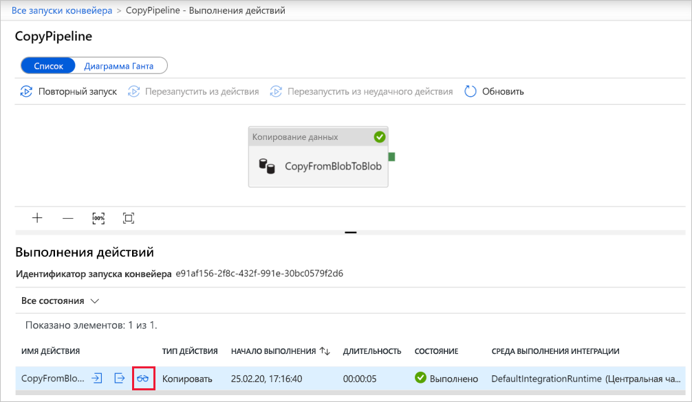
1. Убедитесь, что в папке **output** появился новый файл. 
1. Вы можете перейти из представления **Выполнения действий** в представление **Pipeline Runs** (Запуски конвейера), выбрав **одноименную ссылку**. 

## запуск конвейера по расписанию;
Эта процедура необязательна в этом руководстве. Вы можете создать *триггер планировщика* для периодического запуска конвейера (ежечасно, ежедневно и т. д.). На этом этапе вы создадите триггер для выполнения каждую минуту до указанного времени и даты. 

1. Переключитесь на вкладку **Автор**. 

1. Перейдите к конвейеру, выберите **Добавить триггер** на панели инструментов конвейера, а затем выберите **New/Edit** (Создать или изменить). 

1. На странице **Add Triggers** (Добавление триггеров) щелкните **Choose trigger** (Выбор триггера), а затем — **Создать**. 

1. На странице **Новый триггер** в поле **End** (Окончание) выберите **On Date** (Дата) и укажите время окончания (на несколько минут позже текущего). Затем щелкните **Применить**. 

   Каждый запуск конвейера оплачивается, поэтому не следует выбирать время окончания, наступающее намного позднее времени начала. Убедитесь, что выбран один и тот же день. Но при этом обязательно оставьте достаточно времени, чтобы конвейер успел запуститься между временем публикации и временем окончания. Триггер вступит в силу только после публикации решения в службе "Фабрика данных", а не сразу при сохранении триггера в пользовательском интерфейсе. 

1. На странице **Создание триггера** установите флажок **Активировано**, а затем выберите **Сохранить**. 

   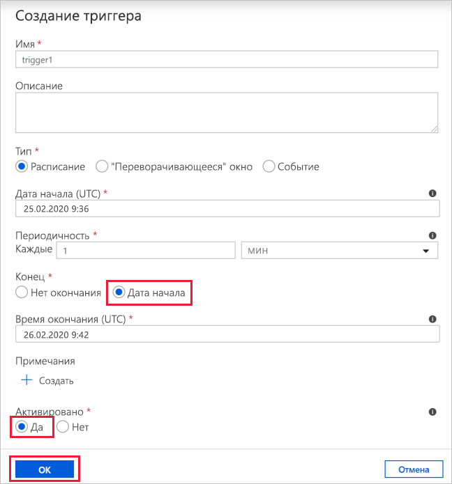
1. Ознакомьтесь с предупреждающим сообщением и нажмите кнопку **Готово**.

1. Щелкните **Опубликовать все**, чтобы перенести изменения в службу "Фабрика данных". 

1. Перейдите на вкладку **Мониторинг** слева. Щелкните **Обновить**, чтобы обновить список. Вы увидите, что конвейер запускается каждую минуту в течение всего периода — от времени публикации до времени окончания. 

   Обратите внимание на значения в столбце **Активировано**. Здесь указан запуск вручную, который вы выполняли на предыдущем шаге (**Trigger Now** (Запустить сейчас)). 

1. Перейдите к представлению **Запуски триггеров**. 

1. Убедитесь, что для каждого запуска конвейера в папке **output** создается выходной файл вплоть до указанного времени окончания. 

## Дополнительная информация
В этом примере конвейер копирует данные из одного расположения в другое в хранилище BLOB-объектов Azure. Перейдите к [руководствам](tutorial-copy-data-portal.md), чтобы узнать об использовании фабрики данных в различных сценариях. 
